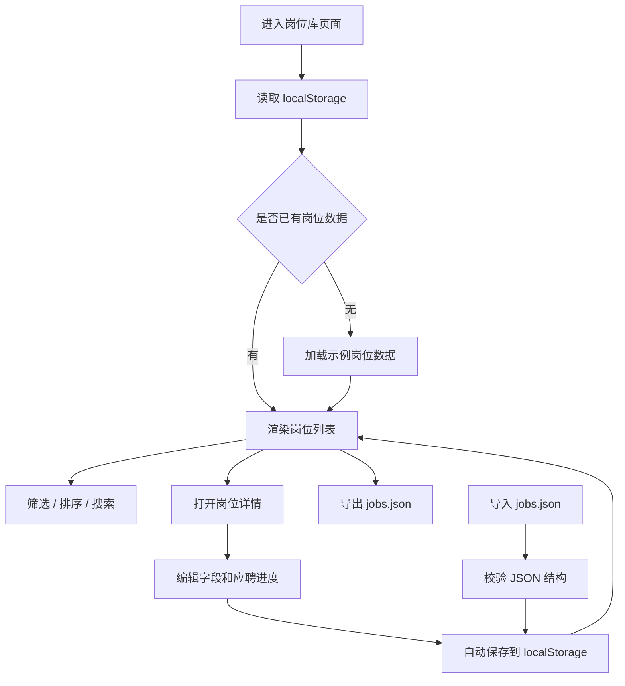

# 岗位库管理工具 PRD

## 1. 产品概述

岗位库管理工具用于长期维护 Boss 岗位信息，解决岗位分散、投递进度难跟踪、岗位分档标准不统一的问题。
- 目标用户：正在投递前端/RN/AI 相关岗位的求职者。
- 核心价值：把 JD、薪资、融资阶段、匹配度、个人意向、应聘进度沉淀成可筛选、可复盘、可导入导出的结构化岗位库。

## 2. 核心功能

### 2.1 用户角色

本工具首版只面向单用户本地使用，不设计登录和权限系统。

### 2.2 功能模块

1. **岗位总览页**：岗位分档概览、筛选器、岗位表格、分页浏览、快速更新应聘进度。
2. **岗位详情/编辑面板**：查看原始 JD、编辑结构化字段、维护风险点、准备重点、Boss 招呼语。
3. **数据管理区**：导入/导出 JSON、重置示例数据、查看本地保存状态。

### 2.3 页面详情

| 页面名称 | 模块名称 | 功能描述 |
|---|---|---|
| 岗位总览页 | 分档卡片 | 展示练手、适合、想去三个档位数量，点击后筛选对应岗位 |
| 岗位总览页 | 筛选工具栏 | 支持按分档、应聘进度、融资阶段、关键词筛选 |
| 岗位总览页 | 岗位表格 | 展示公司、薪资、融资阶段、推荐档位、个人意向、匹配度、进度、优先级 |
| 岗位总览页 | 分页控件 | 默认每页 10 条，支持上一页、下一页，并展示当前页范围和总条数 |
| 岗位总览页 | 快速操作 | 支持切换进度、标记想去、打开详情、删除岗位 |
| 详情/编辑面板 | 基础信息 | 编辑公司、岗位、薪资、融资阶段、城市、链接 |
| 详情/编辑面板 | 匹配信息 | 编辑 stageTier、fitTier、userIntent、matchScore、priority、riskTags |
| 详情/编辑面板 | JD 内容 | 查看和编辑原始 JD、职责、要求、加分项 |
| 详情/编辑面板 | 准备信息 | 维护招呼语、风险说明、准备点、可能问题、备注 |
| 数据管理区 | JSON 导入 | 从 `jobs.json` 导入岗位库 |
| 数据管理区 | JSON 导出 | 导出当前岗位库作为长期备份 |
| 数据管理区 | 本地持久化 | 自动保存到 `localStorage` |

## 2.4 岗位分档完整标准

### 练手

定位：用于恢复面试手感、校准表达、验证简历问题，不作为核心求职目标。

硬性标准：
- 融资阶段：不需要融资、天使轮、A 轮优先归为练手。
- 薪资：可以低于或接近当前 18k，通常接受 `12-25k` 区间。
- 匹配度：约 `50%-65%`，有部分技术栈匹配，但岗位吸引力或确定性一般。
- 面试价值：能练基础题、项目表达、投递节奏，即使不去也有训练价值。

典型特征：
- JD 泛化，要求基础前端、Vue/React、页面开发、工程化基础。
- 公司阶段早、业务不确定性较高，或薪资提升有限。
- 对候选人要求不算精准，适合用来恢复状态。

风险提示：
- 不应投入太多定制准备时间。
- 不建议优先请假面试，除非反馈速度快或题目有训练价值。

### 适合

定位：值得认真投递和准备，目标是获得稳定面试机会和合理薪资提升。

硬性标准：
- 融资阶段：B 轮、C 轮优先归为适合。
- 薪资：应高于当前 18k，优先 `20-30k` 或有明确上浮空间。
- 匹配度：约 `65%-80%`，React/TypeScript/工程化/RN/电商/后台/AI Coding 至少命中两到三项。
- 面试价值：岗位问题能复用现有简历主线，不需要大幅重写项目经历。

典型特征：
- 技术栈与当前简历主线匹配：React、Next.js、TypeScript、React Native、Node.js、工程化、性能优化。
- 业务方向与经历接近：跨境电商、SaaS、中后台、移动端、IoT/智能硬件、AI 工具。
- 要求有独立交付、复杂模块负责、性能优化或跨团队协作能力。

风险提示：
- 如果强要求深度后端、原生 Android/iOS、算法或音视频底层，需要降低优先级。
- 如果薪资只小幅高于当前但准备成本高，也不应排在第一梯队。

### 想去

定位：核心目标岗位，需要定制简历侧重点、Boss 招呼语和面试准备。

硬性标准：
- 融资阶段：D 轮、上市优先归为想去。
- 薪资：明显高于当前 18k，优先 `25k+` 或总包提升明确。
- 匹配度：约 `80%+`，技术栈、业务方向、公司阶段、成长性和薪资至少四项同时达标。
- 面试价值：即使难度较高，也值得提前准备项目深挖和技术追问。

典型特征：
- 公司稳定性和品牌较好，业务清晰，有长期积累价值。
- JD 明确命中 React/TypeScript/RN/Hybrid/电商/AI Agent/工程化等核心卖点。
- 对 GitHub、博客、AI Coding、复杂项目交付有加分，能放大你的差异化。

风险提示：
- 需要单独定制投递话术和面试准备，不建议裸投。
- 如果岗位强卡 5 年以上、架构师、团队管理或底层专项，需谨慎评估真实胜率。

## 3. 核心流程

用户进入页面后，系统优先从 `localStorage` 读取岗位库；没有数据时加载内置示例数据。用户可以新增或编辑岗位，系统根据融资阶段生成默认分档，并允许用户维护最终推荐档位和应聘进度。所有改动自动持久化到浏览器本地，同时支持导出 JSON 作为长期备份。

## 4. 用户界面设计

### 4.1 设计风格

- 视觉方向：桌面优先、密度较高的工作台风格，类似投递作战面板。
- 主色：深蓝黑 `#0f172a`，强调色使用青绿 `#14b8a6` 和琥珀色 `#f59e0b`。
- 背景：浅灰底 + 白色卡片，表格区域强调清晰层次。
- 按钮：圆角、轻阴影、状态色明确。
- 字体：使用系统中文字体栈，保证可读性和稳定性。
- 图标：首版不强依赖图标库，用文字标签和状态徽标表达信息。

### 4.2 页面设计概览

| 页面名称 | 模块名称 | UI 元素 |
|---|---|---|
| 岗位总览页 | 顶部区域 | 标题、当前薪资基准、导入/导出按钮 |
| 岗位总览页 | 统计卡片 | 4-6 个指标卡，展示数量和重点进度 |
| 岗位总览页 | 筛选栏 | 搜索框、分档 select、进度 select、融资阶段 select、标签筛选 |
| 岗位总览页 | 岗位表格 | 粘性表头、彩色 badge、优先级标识、操作按钮 |
| 编辑面板 | 侧边抽屉 | 表单分组、textarea、标签选择、多行备注 |
| 数据管理区 | 工具条 | 导入 JSON、导出 JSON、重置示例数据 |

### 4.3 响应式

首版桌面优先。移动端采用纵向卡片列表替代表格，详情面板改为全屏弹层，保证基本可用。
