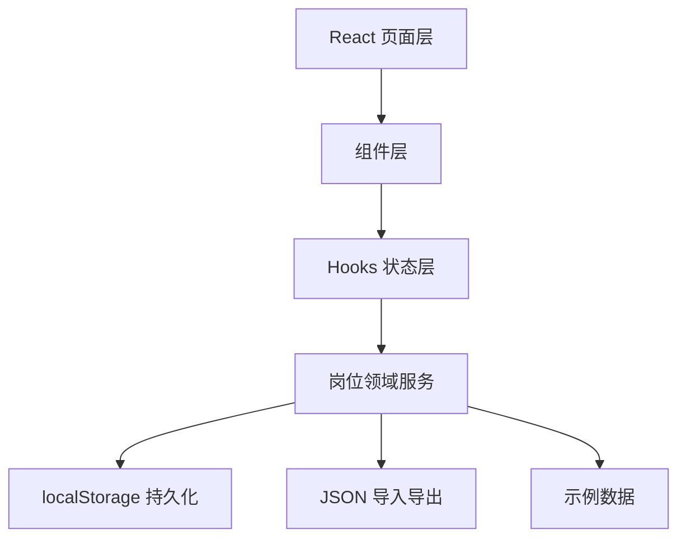
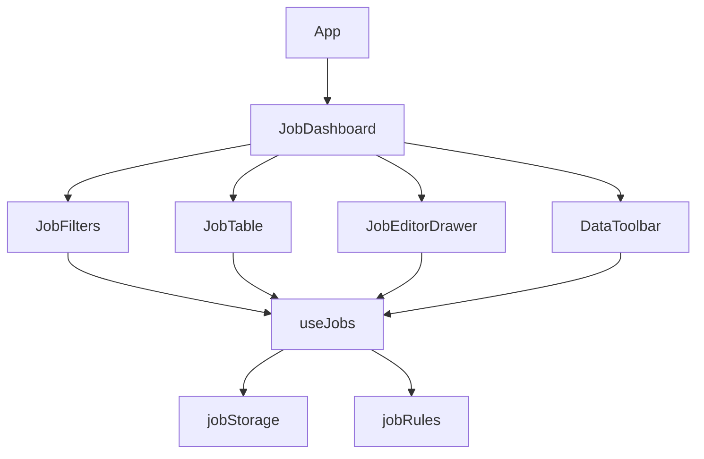
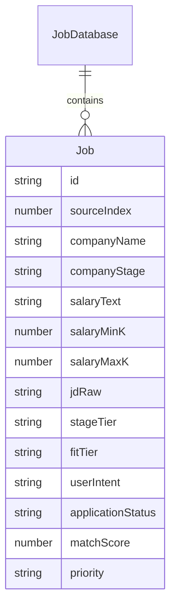

# 岗位库管理工具技术架构

## 1. 架构设计

首版采用纯前端本地应用，不依赖后端服务。运行时数据存储在 `localStorage`，长期备份通过 `jobs.json` 导入导出完成。



## 2. 技术说明

- 前端：React 18 + TypeScript + TailwindCSS 3 + Vite
- 状态管理：Zustand + React `useState` / `useMemo`
- 持久化：`localStorage` + JSON 文件导入导出
- 构建工具：Vite
- 数据源：首版内置示例数据；后续可从 `1.txt` 做半自动解析

## 3. 路由定义

首版单页应用，不引入路由库。

| 路径 | 用途 |
|---|---|
| `/` | 岗位库总览、筛选、详情编辑、导入导出 |

## 4. API 定义

首版无后端 API。核心接口为前端本地服务函数。

```ts
export interface JobDatabase {
  version: number;
  currentSalaryK: number;
  updatedAt: string;
  jobs: Job[];
}

export interface JobStorageService {
  load(): JobDatabase;
  save(database: JobDatabase): void;
  importFromJson(file: File): Promise<JobDatabase>;
  exportToJson(database: JobDatabase): void;
}
```

## 5. 服务架构

无后端服务。前端内部按领域拆分：



## 6. 数据模型

### 6.1 数据模型定义



### 6.2 TypeScript 类型

```ts
export type CompanyStage =
  | 'no_financing'
  | 'angel'
  | 'series_a'
  | 'series_b'
  | 'series_c'
  | 'series_d'
  | 'listed'
  | 'unknown';

export type JobTier = 'practice' | 'fit' | 'target';

export type ApplicationStatus =
  | 'pending_apply'
  | 'applied'
  | 'pending_interview'
  | 'first_interview'
  | 'second_interview'
  | 'rejected'
  | 'offer';

export interface Job {
  id: string;
  sourceIndex?: number;
  companyName: string;
  companyStage: CompanyStage;
  jobTitle?: string;
  salaryText: string;
  salaryMinK?: number;
  salaryMaxK?: number;
  currentSalaryK?: number;
  jdRaw: string;
  responsibilities?: string[];
  requirements?: string[];
  bonusItems?: string[];
  techStack?: string[];
  businessTags?: string[];
  riskTags?: string[];
  stageTier: JobTier;
  fitTier: JobTier;
  userIntent: 'unset' | 'not_interested' | 'normal' | 'want';
  matchScore?: number;
  priority?: 'P0' | 'P1' | 'P2' | 'P3' | 'P4';
  applicationStatus: ApplicationStatus;
  customGreeting?: string;
  fitReason?: string;
  riskReason?: string;
  prepNotes?: string[];
  interviewQuestions?: string[];
  sourceUrl?: string;
  city?: string;
  remark?: string;
  createdAt: string;
  updatedAt: string;
}
```

## 7. 文件结构

计划在 `简历相关/job-tracker-app/` 下创建独立 Vite 应用：

```text
job-tracker-app/
  package.json
  index.html
  vite.config.ts
  tsconfig.json
  tailwind.config.js
  postcss.config.js
  src/
    main.tsx
    App.tsx
    styles.css
    types/job.ts
    data/sampleJobs.ts
    services/jobRules.ts
    services/jobStorage.ts
    hooks/useJobs.ts
    components/StatCards.tsx
    components/JobFilters.tsx
    components/JobTable.tsx
    components/JobEditorDrawer.tsx
    components/DataToolbar.tsx
```

## 8. 实现约束

- 不引入后端服务，不依赖数据库。
- JSON 持久化包括两层：自动保存到 `localStorage`，手动导入/导出 `jobs.json`。
- 融资阶段默认分档通过 `getStageTier` 计算，但允许用户修改最终 `fitTier`。
- 应聘进度必须支持：待投递、已投递、待面试、一面、二面、不通过、Offer。
- 岗位列表默认分页大小为 10 条，筛选条件变化后回到第一页。
- 顶部分档卡片只保留练手、适合、想去三项，并直接驱动 `fitTier` 筛选。

## 9. 分档规则

| 档位 | 默认融资阶段 | 薪资参考 | 匹配度参考 | 使用策略 |
|---|---|---|---|---|
| 练手 | 不需要融资、天使轮、A 轮 | `12-25k` 或接近当前 18k | `50%-65%` | 用于恢复面试手感、练项目表达、验证简历风险 |
| 适合 | B 轮、C 轮 | `20-30k`，应有明确上浮空间 | `65%-80%` | 认真投递，准备常规项目深挖和技术追问 |
| 想去 | D 轮、上市 | `25k+` 或总包明显提升 | `80%+` | 定制招呼语、简历侧重点和专项面试准备 |

最终推荐档位以用户手动编辑后的 `fitTier` 为准，融资阶段只提供默认建议。
