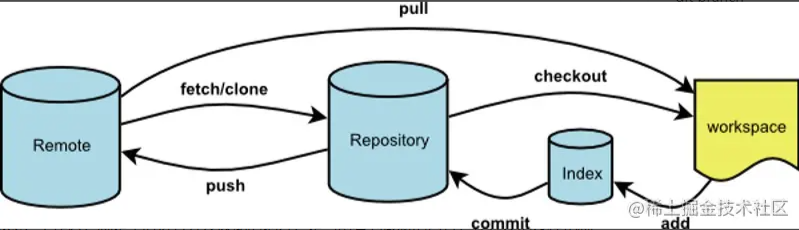

# 原理

**Workspace：工作区**，就是平时进行开发改动的地方，是当前看到最新的内容，在开发的过程也就是对工作区的操作

**Index：暂存区**，当执行 `git add` 的命令后，工作区的文件就会被移入暂存区，暂存区标记了当前工作区中那些内容是被 Git 管理的，当完成某个需求或者功能后需要提交代码，第一步就是通过 `git add` 先提交到暂存区。

**Repository：本地仓库**，位于自己的电脑上，通过 `git commit` 提交暂存区的内容，会进入本地仓库。

**Remote：远程仓库**，用来托管代码的服务器，远程仓库的内容能够被分布在多个地点的处于协作关系的本地仓库修改，本地仓库修改完代码后通过 `git push` 命令同步代码到远程仓库。

# 工作流程

1.在工作区开发，添加，修改文件。
2.将修改后的文件放入暂存区。
3.将暂存区域的文件提交到本地仓库。
4.将本地仓库的修改推送到远程仓库。

zsf1482451437:zsf900625@

SiFeng Zhai:zsf900625@

1482451437@qq.com:zsf900625@
