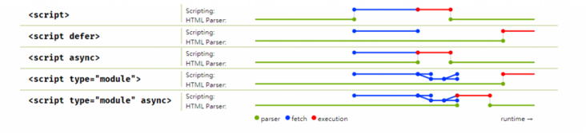

# html5新增了哪些特性？

- 新增了几个语义化元素（nav、header、aside、footer等）
- 新增了两个媒体元素（video和audio）
- 等等

# script标签

我们知道，解析HTML过程中如果遇到**script元素**，要停止解析；同时**启动网络线程**下载script中的资源，并在下载完成后启动**js引擎**解析并执行script中的代码，等js代码**执行完毕**再继续HTML的解析；

这样可能会出现的问题有：

- DOM 树在还**没有完全解析**时**就开始执行 JavaScript**，需要操作 DOM 的程序可能因此无法正确执行；
- 或是由于 `<script>` 中的**资源下载**、**执行时间**过程，用户会卡在白画面，并会产生觉得网站太慢不好用之类的体验；

而把 `<script>` 标签的位置都放到 **`<body>` 的最后一行**来避免 DOM 树解析不完全的问题；

但是在复杂的网站中，需要等到整个 DOM 树都载入完成才开始下载 `<script>` 内的资源并执行，依然会有一段等待时间；

从HTML4 开始，`<script>` 多了 `defer` 属性；

而 HTML5 则多了 `async`；

两者都是用来帮助开发者控制 `<script>` 内**资源的载入及执行顺序**，以及避免 DOM 的解析被资源下载卡住的问题；

一张图理解两者作用

### **async**

对于**普通脚本**，如果存在 `async` 属性，那么**下载脚本**和**DOM解析** 会**并行**，并尽快解析和执行；

对于**模块脚本**，如果存在 `async` 属性，那么脚本及其**所有依赖**都会在**延缓队列**中执行，因此它们会被并行下载，并尽快解析和执行；

该属性能够**消除**解析阻塞的 Javascript；

解析阻塞的 Javascript 会导致浏览器**必须加载并且执行脚本**，之后才能继续解析；

`async` 比较特别，因为在**下载后会立刻执行**，且不**保证执行顺序**，一般常见的应用是设定在**完全独立的小小模块**中，例如**背景Logo、页面广告**等，在避免造成使用者体验变差的同时，尽量早的产生效果。

### **defer**（deferred，延迟）

这个布尔属性被设定用来通知浏览器该脚本将在文档**完成解析后**，触发 `DOMContentLoaded (en-US)` **事件前执行**；

有 `defer` 属性的脚本会**阻止** `DOMContentLoaded` 事件，直到**脚本被加载并且解析完成**；

也就是说，在加上 `defer` 属性后，浏览器会继续解析、渲染画面，而**不会因为需要载入`<script>` 内的资源而卡住**；实际执行时，会在 `DOMContentLoaded` 执行之前，由上到下的依照摆放顺序触发。

**`DOMContentLoaded` 事件**

当初始的 **HTML** 文档被**完全加载和解析完成**之后，**`DOMContentLoaded` **事件被触发，而无需等待样式表、图像和子框架的完全加载。

如果希望 DOM 在用户请求页面后尽可能快地解析

- js异步化；
- 优化样式表的加载；

由于被**并行加载**而减慢页面加载，从主 html 文档“窃取”流量。

`defer` 由于**后台载入**、**不打断渲染**及**确保执行顺序**的特点，基本上在没特殊需求的情况下，在 `<script>` 中设置一下就行了；

`async` 及 `defer` 是 `<script>` 专属的属性；

对于网页中的**其他资源**，可以通过 `<link>` 的`preload`、`prefetch` 属性，来帮我们 **延迟加载** 未来才需要用到的资源。