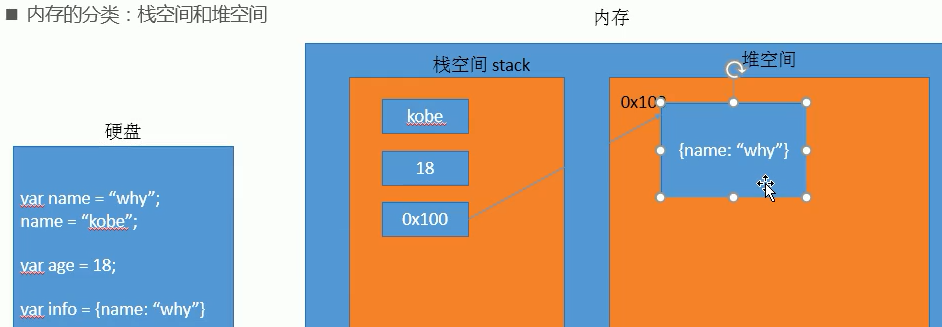

## 计算机基础

### 数据存储

计算机内部使用**二进制 0 和 1**来表示数据；

所有**数据**，包括文件、图片等最终都是以二进制数据（0 和 1）的形式存放在**硬盘**中的；

所有**程序**，包括操作系统，**本质都是各种数据**，也以二进制数据的形式存放在硬盘中；

平时我们所说的安装软件，其实就是把程序文件复制到硬盘中；

**硬盘、内存**都是保存的二进制数据；

###  数据存储单位

```
大小关系：bit < byte < kb < GB < TB<.....
```

- 位(bit)：   1bit 可以保存一个 0 或者 1 （最小的存储单位）
- 字节(Byte)：1B = 8b
- 千字节(KB)：1KB = 1024B
- 兆字节(MB)：1MB = 1024KB
- 吉字节(GB):  1GB = 1024MB
- 太字节(TB):  1TB = 1024GB

### 程序运行

计算机运行软件的过程：

打开某个**程序**时，先从**硬盘**中把程序的代码加载到**内存**中；

**CPU**执行内存中的代码；

之所以要内存的一个重要原因，是因为 **cpu运行太快**了，如果只从硬盘中读数据，会**浪费cpu性能**；

所以，才使用存取速度更快的**内存**来保存运行时的数据；

## 初识JavaScript

### 是什么

- 起源：**网景公司**，由**Brendan Eich**设计出，本来叫**liveScript**，后来为了**蹭热度**改成JavaScript
- 当时微软也推出一门语言叫JScript
- JavaScript成为了ECMAScript最著名的实现之一（ECMAScript是一种语言标准）
- 中国也有自己设计的语言--**易语言**（写外挂）
- JavaScript 是世界上最流行的语言之一，是一种运行在客户端的脚本语言 （Script 是脚本的意思）
- 现在也可以基于 Node.js 技术进行服务器端编程

### 特点

- 它是一种解释型语言，一行行读取，一行行执行（而编译型语言是一次性编译完，在执行）
- 同时它也是一门动态类型语言，可以在执行过程中改变变量的类型，灵活但不安全（静态类型的变量不能改类型）
- 后来推出TypeScript，提供了类型检测

### 作用

-  表单动态校验（密码强度检测）  （ JS 产生最初的目的 ）
-  网页特效
-  服务端开发(Node.js)
-  桌面程序(Electron)（而Vscode是由ts开发的，然后ts转换成js ）
-  App(Cordova) 
-  控制硬件-物联网(Ruff)
-  游戏开发(cocos2d-js)

### 编写位置

- **在HTML元素中直接执行js代码**

  ```html
  <a href="" onClick="alert(123)"></a>
  ```

  ```html
  <a href="javascript:alert(123)" ></a>
  ```

  **但是这种写法不推荐**

- **写到script标签中**

- **从外部引入js文件**（script的src属性引入）

以前代码中script标签还会使用type="text/javascript"属性，现在省略了，因为js是所有现代浏览器以及HTML5的**默认脚本**啦（以前还有其他脚本语言）

**推荐把js放在body元素的最后一个子元素**（写在前面的话有些DOM节点还没加载出来，可能造成不必要的错误）

注意：

**js严格区分大小写**（而HTML和css不区分）

### 2.5 js与浏览器的交互

- **浏览器弹出窗口**

  `alert()`

- **在控制台打印**

  `console.log()`

- **DOM操作时**

  `document.write("<h2>hhh</h2>")`

- **接收用户输入**

  `var age = prompt("提示")`

  `console.log(age)// 18`

### 2.6 浏览器执行 JS 

**浏览器分成两部分：渲染引擎和 JS 引擎**

```
	浏览器本身并不会执行JS代码，而是通过内置 JavaScript 引擎(解释器) 来执行 JS 代码 。JS 引擎执行代码时逐行解释每一句源码（转换为机器语言），然后由计算机去执行，所以 JavaScript 语言归为脚本语言，会逐行解释执行。
```

### 2.7 组成

1. #### **ECMAScript**

   			ECMAScript 是由ECMA 国际（ 原欧洲计算机制造商协会）进行标准化的一门编程语言，这种语言在万维网上应用广泛，它往往被称为 JavaScript或 JScript，但实际上后两者是 ECMAScript 语言的实现和扩展。

   ECMAScript：规定了**JS的编程语法**和**基础核心知识**，是所有**浏览器厂商**共同遵守的一套JS语法工业标准。

   更多参看MDN: [MDN手册](https://developer.mozilla.org/zh-CN/docs/Web/JavaScript/JavaScript_technologies_overview)

2. #### **DOM——文档对象模型**

     **文档对象模型**（DocumentObject Model，简称DOM），是W3C组织推荐的处理可扩展标记语言的标准编程接口。**通过 DOM 提供的接口**可以对页面上的各种**元素**进行操作（大小、位置、颜色等）

3. #### **BOM——浏览器对象模型**

     **浏览器对象模型**(Browser Object Model，简称BOM) 是指浏览器对象模型，它提供了独立于内容的、可以与浏览器窗口进行互动的对象结构。**通过BOM可以操作浏览器窗口**，比如弹出框、控制浏览器跳转、获取分辨率等。

##  JavaScript注释

### 单行注释

单行注释的注释方式如下：

```html
// 我是一行文字，不想被 JS引擎 执行，所以 注释起来	
```

```
// 用来注释单行文字（  快捷键   ctrl  +  /   ）
```

###  多行注释

多行注释的注释方式如下：

```html
/*
  获取用户年龄和姓名
  并通过提示框显示出来
*/
```

```
/* */  用来注释多行文字（ 默认快捷键  alt +  shift  + a ） 
```

**快捷键修改**为：   ctrl + shift  +  /

vscode → 首选项按钮 → 键盘快捷方式 → 查找 原来的快捷键 → 修改为新的快捷键 → 回车确认

### 文档注释

用于提示其它开发人员某个函数的参数、返回值、功能

```js
/**
*提示文本
*/
```


## 变量

### 为什么需要变量？

**保存和复用**

### 什么是变量？

白话：变量就是一个装东西的盒子。

通俗：变量是用于存放数据的容器。 我们通过 变量名 获取数据，甚至数据可以修改。

### 变量存储的本质

打开某个**程序**时，先从**硬盘**中把程序的**代码**加载到**内存**中

**而内存分两类：**

- 栈空间stack
- 堆空间

**基本数据类型**都是放在**栈空间**里的

而**引用数据类型**都是放**堆空间**里的



​	**本质**：**变量**是**程序**在**内存中**申请的一块用来**存放数据的空间**。类似我们酒店的房间，一个房间就可以看做是一个变量。  


### 命名规范

**规则：**

- 由**字母A-Za-z**、**数字0-9**、**下划线_**、**美元符号$**组成，如：usrAge, num01, _name；
- 严格**区分大小写**，var app; 和 var App; 是两个变量；
- **不能 以数字开头**，  18age   是错误的；
- 不能 是**关键字、保留字**。例如：var、for、while；
- 变量名必须**有意义**， MMD   BBD        nl   →     age  ；
- 遵守**驼峰命名法**。首字母小写，后面单词的首字母需要大写。myFirstName

**推荐翻译网站： 有道    爱词霸**

具体可以去官方MDN文档查看

### 标识符

标识符：就是指开发人员为**变量、属性、函数、参数**取的名字。

标识符不能是关键字或保留字。

###  关键字

关键字：是指 JS本身**已经使用**了的字，不能再用它们充当变量名、方法名。

包括：break、case、catch、continue、default、delete、do、else、finally、for、function、if、in、instanceof、new、return、switch、this、throw、try、typeof、var、void、while、with 等。

### 保留字

保留字：实际上就是预留的“关键字”，意思是现在虽然还不是关键字，但是未来可能会成为关键字，同样不能使用它们当变量名或方法名；

包括：boolean、byte、char、class、const、debugger、double、enum、export、extends、fimal、float、goto、implements、import、int、interface、long、mative、package、private、protected、public、short、static、super、synchronized、throws、transient、volatile 等。

注意：如果将保留字用作变量名或函数名，那么除非将来的浏览器实现了该保留字，否则很可能收不到任何错误消息。当浏览器将其实现后，该单词将被看做关键字，如此将出现关键字错误。

## 数据类型

### 为什么需要数据类型？

在计算机中，不同的数据所需占用的存储空间是不同的，为了便于把数据分成所需内存大小不同的数据，充分利用存储空间，于是定义了不同的数据类型；

简单来说，数据类型就是数据的类别型号。比如姓名“张三”，年龄18，这些数据的类型是不一样的；

**数据类型的分类**

- 基本数据类型 

  **Number**

  **String**

  **Boolean**

  **Undefined**

  **Null**

- 复杂数据类型 

  **object**

### 基本数据类型

#### 数值型 **Number**

JavaScript 数字类型既可以保存整数，也可以保存小数(浮点数）。  

```js
const age = 21;       // 整数
const Age = 21.3747;  // 小数   
```

#### **进制**

在JS中**8进制前面加0**，**16进制前面加 0x**  

#### **数值型范围**

- 最大值：**Number.MAX_VALUE**，这个值为： 1.7976931348623157e+308

- 最小值：**Number.MIN_VALUE**，这个值为：5e-32

#### **三个特殊值**

- **Infinity** ，代表无穷大，大于任何数值
  
- **-Infinity** ，代表无穷小，小于任何数值
  
- **NaN** ，Not a number，js中当对数值进行计算时没有结果返回，则返回NaN

#### **isNaN**

用来判断一个变量是否为非数值类型，返回 true 或者 false

```js
const usrAge = 21;
console.log(isNaN(userAge));   // false 
```

### 字符型 String

字符串型可以是引号中的任意文本，其语法为 **双引号 ""** 和 **单引号''**

```js
const strMsg = "我爱北京天安门~"; 
```

因为 HTML 标签里面的属性使用的是双引号，JS 这里我们更推荐使用单引号。

#### 字符串引号嵌套

外单内双

```js
const strMsg = '我是"高帅富程序猿';   // 我是"高帅富程序猿
```

#### 字符串转义符

类似HTML里面的特殊字符，字符串中也有特殊字符，我们称之为转义符。

| 转义符 | 解释说明                          |
| ------ | --------------------------------- |
| \n     | 换行符，n   是   newline   的意思 |
| \ \    | 斜杠   \                          |
| \\'    | '   单引号                        |
| \\"    | ”双引号                           |
| \t     | tab  缩进                         |
| \b     | 空格 ，b   是   blank  的意思     |

#### 字符串长度.length

```js
const strMsg = "我是帅气多金的程序猿！";
alert(strMsg.length); // 显示 11
```

#### 字符串拼接

**+ 号总结口诀：数值相加 ，字符相连**

### 布尔型Boolean

布尔类型有两个值：true 和 false ，其中 true 表示真（对），而 false 表示假（错）;

布尔型和数字型相加的时候， true 的值为 1 ，false 的值为 0;

```js
console.log(true + 1);  // 2
console.log(false + 1); // 1
```

### Undefined和 Null

一个**声明后没有被赋值**的变量会有一个默认值是**undefined** 

但是**转化成数字**时，**undefined为NaN，null为0**

```js
const variable;
console.log(variable);           // undefined
console.log('你好' + variable);  // 你好undefined
console.log(11 + variable);     // NaN
console.log(true + variable);   //  NaN
```

一个声明变量给 null 值，里面存的值为空（学习对象时，我们继续研究null)

```js
const vari = null;
console.log('你好' + vari);  // 你好null
console.log(11 + vari);     // 11
console.log(true + vari);   //  1
```

undefined值实际上是由null值衍生出来的，所以如果**比较undefined和null是否相等时，返回true**

```js
console.log(undefined == null)// true
```


### 判断数据类型

如何获取变量的数据类型?

**typeof** 操作符（也可以用**typeof()**这种格式）

```js
const num = 18;
console.log(typeof num)//number      
```

**缺点**

- 判断**Array、Object、null**或**其它对象**得出的结果都是 'object'；

**instanceof**（原型链检测）

检测某个**实例对象**的原型链上是否出现**构造函数**的 **`prototype` 属性**;

```js
function C(){}
const o = new C();
o instanceof C; // true，因为 Object.getPrototypeOf(o) === C.prototype
```

**Object.prototype.toString.call()**

- Object.prototype.toString()返回的是调用者的类型；

- 而call()可以改变this指向，使得可以判断传入数据的类型；


### 数据类型转换

**使用表单、prompt 获取过来的数据默认是字符串类型的**，此时就不能直接简单的进行加法运算，而需要转换变量的数据类型。

通常会实现3种方式的转换：

- 转换为字符串类型
- 转换为数字型
- 转换为布尔型

### 转换为数字型

- Number(其它类型)
- parseInt（字符串类型）转成整型
- parseFloat（字符串类型）转成浮点型

#### **将string转换成数值型**

**Number()**

```js
const message1 = "123"
const num1 = Number(message1)
console.log(typeoof num1)// 123

const message2 = "abc"
const num2 = Number(message2)
console.log(typeoof num2)// NaN
```

注意：**Number()**虽然可以将字符串转化成数字类型，但只限于能转化成数字类型的如"123"，而转化**"abc"**,会返回**NaN**，虽然类型转化成功了，但是**abc不是数值**，所以返回**NaN**这种特殊的数值类型

**parseInt(string, radix)**函数

只要找到一个**非数值类型**的就停止解析并返回**NaN**

如果**数字在前**，有多少数字就转换多少

```js
parseInt("123.33")// 123
```

```js
parseInt("123ab")// 123
parseInt("ab123")// NaN
```

**parseFloat()**函数

只要找到第一个小数点，后面不解析了

```js
parseFloat("123.33")// 123.33
parseFloat("123.33.12")// 123.33
```

#### **将Boolean转换成数值类型**

**Number()**

- false 0
- true 1

#### **将undefined转换成数字类型**

**Number()**

NaN

#### **将null转换成数字类型**

**Number()**

0

注意 parseInt 和 parseFloat 单词的大小写

- 隐式转换是我们在进行算数运算的时候，JS 自动转换了数据类型

- 转换为布尔型

  - 代表空、否定的值会被转换为 false  ，如 ''、0、NaN、null、undefined  

  - 其余值都会被转换为 true


```js
console.log(Boolean('')); // false
console.log(Boolean(0)); // false
console.log(Boolean(NaN)); // false
console.log(Boolean(null)); // false
console.log(Boolean(undefined)); // false
console.log(Boolean('小白')); // true
console.log(Boolean(12)); // true
```

### 转化成字符串类型

- **变量.toString()**
- **String(变量)**
- **字符串拼接**(变量 + "")(**隐式转换**，**其他数据类型**通过**+运算符**进行拼接时，会**自动**转换成**字符串类型**)

```js
const num = 123
const obj = null
const msg = undefined
const flag = true
num.toString()//"123"
obj.toString()//不适用
msg.toString()//不适用
flag.toString()//"true"
```

null和undefined没有toString()方法

```js
const num = 123
const obj = null
const msg = undefined
const flag = true
String(num)//"123"
String(obj)//"null"
String(msg)//"undefined"
String(flag)//"true"
```

```js
const num = 123
const obj = null
const msg = undefined
const flag = true
num + ""// "123"
obj + ""// "null"
msg + ""// "undefined"
flag + ""// "true"
```

### 转换成布尔类型

**Boolean()**

除了这五种常见特殊值

- **""**(空字符串)
- **0**(或者-0)
- **undefined**
- **null**
- **NaN**

返回**false**

其它值返回**true**

## 运算符


**运算符**（operator）也被称为操作符，是用于实现**赋值**、**比较**和**执行算数运算**等功能的符号。

JavaScript中常用的运算符有：

-  **算数**运算符
-  **递增和递减**运算符
-  **比较**运算符
-  **逻辑**运算符
-  **赋值**运算符

### 算数运算符

- 算术运算符概述

  概念：算术运算使用的符号，用于执行两个变量或值的算术运算。

- **浮点数的精度问题**

  浮点数值的最高精度是 17 位小数，但在进行算术计算时其精确度远远不如整数。


```js
const result = 0.1 + 0.2;    // 结果不是 0.3，而是：0.30000000000000004
console.log(0.07 * 100);   // 结果不是 7，  而是：7.000000000000001
```


**所以：不要直接判断两个浮点数是否相等 !** 

### 自增和自减运算符

- 前置自增运算符

**先自加，后返回值**

```js
const num = 10;
alert(++num + 10);   // 21
```

- 后置自增运算符


**先返回原值，后自加** 

```js
const num = 10;
alert(10 + num++);  // 20
```

### （关系）比较运算符

- 等号比较


```js
console.log(18 == '18');//true，默认转换类型
console.log(18 === '18'); //false，一模一样才行
```

**==** 当两边**类型不一样**时，会进行**隐式转换**，转换成相同类型再进行值的比较，而隐式转换时**转左边还是转右边呢？**，查**MDN**（很多情况）

### 逻辑运算符

- 逻辑与**&&**

  两边都是 true才返回 true，否则返回 false

- 逻辑或 **||**

  只要有一边是true就返回true

- 逻辑非 **！**

  逻辑非（!）也叫作取反符，用来取一个布尔值相反的值，如 true 的相反值是 false

  ```js
  const isOk = !true;
  console.log(isOk);  // false
  ```

  **&& 特殊用法**：当访问了对象不存在的成员（如某个函数）时，要这样写 `a.eat && a.eat()`，等价于

  ```js
  if (a.eat) {
  	a.eat()
  }
  ```

  如果不这么做，那js会**报错**，**不会执行后面的代码**，因为js是**解释型语言**，读一行执行一行

  这叫**短路与**，有**一个条件为false**就不做后续判断

  **|| 特殊用法** ：当需要从多个变量中取一个能用的时，可以这样

  ```js
  const a = b || c || d
  ```

  这叫**短路或**，只要**有一个条件为true**就不做后续判断

### 赋值运算符

```js
const age = 10;
age += 5;  // 相当于 age = age + 5;
age -= 5;  // 相当于 age = age - 5;
age *= 10; // 相当于 age = age * 10;
```

### 优先级

有张表，**（）**很高

##  js执行顺序

- 顺序
- 分支
- 循环

**代码块** 多行代码的集合。放**{}**里

### 顺序

### 分支

- if 
- switch

**if**

- 有简写的**三元表达式**`表达式1? : 表达式2: 表达式3`（只有3个元素）
- if()**括号**里边的值会进行**隐式转换**成**Boolean类型**

**switch**

```js
switch( 表达式 ){ 
    case value1:
        // 表达式 等于 value1 时要执行的代码
        break;
    case value2:
        // 表达式 等于 value2 时要执行的代码
        break;
    default:
        // 表达式 不等于任何一个 value 时要执行的代码
}
```

如果所有的 case 的值都和表达式的值不匹配，则执行 default 里的代码

**注意： 执行case 里面的语句时，如果没有break，则继续执行下一个case里面的语句**，这叫**case穿透**

switch 语句和 if else if 语句的区别

**当分支比较少时，if… else语句的执行效率比 switch语句高。**

**当分支比较多时，switch语句的执行效率比较高，而且结构更清晰。** 

###  循环

### for循环

```js
for(初始化变量; 条件表达式; 操作表达式 ){
    //循环体
}
```

执行过程：

1. **初始化变量**，初始化操作在整个 for 循环只会执行一次。**执行条件表达式，如果为true，则执行循环体语句**，否则退出循环，循环结束。
2. 执行操作表达式，此时第一轮结束。
3. 第二轮开始，直接去**执行条件表达式**（**不再初始化变量**），如果为 true ，则去执行循环体语句，否则退出循环。
4. 继续执行操作表达式，第二轮结束。
5. 后续跟第二轮一致，直至条件表达式为假，结束整个 for 循环。

**for循环嵌套**

打印五行五列星星

```js
let star = '';
for (let j = 1; j <= 3; j++) {
    for (var i = 1; i <= 3; i++) {
      star += '☆'
    }
    // 每次满 5个星星 就 加一次换行
    star += '\n'
}
console.log(star);
```

核心逻辑：

1.内层循环负责一行打印五个星星

2.外层循环负责打印五行

### while循环

```js
while (条件表达式) {    // 循环体代码 }
```

执行思路：

**先执行条件表达式，执行循环体代码**

注意：

**必须要有退出条件**，否则会成为**死循环**

**do-while**

```js
do {     
    循环体代码 - 条件表达式为 true 时重复执行循环体代码
} while(条件表达式);
```

**先再执行循环体，再判断**，

### continue、break

continue 关键字用于立即**跳出本次**循环，**执行下一次**循环 

 break 关键字用于**立即跳出整个循环**（循环结束）。

### **断点调试**

断点调试可以帮助**观察**程序的**运行过程**

**技巧：**当需要在**多个文件**中找要调试的文件，可以在**要调试的文件**里代码的某一**空行**写上 `debugger` 这样调试时浏览器会**自动**帮你找到你要调试的文件

**流程：**
浏览器中按 **F12**--> **sources** -->找到需要调试的文件-->在程序的**某一行**设置断点（**鼠标左键**） --> **刷新网页** -->**鼠标**移动到需要观察的**变量**上

 或者在**Watch**里输入想要观察的**变量**，通过watch可以监视变量的值的变化，非常的常用。

摁下**F11**（或者点击**第二个图标**），程序**单步执行**，让程序一行一行的执行，这个时候，观察watch中变量的值的变化。

**第一个图标** 跳过当前断点，执行下一个断点，如果没有下一个断点，程序运行结束


## 代码规范

### 标识符命名规范

-  **见名知义**
-  **变量**的名称一般用**名词**  
-  **函数**的名称一般用**动词**  

### 操作符规范

操作符的**左右两侧**各保留**一个空格**

```js
// 操作符的左右两侧各保留一个空格
for (let i = 1; i <= 5; i++) {   
    if (i == 3) {       
        break; // 直接退出整个 for 循环，跳到整个for循环下面的语句   
    }   
    console.log('我正在吃第' + i + '个包子呢');
}
```

### 单行注释规范

单行注释前面注意有个空格

```js
for (let i = 1; i <= 5; i++) {   
    if (i == 3) {       
        break; // 单行注释前面注意有个空格   
    }   
    console.log('我正在吃第' + i + '个包子呢');
}
```

### 其他规范	

关键词、操作符之间后加空格

##  数组

**为什么需要数组这种数据结构？**

- 保存大量数据
- 虽然js可以放**不同类型**数据进数组，但**建议**数组中**同类型**，因为在真实开发中，往往需要**对数组元素进行统一处理**，比如要对数组元素按**字符串的方式**处理，但某个元素是**数值型**，可能**不支持**这种处理方式，这样的话会造成意外的麻烦

### 创建数组

JS 中创建数组有两种方式：

- 使用  **Array对象**

  ```js
  var arr = new Array();   // 创建一个新的空数组 
  ```

- 利用数组**字面量**

  ```js
  var  数组名 = []；
  var  数组名 = ['小白','小黑','大黄','瑞奇'];
  ```

### 数组常见操作

### 获取长度

`数组.length`

### 获取元素

**获取某个位置的元素**

索引值

```js
// 定义数组
var arrStus = [1,2,3];
// 获取数组中的第2个元素
alert(arrStus[1]);    
```

**注意：**

- 如果访问时数组**不存在**的**索引值**，不会报错，得到的值是**undefined**
- **js数组**索引值**不支持负数**

### 遍历

又叫**迭代**

- 使用**for循环**
- 数组**高阶函数**


### 新增元素

数组中可以通过以下方式在数组的末尾插入新元素：

```js
数组[ 数组.length ] = 新数据;
```

### 合并


## 高阶函数

支持链式调用

### every()

测试一个数组内**所有元素**是否能通过**某个指定函数的测试**;


**返回值：**

一个布尔值

```js
const isBelowThreshold = (currentValue) => currentValue < 40;
const array1 = [1, 30, 39, 29, 10, 13];
console.log(array1.every(isBelowThreshold));// true
```

### some()

测试数组中是不是**至少有 1** 个元素通过了被提供的**函数测试**

**返回值：**

一个布尔值

```js
const array = [1, 2, 3, 4, 5];

// checks whether an element is even
const even = (element) => element % 2 === 0;

console.log(array.some(even));
// expected output: true
```


### filter()

**返回值**：

一个**新的、符合条件**的元素组成的**数组**；

如果没有任何数组元素通过测试，则返回**空数组**；

```js
// 需求：取出小于100的数字
// 10 20 40 50
const nums = [10, 20, 111, 222, 444, 40, 50]

let newNums = num.filter(function (n) {
    return n < 100
})
```

### map()


**返回值：**

一个由原数组每个元素执行回调函数的结果组成的**新数组**

```js
// 需求: 使数组里每一个元素乘以2得到一个新数组
// 20 40 80 100
let new2Num = newNum.map(function (n) {
    return n * 2
})
```

### reduce()

**应用场景**

需要利用**上一次处理结果**当下一次操作元素

```js
// 需求：将新数组求和
// new2Num 20 40 80 100
let total = new2Num.reduce(function (preValue, n) {
    return preValue + n
}, 0)
// 一开始：preValue--0，n--20
// 第1次：preValue--0+20，n--40
// 第2次：preValue--0+20+40，n--80
// 第3次：preValue--0+20+40+80，n--100
// 第4次：preValue--0+20+40+80+100
// 240
```

**需求汇总：取出小于100的元素，并将他们*2并求和**

链式调用

```js
const nums = [10, 20, 111, 222, 444, 40, 50]

let total = nums.filter(function (n) {
    return n < 100
}).map(function (n) {
    return n * 2
}).reduce(function (pre, n) {
    return pre + n
}, 0)
```

箭头函数写法

```js
const nums = [10, 20, 111, 222, 444, 40, 50]

let total = nums.filter(n => n < 100).map(n => n * 2).reduce((pre, n) => pre + n)
```

### forEach()

**返回值：**

总是返回undefined，所以**不支持链式调用**，一般是放在一个调用链的**最后**执行副作用；

不会**直接改变**调用它的对象，但是那个对象可能会被 `callback` 函数改变；

除了抛出异常以外，没有办法**中止或跳出** `forEach()` 循环；

```js
const array1 = ["a", "b", "c"];
array1.forEach((element) => console.log(element));
// expected output: "a"
// expected output: "b"
// expected output: "c"
```

### 总结

|  函数   |                           应用案例                           | 区别、注意事项 |
| :-----: | :----------------------------------------------------------: | :------------: |
| every() |              检测所有元素的的大小（全体性检查）              |  可以中断遍历  |
| some()  | 1.判断数组中是否存在某个值（存在判断）；<br />2.将任意值转化为布尔值（转化为布尔值）； |                |
|  map()  | 1.格式化数组中的对象（格式化）；<br />2.获取字符串中每个字符所对应的 ASCII 码组成的数组（字符串的ASCLL码）； |  不可中断遍历  |

**存在判断**

```js
const fruits = ['apple', 'banana', 'mango', 'guava'];
function checkAvailability(arr, val) {
  return arr.some((arrVal) => val === arrVal);
}
checkAvailability(fruits, 'kela');   // false
checkAvailability(fruits, 'banana'); // true
```

**转化为布尔值**

```js
const TRUTHY_VALUES = [true, 'true', 1];
function getBoolean(value) {
  if (typeof value === 'string') {
    value = value.toLowerCase().trim();
  }
  return TRUTHY_VALUES.some((t) => t === value);
}
getBoolean(false);   // false
getBoolean('false'); // false
getBoolean(1);       // true
getBoolean('true');  // true
```

**全体性检查**

```js
function isBigEnough(element, index, array) {
  return element >= 10;
}
[12, 5, 8, 130, 44].every(isBigEnough);   // false
[12, 54, 18, 130, 44].every(isBigEnough); // true
```

**格式化**

```js
const kvArray = [{key: 1, value: 10},
               {key: 2, value: 20},
               {key: 3, value: 30}];
const reformattedArray = kvArray.map(function(obj) {
   cosnt rObj = {};
   rObj[obj.key] = obj.value;
   return rObj;
});

// reformattedArray 数组为： [{1: 10}, {2: 20}, {3: 30}],

// kvArray 数组未被修改：
// [{key: 1, value: 10},
//  {key: 2, value: 20},
//  {key: 3, value: 30}]

```

**字符串的ASCLL码**

```js
const map = Array.prototype.map;
const a = map.call("Hello World", (x) => x.charCodeAt(0));
console.log(a);
// a 的值为 [72, 101, 108, 108, 111, 32, 87, 111, 114, 108, 100]
```


## 常用方法

### join()

将一个数组（或一个[类数组对象](https://developer.mozilla.org/zh-CN/docs/Web/JavaScript/Guide/Indexed_collections#working_with_array-like_objects)）的所有元素连接成一个**字符串**并返回这个字符串;

如果数组只有一个元素，那么将返回该项目而不使用**分隔符**;

如果缺省该值，数组元素用逗号（`,`）分隔；

如果`separator`是空字符串 (`""`)，则所有元素之间都没有任何字符；

如果一个元素为 `undefined` 或 `null`，它会被转换为空字符串；

**返回值：**

一个所有数组元素连接的字符串。如果 `arr.length` 为 0，则返回空字符串；

```js
const elements = ["Fire", "Air", "Water"];
console.log(elements.join());
// expected output: 'Fire,Air,Water'
console.log(elements.join(""));
// expected output: 'FireAirWater'
console.log(elements.join("-"));
// expected output: 'Fire-Air-Water'
```

### reverse()


```

```


