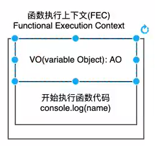
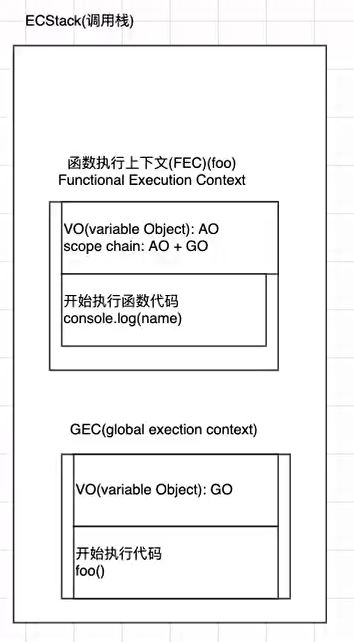

## 提升原理（早期ECMA）

### 作用域

当前的**执行上下文**，值和表达式在其中“可见”或可被访问；

子作用域可以访问父作用域；

在es6之前，只有这几种作用域：

- 全局作用域
- 函数作用域
- with语句形成的

**为什么会出现变量\函数提升？**

这与全局代码执行过程有关

### 全局代码执行过程

例如这段代码

```js
var name1 = 20
var name2 = 30
var res = name1 + name2
```

#### 1.代码被解析

v8引擎内部会帮助我们创建一个**全局对象**（GlobalObject->GO）

并且会将这些**全局变量**放到该**全局对象**中，还未进行赋值操作

```js
var name1 = 20
var name2 = 30
var res = name1 + name2

var globalObject = {
    String: '类',
    Date: '类',
    setTimeout: "函数"
    window: this,
    name1: undefined,
    name2: undefined,
    res: undefined
}
```

#### 2.运行代码

为了执行代码，v8引擎内部会有一个**执行上下文execute context stack**（函数调用栈）；

而我们执行的是全局代码，为了全局代码能够正常执行，需要创建**全局执行上下文**（Global Execution context）（全局代码需要被执行时才会被创建）；

而**全局执行上下文**里面有个variable object（VO）指向的是GO；

开始执行代码；

**作用域提升**的原理就是这样：

**name1、name2、res**一开始被放进了**全局对象GO**，并且值都为**undefined**，此时代码还未执行（编译阶段）；

然后**执行**代码，为他们分别赋值；

要是在执行代码之前前想获取他们的值，只会是undefined；

**变量是这样提升的，那函数呢？**

### 函数执行过程

```js
var name = 'zsf'
foo(123)
function (num) {
    console.log(m)
    var m = 10
    var n = 20
}
```

同样，解析到函数时，会在调用栈里创建一个**函数执行上下文**（FEC），FEC包含2部分：

- VO：指向AO
- 执行代码

然后将**num、m、n变量**放到**AO对象**中，并赋值为undefined

**执行代码**后才会给num、m、n**赋值**

在此之前打印会是**undefined**




### 作用域链

**查找**一个**变量**时，真实的查找路径是**沿着作用域链**找的

```js
var name = 'zsf'
foo(123)
function (num) {
    console.log(m)
    var m = 10
    var n = 20
    console.log(name)//zsf
}
```



其实AO有两部分组成：

- AO本身
- 父级作用域（这里是GO）

**当在AO里面找不name时，会去GO里找**

父级作用域在**编译时**已经确定了,与**定义时**位置有关系，而与**调用时**位置没有关系

当**函数里嵌套函数**同理

```js
var name = 'zsf'
foo(123)
function (num) {
    console.log(m)
    var m = 10
    var n = 20
    function bar() {
        console.log(name)
    }
    bar()//zsf
}
```


函数**执行完**对应的**FEC**就会**弹出栈**

### 面试题

```js
var n = 100
function bar() {
    n = 200
}
bar()
console.log(n)//200
```

```js
function foo () {
    console.log(n)//undefined
    var n = 200
    console.log(n)//200
}
var n = 100
foo()
```

```js
var a = 100
function bar() {
    console.log(a)//undefined
    return
    var a = 10
}
bar()// return是执行阶段的，编译阶段依然会有a:undefined放VO中
```

## this

### 为什么需要this？

没有this，平常写代码很不方便，拷贝一个对象时，很多地方可能都需要修改

### this的指向

与函数**定义时位置**无关，与**函数调用时位置**有关

```js
function foo() {
  console.log(this);
}
// 1.直接调用这函数
foo()//window对象

var obj = {
  name: 'zsf',
  fn: foo
}
// 2.创建一个对象，对象中的函数指向foo
obj.fn()//obj对象
// 3.apply调用
foo.apply('123')//String对象
```

### 绑定规则

#### 默认绑定

**独立函数**调用，指向window

函数调用时没有调用主体

```js
function foo() {
  console.log(this)
}

foo()//window对象
```

```js
var obj = {
  name: 'zsf',
  fn: function foo() {
    console.log(this)
  }
}

var bar = obj.fn
bar()//window,依然没有调用主题
```


#### 隐式绑定

v8引擎绑定的

函数通过**某个对象**进行调用的，this绑定的就是该对象

**前提条件：**

- 必须在**调用的对象内部**有一个**对函数的引用**（比如一个**属性**）
- 如果没有这样的引用，在进行调用时，会报找不到该函数的错误
- 正是通过**这个引用**，**间接**的将this绑定到了这个对象上

```js
var obj = {
  name: 'zsf',
  fn: function foo() {
    console.log(this)
  }
}
obj.fn()//obj对象
```

```js
var obj1 = {
  name: 'zsf',
  fn: function foo() {
    console.log(this)
  }
}
var obj2 = {
  name: 'obj2',
  fn: obj1.fn
}

obj2.fn() // obj2
```


#### 显式绑定

如果不希望在**对象内部**包含这个函数的引用，同时又希望在这个对象上进行**强制调用**，怎么做？

**每个函数**对象都有这2个方法

- call()
- apply()
- bind()

```js
function foo() {
  console.log("被调用了", this);
}
// 直接调用和call()/apply()调用的区别在于this绑定不同
// 直接调用this指向window
foo()
// call()/apply()调用会指定this绑定对象
var obj = {
  name: 'obj'
}
foo.call(obj)//obj
foo.apply(obj)//obj
foo.apply("aaa")//aaa
```

直接调用和call()/apply()调用的区别在于**this绑定不同**：

- 直接调用this**指向window**
- call()/apply()调用会**指定this绑定对象**

#### call和apply的区别

传参方式不同，call接收**多个参数是以逗号分开**，而**apply**会将多个**参数放数组**里

```js
function sum(num1, num2) {
  console.log(num1 + num2, this)
}

foo.call('call', 20, 30)
foo.apply('qpply', [20, 30])
```

**bind的显示绑定**

```js
function foo() {
  console.log(this)
}
foo.call('aaa')
foo.call('aaa')
foo.call('aaa')
foo.call('aaa')
```

等价于

```js
function foo() {
  console.log(this)
}
// 隐式绑定和显式绑定冲突了，根据优先级，显式绑定
var newFoo = foo.bind('aaa')
newFoo() // aaa
```

bind绑定之后会生成一个**新的函数**返回


#### new绑定

js中的**函数**可以当做一个**类的构造函数**来使用，也就是使用**new**关键字

```js
function Person(name, age) {
  this.name = name
  this.age = age
}

var p1 = new Person('zsf', 18)
console.log(p1) // Person
```

通过一个**new**关键字**调用函数**时（构造器），这个时候**this**是在**调用这个构造器时创建**出来的，并且**this = 创建出来的对象**

### 规则之外

#### 忽略显式绑定

```js
function foo() {
  console.log(this)
}

foo.call(null) // window
foo.call(undefined) // window

```

call、apply、bind当传入参数为**null或undefined**时，自动将**this绑定到window对象**

#### 间接函数引用

```js
var obj1 = {
  name: 'obj1',
  foo: function () {
    console.log(this)
  }
}

var obj2 = {
  name: 'obj2'
  bar: null
};

(obj2.bar = obj1.foo)()// 独立函数调用，window， 为啥
(obj1.foo)()//报错，为啥
```

这属于**独立函数调用**（无等号就是**隐式绑定**）

#### 箭头函数

#### 基础语法

箭头函数**不会绑定this、arguments**属性

箭头函数**不能作为构造函数**来使用（不能和new关键字一起使用）

- ()
- =>
- {}

**简写：**

- 只有一个参数可以**省()**
- 只有一行执行提可以**省{}**,并且会将该行代码**当结果返回**
- 执行体只有一行且返回的是一个对象,**小括号()括起来**

```js
var nums = [1,2,3]
nums.forEach(item => {
    console.log(item)
})
```

```js
var nums = [1,2,3]
nums.filter(item => item % 2 === 0)
```

```js
var bar = () => ({name: 'zsf', age: 18})
```

#### 规则

箭头函数**不绑定this**，而是根据**外层作用域**来决定this

```js
var foo = () => {
  console.log(this)
}

foo()//window

var obj = {
  fn: foo
}
obj.fn()//window

foo.call('abc')//window
```

**这样有什么应用呢？**

在箭头函数出来**之前**

```js
var obj = {
  data: [],
  getDate: function () {
    // 发送网络请求，将结果放上面的data属性中
    var _this = this
    setTimeout(function () {
      var result = ['abc', 'bbv', 'ccc']
      _this.data = result
    }, 2000)
  }
}
// 由于这里的隐式绑定，第5行的this绑定了obj对象。才有了，第8行的写法
obj.getDate()
```

箭头函数出来**之后**

```js
var obj = {
  data: [],
  getDate: function () {
    // 发送网络请求，将结果放上面的data属性中
    setTimeout( () => {
      var result = ['abc', 'bbv', 'ccc']
      this.data = result
    }, 2000)
  }
}
obj.getDate()
```

箭头函数**不绑定this**，相当于**没有this**，会寻找**上层作用域**寻找this;

也就是在**getData的作用域**里找this，而**obj.getData**已经**隐式绑定了getData里的this**指向**obj**

### 一些函数的this分析

**setTimeout**

```js
setTimeout(function () {
  console.log(this)//window
}, 1000)
```

setTimeout内部使用的**独立函数调用**，所以**this默认绑定window对象**

###  规则优先级

- 默认最低
- 显式高于隐式
- new高于隐式
- new高于显式

```js
var obj = {
  name: 'obj',
  fn: function foo() {
    console.log(this)
  }
}

obj.fn.call('abc')//abc
```

```js
function foo() {
  console.log(this)
}
var obj = {
  name: 'obj',
  fn: foo.bind('abc')
}

obj.fn()//abc
```

```js
var obj = {
  name: 'obj',
  fn: function () {
    console.log(this)
  }
}

var p = new obj.fn()//fn函数对象
```

```js
function foo() {
  console.log(this)
}
var bar = foo.bind('aa')
var p = new bar()//foo
```

由于call和apply都是主动调用函数，所以不能和new一起使用

### 实现apply、call、bind

#### call

补充：

**展开运算符...**(类似遍历)

```js
var names = ['abc', 'abb', 'ccc']
function foo (n1, n2, n3) {
    
}
foo(...names)

```

自己实现

```js
// 给所有函数加上一个自定义call
Function.prototype.sfcall = function (thisArg, ...args) {
  // 在这里可以执行调用者（函数）
  // 问题1：如何获取到是哪个函数调用了sfcall?
  var fn = this
  // 边界情况edge case1 对thisArg转成对象类型（防止传入非对象类型报错）
  
  // 边界情况edge case2 传入参数null/undefined
  thisArg = thisArg ? Object(thisArg) : window
  // 边界情况edge case2 调用者（函数）有一个或多个参数时
  // 如何执行调用者（函数）?
  thisArg.fn = fn
  // 边界情况edge case3 调用者有返回值
  var result = thisArg.fn(...args)
  delete thisArg.fn
  // 返回调用者的返回值
  return result
}

function foo(n1, n2) {
  console.log('foo执行了', this, n1, n2)
  console.log(n1 + n2);
}

foo.sfcall('sss', 1, 2)
```

#### apply

有时间再补

#### bind

有时间再补

## 内存管理

### 内存泄漏

存在**该释放**内存空间**没有回收**

### 垃圾回收

（Garbage Collection）GC

**不再使用的对象**，都称之为**垃圾**，需要被**回收**

那GC怎么知道哪些对象不再使用呢？

**GC算法**

- 引用计数
- 标记清除

#### 引用计数

每个对象会有个count 只要有引用指向，就+1；当count=0时，就回收该对象

但是这种算法会存在**循环引用**的问题（**两个相互引用**），count永不为0

#### 标记清除

设置一个（root object）**根对象**，垃圾回收器会**定期**从这个**根开始**，找所有**从根开始有引用**到的对象，对于那些**没有引用到**的对象，就认为是**不可用**对象


这种算法会解决循环引用问题

## 补充

### with

with语句可以形成自己的作用域

```js
var obj = {
  name: 'zsf'
}
with(obj) {
  console.log(name)
}
```

现在已经**不推荐了**

### eval

全局函数

```js
var str = 'console.log(123)'
eval(str)//123
```

不建议：

- 可读性差
- 可能会被修改内容，被攻击
- 必须经过js解释器，不能js引擎优化，执行效率低

### 严格模式

es5提出

严格模式的限制：

- 通过**抛出错误**来消除一些原有的静默（silent）错误
- 让**js引擎**执行代码时可以进行**更多的优化**
- **禁用**了**ECMAScript未来版本**可能会定义的**语法**

#### 开启

- js文件
- 某个函数中

**js文件**

文件顶部写上 `use strict` 

**某个函数中**

```js
function () {
    'use strict'
    ...
}
```

####   严格模式常见限制

- 意外创建全局变量
- **不允许**函数有**相同参数名称**
- 静默错误
- **不允许**使用原先的**8进制**格式
- 不允许**with语句**
- **eval**函数**不会向上引用变量**
- **独立函数**（自执行）的this指向**undefined**
- **setTimeout**的this指向**依然是window**
