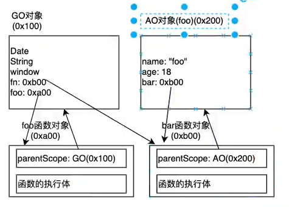

# 函数

函数：就是**封装了一段可被重复调用执行的代码块**。通过此代码块可以**实现某段代码的重复使用**。  

**调用函数，是享受封装的成果**

## 声明函数

利用关键字 **function**

```js
function fn() {...}
```

利用**函数表达式**

```js
const fn = function(){...}
```

每个函数都有一个属性**name**；

**命名函数**和**function定义的函数**，这两种函数的name属性**是定义时函数的名字**；

而**匿名函数**的name属性是**赋值**操作**左边**那个变量名；

## 调用函数

```js
// 调用函数
函数名();  // 通过调用函数名来执行函数体代码
```

注意：声明函数**本身**并**不会执行**代码，只有**调用**函数时**才会执行**函数体代码。


## 参数

函数的**参数**是函数与**调用者**的**交流**渠道

- **形参**：函数**定义时**设置接收调用时传入

- **实参**：函数**调用时**传入小括号内的真实数据

```js
// 带参数的函数声明
function 函数名(形参1, 形参2 , 形参3...) { // 可以定义任意多的参数，用逗号分隔
// 函数体
}
// 带参数的函数调用
函数名(实参1, 实参2, 实参3...); 
```

**函数形参和实参数量不匹配时**

注意：在JavaScript中，**形参**的**默认值**是**undefined**。

### arguments

当**不确定**有**多少个参数**传递的时候，可以用 **arguments** 来获取；

JavaScript 中，arguments实际上它是当前函数（**箭头函数除外**）的一个**内置对象**；

所有函数都内置了一个 arguments 对象，arguments 对象中**存储**了传递的**所有实参**；

arguments展示形式是一个**伪数组**，因此可以进行遍历。**伪数组**具有以下特点：

- 具有 **length** 属性；
- 按索引方式储存数据；
- **不具有**数组的 **push , pop 等**方法；

注意：**只能在函数内部使用该对象**，用此对象获取函数调用时传的实参；

**把类数组（array-like）对象arguments转化成array**

- Array.prototype.slice.call(arguments)
- Array.from(arguments)  es6
- [...arguments]

### **值传递**

```js
function foo (name) {
    name = 'kobe'
}
const temp = 'hhh'
test(temp)
console.log(temp)// hhh
```

`const temp = 'hhh'`这会在内存的**栈空间**开辟一块内存空间；

`test(temp)`也会在内存的**栈空间**开辟一块专门**供函数执行**的内存空间（**函数栈**），并将**test()**相关的变量压入这**函数栈**；

等函数执行完，test()相关的弹出栈（释放内存）；

打印结果**是hhh而不是kobe**；

### 引用传递

```js
function test (arr) {
    arr[0] = 'kobe'
}
const temp = [1, 2, 4]
test(temp)
console.log(temp)// ['kobe', 2, 4]
```


`const temp = [1, 2, 4]`数组是引用类型，这会在堆空间开辟一块连续的内存空间；

而`temp`这变量放在**栈空间**里，temp存的是该**数组**在**堆空间**中的**内存地址0x100**；

`test(temp)`这也会在内存的**栈空间**开辟一块专门**供函数执行**的内存空间（**函数栈**），并将**test()**相关的变量压入这**函数栈**；

执行**test()**，**temp将该数组的引用传递给了arr**，所以**arr指向**了数组在**堆空间**的**内存地址**（arr**可以访问该数组**了）

执行 `arr[0] = 'kobe'`，修改数组的第一个元素内容，**test()**函数执行完，test()相关的弹出栈（释放内存）；

打印结果是`['kobe', 2, 4]`而不是 `[1, 2, 4]`；

**引用传递**说白了就是**提供权利**（**内存地址**）给你**修改内容**

小结：

-  函数可以带参数也可以不带参数
-  声明函数的时候，函数名括号里面的是形参，形参的默认值为 undefined
-  调用函数的时候，函数名括号里面的是实参
-  多个参数中间用逗号分隔
-  形参的个数可以和实参个数不匹配，但是结果不可预计，我们尽量要匹配

##  返回值

### return

```js
// 声明函数
function 函数名（）{
    ...
    return  需要返回的值；
}
// 调用函数
函数名();    // 此时调用函数就可以得到函数体内return 后面的值
```

-  在使用 **return** 语句时，函数会**停止**执行，并**返回**指定的值
-  如果函数**没有 return** ，**返回值**是 **undefined**
-  如果**return后面没内容**，**返回值**也是**undefined**

## 调用栈

函数的**调用过程**是一个**圧栈**的过程，所以才会出现**函数递归调用**导致**栈空间**不足的错误

**经验** 

报错RangeError：Maximum call stack size exceed

**大概率**是出现**函数递归调用**啦


## 立即执行函数

（IIFE立即调用函数表达式）

```js
(function foo () {
    ...
})()
// 这种也行
(function foo () {
    ...
}())
// 或者
var demo = function(){
    ...
}()
```

执行完后会**立即销毁**，想通过**函数名调用**时不行的，所以foo()没有意义了

上面的也可以这样写

```js
(function () {
    ...
})()
```

**这样有什么用呢？**

这会创建一个**独立**的执行上下文环境，可以**避免外界访问或修改**内部的变量，并且也不会污染外部作用域


# 函数的灵活

## 当参数

函数的参数可以传函数

```js
function calc(num1, num2, calcFn) {
  console.log(calcFn(num1, num2))
}
function add(n1, n2) {
  return n1 + n2
}
function decrease(n1, n2) {
  return n1 - n2
}
var num1 = 30
var num2 = 20
calc(num1, num2, add)//50
calc(num1, num2, decrease)//10
```

## 当返回值

```js
function foo() {
  function bar() {
    console.log("bar")
  }
  return bar
}
var fn = foo()
fn()//bar
```

# 高阶函数

接收**另外一个函数为参数**，或者**返回值是另一个函数**时，这种函数叫**高阶函数**

js常见高阶函数：

数组的

- **filter()**
- **map()**
- **forEach()**
- **reduce()**
- **find()**
- **findindex()**

# 纯函数

掌握**纯函数**对于理解很多**框架的设计**是非常有帮助的

**纯函数**特点：

- **确定的输入**，一定会产生**确定的输出**
- 不能产生**副作用**

## 副作用

副作用（side effect）

执行一个函数时，除了**返回结果值**以外，函数还进行其它的操作；

比如**修改了全局变量**，**修改参数**或者改变**外部的存储**；

副作用，往往是产生bug的温床！

**纯函数举例**

- slice 截取数组不会对**原函数**进行任何操作，而是产生一个**新的数组**（**不会修改传入的参数**）

而splice 截取数组，返回新数组，同时也**会对原数组进行修改**

```js
var list = ['a', 'b', 'c']

var newList = list.slice(0,2)
console.log(newList)// ['a', 'b']
console.log(list)// ['a', 'b', 'c']
```

```js
var list = ['a', 'b', 'c', 'd']

var newList = list.splice(2)
console.log(newList)// ['c', 'd']
console.log(list)// ['a', 'b']
```

这也是一个纯函数

```js
var obj = {
  name: 'zsf',
  age: 18
}

function foo(info) {
  return {
    ...info,
    age: 100
  }
}

foo(obj)
console.log(obj)
```

**...info**拿的只是**obj**的一个**副本**，并没有修改obj

**react组件要求是一个纯函数**

## 优势

为什么纯函数在函数式编程中非常重要呢?

- 纯函数可以**安心的编写**和**安心的使用**，只需要关心**参数**和**返回值**
- 让函数的**职责单一**
- 可以进行**逻辑的复用**，复用之后可以定制一些东西，拓展性强

**柯里化逻辑复用例子**

```js
// 假如有这样一个需求: 把5和另外的一个数字相加
console.log(sum(5, 10))
console.log(sum(5, 149))
console.log(sum(5, 106))
console.log(sum(5, 199))

// 柯里化的可以进行逻辑的复用,参数5多次使用，可以复用
function makeAdder(count) {
  return function (num) {
    return count + num
  }
}
var adder5 = makeAdder(5)
adder5(10)
adder5(149)
adder5(106)
adder5(199)
```


## 柯里化Currying

只**传递给函数一部分参数来调用它**，让它**返回一个函数去处理剩余的参数**，这个过程就叫柯里化

只要是将**多个参数**的**一次函数调用**拆分成**多次函数调用**

```js
function foo(a, b, c) {
  return a + b + c
}
foo(1, 2, 3)

// 柯里化
function bar(a) {
  return function (b) {
    return function (c) {
      return a + b + c
    }
  }
}
bar(1)(2)(3)
```

**简化柯里化**

```js
var bar = a => b => c => {
    return a + b + c
} 
```

## 实现柯里化

传入一个函数，返回一个函数；

需要判断该接收的参数是否接收完毕；

使用apply()防止被人调用时修改**this指向**，导致错误;

```js
function add(a, b, c) {
  return a + b + c
}
function sfCurrying(fn) {
  // 1.传入一个函数，返回一个函数
  function curried(...args) {
    // 2.需要判断该接收的参数是否接收完毕
    // 2.1 如何知道传入函数需要多少参数 函数名.length
    if (args.length >= fn.length) {
      // 使用apply防止被人调用时修改this指向，导致错误
      return fn.apply(this, args)
    } else {
      // 参数还不够，返回新函数
      return function curried2(...args2) {
        // 使用递归，拼接参数
        return curried.apply(this, [...args, ...args2])
      }
    }
  }
  return curried
}
// 对add柯里化
var curryingFn = sfCurrying(add)

// add(10, 20, 30)
console.log(curryingFn(10, 20, 30))
console.log(curryingFn(10, 20)(30))
console.log(curryingFn(10)(20)(30))
```

## 应用场景

vue3源码的**渲染器**里的最后用到

# 组合函数

组合函数是js开发过程中一种对**函数使用的技巧，模式**

当一个**数据**需要**依次调用多个函数**时可以应用这个技巧

例子

```js
function double(n) {
  return n * 2
}

function square(m) {
  return m ** 2
}
// 需求：square(double(count))
function composFn(fn1, fn2) {
  return function (count) {
    // 取决于调用顺序
    return fn2(fn1(count))
  }
}

var newFn = composFn(double, square)
console.log(newFn(10))//400
```

## 通用组合函数的实现

```js
function double(n) {
  return n * 2
}

function square(m) {
  return m ** 2
}
// 需求：通用组合函数
function sfCompos(...fns) {
  // 边界情况1 参数传入非函数
  var length = fns.length
  for (let i = 0; i < length; i++) {
    if (typeof fns[i] !== 'function') {
      throw new TypeError('期望参数是函数')
    }
  }
  return function compos(...args) {
    var index = 0
    var result = length ? fns[index].apply(this, args): args
    while (++index < length) {
      result = fns[index].call(this, result)
    }
    return result
  }
}

var newFn = sfCompos(double, square)
console.log(newFn(10))//400
```


# 错误处理

## 抛出异常

调用一个函数时，如果出现了错误，应该去修复这个错误~

不然返回结果不是预期结果

当函数**出现错误**时，应该**告诉调用者**出现了什么错误

比如

```js
function sum(num1, num2) {

  if (typeof num1 !== 'number' || typeof num2 !== 'number') {
    throw 'error'
  }

  return num1 + num2
}

console.log(sum({name: 'zsf'}, 'hhh'))
```

当参数不是**number**类型，就**告诉调用者错误**，如果调用者**不进行错误处理**，就**终止**程序

一般抛出的是**对象**，能放更多信息

### Error类

```js
function sum(num1, num2) {

  if (typeof num1 !== 'number' || typeof num2 !== 'number') {
    throw new Error('不能传入非数字类型~')
  }

  return num1 + num2
}

console.log(sum({name: 'zsf'}, 'hhh'))
```

#### 属性

- message
- name
- stack

stack可以看到**函数调用栈**

```js
function foo(params) {
  throw new Error('error')
}

function bar(params) {
  foo()
}

function test(params) {
  bar()
}

function demo(params) {
  test()
}

demo()
```


```js
// Uncaught Error: error
//    at foo 
//    at bar 
//    at test 
//    at demo 
//    at index.js:17:1
```


### Error的子类

- **TypeError** 类型错误
- **RangeError **下标越界
- **SyntaxError **语法错误

## 处理异常

### 不处理

会将异常**抛给调用者**，最终会抛给顶层调用者，如果**顶层不处理**，**程序终止**，并且报错

```js
function foo(params) {
  throw new Error('error')
}

function bar(params) {
  foo()
}

function test(params) {
  bar()
}

function demo(params) {
  test()
}

demo()
console.log('后续代码')
```

### 捕获异常

在**可能出现异常的代码片段**使用**try...catch**

```js
function foo(params) {
  throw new Error('error')
}

function bar(params) {
  try {
    foo()
  } catch (error) {
    console.log(error)
  }
}

function test(params) {
  bar()
}

function demo(params) {
  test()
}

demo()
console.log('后续代码')
```

处理了异常--打印异常信息，

后续代码正常执行~

**finally**

类似promise的finally，不管有没有异常都会执行里面代码

# 闭包

在 JavaScript 中，闭包会随着**函数的创建**而被同时创建；

*闭包*是由**函数**以及声明该函数的**词法环境**组合而成的；

该环境包含了这个**闭包创建时**作用域内的**任何局部变量**。

**js中的闭包**

```js
function foo() {
  var name = 'zsf'
  function bar() {
    console.log("bar", name)
  }
  return bar
}
var fn = foo()
fn()//bar
```

**闭包=bar()+name**

闭包可以理解为**函数**+**可以访问的自由变量**

**执行完foo()**后，**理应销毁foo()的作用域**，但是foo()**内部的的bar()**还需要访问foo()作用域中的**name**（阻止了foo()的回收）

**广义上**，**js中所有函数都是闭包**（**可以访问**外层作用域的自由变量）

**狭义上**，js中的**函数**如果**访问了**外层作用域的变量（访问了），那这函数就是一个闭包

**模块模式**是闭包的应用~

## 闭包陷阱

```js
function foo(name) {
    function bar() {
        console.log(name)
    }
    return bar
}
const bar1 = foo('zsf')
bar1() // zsf

const bar2 = foo('hhh')
bar2() // hhh

bar1() // zsf
```

闭包在捕获**外层作用域**的变量时，捕获的是在定义那一刻的变量；

## 闭包产生的问题

本应该foo()应该销毁，但是闭包阻止了foo()的回收,**为什么?**

```js
function foo() {
  var name = 'zsf'
  function bar() {
    console.log("bar", name)
  }
  return bar
}
var fn = foo()
fn()//bar
```



因为bar()创建的**AO对象**还有对**父级作用域**（也就是**foo()**）的**引用指向**

但是，bar()**被GO的成员指向**了，这样只要**GO对象不销毁**，那**bar()内存空间就会一直占用**，要是一直使用fn()还好，但我们**只想要执行一次fn()**的话就存在**内存泄露**了！不需要fn()了但它不被销毁

所以说闭包**可能会产生内存泄漏**，取决于你要不要**继续使用那个函数对象**

## 解决闭包产生的内存泄漏

怎么解决？

**fn = null**就行了


按照GC的**清楚标记**算法，由于**bar()不可达**，虽然bar对象和foo对象存在循环引用，但也**会销毁**

## 补充一点

```js
function foo() {
  var name = 'zsf'
  var age = 18
  function bar() {
    debugger
    console.log(name)
  }
  return bar
}
var fn = foo()
fn()//bar
```

v8引擎会删掉 `var age = 18`这行，因为闭包时没有使用age（开发者工具中可观察到-closure）

v8引擎正是做了很多细节的优化，所以性能很高

