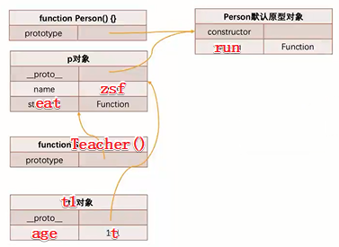

# 1 面向对象

## 1.1 创建对象

创建对象方式：

- 字面量
- new Object

**字面量**

```js
var obj = {
    ...
}
```

**new**

```js
var obj = new Object()
obj.name = 'zsf'
```

## 1.2 创建多个对象的方案

### **工厂模式**

```js
function Person(name, age) {
  var p = {}
  p.name = name
  p.age = age
  p.run = function run() {
    console.log('跑步')
  }
  return p
}
var p1 = new Person('zsf', 18)
var p2 = new Person('hhh', 19)

console.log(p1)
console.log(p2)
```

**缺点：**

打印对象时，**都是Object类型**，获取不到对象**真实的类型**

###  构造函数（构造器）

当使用new调用函数时，和普通调用函数有什么区别？

new调用函数时，发生了什么？

1. 在内存中**创建一个新对象**（空）
2. 将**构造函数**的**显式原型prototype**赋值给前面创建出来的**对象**的**隐式原型**__proto__
3. **构造函数**内部的**this**，会**指向**创建出来的**新对象**
4. **执行**函数代码
5. 如果构造函数没有**返回非空对象**，这**返回**创建出来的**新对象**

用代码表示

```js
function Person() {
  
}
var p = new Person()
```

**内部原理**

```js
function Person() {
  var moni = {}
  this = moni
  this.__proto__ = Person.prototype
  执行代码
  return moni
}
var p = new Person()
```

**moni对象变成了 `{ __proto__: Person.prototype }`**

```js
function Person(name, age) {
  this.name = name
  this.age = age

}
var p1 = new Person('zsf', 18)
console.log(p1)
```

弥补了工厂模式的不足

但是也有**缺点**

 当对象内某个**属性的值是函数**的时候，相当于**重复的创建**了

### 原型和和构造函数结合

```js
function Person(name, age) {
  this.name = name
  this.age = age
}
// 函数放原型
Person.prototype.eat = function () {
  console.log(this.name + '吃东西')
}

var p1 = new Person('zsf', 18)
var p2 = new Person('hhh', 19)

p1.eat()
p2.eat()
```


## 1.3 对操作属性的控制

需求：对**一个属性**进行比较**精准的操作控制**

需要使用**属性修饰符**：

- 可以**精准地添加或修改**对象的属性
- 使用**Object.definedProperty**()添加或修改属性

### Object.definedProperty

Object.definedProperty()会直接在**一个对象**上**定义一个新属性**，或者**修改**一个对象的**现有属性**，并**返回此对象**

**可接收3个参数：**

- obj要操作的**对象**
- prop要定义或修改的**属性名**称或**Symbol**
- description要定义或修改的**属性描述符**

**返回值**

传递给函数的对象

```js
var obj = {
  name: 'zsf',
  age: 18
}
// 属性描述符是一个对象
Object.defineProperty(obj, 'height', {
  value: 1.88
})

console.log(obj)
```

## 1.4 属性描述符

分2类：

- **数据属性**描述符
- **存取属性**描述符


### Configurable

是否可以通过**delete**删除属性，是否可以**修改它的属性**，或者是否可以将它修改成**存取属性**，默认false

### Enumerable

是否可以通过**for-in**或**Object.keys**返回该属性，默认false

### Writable

是否可以**修改属性的值**，默认false

### value

**属性的值**，默认undefined

```js
var obj = {
  name: 'zsf',
  age: 18,
  _address: '广州市'
}
// 存取属性描述符
Object.defineProperty(obj, 'address', {
  enumerable: true,
  configurable: true,
  // 私有属性
  get: function() {
    return this._address
  },
   set: function(value) {
     this._address = value
   }
})

console.log(obj.address)
```

**存取属性描述符应用场景：**

- 隐藏私有属性**不希望**被外界**使用和赋值**
- 如果希望截获一个属性它访问和设置过程

```js
var obj = {
  name: 'zsf',
  age: 18,
  _address: '广州市'
}
// 存取属性描述符
Object.defineProperty(obj, 'address', {
  enumerable: true,
  configurable: true,
  // 私有属性
  get: function() {
    foo()
    return this._address
  },
   set: function(value) {
     this._address = value
   }
})
function foo() {
    console.log('被使用了')
}
console.log(obj.address)
```

### 定义多个属性描述符

```js
var obj = {
  
}
// 多个属性描述符
Object.defineProperties(obj, {
  name: {
    enumerable: true,
    configurable: true,
    value: 'zsf'
  },
  age: {
    value: 19
  }
})

console.log(obj)
```

## 1.5 对象的其它方法

- preventExtends(obj) 阻止拓展（添加属性）
- getOwnPropertyDescriptors 获取对象**所有**的**属性的描述符**
- seal 设置所有属性描述符为false

# 原型

JavaScript 常被描述为一种**基于原型的语言 (prototype-based language)**——每个对象拥有一个**原型对象**，对象以其原型为模板、从原型继承**方法**和**属性**。

## 对象原型（隐式原型）

对象的**原型**可以通过**Object.getPrototypeOf(obj)**获取或已经被弃用的__proto__获取；

js中每个**对象**都有一个`__proto__`属性(是个对象)，这个对象叫对象的**原型**（**隐式原型**），这个对象还会**指向另一个对象**（对应的**原型对象**）

```js
var obj = {
  name: 'zsf',
  __proro__: {}
}
```

**隐式原型有什么用呢？**

1. 在**当前对象**中去**查找**对应的**属性**，如果**找到就直接使用**
2. 如果**没有找到**，那么会**沿着他的原型**去查找
3. 为什么要把有些属性放进原型，而不放在对象里？**为了继承**，这样就**不用每个对象都放**，而是**需要**就去**原型里面找**，这也就解决了**构造函数**可能**重复创建**某些可能不需要的属性了

```js
var obj = {
  name: 'zsf'
}
console.log(obj.age)// undefined
```

```js
var obj = {
  name: 'zsf'
}
obj.__proto__.age = 10
console.log(obj.age)// 10
```

在传统的 OOP 中，首先定义“类”，此后创建**对象实例**时，类中定义的所有**属性和方法**都被复制到实例中;

在 JavaScript 中并不如此复制——而是在**对象实例**和它的**构造器**之间建立一个**链接**（它是__proto__属性，是从构造函数的`prototype`属性派生的）;

之后通过上溯**原型链**，在构造器中找到这些**属性和方法**;

##  函数原型（显式原型)

**函数原型有什么用呢？**

new调用函数时，发生了什么？

1. 在内存中**创建一个新对象**（空）
2. 将**构造函数**的**显式原型prototype**赋值给前面创建出来的**对象**的**隐式原型**__proto__
3. **构造函数**内部的**this**，会**指向**创建出来的**新对象**
4. **执行**函数代码
5. 如果构造函数没有**返回非空对象**，这**返回**创建出来的**新对象**

第2步

```js
function foo() {
  // 下面三行代码是内部自动操作的，不用写
  var moni = {}
  this = {}
  this.__proto__ = foo.prototype
}

console.log(foo.prototype)

new foo()
```

构造函数的**prototype**属性与**对象的原型**的区别：

对象的原型是**每个实例**上都有的属性；

构造函数的**prototype**属性是**构造函数**的属性；

`Object.getPrototypeOf(new Foobar())`和`Foobar.prototype`指向着同一个对象；

## 构造函数的prototype

希望被**原型链下游**的对象继承的**属性和方法**，都被储存在其中；

**构造函数**的**prototype**属性**指向**了他的**原型对象**，该原型对象里面有**constructor**属性；

每个**实例对象**都从**原型**中继承了一个 **constructor** 属性，该属性**指向**了用于构造此实例的**构造函数**；


prototype.**constructor**指向构造函数本身

**可以往prototype里添加的属性吗？**

可以的

而且还可以添加多个

```js
function foo() {
  
}

foo.prototype = {
  name: 'zsf',
  age: 18
}

var f1 = new foo()
console.log(f1.name, f1.age);
```

但是一定要加constructor，原来prototype有，不添加会影响原型链

```js
function foo() {
  
}

foo.prototype = {
  constructor: foo,
  name: 'zsf',
  age: 18
}

var f1 = new foo()
console.log(f1.name, f1.age);
```

这样添加的constructor，可枚举为true，应该设置为false

开发中应该这样添加constructor（用对象的defineProperty）

```js
function foo() {
  
}

foo.prototype = {
  name: 'zsf',
  age: 18
}
Object.defineProperty(foo.prototype, 'constructor', {
  enumerable: false,
  configurable: true,
  writable: true,
  value: foo
})

var f1 = new foo()
console.log(f1.name, f1.age);
```

## 对象的其它方法、操作符

| hasOwnProperty()     | 对象是否有某一个**属于自己**的属性（而不是原型上的属性）     |
| -------------------- | ------------------------------------------------------------ |
| **in/for in** 操作符 | 判断某个属性是否在**对象上或对象的原型上**                   |
| instanceof           | 检测**构造函数的prototype**，是否**出现在某个实例对象的原型链**上（stu instanceof Student） |
| isPrototypeOf()      | 检测**某个对象**，是否**出现**在**某个实例对象的原型链**上   |


# 原型链

解释了为何一个对象会拥有定义在**其他对象中**的属性和方法；

从一个**对象上获取属性**，如果在当前**对象中没有**获取到就会**去它的原型上**面获取

可观察到原型链的例子

```js
var obj = {
  name: 'zsf',
  age: 18
}

obj.__proto__ = {

}

console.log(obj.address)// undefined

obj.__proto__.__proto__ = {
  address: '广州'
}

console.log(obj.address)// 广州
```


## Object的原型对象

**原型链最顶层的**原型对象--Object原型对象

 

原型链是有尽头的(Object.prototype)

```js
var obj = {
  name: 'zsf',
  age: 18
}

console.log(obj.__proto__)// 尽头
console.log(obj.__proto__.__proto__)// null 因为没了
```

new Object() 发生了什么，类似于new调用构造函数

```js
var obj1 = new Object()
```

Object()内部

```js
var moni = {}
this = moni
this.__proto__ = Object.prototype
执行代码
return moni
```

**moni对象变成了 `{ __proto__: Object.prototype }`**

**返回的moni对象**会被**obj1接收**

也就是

```js
obj1.__proto__ = Object.prototype
```

## Object本质也是构造函数

既然是构造函数，那就有**显式原型**prototype

# 4 继承

**为什么需要继承？**

当多个类有很多重复的代码，应该把公共的部分抽离出来封装成父类，子类继承

```js
function Student(name, age) {
  this.name = name
  this.age = age
}

Student.prototype.run = function () {
  console.log(this.name + '跑步')
}


function Teacher(name, age) {
  this.name = name
  this.age = age
}

Teacher.prototype.run = function () {
  console.log(this.name + '跑步')
}
```

## 4.1 直接使用原型链继承

**继承例子**

```js
function Person(name, age) {
  this.name = 'zsf'
  this.age = age
}

Person.prototype.run = function () {
  console.log(this.name + '跑步')
}

function Teacher(name) {
  this.age = 't'
}

var p = new Person()
Teacher.prototype = p

Teacher.prototype.eat = function () {
  console.log(this.name + '吃')
}

var t1 = new Teacher()

console.log(t1.name)
t1.run()
console.log(p)
```

本来t1是没有name和run()的，加上 

```js
var p = new Person()
Teacher.prototype = p
```

之后，就有了



### 弊端

这种继承有3种弊端

- 打印t1对象，继承属性是看不到的
- 当修改父类中的属性时，多个子类都会受到影响
- 实现类的过程都没有传参数

## 4.2 借用构造函数继承

### 原理


为了能**复用age，name**这些属性，**借用了构造函数Person()**，把它**当成普通函数**去调用，通过**call绑定this与Student**，这样就是**给Student添加**age，name这些属性，而**不是给Person添加**


为了能**复用running这些**方法，**new Person()时**创建出来一个**p对象** ，p对象的**隐式原型`__proto__`**又指向**Person显式原型prototype**，然后将**Student的显式原型**prototype**指向p对象**，这样就做到了**Student的显式原型**prototype**指向Person显式原型**prototype（但是**不能直接**Student的显式原型prototype**指向**Person显式原型prototype！！！）

这样，当**stu.running()**的时候就会**沿着原型链**找到这个方法，从而**实现复用**

如果直接 `Student.prototype = Person.prototype`


那当`Student.prototype.studying = function(){}`的时候，就是给Person添加studying方法了，显然，**本来是给子类添加方法**，**现在把方法添加给了父类**，这**不符合面向对象**的原则

```js
function Person(name, age) {
  this.name = name
  this.age = age
}

Person.prototype.run = function () {
  console.log(this.name + '跑步')
}

function Teacher(name, age) {
  Person.call(this, name, age)
  this.tno = 102
}

var p = new Person()
Teacher.prototype = p

Teacher.prototype.eat = function () {
  console.log(this.name + '吃')
}

var t1 = new Teacher('zsf', 18)

console.log(t1)
```


### 弊端

**解决了原型链继承的弊端，但是这种也有2种弊端：**

- 父类构造函数至少被调用2次
- t1原型对象（p）有多余的属性（子类已经有了）

## 4.3 寄生式继承

道格拉斯

**原型式继承+工厂函数**

```js
var personObj = {
  running: function () {
    console.log('跑')
  }
} 

function createStudent(name) {
  var stu = Object.create(personObj)
  stu.name = name
  stu.stufying = function () {
    console.log('study')
  }
  
   return stu
}

var stuObj1 = createStudent('zsf')
var stuObj2 = createStudent('hhh')
```

**这种方式有原型式继承和工厂函数的弊端**

## 4.4 寄生组合式继承

```js
function Person(name, age, friends) {
  this.name = name
  this.age = age
  this.friends = friends
}

Person.prototype.running = function () {
  console.log('running')
}

Person.prototype.eating = function () {
  console.log('eating')
}
// 创建出一个对象，并指向Person的显式原型（prototype），然后赋值给Student的prototype
Student.prototype = Object.create(Person.prototype)
// 修改准确描述符，不然打印出来的是Person类型，因为刚刚创建出来的对象没有constructor，所以会上去找Person的constructor，而constructor指向构造函数本身，因此是Person类
Object.defineProperty(Student.prototype, 'constructor', {
  enumerable: false,
  configurable: true,
  writable: true,
  value: Student
})

function Student(name, age, friends, sno, score) {
  Person.call(this, name, age, friends)
  this.sno = sno
  this.score = score
}

Student.prototype.studying = function () {
  console.log('studying')
}
```

这样不具有通用性

因此可以**封装一个工具函数**

```js
// 当然，要是觉得Object.create太新，也可以自定义,换掉就行
function createObject(o) {
  function fn() {}
  fn.prototype = 0
  return new fn()
}

// 封装成工具类函数
function inheritPrototype(SubType, SuperType) {
  // 创建出一个对象，并指向Person的显式原型（prototype），然后赋值给Student的prototype
  SubType.prototype = Object.create(SuperType.prototype)
  // 修改准确描述符，不然打印出来的是Person类型，因为刚刚创建出来的对象没有constructor，所以会上去找Person的constructor，而constructor指向构造函数本身，因此是Person类
  Object.defineProperty(SubType.prototype, 'constructor', {
    enumerable: false,
    configurable: true,
    writable: true,
    value: SubType
  })
}


function Person(name, age, friends) {
  this.name = name
  this.age = age
  this.friends = friends
}

Person.prototype.running = function () {
  console.log('running')
}

Person.prototype.eating = function () {
  console.log('eating')
}


function Student(name, age, friends, sno, score) {
  Person.call(this, name, age, friends)
  this.sno = sno
  this.score = score
}
// 寄生组合式继承
inheritPrototype(Student, Person)

Student.prototype.studying = function () {
  console.log('studying')
}
```

# 5 原型继承关系


## 5.1 函数的特殊

- foo是一个**函数**，有个**显示原型**prototype
- foo**也是一个对象**，也会有一个**隐式原型**`__proto__`
- 这两个原型不相等
- **prototype来自哪里？**创建了一个**函数** foo.prototype = {constructor: foo } 
- **`__proto__`来自哪里？** **new Function()**, foo.`__proto__` = Function.prototype, 而 Function.prototype = { constructor: Function }
- 特殊：Function.`__proto__` = Function.prototype

```js
function foo() {
  
}
// 等同于
var foo = new Function()
```


