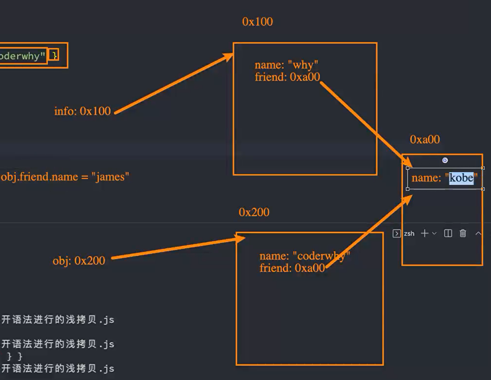
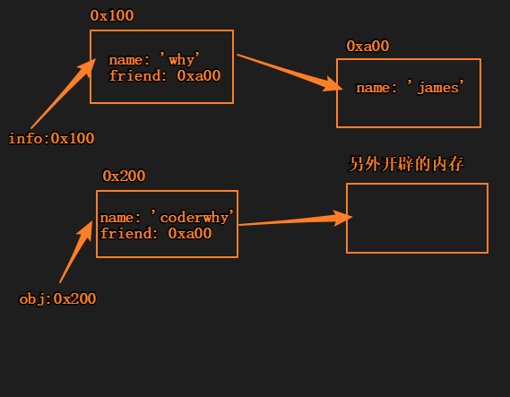
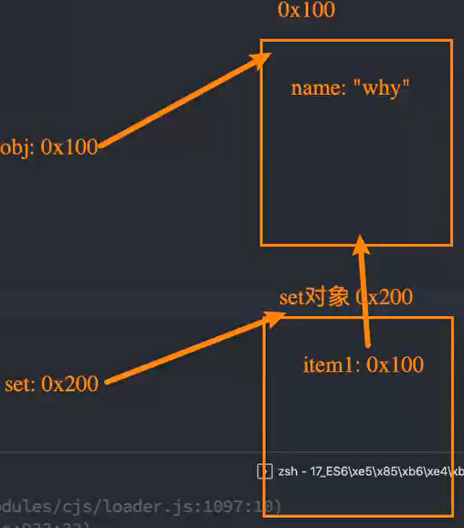
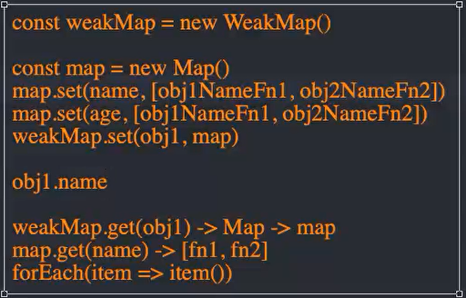

# 类

- 使用class关键字
- 构造函数，原型链的语法糖

## 定义

```js
class Person {

}
```

类中的代码会自动使用**严格模式**，独立调用的函数中的**this**指向**undefined**

##  构造方法

- constructor
- 只能有一个

```js
class Person {
  // 构造方法,只能有一个
  constructor (name, age) {
    this.name = name
    this.age = age
  }
}

var p1 = new Person('zsf', 18)

console.log(p1)
```

## 其它方法

- 实例方法
- 访问器
- 静态方法

```js
class Person {
  // 构造方法,只能有一个
  constructor (name, age) {
    this.name = name
    this.age = age
    this._address = '广州'
  }

  eating () {
    console.log('eat')
  }
  // 类的访问器
  get_address () {
    return this._address
  }

  // 类的静态方法
  static createPerson () {
    console.log('静态方法')
  }
}

var p1 = new Person('zsf', 18)

console.log(p1)
Person.createPerson()
```

## 继承

extends

### super

在子类构造方法中**使用this或者return默认对象之前**，必须通过**super调用父类的构造方法**

**super作用：**

- 使用父类构造方法
- 继承式重写父类方法（复用父类逻辑）

```js
class Person {
  // 构造方法,只能有一个
  constructor (name, age) {
    this.name = name
    this.age = age
  }
  eating () {
    console.log(1)
  }
}

class Student extends Person {
  constructor (name, age, sno) {
    // 使用父类构造方法
    super(name, age)
    this.sno = sno
  }
  // 可以重写父类方法
  eating () {
    super.eating()
    console.log(2)
  }
}

var stu = new Student('zsf', 18, 102)

stu.eating()// 1 2
```

## 继承内置类

```js
class MyArray extends Array {
  fiestItem () {
    return this[0]
  }
}

var arr = new MyArray(1,2,3)
console.log(arr.fiestItem())
```

## 混入mixin

js中只能**单继承**，但又想**复用除父类外其它类代码**，怎么办？

- 方式1-**借助函数**（混入属性、和带参不好做）
- **react**高阶组件

```js
class Runner {
  running () {

  }
}
function mixinRunner(BaseClass) {
  class NewClass extends BaseClass {
    running () {
      console.log('run')
    }
  }

  return NewClass
}

var NewStudent = mixinRunner(Student)
var ns = new NewStudent()
ns.running()
```

# 多态

**传统意义多态条件：**

- 有继承
- 有重写
- 有父类引用指向子类对象

**但js多态条件**：

- **不同的数据类型**
- 进行**同一操作**
- 表现出**不同的行为**

多态的目的是写出更加通用的代码~

```js
function calcArea(foo) {
 console.log(foo.getArea())
}

var obj1 = {
  name: 'zsf',
  getArea: function () {
    return 1000
  }
}

class Person {
  getArea () {
    return 100
  }
}

var p = new Person()

calcArea(obj1)
calcArea(p)
```

这也是js中多态的体现

```js
function sum(m, n) {
  return m + n
}

sum(20, 30)
sum('ab', 'c')
```

# es6新增

## 对象的字面量增强写法

- 属性简写
- 方法简写
- 计算属性

```js
var name1 = 'zsf'
var age = 18
var address = '广州市'

var obj = {
  // 属性的简写
  name1,
  age,
  address,
  // 方法的简写
  bar () {

  },

  baz: () => {
    console.log(this)// window 
  },

  [name1 + 123]: 'hhh'
}
```

## 解构

- 数组的解构
- 对象的解构

**数组**

```js
var names = [1, 2, 3]
var [item1, item2, item3] = names
console.log(item1, item2, item3)// 1 2 3
```

**对象**

```js
var obj = {
  name1: 'zsf',
  age: '18',
  height: 1.88
}

var {name1, age, height} = obj
console.log(name1, age, height)// zsf 18 1.88
// 改名
var { age: newAge } = obj
console.log(newAge)// 18
```

**应用场景**：

对函数的参数解构

```js
var obj = {
  name1: 'zsf',
  age: '18'
}

function foo({name1, age}) {
  console.log(name1, age)
}

foo(obj)// zsf 18
```

## let/const

### 注意事项

**注意1**：

const声明常量的**值不能修改**；

const声明常量要求一个**初始值**；

要是传递的是**引用类型**（**内存地址，比如对象**），可以**通过引用找到对象**，去**修改对象内部的属性**，这是**可以**的

使用Object.freeze()也可以使一个对象**不可重新赋值**；

```js
const obj = {
  name1: 'zsf',
  age: '18'
}

obj = {}// 报错
obj.name1 = 'hhh' // 可以

console.log(obj.name1) // hhh
```

**注意2：**

**let/const 不能定义同一变量，var可以**

### 不能作用域提升

如果使用**let/const声明**的变量，在**声明之前访问**就会**报错**

```js
console.log(foo)
let foo = 'foo'
```

那么是不是意味着**foo变量**只有在代码**执行阶段**才会创建呢？

不是。已经**创建了**，但是**不能访问**

一个**变量**在**声明之前能被访问**，我们称之为**作用域提升**

所以let/const**不能作用域提升**！

### 暂时性死区

从一个**代码块**的**开始**直到代码执行**声明变量**的行之前，let 或 const 声明的变量都处于“暂时性死区”；

当**变量**处于**暂时性死区**中，其尚未被初始化，**尝试访问**变量将抛出 ReferenceError；

当代码执行到**声明变量**所在的**行**，变量**被初始化**为一个值；

若声明中**未指定**初始值，初识值为**undefined**；

```js
var h = 'test'
function foo() {
  console.log(h)
  let h = 'cms'
}
foo()
```

抛出 ReferenceError

**与词法作用域**

```js
function test() {
  var foo = 33;
  if(foo) {
    let foo = (foo + 55); // ReferenceError
  }
}
test();
```

抛出 ReferenceError

由于外部变量 `foo` 有值，因此会执行 `if` 语句块；

但是由于词法作用域，该值在**块内**不可用：`if` 块内的标识符 `foo` 是 `let foo`；

表达式 `(foo + 55)` 会抛出 `ReferenceError` 异常，是因为 `let foo` 还没完成初始化，它仍然在暂时性死区里。

### 与window之间的关系

- 在全局通过**var 来声明一个变量**，事实上会**在window上添加一个属性**
- 但是**let/const**是**不会给window上添加任何属性的**

那let/const声明的变量保存在哪里呢？

放在一个**variableMap**的数据结构里，已经**不完全等于window**了

### var、let、const的选择

| var            | let                            | const            |
| -------------- | ------------------------------ | ---------------- |
| 作用域提升     | 明确知道变量后续会被赋值在使用 | 优先使用         |
| 没有块级作用域 |                                | 保证数据的安全性 |
| window全局对象 |                                |                  |
| 不要使用了     |                                |                  |


## 块级作用域

注意：只对**let、const、class、function**声明的类型有效

```js
{
  var v1 = 'v1'
  let foo = 'foo'
  console.log(foo) // foo
}
console.log(v1) //v1
console.log(foo) //找不到

```

但是**function**特殊，不同浏览器有不同实现（**大部分浏览器**为了**兼容**以前的代码，让function是没有块级作用域的，**但要是有浏览器只支持es6**，那function也是**有块级作用域的**）

**常见块级作用域**

- `for () {}`
- `if () {}`
- `switch`

### 应用

 **没有块级作用域之前**

```html
<button>1</button>
<button>2</button>
<button>3</button>
<button>4</button>
<button>5</button>
```

```js
const btns = document.getElementsByTagName('button')

for (var i = 0; i < btns.length; i++) {
  btns[i].onclick = function () {
    console.log('第' + i + '个被点击')
  }
}
```

**不论点击哪个按钮，都是打印“第5个被点击”**

因为**点击处理函数的作用域没有i**，他要去**上层作用域找i**，也就是去**全局作用域里找**，而全局作用域的i在不断地进行++的时候已经变成**5**了

没有块级作用域之前，是这样解决的

```js
const btns = document.getElementsByTagName('button')

for (var i = 0; i < btns.length; i++) {
  (function (n) {
    btns[i].onclick = function () {
      console.log('第' + n + '个被点击')
    }
  })(i)
}
```

通过**函数多形成了一层作用域**，**暂存了i的值**，就**不用去全局作用域**里找了

块级作用域出来之后

```js
const btns = document.getElementsByTagName('button')

for (let i = 0; i < btns.length; i++) {
  btns[i].onclick = function () {
    console.log('第' + i + '个被点击')
  }
}

```

**let使for具有块级作用域，不会去全局作用域里找i**

### 暂时性死区

使用**let、const**声明的变量。在**声明之前**，变量都是**不可以访问**的，这种现象叫暂时性死区

## 模板字符串

es6之前，变量和字符串拼接时，书写**不方便**和**可读性差**

- 可以计算
- 可以放函数

```js
const name1 = 'zsf'
const age = 18
function doubleAge() {
  return age * 2
}
const msg = `我是 ${ name1 }, ${ age + 2 } 岁, ${ doubleAge() }` 
console.log(msg)
```

### 另外的用法

**标签模板字符串**

- **第一个参数**是字符串中**整个字符串**(**不包含模板字符串**的内容)，只是被**切成多块**，放到**数组**中
- **第二参数**是字符串中,**第一个${}**

```js
function foo(m, n) {
  console.log(m, n)
}

const name1 = 'zsf'
const age = 18
// 标签模板字符串
foo`hello ${ name1 } hh ${ age } h`

```

**应用场景：**

我们自己是很少这样写，但是在react中，遵循**all(html css) in js**, 有个**styled-component库**，会用到标签模板字符串

## 函数

### 参数的默认值

es6之前，参数的默认值是这样的

```js
function foo(m, n) {
  m = m || 'zsf'
  n = n || 'hhh'
  console.log(m, n)
}

foo(0, '')// zsf hhh

```

**缺点：**

- 可读性差
- 有bug，要是传0和空字符串

es6后可以这样写

```js
function foo(m = 'zsf', n = 'hhh') {
  console.log(m, n)
}

foo(0, '')// 0 ''
```

**注意：**

函数有默认值的形参，不算入length属性

**对象解构也可以当默认值**

```js
function foo({ name1, age } = { name1: 'zsf', age: 18 }) {
  console.log(name1, age)
}

foo()

```

**建议**

**有默认值的形参**最后放到**最后**

### 剩余参数

rest参数必须**放参数最后**

```js
function foo(m, n, ...args) {
  console.log(m, n)
  console.log(args)
}

foo(1, 2, 3, 4)// 1 2 [3, 4]

```

#### 与arguments的区别

- **arguments对象**包含了**所有实参**
- **arguments对象**是个**伪数组**，**rest参数**是一个**真数组**
- es6就希望**rest参数**来替代**arguments**

### 箭头函数

箭头函数是**没有显式原型**的，**不能作为构造函数**

## 展开语法

**使用场景：**

- **函数调用**时使用
- **数组构造**时使用
- **构建对象字面量**时使用es9新增

```js
const nums = [1, 2, 3]
const name1 = 'zsf'


function foo(x, y, z) {
  console.log(x, y, z)
}
// 函数调用时
foo(...nums)// 1 2 3
foo(...name1)// z s f

// 构造数组时
const newNums = [...nums]
console.log(newNums)// 1 2 3

// es9构建对象字面量时
const info = {name: 'zsf', age: 18}
const obj = {...info, address: '广州市'}
console.log(obj)// {name: 'zsf', age: 18, address: '广州市'}


```

### 本质

展开运算符进行的是**浅拷贝**

```js
const info = {
  name: 'why',
  friend: {name: 'kobe'}
}

const obj = {...info, name: 'coderwhy'}
obj.friend.name = 'james'

console.log(info.friend.name)// james

```

**改的是obj的，但是info的也被改了**

**浅拷贝**内存图



而**深拷贝**会重新开辟一块新内存，防止原数据被修改




## 数值

- ob 2进制
- 0o 8进制
- ox 16进制
- 大数值连接符_(100_000_000)

## Symbol

### 没有Symbol的弊端

**为什么需要Symbol呢？**

- es6之前，对象的属性名都是**字符串形式**，容易造成**属性名的冲突**
- 当我们希望给一个对象**添加一个新属性和值**的时候，但是**不确定它原来内部**有什么内容的情况下，很容易造成属性名冲突，从而**覆盖掉它内部的某个属性**

**新增数据类型**，es6之后，对象的属性名**可以是字符串**，也可以**是Symbol值**

### 基本使用

它是一个函数，用于生成唯一的值

```js
const s1 = Symbol()
const s2 = Symbol()

console.log(s1 === s2)// false
```

### 作为对象的key

- 定义对象字面量时使用
- 新增属性

```js
// 写法1 定义对象字面量时使用
const obj = {
  [s1]: 'zsf',
  [s2]: 'hhh'
}

//写法2 新增属性

obj[s3] = 'nba'
const s4 = Symbol()
Object.defineProperty(obj, s4, {
  enumerable: true,
  configurable: true,
  writable: true,
  value: 'cba'
})
// 获取 不能通过.语法获取
console.log(obj[s1], obj[s2], obj[s3], obj[s4])
```

### 遍历所有Symbol

- 使用Symbol作为key的属性名，在**遍历Object.keys等**中是**获取不到**这些Symbol值的
- 可以使用**Object.getOwnPropertySymbols()**获取**所有的Symbol值**

### 补充

Symbol也可以生成相同的key

```js
// Symbol也可以生成相同的key
const sa = Symbol.for('aaa') 
const sb = Symbol.for('aaa')
console.log(sa === sb) // true
```

## Set

es6之前，js存储数据的结构主要有2种：**数组、对象**

es6新增了2种数据结构：**Set、Map**

另外形式**WeakSet、WeakMap**

### 基本使用

Set类似于数组，但**元素不能重复**

通过**构造函数Set创建**

```js
const set = new Set()
set.add(10)
set.add(11)
set.add(12)

set.add(10)
// 地址不一样，也是不同元素，注意
set.add({})
set.add({})

console.log(set)// 10 11 12 {} {}
```

### 应用场景

- 不希望有重复数据
- 数组去重

```js
const arr = [33, 10, 26, 30, 33, 26]

const arrSet = new Set(arr)
// const newArr = Array.from(arrSet)
// 或者，Set也支持展开运算符
const newArr = [...arrSet]
console.log(newArr)
```

### 常见属性、方法

- size 返回元素个数
- add() 添加某个元素
- delete() 删除元素
- has() 是否包含某元素
- clear() 清空
- forEach() 遍历

### WeakSet

与Set区别：

- 只能**存放对象类型**
- 对元素的引用是**弱引用**，若**没有其它引用**对该对象进行引用，那么**GC可以对该对象进行回收**（GC不认识弱引用，当**没有强引用指向某个对象**时，**就算有弱引用指向该对象，GC也会回收该对象**）

**set对象**对某个对象的引用是**强引用**

```js
let obj = {name: 'why'}

const set = new Set()
set.add(obj)
```



当执行`obj = null`，obj对象**不会被销毁掉**，因为set对象中**还有属性对obj强引用**

#### 常见方法

- add()
- delete()
- has()

WeakSet不能遍历！

#### 应用场景

不能通过非构造方法创建出来的对象调用类的方法

```js
const personSet = new WeakSet()

class Person{
  constructor () {
    personSet.add(this)
  }

  running () {
    if (!personSet.has(this)) {
      throw new Error('不能通过非构造方法创建出来的对象调用running方法')
    }
    console.log('running', this)
  }
}

const p = new Person()
p.running()

p.running.call({name: 'why'})// 抛出异常
```

## Map

**补充:**

js中是**不能使用对象作为key**的，使用对象作为key，会**将object转化为字符串**，即使多个不同对象，但都会转换成**object这一个字符串**

**Map与对象的区别：**

- Map可以使用**对象类型**或者**其它类型**作为key

### 使用

使用更多的，还是**使用对象类型作为key**

```js
const obj1 = {name: 'zsf'}
const obj2 = {name: 'hhh'}

const map = new Map()

map.set(obj1, 'aaa')
map.set(obj2, 'bbb')
map.set(1, 'ccc')


console.log(map)

```

### 常见属性、方法

- size 
- set() 
- get()
- has()
- delete()
- clear()
- forEach()

### WeakMap

类似于WeakSet

- 只能是对象类型作为key
- 弱引用

#### 常见方法

- get()
- set()
- has()
- delete()

#### 应用场景

**vue3响应式原理**

监听**对象的改变**，并且有**某些函数做出对应的响应**

如何将**函数和对象的属性**关联在一起呢？



1. 将obj1的name**属性**和name属性**对应的响应函数**(多个放数组)用**Map**关联起来，map保存
2. 然后将**obj1**和这个**map**用**WeakMap**关联起来，weakmap保存
3. 当**obj1.name发生改变**时，用**weakMap.get(obj1)获取map**，再用**map.get(name)获取到对应的响应函数数组**，然挨个执行
4. 其它对象属性同理

**为什么第五行使用weakMap不用map？**

要是哪一天`obj1 = null`了，weakmap是弱引用，该对象会自动销毁，用**map**的话，**强引用**，**obj1不会被销毁**

# es6转es5

在线转网站：https://babeljs.io/

# es7

## Array Includes

**es7之前**，想判断一个**数组**中是**否包含某个元素**，需要通过**indexOf**获取结果，并且**判断是否为-1**.

```js
const arr = [1, 2, 3, 4]
if (arr.indexOf(1) !== -1) {
  console.log('包含1')
}
```

**es7使用includes()**

第2个参数还可以**设置从第几个开始查找**

```js
// es7
if (arr.includes(1)) {
  console.log('包含1')
}
```

### 与indexOf的区别

对NaN的判断，indexOf判断不出

```js
const arr = [1, 2, 3, 4, NaN]
if (arr.indexOf(NaN) !== -1) {
  console.log('包含NaN')
} else {
  console.log('找不到')// 打印找不到
  
}
// es7
if (arr.includes(NaN)) {
  console.log('包含NaN')// 包含NaN
}
```

## 指数运算

```js
const result1 = Math.pow(2, 3)
console.log(result1)// 8

// es7

const result2 = 2 ** 3
console.log(result2) // 8
```

# es8

## Object.values

es5之前可以通过Object.keys获取一个对象所有的key，**在es8中，提供了Object.values来获取所有的value值**

```js
const obj = {
  name: 'zsf',
  age: 18
}
console.log(Object.values(obj))
```

## Object.entries

可以获取到一个**数组**，数组中会存放**可枚举属性**的**键值对数组**

```js
const obj = {
  name: 'zsf',
  age: 18
}
console.log(Object.entries(obj))// [['name', 'zsf'], ['age', 18]]
```

## String padding

某些字符串需要对其**前后进行填充**，来实现**某种格式化效果**

- padStart
- padEnd

```js
const msg = 'hello world'
const newMsg =  msg.padStart(15, '*').padEnd(20, '-')
console.log(newMsg)// ****hello world-----

```

# es10

## flat

数组降维

```js
const nums = [10, 20, [2, 8], [[30, 40], [20,45]], 78]
const newNums= nums.flat()
console.log(newNums)
// [10, 20, 2, 8, Array(2), Array(2), 78]
```

### flatMap()

按照**可指定的深度**递归遍历数组，并将**所有元素**与**遍历所有元素到子数组中的元素**合并为一个新数组

- 先是map操作，再做flat操作
- 相当于深度为1

```js
const msg = ['hello world', '你好啊，李银河', 'my name is coderwhy']
const words = msg.flatMap(item => {
  return item.split(' ')
})
console.log(words)
// ['hello', 'world', '你好啊，李银河', 'my', 'name', 'is', 'coderwhy']
```

# es11

可选链

es11之前，**防止某些属性是undefined**而**阻止后续代码的执行**，一般是这样做的

```js
const info = {
  name: 'zsf'
}

if (info && info.friend && info.friend.girlFriend) {
  console.log(info.friend.girlFriend)
  
}

console.log('其它代码逻辑') // 不会前面阻止这里的打印


```

有了可选链，代码更加严谨，**不会因为某个属性是undefined而影响后面代码的执行**

```js
const info = {
  name: 'zsf'
}

console.log(info.friend?.girlFriend?.name)// undefined


console.log('其它代码逻辑') // 不会前面阻止这里的打印


```

## 全局对象

globalThis

在浏览器或者node环境下获取全局对象

```js
console.log(globalThis)// 浏览器: window node: global
```

# es12

## FinalizationRegistry

需要监听对象被销毁并回调一个函数时，可以用**FinalizationRegistery**这构造方法（类）

```js
let info = {
  name: 'zsf'
}
const finalRegistry = new FinalizationRegistry(() =>{
  console.log('注册在finalRegistery的对象，被销毁了')
  
})

finalRegistry.register(info)

info = null
```

## WeakRef

要是想用WeakRef创建出来的弱引用去**拿到原来对象的属性**，**要用deref()**

```js
const obj = {
    name: 'zsf'
}
let info = new WeakRef(obj)
obj = null
// 直接info.name拿不到
console.log(info.deref().name)// zsf
```

在**WeakRef(obj)**的作用下，i**nfo是弱引用**，**obj**不久就会被**销毁**

