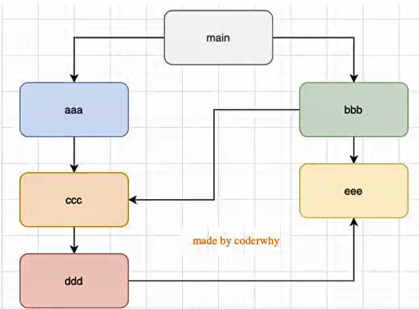
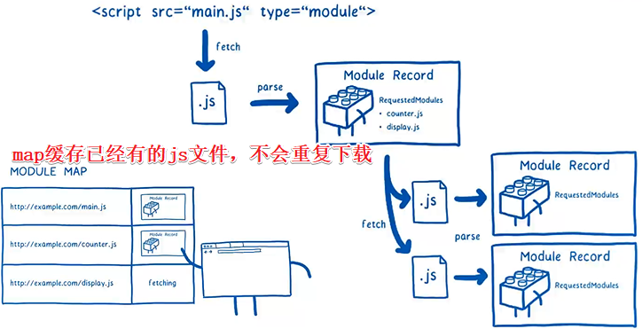
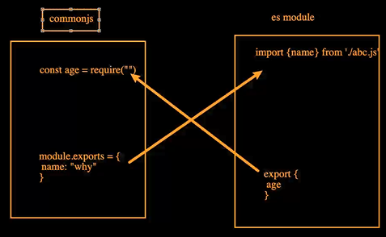
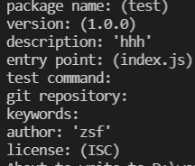
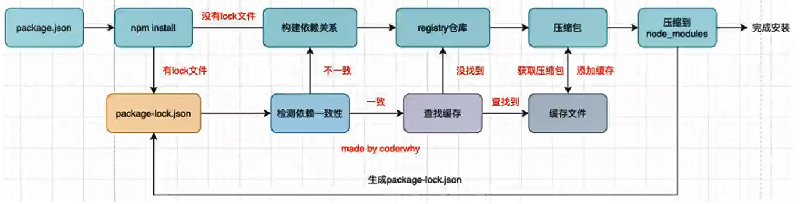

# 1 模块化

**什么是模块化？**

- 目的是将程序划分成**一个个小的结构**
- 这个结构有**独立的作用域**，**独立的逻辑**（避免命名冲突）
- 这个结构当希望另外结构使用自己的**变量、函数、对象**时，可以**导出**
- 这个结构想使用另外结构的变量、函数、对象时，可以**导入**

一般的，**一个文件**就是**一个模块**

早期js是没有模块化的，**es6后js支持模块化啦~**

**js为什么需要模块化？**

1. **ajax**的出现，**前后端开发分离**，意味着后端返回数据后，需要**js进行前端页面的渲染**
2. **SPA**的出现，前端页面变得更加复杂，包括**前端路由、状态管理**等等，一系列复杂的需求需要通过js来实现
3. 包括**node**的出现，js编写**复杂的后端程序**，没有模块化是的话，就很难~

**模块化的核心是导入和导出**

# 2 模块化规范

在**es6之前**，为了让js支持模块化，涌现出不同模块化的规范：

- AMD
- CMD
- CommonJS

类似于Promise/A+规范，在es6之前，社区已经有了

**AMD、CMD规范用的越来越少**，但是**CommonJS依然非常流行**，node、webpack、vue cli都是基于它的

现在项目使用比较多的是**es6和CommonJS的模块化**

以前是用**立即执行函数**来避免**命名冲突**的

但是这样又会导致**全局作用域访问不了立即执行函数的变量**

以前是这样解决的

**aaa.js**

```js
const moduleA = (function (params) {
  const name = 'zsf'
  const age = 18
  const isFlag = true

  return {
    name: name,
    isFlag: isFlag
  }
})()
```

**bbb.js**

```js
(function (params) {
  if (moduleA.isFlag) {
    console.log(moduleA.name)
  }
})()
```

- **这种方式依然可能有命名冲突**
- **而且使用时还要规定名字**

不过这种方式是模块化的雏形~

# 3 CommonJS规范

**最初**提出来是在**浏览器以外**的地方使用，当时被命名为**SeverJS**，后来为了体现他的广泛性，修改为CommonJS，也会被简称**CJS**

**node**是commonjs一种实现~

## 3.1 导入导出

- module.exports 导出
- require() 导入

index.js

```js
const zsf = require('./zsf.js')

console.log(zsf.name)
zsf.foo()
```

zsf.js

```js
const name = 'zsf'
function foo() {
  console.log(123)
}

module.exports = {
  name: name,
  foo: foo
}
```

**index.js如何使用zsf.js里面的东西呢？**

zsf.js通过**module.exports导出**

index.js通过**require()导入**

**他们通信的东西，是对象~**

所以也可以做个**解构**~

```js
const {name, foo} = require('./zsf.js')

console.log(name)
foo()
```

## 3.2 内部原理

```js
const zsf = {
  name: 'zsf',
  age: 18,
  foo () {
    console.log('foo')
  }
}
module.exports = zsf
```

```js
const zsf = require('./zsf.js')

console.log(zsf)
```

**module.exports 指向zsf** 时，就将zsf暴露出去了，而

require函数内部类似于

```js
function require(id) {
    return module.exports
}
```

所以**zsf = require('./zsf.js')** 时，**zsf 就指向了 module.exports**。

这样，**不同文件指向同一对象**，也就可以共享该对象啦~

### **module.exports**内部逻辑

敲重点！

```js
const module.exports = {}
const exports = module.exports
```

所以这两段代码等效

```js
exports.name = name
exports.age = age
```

```js
module.exports = {
    name,
    age
}
```

但是，要是换成这段代码

```js
exports = {
    name,
    age
}
```

导出的**module.exports就是空对象**了~因为**exports已经改掉了指向**（之前指向module.exports），现在**指向{name, age}**，因为最终**导出的是module.exports指向的对象**

### **require查找规则**

**require(X)**

#### 核心模块

X是一个**Node核心模块**，如path、http，直接**返回**核心模块，并**停止查找**

#### 路径

如果**有后缀名**，按照后缀名格式查找对应文件

如果**没有后缀名**会按照以下顺序：

1. 直接查找文件X
2. 查找X.js
3. 查找X.json
4. 查找X.node

**没有找到**对应的文件，将X作为一个**目录**

查找目录下面的index文件：

1. 查找X/index.js
2. 查找X/index.json
3. 查找X/index.node

如果还没找到就报错啦~

#### 不是路径，不是核心模块

会一层一层往上找node_modules文件夹

## 3.3 模块加载过程

### 第一次引入

**模块在被第一次引入时，模块中的js代码会被运行一次**

```js
// zsf.js
const name = 'zsf'

console.log('zsf模块被运行~')

module.exports = {
  name
}

// foo.js
require('./zsf')// zsf模块被运行~
```

只是将name导入，但zsf.js模块里的打印也运行了~

### 多次引入

**模块被多次引入时，会缓存，最终只加载一次**

为什么只加载一次？

- 因为每个模块对象module都有一个属性：loaded
- 为false表示没有加载。为true表示已经加载

```js
// zsf.js
const name = 'zsf'

console.log('zsf模块被运行~')

module.exports = {
  name
}

// foo.js
require('./zsf')
require('./zsf')
require('./zsf')// zsf模块被运行~
```

你会发现，只打印了一次

### 循环引入



加载顺序采用**深度优先**算法：

main -> aaa -> ccc -> ddd -> eee -> bbb

## 3.4 缺点

### 加载模块是同步的

只有**等到引入的模块加载完毕**，**当前模块**中的代码才能被运行

这个**放服务器不会有什么问题**，因为服务器加载的**js文件都是本地的**，加载速度非常快

但是要是**放浏览器**，如果有的模块需要**网络请求**才能加载，那将会**阻塞**代码的执行

# 4 ES Module

ES Module相比于CommonJS：

- 使用**import**和**export**关键字
- **编译期的静态分析**，也加入了**动态引用**的方式

**es module自动采用严格模式**

那，下面的例子能使用模块吗

```html
<script src="./foo.js"></script>
```

```js
// zsf.js
export const name = 'zsf'
export const age = 18

// foo.js
import {name, age} from './zsf.js'

console.log(name, age)
```

会报错：`SyntaxError: Cannot use import statement outside a module`

不能在模块外使用import~

**得给script元素加上`type="module"`属性**才支持模块化

```html
<script src="./foo.js" type="module"></script>
```

```js
// zsf.js
export const name = 'zsf'
export const age = 18

// foo.js
import {name, age} from './zsf.js'

console.log(name, age)// zsf 18
```

还有一个需要**注意**，使用模块的时候，不能直接打开html，要使用本地服务器（live server）打开，不然会报错，因为**加载模块文件其实需要发送网络请求的**，而且是用**http协议**去加载模块文件的~本地打开用的是**file协议**去加载文件（CORS协议）

## 4.1 导出

### export 声明语句

```js
export const name = 'zsf'
export function foo() {
  
}
export class Person{

}

```

### export和声明分开

```js
const name = 'zsf'
function foo() {
  
}
class Person{

}
export {
  name,
  foo
}
```

注意，**export {}** 是固定语法，不可以写键值对

### 导出时起别名

```js
const name = 'zsf'
function foo() {
  
}
class {

}
export {
  name as fname,
  foo as hhhfoo
}
```

导入也要用别名

### 默认导出

只能有一个~

希望以某个成员作为默认导出时

```js
const name = 'zsf'
function foo() {
  console.log('foo')
}

export {
  name,
  foo as myFoo
}
```

而**常见写法**是这样

```js
const name = 'zsf'
function foo() {
  console.log('foo')
}

export default foo
```

导入方要是用其它名字（导出方不存在），拿到的是默认导出的

```js
import zsf from './bar.js'
zsf() // foo
```


## 4.2 导入

### 普通导入

```js
import {name, age} from './zsf.js'
```

### 起别名导入

常见

```js
import {name as fname, age as fage} from './zsf.js'
```

### 将导出的所有内容放到一个标识符中

```js
import * as foo from './zsf.js'

console.log(foo.name, foo.age)
```

### import

```js
import foo from './zsf.js'
```

这种格式的导入是**同步**的，得等到导入成功、解析完、且赋值时才会执行后续代码

那要想**异步导入**，不阻塞后续代码，怎么做？

**import()**

```js
import('./zsf.js')
```

但这样有个问题，**怎么拿到foo里面的一系列成员？**

**import()返回的是一个promise**

```js
import('./foo').then((res) => {
  console.log(res)
})

```

res拿到的，就是原来foo里面的内容

#### es11新增

**import.meta**

meta本身也是个对象，里面有个人**url**属性，是**当前模块所在的路径**

## 4.3 导入导出结合

### 一般情况

```js
// add.js
export function add() {
  
}

// sub.js
export function sub() {
  
}

// index.js
import { add } from './add.js'
import { sub } from './sub.js'

export {
  add,
  sub
}

// user.js
import { add, sub } from './index.js'
```

类似于这种工具的封装，我们**不会一个一个导入user.js**

而是将那些**子模块全放进index.js**（统一出口）里，再全部导出，user.js**按需导入**~

### 结合

```js
// add.js
export function add() {
  
}

// sub.js
export function sub() {
  
}

// index.js
export { add } from './add.js'
export { sub } from './sub.js'

// user.js
import { add, sub } from './index.js'
```

骚~

### 结合改进

```js
// add.js
export function add() {
  
}

// sub.js
export function sub() {
  
}

// index.js
export * from './add.js'
export * from './sub.js'

// user.js
import { add, sub } from './index.js'
```

如果导入的东西不使用（像这种**统一出口**），可以使用这种方式

这个更骚~

## 4.4 解析流程

推荐文章：https://hacks.mozilla.org/2018/03/es-modules-a-cartoon-deep-dive/

**阶段一，构建（construction）**

根据地址查找js文件，并且下载，将其解析成模块记录（module record）**（静态分析）**

**阶段二，实例化（Instantiation**）

对模块记录进行实例化，并且分配内存空间，解析模块的导入导出语句，把模块指向对应的内存地址

 **阶段三，运行（Evaluation）**

运行代码，计算值，并且将值填充到内存地址中**（动态运行）**

### 构建



### **补充**

CommonJS与es modules之间的相互导入导出



1）**在浏览器中**

不能！因为浏览器默认不支持CommonJS

2）**在node中**

版本区分，有的开始支持，并且可能要写一些配置

3）**平时开发**（webpack）

Vue-CLI->webpack

create-react-app->webpack

任意使用！

# 5 包管理工具

**为什么需要包管理工具？**

方便代码共享和管理！

你可以npm publish你的工具到一个库（registry）中，别人就可以npm install使用你的工具啦~

就不用所有代码都放到github上，你说是不是？

- npm
- yarn
- cnpm
- npx

## 5.1 npm

**如何下载npm工具呢？**

npm属于node的一个管理工具，需要先安装node~

node官网走起~

尽量使用LTS(长期支持)版本

**npm管理的包可以在哪里查看呢？**

https://www.npmjs.org

这个网站会**检索**出上面提到的registry库里面有哪些包，供查看。

但是我们发布的包实际是放registry库里面

### 安装语法

`npm instal 包名`

**如果有很多依赖的包，那是不是要一个东西来记录一下呢？**

**packag.json**

### 创建你的包

命令 `npm init` 可以创建一个**package.json**, `npm init -y` 表示所有东西是yes。

执行 `npm init` 之后，会有以下信息需要写：

package name（包名）

version（版本号）

description（描述）

entry point（项目入口）

test command（测试命令）

git respository (git 仓库)

keywords （仓库关键字）

author （作者）

license （开源协议）



```json
{
  "name": "test",
  "version": "1.0.0",
  "description": "'hhh'",
  "main": "index.js",
  "scripts": {
    "test": "echo \"Error: no test specified\" && exit 1"
  },
  "author": "'zsf'",
  "license": "ISC"
}

```

更多时候是脚手架创建出来的~

### package.json常见属性

**name、version**必填

- name
- version
- description
- author
- license
- **private**
- **main**
- **scripts**
- **dependencies**
- **devDependencies**

**private**

记录当前的项目是否是私有的，

当值为true时，npm是不能发布它的，防止私有项目或模块发布出去，造成公司的损失~

**main**

指向包的入口文件，方便别人使用，一般开源的项目才需要这属性

**scripts**

可以定制化命令

比如

```json
"scripts": {
    "zsf": "node ./index.js"
}
```

你在终端运行 `npm run zsf` 时，实际上就是执行 `node ./index.js` 命令。

**dependencies**

记录生产环境和开发环境都需要依赖的包信息

**devDependencies**

记录开发环境需要依赖包的信息

**peerDependencies**

对等依赖，比如element-plus是依赖于Vue3的，ant design是依赖于react、react-dom的

### 包的版本

npm的包通常要遵从semver版本规范：

semver：https://semver/lang/zh-CN/

- 3位版本号：主版本号（major）、次版本号（minor）、修订号（patch）
- ^ 版本号（minor）、修订号（patch）尽可能最新
- ~ 修订号（patch）尽可能最新

一般的，

主版本是是大改~

次版本是添加了新特性，并且向下兼容

而修订，一般是修改了某个bug

###  npm命令

就说说常用的

| 命令                       | 参数 | 例子                   |
| -------------------------- | ---- | ---------------------- |
| 全局安装                   | -g   | npm install webpack -g |
| 局部安装                   | 无   | npm install webpack    |
| 安装开发和生产依赖         | 无   | npm install webpack    |
| 安装开发依赖               | -D   | npm install webpack -D |
| 安装package.json里所有依赖 | 无   | npm install            |
| 清除缓存                   | 无   | npm cache clean        |

**卸载类似~**，其它官网走起~

### npm install原理

早期`npm` 安装的包**没有缓存**机制和**package-lock**.json等等，所以才会出现`yarn` 解决npm早期的弊端

**你想过执行 `npm install` ，发生了什么吗**？

1.检查是否有**lock文件**。

2.1 如果没有，那就**构建依赖关系**

2.2 然后去**registry仓库**找

2.3 找到就下载成**压缩包**，并且放到**缓存**里

2.4 然后解压到**node_modules**文件夹

2.5 最后会生成一个**lock文件**（package-lock.json）

3.如果有， 那就检查**版本的一致性**

3.1 如果不一致，会**重新构建依赖关系**，并执行第2.2 ~ 2.5步

3.2 如果一致，会**查找缓存**（npm get cache 可以查看缓存的包存放的位置）

3.3 如果没有缓存，会去**registry仓库**下载

3.4 如果有缓存， 会**获取压缩包**，并解压到node_modules文件夹下，**更新lock文件**

借用一下**王红元老师**的图：



### npx

npm5.2后自带的命令

比较常见是使用它来**调用**项目中的某个**模块**的指令

举个例子，你想自定义个脚本zsf，脚本内容是查看webpack 版本  `webpack --version`

这时你会去package.json中，添加上这么一段，对吧？

```json
"scripts": {
    "zsf": "webpack --version"
}
```

但是你不想这么做，想直接运行，而且webpack还是安装在别的路径，你觉得cd一下再执行太麻烦啦，这时你就可以使用

`npx webpack --version`

不用cd了~

## 5.2 yarn

 与npm类似，一些细节不同，想了解官网走起~

## 5.3 cnpm

某些情况，我们无法从 https://registry.npmjs.org 下载下来一些需要的包，或者下载速度比较慢（毕竟是国外的网站）

**怎么解决？**

**方法一**

拷贝一份国外的registry仓库，放到国内服务器（淘宝镜像），然后使用 `npm config set registry https://registry.npm.taobao.org`  命令修改访问源 （查看 npm config get registry）

但是，**不推荐**这种方法，因为这个镜像对registry的同步可能不是实时的，说不定是10分钟才更新1次。。。而且这个镜像有可能不再维护。。。

**方法二**

全局安装cnpm

`npm install cnpm -g`

然后使用 `cnpm config set registry https://registry.npm.taobao.org`  命令修改访问源 

和方法一同理，**不推荐**。

**小技巧**

遇到实在不能安装的包，使用手机热点，嘿嘿，管用哟。

## 5.4 发布

**如何发布自己的包？**

1.先 `npm init` 创建，填一下基本信息

2.然后新建一个index.js

3.在里面写内容

```js
function add(num1, num2) {
    return num1 + num2
}

module.exports = {
    add
}
```

4.前提是你在npm在有账号，然后使用 `npm login` 填写账号信息

5.最后 `npm publish`

最后可以npm install xxx验证一下~

## 5.4 更新

当你想修改你的包

要先修改版本号，然后再 `npm publish` 发布

## 5.5 删除、过期

**npm unpublish 删除**

**npm deprecate 过期**
