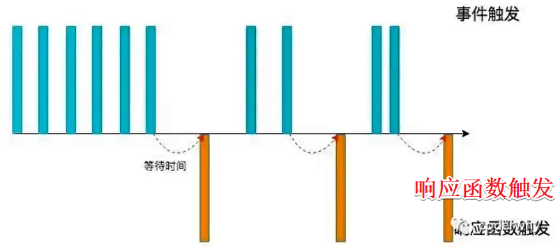
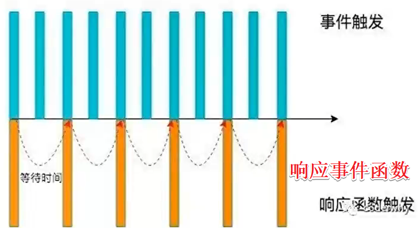

# 防抖与节流

**为什么需要防抖和节流？**

js是事件驱动的，大量的操作会触发事件，加入到事件队列中去

而对于某些**频繁的事件处理**会造成**性能损耗**

我们就可以通过防抖和节流来**限制**事件频繁的发生

比如输入框的联想，如果每次输入一个字符都需要请求一次（输入的很快），那将对服务器压力非常大；

我们应该做一个**限制**：设置一个等待计时器，当用户500ms内有新输入，就清空等待时间，重新计时，再等待500ms，只有计数器超过500ms才会发送请求~

这是防抖的一个典型应用

## 防抖

debounce

往后推延



### 应用场景

- 输入框的联想
- 回城挑衅
- 频繁点击按钮
- 监听浏览器滚动事件，完成某些特定操作
- 用户缩放浏览器的resize事件
- 等待

### 手写

设置一个计时器

如果在规定时间内有重复事件触发，则清空计时器，重新计时。

直到超出规定时间，才会触发事件

#### 基本实现

```js
const debounceElement = document.getElementById("debounce")
const handleClick = function (e) {
  console.log("点击了一次")
}
// debounce防抖函数
function debounce(fn, delay) {
  // 定一个定时器对象，保存上一次的定时器
  let timer = null
  // 真正执行的函数
  function _debounce() {
    // 取消上一次的定时器
    if (timer) {
      clearTimeout(timer);
    }
    // 延迟执行
    timer = setTimeout(() => {
      fn()
    }, delay)
  }
  return _debounce
}
debounceElement.onclick = debounce(handleClick, 300)
```

#### this-参数

```js
function debounce(fn, delay) {
  let timer = null

  const _debounce = function (...args) {
    // 重置上一次的计时器,前提timer有值
    if(timer) clearTimeout(timer)
    // 重新计时
    timer = setTimeout(() => {
      // 显示绑定this，防止独立调用this指向window，这个工具函数的this应该指向事件对象
      fn.apply(this, args)
    }, delay)
  }

  return _debounce
}
```

#### 立即执行

```js
function debounce(fn, delay, immediate = false) {
  let timer = null
  let isInvoke = false

  const _debounce = function (...args) {
    // 重置上一次的计时器,前提timer有值
    if(timer) clearTimeout(timer)

    // 判断是否是立即执行
    if (immediate && !isInvoke) {
      fn.apply(this, args)
    }
    // 重新计时
    timer = setTimeout(() => {
      // 显示绑定this，防止独立调用this指向window，这个工具函数的this应该指向事件对象
      fn.apply(this, args)
      isInvoke = true
    }, delay)
  }

  return _debounce
}
```

#### 取消

```js
function debounce(fn, delay, immediate = false) {
  let timer = null
  let isInvoke = false

  const _debounce = function (...args) {
    // 重置上一次的计时器,前提timer有值
    if(timer) clearTimeout(timer)

    // 判断是否是立即执行
    if (immediate && !isInvoke) {
      fn.apply(this, args)
    }
    // 重新计时
    timer = setTimeout(() => {
      // 显示绑定this，防止独立调用this指向window，这个工具函数的this应该指向事件对象
      fn.apply(this, args)
      isInvoke = true
      timer = null
    }, delay)

  }

  // 取消功能
  _debounce.cancel = function () {
    if (timer) {
      clearTimeout(timer)
    }
    timer = null
    isInvoke = false
  }

  return _debounce
}
```


## 节流

throttle

固定频率处理



### 应用场景

- 游戏中的一些设计（无论你点击多少次，只会以固定的频率触发事件）
- 监听页面的滚动事件
- 鼠标移动事件
- 用户频繁的点击按钮操作

### 手写

第一个要不要立即执行？

需要计算剩余时间（remainTime = interval - （nowTime - startTime））

**nowTime怎么来？**

事件触发的时间nowTime = new Date().getTime()

**interval是什么？**

时间间隔，传入的参数

当**剩余时间**小于等于0的时候要执行一次，而且startTime要重新赋值为nowTime

#### **基本实现**

```js
function throttle(fn, interval) {
  let startTime = 0

  const _throttle = function () {    
    // 触发事件但当前时间
    const nowTime = new Date().getTime()
    // 剩余时间
    const remainTime = interval - (nowTime - startTime)

    if (remainTime <= 0) {
      fn()
      // startTime重新计时
      startTime = nowTime
    }
  }

  return _throttle
}
```


## 第三方库

当然，这两个工具函数也可以使用别人写好的，放在第三方库里

- lodash
- underscore

虽然lodash是underscore的升级版，更重量级，功能也更多；

但是目前underscore还在维护，lodash已经很久没有更新了

### 模拟防抖与节流的区别

**防抖**

当输入新字符等待1.5s后才会发请求，等待时间没超过1.5s输入就会清空等待时间，重新计时

```html
<input type="text">
  <!-- cdn引入 -->
  <script src="https://cdn.jsdelivr.net/npm/underscore@1.13.2/underscore-umd-min.js"></script>
  <script>
    const inputEl = document.querySelector('input')
    let counter = 0

    const inputChange = () => {
      console.log(`发送了${ ++counter }次网络请求`)
    }
    inputEl.oninput = _.debounce(inputChange, 1500)

  </script>
```

**节流**

以固定1.5s的频率发请求

```js
<input type="text">
  <!-- cdn引入 -->
  <script src="https://cdn.jsdelivr.net/npm/underscore@1.13.2/underscore-umd-min.js"></script>
  <script>
    const inputEl = document.querySelector('input')
    let counter = 0

    const inputChange = () => {
      console.log(`发送了${ ++counter }次网络请求`)
    }
    inputEl.oninput = _.throttle(inputChange, 1500)

  </script>
```


# 快速排序

```js
const sortArray = function(nums) {
    // 边界
    if(nums.length <= 1) return nums
    // 中间下标
    const midIndex = Math.floor(nums.length/2)
    // 以中间为基准截取
    const midValue = nums.splice(midIndex, 1)[0]

    const left = []
    const right = []

    // 分类，大的放基准右边，小的放左边
    nums.forEach((item) => {
        if(item < midValue) {
            left.push(item)
        } else {
            right.push(item)
        }
    })

    // 递归+连接
    return [...sortArray(left), midValue, ...sortArray(right)]
}
```

# 深拷贝

## 简单版

```js
const newObj = JSON.parse(JSON.stringify(oldObj))
```

- ⽆法实现对函数 、RegExp等特殊对象的克隆

## 复杂版

先判断拷贝的类型：

**基本类型**，直接拷贝

**引用类型**，分情况讨论（object、array、Date、Function）

基本类型

```js
function deepClone(source) {
  return source
}
```

引用类型之object，遍历每个属性，并克隆

```js
function deepClone(source) {
  if (source instanceof Object) {
    let dist = new Object()
    for (let key in source) {
      dist[key] = deepClone(source[key])
    }
    return dist
  }
  return source
}
```

引用类型之Function，**怎么拷贝函数的函数体和参数呢？**直接调用


