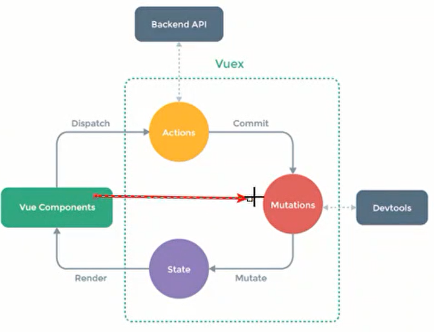

# 1 状态管理

**vuex是什么？**

状态管理工具

**状态管理是什么？**

可以简单看成**多个组件**需要**共享的变量**全部存储到**一个对象**里面

**为什么官方还要专门出一个vuex插件？**

能共享、响应式

**管理什么状态呢？**

- 用户的登陆状态
- 用户名称、头像、位置等等
- 购物车等等

## 1.1 基本使用

**多个组件之间怎么共享状态的呢？**



**Vue Compents**就是**组件树**；

需要进行**共享和管理**的状态放**State对象**里面；

当需要修改某个状态时，**commit**一个**mutation**（不要直接改！），就会执行**Mutations**中对应的函数，修改状态；

但**Mutations**中是不允许有**异步请求**的；

当修改某个状态需要发起**异步请求**时，就需要**dispatch**到**Actions**，然后由Actions去**commit**到Mutations；

### 创建store

**vuex3.x的写法**

安装 

`npm install vuex -s`

store文件夹下的**index.js**；

使用**Vuex.Store()**创建,**state**是个对象;

```js
import vuex from 'vuex'

const store = new vuex.Store({
  state: {
      counter
  }
})

export default store
```

**vuex4.x写法**

安装

`npm install vuex@next -S`

store文件夹下的**index.js**；

使用**createStore()**创建，**state**是个函数，类似vue2.x中的data选项;

```js
import { createStore } from 'vuex'

const store = createStore({
  state() {
      return {
          counter: 0
      }
  }
})
    
export default store
```

**main.js**

vue2.x写法

```js
import Vue from 'vue'
import App from './App.vue'
import store from './store'

Vue.use(store)

new Vue({
  store,
  render: h => h(App)
}).$mount('#app')
```

vue3.x写法

```js
import { createApp } from 'vue'
import App from './App.vue'
import store from './store'

const app = createApp(App)
app.use(store)
app.mount('#app')
```

**HelloWorld.vue**

```html
<h3>{{ $store.state.counter }}</h3>
```


### 提交修改

- 直接改devtools跟踪不到是哪个组件修改了状态
- 也可以从**vue components**直接到**mutations**，devtools只会跟踪同步操作
- 是要是有异步操作（如网络请求）就不能绕过actions，actions会跟踪异步操作

store目录下的**index.js**;

mutations里面的方法会默认**传入state**参数;

```js
import { createStore } from 'vuex'

const store = createStore({
  state() {
      return {
          counter: 0
      }
  },
  mutations: {
      increment(state) {
          state.counter
      }
  }
})
    
export default store
```

**vue2.x写法**

HelloWorld.vue

```html
<h2>{{ $store.state.counter }}</h2>
<button @click="add()">+</button>
```

```js
methods: {
  add () {
    this.$store.commit('increment')
  }
}
```

- 使用**commit()**提交
- commit()的**参数**是在vuex实例中**mutations的方法名**


# 2 vuex核心

- state
- getters
- mutations
- action
- module

## 2.1 state

### 单一状态树

用**一个对象**包含全部应用的状态；

SSOT, Single Source Of Truth,**单一数据源**；

为了方便管理和维护、**模块化**，vuex提供了**module**；

### 辅助函数mapX()

vuex提供了一种**辅助函数**，方便获取状态，mapX(X可以是state、mutations等等)；

如果想将某些状态放入**计算属性**，可以使用mapX；

mapX()返回的是一个**对象**；

有**数组写法**，如果想**自定义名字**可以使用**对象写法**；

store目录下的**index.js**

```js
import { createStore } from 'vuex'
const store = createStore({  
    state() {      
        return {          
            counter: 0,
            name: 'zsf'
        }  
    }
})
export default store
```

HelloWorld.vue

```html
<h2>{{ counter }}</h2>
<h2>{{ name }}</h2>
```

```js
import { mapState } from 'vuex'

computed: {
  // 其它计算属性省略
  ...mapState(['counter', 'name'])
}
```


## 2.2 getters

某些属性需要变化后才能使用，这个时候可以用**getters**；

类似计算属性**computed**；

getters里面的方法接收两个参数，第一个是**state对象**，第二个是**其它getters对象**；

store文件夹下的**index.js**

```js
import { createStore } from 'vuex'
const store = createStore({
    state() {      
        return {          
            counter: 0,
            name: 'zsf'
        }  
    },
    getters: {
        powerCounter(state) {
            return state.counter * state.counter
        }
    }
})
export default store
```

### 传参

**如果希望getters里的函数传参呢？**

```js
getters: {
	moreAgeStu(age) {
        return function (age) {
            return state.student.filter((s) => s.age > age)
        }
    }
}
```

### 辅助函数

同样，getters也有对应的辅助函数**mapGetters()**，用法与state的类似~;

## 2.3 mutations

### 传参

mutations里的函数的第二个参数**payload**，负载；

payload是通过**$store.commit()**的**第二个参数**传进来的；

Home.vue

```html
<button @click="addCount(5)">+5</button>
```

```js
methods: {
  addCount (count) {
    return this.$store.commit('increment', count)
  }
}
```

store目录下的**index.js**

```js
mutations: {
    increment(state, payload) {
      state.counter += payload
    }
}
```

### 提交风格

一般风格

```js
addCount (count) {
	return this.$store.commit('increment', count)
}
```

另一种风格

```js
addCount (count) {
	return this.$store.commit({
        type: 'increment',
        count: count
    })
}
```

### 常量

在mutations中使用常量，能减少一些**commit()**和**mutations**中函数名不一致的错误；

以上面的**increment**为例

store文件夹下的**mutations-types.js**

```js
export const INCREMENT = 'increment'
```

Home.vue

```html
<h2>{{ $store.state.counter }}</h2>
<button @click="add()">+</button>
```

```js
import {
  INCREMENT
} from './store/mutations-types'

methods: {
  add () {
    this.$store.commit(INCREMENT)
  }
}
```

store文件夹下的**index.js**

使用 **[]** 获取常量中的值

```js
import {
  INCREMENT
} from './mutations-types'

mutations: {
  [INCREMENT] (state) {
    state.counter++
  }
}
```

### 辅助函数

当然，mutations也有对应的辅助函数**mapMutations()**,用法与上面的辅助函数类似；

## 2.4 actions

action**类似**于mutation；

但action提交的是**mutation**，而不是直接变更状态；

action可以包含任意**异步操作**；

action中的函数的第一个参数**context**，是一个**和store实例有相同方法和属性**的context**对象**；

**dispatch()**可以返回一个**Promise对象**；

### 基本使用

Home.vue

```html
<h2>{{ $store.state.counter }}</h2>
<button @click="add()">+</button>
```

```js
methods: {
  add () {
    this.$store.dispatch('increment')
  }
}
```

store目录下的**index.js**

```js
state() {
    return {
        counter: 0
    }
},
mutations: {
    increment(state) {
        state.counter++
    }
},
action: {
    // 这里使用定时器模拟异步操作
    incrementAction(context) {
        setTimeout(() => {
            context.commit('increment')
        }, 1000)
    }
}
```

当你点击+按钮，会过一秒counter才加1~


### dispatch()

在组件中要是想知道**某一次派发有没有完成**，这就需要组件对**请求成功之后提示**，而不是全部交给action；

这时就可以使用**dispatch()**返回**Promise**啦；

Home.vue

```html
<h2>{{ $store.state.counter }}</h2>
<button @click="add()">+</button>
```

```js
methods: {
  add () {
    this.$store.dispatch('increment').then((res) => {
        console.log(res)
    }, (err) => {
        console.log(err)
    })
  }
}
```

store目录下的**index.js**

```js
state() {
    return {
        counter: 0
    }
},
mutations: {
    increment(state) {
        state.counter++
    }
},
action: {
    // 这里使用定时器模拟异步操作
    incrementAction(context) {
        return new Promise((resolve, reject) => {
            setTimeout(() => {
                context.commit('increment')
                resolve('提交成功！')
            }, 1000)
        }).catch((err) => {
            reject(err)
        })
    }
}
```

increment这个mutation提交成功之后，执行resolve(),将提交成功的结果交给组件处理~


### 辅助函数

同样，action也有对应的辅助函数**mapAction()**,用法与上面的辅助函数类似；

## 2.5 module

由于使用单一状态树，应用的**所有状态**都会**集中**到store对象中；

当应用变得复杂，store对象就会变得相当**臃肿**；

为了解决这一问题，Vuex允许将store对象分成**模块（module）**；

每个模块有自己的state、mutation、action、getters等等；

在modules目录下的**home.js**

```js
const home = {
	state() {
		return {
            counter: 0
        }
	},
    ...
}
```

在modules目录下的**user.js**

```js
const home = {
	state() {
		return {
            counter: 1
        }
	},
    ...
}
```

store目录下的**index.js**

```js
module: {
    home,
    user
}
```

Home.vue

```html
<h2>{{ $store.state.home.counter }}</h2>
<h2>{{ $store.state.user.counter }}</h2>
```

最后屏幕显示0和1

### 命名空间

默认情况下，模块内部的 action 和 mutations 仍是注册在**全局命名空间**的；

这样使得多个模块能够对**同一个 action 或 mutations** 作出响应；

**getters** 同样也默认注册在**全局命名空间**，但是目前这并非出于功能上的目的；

如果希望**使用或修改**某个模块的状态时，**不影响**全局命名空间的**其它状态**；

这时就需要给模块**带上命名空间**了，模块内新增一个`namespaced: true`属性；

使用带有**命名空间**的模块里的状态，需要用**类似路径**的方式；

如果需要commit提交修改，类似~；

```js
const home = {
    namespaced: true
	state() {
		return {
            counter: 1
        }
	},
    ...
}
```

store目录下的**index.js**

```js
module: {
    home
}
```

Home.vue

```html
<h2>{{ $store.getters[home/counter] }}</h2>
```

最后显示1

### 辅助函数

同样，模块中也可以使用辅助函数；

但是注意：上面使用的辅助函数的前提是在**全局命名空间**中，**局部命名空间**使用辅助函数写法有所不同，详情看官网~；
