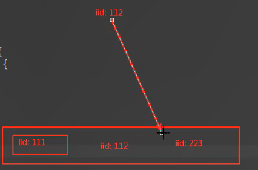

# 01-git

## 创建git仓库

1. 登陆
2. new repository
3. 仓库名 简介
4. 不用readme、选择一个license（MIT）

## 本地与git仓库关联(拷贝方式)

### 克隆git仓库到本地（workspace）

注意：

**本地项目名mall_1和git仓库名mall不能一样！**

**1.复制git网站那一段地址**

`https://github.com/zsf1482451437/mall.git`

**2.在终端中打开本地项目mall_1**

执行 `git clone https://github.com/zsf1482451437/mall.git`

**3.复制本地项目mall_1（.gitignore文件和node_modules文件夹不用复制）到mall**

**4.在终端打开项目mall**

执行 `git status` 查看文件提交状态

### **提交所有文件到暂存区（index）**

执行 `git add .` 

### 提交所有文件到本地仓库（repository）

执行 `git commit -m '操作描述'` 

### 提交到远程仓库（remote）

执行 `git push`

## 本地与git仓库关联（快速方式）

`git remote add origin https://github.com/用户名/仓库名.git`

`git push origin master`

# 02-初始化项目

## 目录结构划分


## 引入两个css

base.css

normalize.css

进行标签样式统一

## 路径起别名

项目下新建一个vue.config.js文件

```js
module.exports = {
  configureWebpack: {
    resolve: {
      alias: {
        assets: '@/assets',
        common: '@/common',
        components: '@/components',
        network: '@/network',
        views: '@/views'
      }
    }
  }
}
```

然后在App.vue里面的style里引入

```vue
<style>
@import "assets/css/base.css";
</style>
```

## 项目模块划分

路由映射关系

# 03-导航

## 封装一个NavBar

```vue
<template>
  <div class="nav-bar">
    <div class="left"><slot name="left"></slot></div>
    <div class="center"><slot name="center"></slot></div>
    <div class="right"><slot name="right"></slot></div>
  </div>
</template>

<script>
export default {
  name: 'NavBar'
}
</script>

<style scoped>
.nav-bar {
  display: flex;
  height: 44px;
  line-height: 44px;
  text-align: center;
  box-shadow: 0 1px 1px rgba(100, 100, 100, .1);
}
.left, .right {
  width: 60px;
}
.center {
  flex: 1;
}
</style>

```

## **在Home组件中使用**

```vue
<template>
  <div id="home">
    <nav-bar class="home-nav">
      <div slot="center">购物街</div>
    </nav-bar>
  </div>
</template>

<script>
import NavBar from 'components/common/navbar/NavBar'
export default {
  name: 'Home',
  components: {
    NavBar
  }
}
</script>

<style scoped>
.home-nav {
  background-color: var(--color-tint);
  color: #fff;
}
</style>

```

效果


# 04-首页

## 首页的网络封装

1.在network文件夹下新建一个文件request.js

```js
import axios from 'axios'

export function request (config) {
  // 1.创建axios实例
  const instance = axios.create({
    baseURL: 'http://152.136.185.210:7878/api/hy66',
    timeout: 5000
  })
  // 2.1请求拦截
  instance.interceptors.request.use(config => {
    return config
  }, err => {
    console.log(err)
  })
  // 2.2响应拦截
  instance.interceptors.request.use(res => {
    return res.data
  }, err => {
    console.log(err)
  })
  // 3.发送真正的网络请求
  return instance(config)
}
```

2.再做一层封装，针对首页的网络请求

3.在network文件夹下新建一个文件home.js

```js
import { request } from './request'

export function getHomeMultidata () {
  return request({
    url: '/home/multidata'
  })
}

```

## 使用

在Home组件导入

```
import { getHomeMultidata } from 'network/home'
```

### **什么时候发生网络请求呢？**

组件创建的时候

```vue
<script>
import NavBar from 'components/common/navbar/NavBar'
import { getHomeMultidata } from 'network/home'
export default {
  name: 'Home',
  components: {
    NavBar
  },
  data () {
    return {
      result: null
    }
  },
  created () {
    // 1.请求多个数据
    getHomeMultidata().then(res => {
      this.result = res
    })
  }
}
</script>
```


**可能会遇到的问题**

- 跨域

使用代理解决跨域

```js
// vue.config.js
module.exports = {
  // 代理处理跨域
  devServer: {
    proxy: {
      '/api': {
        target: 'http://123.207.32.32:8000',
        ws: true, // 对websocket也代理
        changeOrigin: true
      }
    }
  }
}
```

## 轮播图

**1.新建一个文件夹swiper，放到components/common下**

### swiper/index.js

```js
import Swiper from './Swiper'
import SwiperItem from './SwiperItem'

export {
  Swiper, SwiperItem
}
```

对象导出方便别的地方导入

### swiper/Swiper.vue

```vue
<template>
  <div id="hy-swiper">
    <div
      class="swiper"
      @touchstart="touchStart"
      @touchmove="touchMove"
      @touchend="touchEnd"
    >
      <slot></slot>
    </div>
    <slot name="indicator"> </slot>
    <div class="indicator">
      <slot name="indicator" v-if="showIndicator && slideCount > 1">
        <div
          v-for="(item, index) in slideCount"
          class="indi-item"
          :class="{ active: index === currentIndex - 1 }"
          :key="index"
        ></div>
      </slot>
    </div>
  </div>
</template>

<script>
export default {
  name: 'Swiper',
  props: {
    interval: {
      type: Number,
      default: 3000
    },
    animDuration: {
      type: Number,
      default: 300
    },
    moveRatio: {
      type: Number,
      default: 0.25
    },
    showIndicator: {
      type: Boolean,
      default: true
    }
  },
  data: function () {
    return {
      slideCount: 0, // 元素个数
      totalWidth: 0, // swiper的宽度
      swiperStyle: {}, // swiper样式
      currentIndex: 1, // 当前的index
      scrolling: false // 是否正在滚动
    }
  },
  mounted: function () {
    // 1.操作DOM, 在前后添加Slide
    setTimeout(() => {
      this.handleDom()

      // 2.开启定时器
      this.startTimer()
    }, 100)
  },
  methods: {
    /**
     * 定时器操作
     */
    startTimer: function () {
      this.playTimer = window.setInterval(() => {
        this.currentIndex++
        this.scrollContent(-this.currentIndex * this.totalWidth)
      }, this.interval)
    },
    stopTimer: function () {
      window.clearInterval(this.playTimer)
    },

    /**
     * 滚动到正确的位置
     */
    scrollContent: function (currentPosition) {
      // 0.设置正在滚动
      this.scrolling = true

      // 1.开始滚动动画
      this.swiperStyle.transition = 'transform ' + this.animDuration + 'ms'
      this.setTransform(currentPosition)

      // 2.判断滚动到的位置
      this.checkPosition()

      // 4.滚动完成
      this.scrolling = false
    },

    /**
     * 校验正确的位置
     */
    checkPosition: function () {
      window.setTimeout(() => {
        // 1.校验正确的位置
        this.swiperStyle.transition = '0ms'
        if (this.currentIndex >= this.slideCount + 1) {
          this.currentIndex = 1
          this.setTransform(-this.currentIndex * this.totalWidth)
        } else if (this.currentIndex <= 0) {
          this.currentIndex = this.slideCount
          this.setTransform(-this.currentIndex * this.totalWidth)
        }

        // 2.结束移动后的回调
        this.$emit('transitionEnd', this.currentIndex - 1)
      }, this.animDuration)
    },

    /**
     * 设置滚动的位置
     */
    setTransform: function (position) {
      this.swiperStyle.transform = `translate3d(${position}px, 0, 0)`
      this.swiperStyle[
        '-webkit-transform'
      ] = `translate3d(${position}px), 0, 0`;
      this.swiperStyle['-ms-transform'] = `translate3d(${position}px), 0, 0`
    },

    /**
     * 操作DOM, 在DOM前后添加Slide
     */
    handleDom: function () {
      // 1.获取要操作的元素
      let swiperEl = document.querySelector('.swiper')
      let slidesEls = swiperEl.getElementsByClassName('slide')

      // 2.保存个数
      this.slideCount = slidesEls.length

      // 3.如果大于1个, 那么在前后分别添加一个slide
      if (this.slideCount > 1) {
        let cloneFirst = slidesEls[0].cloneNode(true)
        let cloneLast = slidesEls[this.slideCount - 1].cloneNode(true)
        swiperEl.insertBefore(cloneLast, slidesEls[0])
        swiperEl.appendChild(cloneFirst)
        this.totalWidth = swiperEl.offsetWidth
        this.swiperStyle = swiperEl.style
      }

      // 4.让swiper元素, 显示第一个(目前是显示前面添加的最后一个元素)
      this.setTransform(-this.totalWidth)
    },

    /**
     * 拖动事件的处理
     */
    touchStart: function (e) {
      // 1.如果正在滚动, 不可以拖动
      if (this.scrolling) return

      // 2.停止定时器
      this.stopTimer()

      // 3.保存开始滚动的位置
      this.startX = e.touches[0].pageX
    },

    touchMove: function (e) {
      // 1.计算出用户拖动的距离
      this.currentX = e.touches[0].pageX
      this.distance = this.currentX - this.startX
      let currentPosition = -this.currentIndex * this.totalWidth
      let moveDistance = this.distance + currentPosition

      // 2.设置当前的位置
      this.setTransform(moveDistance)
    },

    touchEnd: function (e) {
      // 1.获取移动的距离
      let currentMove = Math.abs(this.distance)

      // 2.判断最终的距离
      if (this.distance === 0) {
        return
      } else if (
        this.distance > 0 &&
        currentMove > this.totalWidth * this.moveRatio
      ) {
        // 右边移动超过0.5
        this.currentIndex--
      } else if (
        this.distance < 0 &&
        currentMove > this.totalWidth * this.moveRatio
      ) {
        // 向左移动超过0.5
        this.currentIndex++
      }

      // 3.移动到正确的位置
      this.scrollContent(-this.currentIndex * this.totalWidth)

      // 4.移动完成后重新开启定时器
      this.startTimer()
    },

    /**
     * 控制上一个, 下一个
     */
    previous: function () {
      this.changeItem(-1)
    },

    next: function () {
      this.changeItem(1)
    },

    changeItem: function (num) {
      // 1.移除定时器
      this.stopTimer()

      // 2.修改index和位置
      this.currentIndex += num
      this.scrollContent(-this.currentIndex * this.totalWidth)

      // 3.添加定时器
      this.startTimer()
    }
  }
}
</script>

<style scoped>
#hy-swiper {
  overflow: hidden;
  position: relative;
}

.swiper {
  display: flex;
}

.indicator {
  display: flex;
  justify-content: center;
  position: absolute;
  width: 100%;
  bottom: 8px;
}

.indi-item {
  box-sizing: border-box;
  width: 8px;
  height: 8px;
  border-radius: 4px;
  background-color: #fff;
  line-height: 8px;
  text-align: center;
  font-size: 12px;
  margin: 0 5px;
}

.indi-item.active {
  background-color: rgba(212, 62, 46, 1);
}
</style>

```

### swiper/SwiperItem.vue

```vue
<template>
  <div class="slide">
    <slot></slot>
  </div>
</template>

<script>
export default {
  name: 'Slide'
}
</script>

<style scoped>
.slide {
  width: 100%;
  flex-shrink: 0;
}

.slide img {
  width: 100%;
}
</style>

```

在home组件中

```vue
<template>
  <div id="home">
    <nav-bar class="home-nav">
      <div slot="center">购物街</div>
    </nav-bar>
    <swiper>
      <swiper-item v-for="item in banners" :key="item.index">
        <a :href="item.link">
          
        </a>
      </swiper-item>
    </swiper>
  </div>
</template>

<script>
import NavBar from 'components/common/navbar/NavBar'
import { getHomeMultidata } from 'network/home'
import { Swiper, SwiperItem } from 'components/common/swiper'
export default {
  name: 'Home',
  components: {
    NavBar,
    Swiper,
    SwiperItem
  },
  data () {
    return {
      banners: [],
      recommends: []
    }
  },
  created () {
    // 1.请求多个数据
    getHomeMultidata().then(res => {
      this.banners = res.data.banner.list
      this.recommends = res.data.recommend.list
    })
  }
}
</script>

<style scoped>
.home-nav {
  background-color: var(--color-tint);
  color: #fff;
}
</style>

```

**2.进一步封装轮播图部分**

在views/home下新建一个文件夹childComps，childComps下新建一个文件HomeSwiper.vue

**HomeSwiper.vue**

```vue
<template>
  <div id="home">
    <swiper>
      <swiper-item v-for="item in banners" :key="item.index">
        <a :href="item.link">
          
        </a>
      </swiper-item>
    </swiper>
  </div>
</template>

<script>
import { Swiper, SwiperItem } from 'components/common/swiper'
export default {
  name: 'HomeSwiper',
  props: {
    banners: {
      type: Array,
      default () {
        return []
      }
    }
  },
  components: {
    Swiper,
    SwiperItem
  }
}
</script>

<style scoped>
</style>

```

Home.vue

```vue
<template>
  <div id="home">
    <!-- 头 -->
    <nav-bar class="home-nav">
      <div slot="center">购物街</div>
    </nav-bar>
    <!-- 轮播图 -->
    <home-swiper :banners="banners"></home-swiper>
  </div>
</template>

<script>
import NavBar from 'components/common/navbar/NavBar'
import HomeSwiper from './childComps/HomeSwiper.vue'
import { getHomeMultidata } from 'network/home'

export default {
  name: 'Home',
  components: {
    NavBar,
    HomeSwiper
  },
  data () {
    return {
      banners: [],
      recommends: []
    }
  },
  created () {
    // 1.请求多个数据
    getHomeMultidata().then(res => {
      this.banners = res.data.banner.list
      this.recommends = res.data.recommend.list
    })
  }
}
</script>

<style scoped>
.home-nav {
  background-color: var(--color-tint);
  color: #fff;
}
</style>

```

### 效果


## 推荐

views/home/childComps下新建一个文件RecommendView.vue

### **RecommendView.vue**

```vue
<template>
  <div class="recommend">
    <div v-for="item in recommends" :key="item.index">
      <a :href="item.link">
        
        <div>{{ item.title }}</div>
      </a>
    </div>
  </div>
</template>

<script>
export default {
  name: 'RecommendView',
  props: {
    recommends: {
      type: Array,
      default () {
        return []
      }
    }
  }
}
</script>

<style scoped>
</style>

```

在Home.vue中使用

### **Home.vue**

```vue
<template>
  <div id="home">
    <!-- 头 -->
    <nav-bar class="home-nav">
      <div slot="center">购物街</div>
    </nav-bar>
    <!-- 轮播图 -->
    <home-swiper :banners="banners"></home-swiper>
    <!-- 分类 -->
    <recommend-view :recommends="recommends"></recommend-view>
  </div>
</template>

<script>
import NavBar from 'components/common/navbar/NavBar'
import HomeSwiper from './childComps/HomeSwiper.vue'
import { getHomeMultidata } from 'network/home'
import RecommendView from './childComps/RecommendView.vue'
export default {
  name: 'Home',
  components: {
    NavBar,
    HomeSwiper,
    RecommendView
  },
  data () {
    return {
      banners: [],
      recommends: []
    }
  },
  created () {
    // 1.请求多个数据
    getHomeMultidata().then(res => {
      this.banners = res.data.banner.list
      this.recommends = res.data.recommend.list
    })
  }
}
</script>

<style scoped>
.home-nav {
  background-color: var(--color-tint);
  color: #fff;
}
</style>

```

### 补全样式

**RecommendView.vue**

```vue
<template>
  <div class="recommend">
    <div class="recommend-item" v-for="item in recommends" :key="item.index">
      <a :href="item.link">
        
        <div>{{ item.title }}</div>
      </a>
    </div>
  </div>
</template>

<script>
export default {
  name: 'RecommendView',
  props: {
    recommends: {
      type: Array,
      default () {
        return []
      }
    }
  }
}
</script>

<style scoped>
  .recommend {
    display: flex;
    margin-top: 10px;
    font-size: 14px;
    padding-bottom: 30px;
    border-bottom: 10px solid #eee;
  }

  .recommend-item {
    flex: 1;
    text-align: center;
  }

  .recommend img {
    width: 80px;
    height: 80px;
    margin-bottom: 10px;
  }
</style>

```

### 效果


## 本周流行

独立的组件FeatureView.vue

### **FeatureView.vue**

```vue
<template>
  <div class="feature">
    <a href="https://act.mogujie.com/zzlx67">
      
    </a>
  </div>
</template>

<script>
export default {
  name: 'Feature'
}
</script>
<style scoped>
</style>

```

在Home.vue中使用

**Home.vue**

```vue
<template>
  <div id="home">
    <!-- 头 -->
    <nav-bar class="home-nav">
      <div slot="center">购物街</div>
    </nav-bar>
    <!-- 轮播图 -->
    <home-swiper :banners="banners"></home-swiper>
    <!-- 推荐 -->
    <recommend-view :recommends="recommends"></recommend-view>
    <!-- 本周流行 -->
    <feature-view></feature-view>
  </div>
</template>

<script>
import NavBar from 'components/common/navbar/NavBar'
import HomeSwiper from './childComps/HomeSwiper.vue'
import { getHomeMultidata } from 'network/home'
import RecommendView from './childComps/RecommendView.vue'
import FeatureView from './childComps/FeatureView.vue'

export default {
  name: 'Home',
  components: {
    NavBar,
    HomeSwiper,
    RecommendView,
    FeatureView
  },
  data () {
    return {
      banners: [],
      recommends: []
    }
  },
  created () {
    // 1.请求多个数据
    getHomeMultidata().then(res => {
      this.banners = res.data.banner.list
      this.recommends = res.data.recommend.list
    })
  }
}
</script>

<style scoped>
#home {
  padding-top: 20px;
}
.home-nav {
  background-color: var(--color-tint);
  color: #fff;
  position: fixed;
  left: 0;
  right: 0;
  top: 0;
  z-index: 9;
}
</style>

```

效果


## 页签

封装一个独立的业务组件TabControl.vue

放components/content/tabControl下

### **TabControl.vue**

```vue
<template>
  <div class="tab-control">
    <div v-for="item in titles" :key="item.index">
      <span>{{ item }}</span>
    </div>
  </div>
</template>

<script>
export default {
  name: 'TabControl',
  props: {
    titles: {
      type: Array,
      default () {
        return []
      }
    }
  }
}
</script>

<style>

</style>

```

### 在Home.vue中使用

```vue
<template>
  <div id="home">
    <!-- 头 -->
    <nav-bar class="home-nav">
      <div slot="center">购物街</div>
    </nav-bar>
    <!-- 轮播图 -->
    <home-swiper :banners="banners"></home-swiper>
    <!-- 推荐 -->
    <recommend-view :recommends="recommends"></recommend-view>
    <!-- 本周流行 -->
    <feature-view></feature-view>
    <!-- 页签 -->
    <tab-control :titles="['流行', '新款', '精选']"></tab-control>
  </div>
</template>

<script>
import HomeSwiper from './childComps/HomeSwiper.vue'
import RecommendView from './childComps/RecommendView.vue'
import FeatureView from './childComps/FeatureView.vue'

import NavBar from 'components/common/navbar/NavBar'
import TabControl from 'components/content/tabControl/TabControl'

import { getHomeMultidata } from 'network/home'

export default {
  name: 'Home',
  components: {
    HomeSwiper,
    RecommendView,
    FeatureView,
    NavBar,
    TabControl
  },
  data () {
    return {
      banners: [],
      recommends: []
    }
  },
  created () {
    // 1.请求多个数据
    getHomeMultidata().then(res => {
      this.banners = res.data.banner.list
      this.recommends = res.data.recommend.list
    })
  }
}
</script>

<style scoped>
#home {
  padding-top: 20px;
}
.home-nav {
  background-color: var(--color-tint);
  color: #fff;
  position: fixed;
  left: 0;
  right: 0;
  top: 0;
  z-index: 9;
}
</style>

```

### **补充样式**

#### 平均排布

```vue
<template>
  <div class="tab-control">
    <div v-for="item in titles" :key="item.index" class="tab-control-item">
      <span>{{ item }}</span>
    </div>
  </div>
</template>

<script>
export default {
  name: 'TabControl',
  props: {
    titles: {
      type: Array,
      default () {
        return []
      }
    }
  }
}
</script>

<style>
.tab-control {
  display: flex;
  text-align: center;
  font-size: 15px;
  height: 40px;
  line-height: 40px;
}
.tab-control-item {
  flex: 1;
}
</style>

```

**效果**


#### 点击到激活并有线

```vue
<template>
  <div class="tab-control">
    <div
      v-for="(item, index) in titles"
      :key="item.index" class="tab-control-item"
      :class="{active: index === currentIndex}"
      @click="itemClick(index)">
      <span>{{ item }}</span>
    </div>
  </div>
</template>

<script>
export default {
  name: 'TabControl',
  props: {
    titles: {
      type: Array,
      default () {
        return []
      }
    }
  },
  data () {
    return {
      currentIndex: 0
    }
  },
  methods: {
    itemClick (index) {
      this.currentIndex = index
    }
  }
}
</script>

<style>
.tab-control {
  display: flex;
  text-align: center;
  font-size: 15px;
  height: 40px;
  line-height: 40px;
}
.tab-control-item {
  flex: 1;
}
.tab-control-item span{
  padding: 5px;
}
.active {
  color: var(--color-high-text);
}
.active span {
  border-top: 3px solid var(--color-tint);
}
</style>

```

**效果**


#### 吸顶效果

在Home.vue中的TabControl组件加个类tab-control

```vue
<template>
  <div id="home">
    <!-- 头 -->
    <nav-bar class="home-nav">
      <div slot="center">购物街</div>
    </nav-bar>
    <!-- 轮播图 -->
    <home-swiper :banners="banners"></home-swiper>
    <!-- 推荐 -->
    <recommend-view :recommends="recommends"></recommend-view>
    <!-- 本周流行 -->
    <feature-view></feature-view>
    <!-- 页签 -->
    <tab-control class="tab-control" :titles="['流行', '新款', '精选']"></tab-control>
    <ul>
      <li></li>
      <li></li>
      <li></li>
      <li></li>
      <li></li>
      <li></li>
      <li></li>
      <li></li>
      <li></li>
      <li></li>
      <li></li>
      <li></li>
      <li></li>
      <li></li>
      <li></li>
      <li></li>
      <li></li>
      <li></li>
      <li></li>
      <li></li>
      <li></li>
      <li></li>
      <li></li>
      <li></li>
      <li></li>
      <li></li>
      <li></li>
      <li></li>
      <li></li>
      <li></li>
      <li></li>
      <li></li>
      <li></li>
      <li></li>
      <li></li>
      <li></li>
      <li></li>
      <li></li>
      <li></li>
      <li></li>
      <li></li>
      <li></li>
      <li></li>
      <li></li>
      <li></li>
      <li></li>
      <li></li>
      <li></li>
      <li></li>
      <li></li>
      <li></li>
      <li></li>
      <li></li>
      <li></li>
      <li></li>
      <li></li>
      <li></li>
      <li></li>
      <li></li>
      <li></li>
      <li></li>
      <li></li>
      <li></li>
      <li></li>
      <li></li>
      <li></li>
      <li></li>
      <li></li>
      <li></li>
      <li></li>
      <li></li>
      <li></li>
      <li></li>
      <li></li>
      <li></li>
      <li></li>
      <li></li>
      <li></li>
      <li></li>
      <li></li>
      <li></li>
      <li></li>
      <li></li>
      <li></li>
      <li></li>
      <li></li>
      <li></li>
      <li></li>
      <li></li>
      <li></li>
      <li></li>
      <li></li>
      <li></li>
      <li></li>
      <li></li>
      <li></li>
      <li></li>
      <li></li>
      <li></li>
      <li></li>
    </ul>
  </div>
</template>

<script>
import HomeSwiper from './childComps/HomeSwiper.vue'
import RecommendView from './childComps/RecommendView.vue'
import FeatureView from './childComps/FeatureView.vue'

import NavBar from 'components/common/navbar/NavBar'
import TabControl from 'components/content/tabControl/TabControl'

import { getHomeMultidata } from 'network/home'

export default {
  name: 'Home',
  components: {
    HomeSwiper,
    RecommendView,
    FeatureView,
    NavBar,
    TabControl
  },
  data () {
    return {
      banners: [],
      recommends: []
    }
  },
  created () {
    // 1.请求多个数据
    getHomeMultidata().then(res => {
      this.banners = res.data.banner.list
      this.recommends = res.data.recommend.list
    })
  }
}
</script>

<style scoped>
#home {
  padding-top: 20px;
}
.home-nav {
  background-color: var(--color-tint);
  color: #fff;
  position: fixed;
  left: 0;
  right: 0;
  top: 0;
  z-index: 9;
}
.tab-control {
  position: sticky;
  top: 44px;
}
</style>

```

**效果**


#### 解析position: sticky属性

```css
position: sticky;
top: 44px;
```

**position: sticky默认是sticky，当达到滚动的某个值时，会自动将sticky改成fixed**

## 商品列表

### 首页数据模型

```js
goods: {
  pop: { page: 0, list: [] },
  news: { page: 0, list: [] },
  sell: { page: 0, list: [] }
}
```

### 请求数据

#### home.js

```js
// 请求商品信息
export function getHomeGoods (type, page) {
  return request({
    url: '/home/data',
    params: {
      type,
      page
    }
  })
}
```

#### Home.vue

```vue
<script>
...

import { getHomeMultidata, getHomeGoods } from 'network/home'

export default {
  name: 'Home',
  components: {
    ...
  },
  data () {
    return {
      ...
    }
  },
  created () {
    // 1.请求多个数据
    this.getHomeMultidata()
    // 2.请求商品数据
    this.getHomeGoods()
  },
  methods: {
    getHomeMultidata () {
      getHomeMultidata().then(res => {
        this.banners = res.data.banner.list
        this.recommends = res.data.recommend.list
      })
    },
    getHomeGoods (type) {
      const page = this.goods[type].page + 1
      getHomeGoods(type, page).then(res => {
        this.goods[type].list.push(...res.data.list)
        this.goods[type].page += 1
      })
    }
  }
}
</script>
```

##### push(...res.data.list)是什么语法？

将数组元素遍历解构，然后一个一个push进去

**为什么需要这句this.goods[type].page += 1？**

当下拉加载更多时，需要再请求一页

### 商品列表数据

/components/content下新建一个目录goods

该目录下新建GoodsList.vue和GoodsListItem.vue组件

#### GoodsList.vue

```vue
<template>
  <div class="goods">
    <goods-list-item v-for="item in goods" :goods-item="item" :key="item.iid"></goods-list-item>
  </div>
</template>

<script>
import GoodsListItem from 'components/content/goods/GoodsListItem'

export default {
  components: {
    GoodsListItem
  },
  props: {
    goods: {
      type: Array,
      default () {
        return []
      }
    }
  }
}
</script>

<style scoped>
.goods {
  display: flex;
  flex-wrap: wrap;
  justify-content: space-around;
}
</style>

```


#### GoodsListItem.vue

```vue
<template>
  <div class="goods-item">
    
    <div class="goods-info">
      <p>{{ goodsItem.title }}</p>
      <span class="price">{{ goodsItem.price }}</span>
      <span class="collect">{{ goodsItem.cfav }}</span>
    </div>
  </div>
</template>

<script>
export default {
  props: {
    goodsItem: {
      type: Object,
      default () {
        return {}
      }
    }
  }
}
</script>

<style scoped>
.goods-item {
  padding-bottom: 40px;
  position: relative;
  width: 48%;
}
.goods-item img {
  width: 100%;
  border-radius: 5px;
}
.goods-info {
  font-size: 12px;
  position: absolute;
  bottom: 5px;
  left: 0;
  right: 0;
  overflow: hidden;
  text-align: center;
}
.goods-info p {
  overflow: hidden;
  text-overflow: ellipsis;
  white-space: nowrap;
  margin-bottom: 3px;
}
.goods-info .price {
  color: var(--color-high-text);
  margin-right: 20px;
}
.goods-info .collect {
  position: relative;
}
.goods-info .collect::before {
  content: '';
  position: absolute;
  left: -15px;
  top: -1;
  width: 14px;
  height: 14px;
  background: url("~assets/img/common/collect.svg") 0 0/14px 14px;
}
</style>

```

#### 在Home.vue里使用

```vue
<template>
  <div id="home">
    ...
    <!-- 商品列表 -->
    <goods-list :goods="goods['pop'].list"></goods-list>
  </div>
</template>

<script>
...
import GoodsList from 'components/content/goods/GoodsList'

...

export default {
  name: 'Home',
  components: {
    ...
    GoodsList
  },
  ...
  }
}
</script>

<style scoped>
...
.tab-control {
  ...
  z-index: 9;
}
</style>

```

#### 点击页签

**要把页签组件内部发生的点击事件传给home组件**，怎么做？

Home组件里的 `<goods-list :goods="goods['pop'].list"></goods-list>` 不能是写死的

##### TabControl

页签组件TabControl里发射自定义事件`tabClick`

```js
itemClick (index) {
      this.currentIndex = index
      // 传给home组件
      this.$emit('tabClick', index)
    }
```

##### Home

1，home组件接收

2，根据接收到的 `index` 做出 `currentType` 对应的改变，用 `tabClick()` 实现

3，还有 `goods[currentType].list` 用一个计算属性 `tabList` 声明

```vue
<template>
  <div id="home">
    ...
    <!-- 页签 -->
    <tab-control
      class="tab-control"
      :titles="['流行', '新款', '精选']"
      @tabClick="tabClick"
    >
    </tab-control>
    <!-- 商品列表 -->
    <goods-list :goods="tabList"></goods-list>
  </div>
</template>

<script>
...

export default {
  ...
  data () {
    return {
      ...
      currentType: 'pop'
    }
  },
  computed: {
    tabList () {
      return this.goods[this.currentType].list
    }
  },
  ...
  methods: {
    // 事件监听相关
    // 监听页签
    tabClick (index) {
      switch (index) {
        case 0:
          this.currentType = 'pop'
          break
        case 1:
          this.currentType = 'new'
          break
        case 2:
          this.currentType = 'sell'
          break
      }
    },
    ...
  }
}
</script>

<style scoped>
...
</style>

```

效果


### 重构滚动效果

#### 原生

但是原生的滚动效果在移动端体验非常卡顿！

**局部滚动**

结构

```html
<div class="content">
    ul>li{哈哈哈$}*100
</div>
```

样式

```css
.content {
  height: 150px;
  background-color: skyblue;
  overflow-y: scroll;
}
```

要是设置高度

使用 `overflow-y: scroll` 属性

当使用 `overflow-y: scroll` 属性时，会默认添加 `overflow: hidden` 属性

#### better-scroll

安装

`npm i -s better-scroll`

使用

```vue
<template>
  <div class="content" ref="content">
    ul>li{哈哈哈$}*100
  </div>
</template>

<script>
import BScroll from 'better-scroll'
export default {
  name: 'Category',
  data () {
    return {
      scroll: null
    }
  },
  mounted () {
    this.scroll = new BScroll(this.$refs.content, {
    })
  }
}
</script>

<style scoped>
.content {
  height: 150px;
  background-color: skyblue;
  overflow: hidden;
}
</style>

```

##### 第二个参数

默认情况下better-scroll是不可以实时监听滚动位置

- probeType
  - 0,1 不检测实时位置
  - 2 在手指滚动的过程中侦测，手指离开后的惯性滚动过程不侦测
  - 3 只要有滚动就侦测

- click
  - true 才会监听到原生事件

- pullUpLoad
  - true


```js
const bscroll = new BScroll(document.querySelector('.xxx'), {
    probeType: 3,
    click: true,
    pullUpLoad: true
})
bscroll.on('pullingUp', () => {
    console.log('上拉加载更多')
    // 发送网络请求，请求更多页数据
    
    //等待数据请求完成，并且将新的数据展示出来后
    setTimeout(() => {
        bscroll.finishPullUp()
    }, 2000)
})
```

#### 上下有高度，如何确定中间高度？


- css3的calc()
- position

```css
height: calc(100% - 96px);
```

```css
overflow: hidden;
  position: absolute;
  top: 44px;
  bottom: 49px;
  left: 0;
  right: 0;
/* 父元素相对定位，父相子绝*/
```

#### 回到顶部

封装一个BackTop.vue

```vue
<template>
  <div class="back-top">
    
  </div>
</template>

<script>
export default {

}
</script>

<style>
.back-top {
  position: fixed;
  right: 8px;
  bottom: 55px;
}
.back-top img {
  height: 43px;
  width: 43px;
}
</style>

```

使用

-  自定义组件没有原生事件，要想监听自定义组件的元素的原生事件，添加`.native`修饰符

父组件

```vue
<scroll
      ref="scroll"
      >
      ...
    </scroll>
```


```vue
<back-top @click.native="backClick()" v-show="isShow"></back-top>
```

```js
// 回到顶部
    backClick () {
      this.$refs.scroll.scrollTo(0, 0, 500)
    }
```


#### 下拉一定长度显示回顶

这个需要子组件实时监听并回传下拉的位置

在子组件中


```js
mounted () {
    // 新建BScoll对象
    this.scroll = new BScroll(this.$refs.wrapper, {
      probeType: this.probeType,
      pullUpLoad: this.pullUpLoad
    })
    // 监听滚动位置
    this.scroll.on('scroll', (position) => {
      this.$emit('scroll', position)
    })
    }
```

```js
 props: {
    probeType: {
      type: Number,
      default: 0
    }
  }
```

在父组件中

```vue
<scroll
      :probe-type="3"
	@scroll="contentScroll"
      >
      ...
    </scroll>
```

```js
// 下拉一定长度显示回顶
    contentScroll (position) {
      this.isShow = (-position.y) > 1000
    }
```

####  上拉加载更多

scroll.vue

```js
mounted () {
    // 新建BScoll对象
    this.scroll = new BScroll(this.$refs.wrapper, {
      ...
      pullUpLoad: this.pullUpLoad
    })
    ...
    // 监听上拉事件
    if (this.pullUpLoad) {
      this.scroll.on('pullingUp', () => {
        this.$emit('pullingUp')
      })
    }
  }
```

```js
methods: {
    ...
    // 结束上拉
    finishedPullUp () {
      this.scroll && this.scroll.finishPullUp && this.scroll.finishPullUp()
    },
    refresh () {
      this.scroll && this.scroll.refresh()
    }
  }
```

home.vue

```vue
<scroll
      ...
      :pull-up-load="true"
      @pullingUp="loadMore"
      >
      ...
    </scroll>
```

```js
methods: {
    ...
    // 上拉加载更多
    loadMore () {
      this.getHomeGoods(this.currentType)
    },
    ...
    getHomeGoods (type) {
      const page = this.goods[type].page + 1
      getHomeGoods(type, page).then(res => {
        this.goods[type].list.push(...res.data.list)
        this.goods[type].page += 1
        // 完成上拉加载更多
        this.$refs.scroll.finishedPullUp()
      })
    }
  }
```

#### 吸顶效果

##### 获取到tabControl的offsetTop

- 须知道滚动到多少时，开始有吸顶效果
- 但是tabControl是组件，没有offsetTop
- 而每个组件的`$el`属性，用于获取组件中的根元素 
- 如果直接在mounted()生命周期函数里通过`this.$refs.tabControl.$el.offsetTop`获取是不准确的，因为图片还没加载完成
- 所以需要监听图片加载完成

homeSwiper.vue

```vue

```

```js
data () {
    return {
      // 轮播图片是否加载完成
      isLoad: false
    }
  }
```

```js
methods: {
    imgLoad () {
      if (!this.isLoad) {
        this.$emit('swiperImgLoad')
        this.isLoad = true
      }
    }
  }
```

- 为了不让homeswiper.vue多次发出事件
- 可以使用isLoad变量记录状态
- 使homeswiper只发一次事件

home.vue

```vue
<tab-control
        :titles="['流行', '新款', '精选']"
        @tabClick="tabClick"
        ref="tabControl1"
        class="tab-control"
        v-show="isTabFixed"
      >
    </tab-control>
    <!-- 页签 -->
    <scroll
      ...
      >
      ...
      <!-- 页签 -->
      <tab-control
        :titles="['流行', '新款', '精选']"
        @tabClick="tabClick"
        ref="tabControl2"
      >
      </tab-control>
      ...
    </scroll>
```


```js
methods: {
    ...
    // 监听页签
    tabClick (index) {
      switch (index) {
        case 0:
          this.currentType = 'pop'
          break
        case 1:
          this.currentType = 'new'
          break
        case 2:
          this.currentType = 'sell'
          break
      }
      this.$refs.tabControl1.currentIndex = index
      this.$refs.tabControl2.currentIndex = index
    },
    ...
    // 下拉一定长度显示回顶
    contentScroll (position) {
      ...
      // 2.判断上面的tab-control是否显示
      this.isTabFixed = (-position.y) > 956
    },
    ...
    // 轮播图加载完成，可以获取吸顶效果的offsetTop了
    swiperImgLoad () {
      this.swiperImgOffsetTop = this.$refs.tabControl2.$el.offsetTop
    },
    ...
  }
```

```css
.home-nav {
  background-color: var(--color-tint);
  color: #fff;
}
.tab-control {
  position: relative;
  z-index: 9;
}
```


### 解决首页中better-scroll可滚动区域的问题

1.better-scroll在决定有多少区域可以滚动时，是根据scrollerHeight属性决定的

2.scrollerHeight属性由放Better-Scroll中的子组件高度决定

3.首页中，刚开始计算scrollerHeight时，没有将图片计算在内

4.当图片加载进来之后有了新高度，但scrollerHeight属性没有进行更新，所以滚动出现了问题

5.如何解决这个问题？监听每一张图片是否加载完成了，只要一张图片加载完成，执行一次refresh()

6.如何监听图片加载完成？

- 原生js：img.onlaod = function() {}
- Vue监听：@load="方法"

7.调用scroll的refresh()

### 对于refresh非常频繁地问题，进行防抖操作

scroll.vue

```js
methods: {
    ...
    refresh () {
      this.scroll && this.scroll.refresh()
    }
  },
```

GoodsListItem.vue

```vue

```

```js
methods: {
    imageLoad () {
      this.$bus.$emit('itemImageLoad')
    }
  }
```

home.vue

```js
mounted () {
    const refresh = this.debounce(this.$refs.scroll.refresh)
    this.$bus.$on('itemImageLoad', () => {
      refresh()
    })
  },
```

```js
methods: {
    // 事件监听相关
    // 防抖函数
    debounce (func, delay) {
      let timer = null
      return function (...args) {
        if (timer) clearTimeout(timer)
        timer = setTimeout(() => {
          func.apply(this, args)
        }, delay)
      }
    },
    ...
  }
```

防抖函数起作用过程：

- 如果直接执行refresh，那refresh函数会被执行30次
- 可以将refresh函数传入到debounce函数中，生成一个新的函数
- 之后在调用非常频繁的时候，就使用新生成的函数
- 而新生成的函数，并不会非常频繁地调用，如果下次执行来的非常快，那么会将上一次取消掉

## 防抖动debounce/节流throttle

搜索框输入一次向服务器请求一次，这样对服务器压力非常大，也就是**防抖动问题**

### **防抖函数**

输入一个字符时等待500（不定）毫秒再发送请求

# 05-详情页

## 商品

### 路由问题

首页->分类时，要想回到首页并保持原来的滚动位置，怎么做？

**1.让home不要随意销毁掉**

`keep-alive`

**2.home中的内容保持原来的位置**

- 离开时保存一个位置信息saveY
- 进来时将位置设置为saveY

app.vue

```vue
<template>
  <div id="app">
    <keep-alive>
      <router-view></router-view>
    </keep-alive>
  </div>
</template>
```

scroll.vue

```js
methods: {
    ...
    // 获取原来滚动位置
    getScrollY () {
      return this.scroll ? this.scroll.y : 0
    }
  },
```

```js
export default {
  ...
  activated () {
    // 进来时设置
    this.$refs.scroll.scrollTo(0, this.saveY, 0)
    // 预防出现bug
    this.$refs.scroll.refresh()
  },
  deactivated () {
    // 离开时保存
    this.saveY = this.$refs.scroll.getScrollY()
  },
  ...
  }
}
```

views/detail下新增Detail.vue

添加路由规则（省）

```vue
<template>
  <div>详情页</div>
</template>

<script>
export default {

}
</script>

<style>

</style>

```

GoodslistItem.vue

```vue
<div class="goods-item" @click="itemClick">
    ...
  </div>
```


```js
methods: {
    ...
    // 点击详情页
    itemClick () {
      this.$router.push('/detail')
    }
  }
```

### 携带参数跳转

- 动态路由

router文件夹下index.js

**因为服务器的是iid**所以

```js
const Detail = () => import('views/detail/Detail.vue')
// 3.创建路由配置对象
const routes = [
  ...
  {
    path: '/detail/:iid',
    component: Detail
  }
]
```

GoodslistItem.vue

```js
props: {
    goodsItem: {
      type: Object,
      default () {
        return {}
      }
    }
  },
methods: {
    ...
    // 点击详情页
    itemClick () {
      this.$router.push('/detail/' + this.goodsItem.iid)
    }
  }
```

detail.vue

```vue
<template>
  <div>{{ iid }}</div>
</template>

<script>
export default {
  data () {
    return {
      // 记录跳转过来的参数
      iid: null
    }
  },
  created () {
    this.iid = this.$route.params.iid
  }
}
</script>

<style>

</style>

```

### 标题和返回

detailnavbar.vue

```vue
<template>
  <nav-bar>
    <div slot="left" class="backImg" @click="backClick()">
      
    </div>
    <div slot="center" class="title">
      <div
        v-for="(item, index) in titles"
        :key="item.index" class="title-item"
        :class="{active: index === currentIndex}"
        @click="itemClick(index)"
      >
        {{ item }}
      </div>
    </div>
  </nav-bar>
</template>

<script>
import NavBar from 'components/common/navbar/NavBar'
export default {
  components: {
    NavBar
  },
  data () {
    return {
      titles: ['商品', '参数', '评论', '推荐'],
      currentIndex: 0
    }
  },
  methods: {
    // 选中当前标题
    itemClick (index) {
      this.currentIndex = index
    },
    // 返回
    backClick () {
      this.$router.back()
    }
  }
}
</script>

<style scoped>
.title {
  display: flex;
}
.title-item {
  flex: 1;
}
.active {
  color: var(--color-high-text);
}
.backImg {
  margin-top: 8px;
}
</style>

```

detail.vue

```vue
<template>
  <div id="detail">
    <detail-nav-bar></detail-nav-bar>
  </div>
</template>

<script>
import DetailNavBar from './childComps/DetailNavBar.vue'
export default {
  components: {
    DetailNavBar
  },
  data () {
    return {
      // 记录跳转过来的参数
      iid: null
    }
  },
  created () {
    this.iid = this.$route.params.iid
  }
}
</script>

<style scoped>

</style>

```

### 封装请求

network下新建detail.js

```js
import { request } from './request'

export function getDetailData (iid) {
  return request({
    url: '/detail',
    params: {
      iid
    }
  })
}

```

### 轮播图

detail.vue

```vue
<detail-swiper :top-images="topImages"></detail-swiper>
```

```js
created () {
    ...

    // 2.根据iid发送请求
    getDetailData(this.iid).then((res) => {
      // 1.获取顶部轮播图片
      this.topImages = res.result.itemInfo.topImages
    })
  }
```

detailswiper.vue

```vue
<template>
  <swiper class="detail-swiper">
    <swiper-item v-for="item in topImages" :key="item">
      
    </swiper-item>
  </swiper>
</template>

<script>
import { Swiper, SwiperItem } from 'components/common/swiper'
export default {
  components: {
    Swiper,
    SwiperItem
  },
  props: {
    topImages: {
      type: Array,
      default () {
        return {}
      }
    }
  }
}
</script>

<style scoped>
.detail-swiper {
  height: 300px;
  overflow: hidden;
}
</style>

```

### 商品基础信息

detail.vue

```vue
<div id="detail">
    ...
    <detail-base-info :goods="goods"></detail-base-info>
  </div>
```


```js
created () {
    ...

    // 2.根据iid发送请求
    getDetailData(this.iid).then((res) => {
      // 1.获取顶部轮播图片
      const data = res.result
      ...
      // 2.获取商品信息
      this.goods = new Goods(data.itemInfo, data.column, data.shopInfo.services)
    })
  }
```

detailbaseinfo.vue

```vue
<template>
  <div v-if="Object.keys(goods).length !== 0" class="base-info">
    <div class="info-title">{{goods.title}}</div>
    <div class="info-price">
      <span class="n-price">{{goods.newPrice}}</span>
      <span class="o-price">{{goods.oldPrice}}</span>
      <span v-if="goods.discount" class="discount">{{goods.discount}}</span>
    </div>
    <div class="info-other">
      <span>{{goods.columns[0]}}</span>
      <span>{{goods.columns[1]}}</span>
      <span>{{goods.services[goods.services.length-1].name}}</span>
    </div>
    <div class="info-service">
      <span class="info-service-item" v-for="index in goods.services.length-1" :key="index">
        
        <span>{{goods.services[index-1].name}}</span>
      </span>
    </div>
  </div>
</template>

<script>
export default {
  name: 'DetailBaseInfo',
  props: {
    goods: {
      type: Object,
      default () {
        return {}
      }
    }
  }
}
</script>

<style scoped>
  .base-info {
    margin-top: 15px;
    padding: 0 8px;
    color: #999;
    border-bottom: 5px solid #f2f5f8;
  }

  .info-title {
    color: #222
  }

  .info-price {
    margin-top: 10px;
  }

  .info-price .n-price {
    font-size: 24px;
    color: var(--color-high-text);
  }

  .info-price .o-price {
    font-size: 13px;
    margin-left: 5px;
    text-decoration: line-through;
  }

  .info-price .discount {
    font-size: 12px;
    padding: 2px 5px;
    color: #fff;
    background-color: var(--color-high-text);
    border-radius: 8px;
    margin-left: 5px;

    /*让元素上浮一些: 使用相对定位即可*/
    position: relative;
    top: -8px;
  }

  .info-other {
    margin-top: 15px;
    line-height: 30px;
    display: flex;
    font-size: 13px;
    border-bottom: 1px solid rgba(100,100,100,.1);
    justify-content: space-between;
  }

  .info-service {
    display: flex;
    justify-content: space-between;
    line-height: 60px;
  }

  .info-service-item img {
    width: 14px;
    height: 14px;
    position: relative;
    top: 2px;
  }

  .info-service-item span {
    font-size: 13px;
    color: #333;
  }
</style>

```

### 商品店铺信息

detail.js

```js
...
export class Shop {
  constructor (shopInfo) {
    this.logo = shopInfo.shopLogo
    this.name = shopInfo.name
    this.fans = shopInfo.cFans
    this.sells = shopInfo.cSells
    this.score = shopInfo.score
    this.goodsCount = shopInfo.cGoods
  }
}

```

detail.vue

```vue
<div id="detail">
    ...
    <!-- 商品店铺信息 -->
    <detail-shop-info :shop="shop"></detail-shop-info>
  </div>
```

```js
created () {
    ...

    // 2.根据iid发送请求
    getDetailData(this.iid).then((res) => {
      ...
      // 3.获取商品店铺信息
      this.shop = new Shop(data.shopInfo)
    })
  }
```

### 去掉导航栏

```css
<style scoped>
#detail {
  position: relative;
  z-index: 9;
  background-color: #fff;
}

</style>
```

### 重构滚动效果

```vue
<div id="detail">
    ...
    <scroll class="content">
      <!-- 轮播图 -->
      <detail-swiper :top-images="topImages"></detail-swiper>
      <!-- 商品基础信息 -->
      <detail-base-info :goods="goods"></detail-base-info>
      <!-- 商品店铺信息 -->
      <detail-shop-info :shop="shop"></detail-shop-info>
    </scroll>
  </div>
```

```css
#detail {
  ...
  height: 100vh;
}

.content {
  height: calc(100% - 44px);
}
```


### 导航栏一直置顶

```vue
<div id="detail">
    <!-- 导航栏 -->
    <detail-nav-bar class="nav-bar"></detail-nav-bar>
    ...
  </div>
```

```css
.nav-bar {
  position: relative;
  z-index: 9;
  background-color: #fff;
}
```

### 详情

```vue
<div id="detail">
    ...
    <scroll class="content">
      ...
      <!-- 详情信息 -->
      <detail-goods-info :detailInfo="detailInfo"></detail-goods-info>
    </scroll>
  </div>
```

```js
created () {
    ...

    // 2.根据iid发送请求
    getDetailData(this.iid).then((res) => {
      ...
      // 4.保存商品的详情数据
      this.detailInfo = data.detailInfo
    })
  }
```


## 技巧

### 整合数据

- 当一个组件需要的数据来自多个数据源，需要把这些数据整合成一个对象，让组件面向那个对象获取数据

- 通过构造一个类，用类的构造器的参数接收数据，然后用这个类的成员去复制这些数据

detail.js

```js
export class Goods {
	constructor(itemInfo, columns, services) {
		this.title = itemInfo.title
		this.desc = itemInfo.desc
		this.newPrice = itemInfo.price
		this.oldPrice = itemInfo.oldPrice
		this.discount = itemInfo.discountDesc
		this.columns = columns
		this.services = services
		this.realPrice = itemInfo.lowNowPrice
	}
}
```

### 判断一个对象是否为空

```js
Object.keys(对象).length === 0
```

### 将时间戳转换成特定格式的时间（常用）

**服务器返回的时间一般时时间戳**

1.将时间戳转换成Date对象

Date()需要的参数是毫秒，而时间戳单位是秒，需要乘以1000

```js
const date = new Date(time*1000)
```

2.将date进行格式化，转成对应的字符串,由于这个功能太常用，一般的编程语言都会内置时间戳格式化函数func

```js
func(date, 'yyyy-MM-dd')
```

但是js还没有，需要用别人写好的函数

## 参数

detail.js

```js
...
export class GoodsParam {
  constructor (info, rule) {
    // 注: images可能没有值(某些商品有值, 某些没有值)
    this.image = info.images ? info.images[0] : ''
    this.infos = info.set
    this.sizes = rule.tables
  }
}

```

detail.vue

```vue
<scroll class="content">
      ...
      <!-- 参数信息 -->
      <detail-param-info :paramInfo="paramInfo"></detail-param-info>
    </scroll>
```

```js
created () {
    // 1.保存传入的iid
    this.iid = this.$route.params.iid

    // 2.根据iid发送请求
    getDetailData(this.iid).then((res) => {
      ...
      // 5.获取参数信息
      this.paramInfo = new GoodsParam(data.itemParams.info, data.itemParams.rule)
    })
  }
```

detailparaminfo.vue

```vue
<template>
  <div class="param-info" v-if="Object.keys(paramInfo).length !== 0">
    <table v-for="(table, index) in paramInfo.sizes"
           class="info-size" :key="index">
      <tr v-for="(tr, indey) in table" :key="indey">
        <td v-for="(td, indez) in tr" :key="indez">{{td}}</td>
      </tr>
    </table>
    <table class="info-param">
      <tr v-for="(info, index) in paramInfo.infos" :key="index">
        <td class="info-param-key">{{info.key}}</td>
        <td class="param-value">{{info.value}}</td>
      </tr>
    </table>
    <div class="info-img" v-if="paramInfo.image.length !== 0">
      
    </div>
  </div>
</template>

<script>
export default {
  name: 'DetailParamInfo',
  props: {
    paramInfo: {
      type: Object,
      default () {
        return {}
      }
    }
  }
}
</script>

<style scoped>
  .param-info {
    padding: 20px 15px;
    font-size: 14px;
    border-bottom: 5px solid #f2f5f8;
  }

  .param-info table {
    width: 100%;
    border-collapse: collapse;
  }

  .param-info table tr {
    height: 42px;
  }

  .param-info table tr td {
    border-bottom: 1px solid rgba(100,100,100,.1);
  }

  .info-param-key {
    /*当value的数据量比较大的时候, 会挤到key,所以给一个固定的宽度*/
    width: 95px;
  }

  .info-param {
    border-top: 1px solid rgba(0,0,0,.1);
  }

  .param-value {
    color: #eb4868
  }

  .info-img img {
    width: 100%;
  }
</style>

```

## 评论

detail.vue

```vue
<scroll class="content">
      ...
      <!-- 评论信息 -->
      <detail-comment-info :commentInfo="commentInfo"></detail-comment-info>
    </scroll>
```

```js
created () {
    ...

    // 2.根据iid发送请求
    getDetailData(this.iid).then((res) => {
      ...
      // 6.获取评论信息
      if (data.rate.cRate !== 0) {
        this.commentInfo = data.rate.list[0]
      }
    })
```

detailcommentinfo.vue

```vue
<template>
  <div>
    <div v-if="Object.keys(commentInfo).length !== 0" class="comment-info">
      <div class="info-header">
        <div class="header-title">用户评价</div>
        <div class="header-more">
          更多
          <i class="arrow-right"></i>
        </div>
      </div>
      <div class="info-user">
        
        <span>{{commentInfo.user.uname}}</span>
      </div>
      <div class="info-detail">
        <p>{{commentInfo.content}}</p>
        <div class="info-other">
          <span class="date">{{commentInfo.created}}</span>
          <span>{{commentInfo.style}}</span>
        </div>
        <div class="info-imgs">
          
        </div>
      </div>
    </div>
  </div>
</template>

<script>

export default {
  name: 'DetailCommentInfo',
  props: {
    commentInfo: {
      type: Object,
      default () {
        return {}
      }
    }
  }
}
</script>

<style scoped>
  .comment-info {
    padding: 5px 12px;
    color: #333;
    border-bottom: 5px solid #f2f5f8;
  }

  .info-header {
    height: 50px;
    line-height: 50px;
    border-bottom: 1px solid rgba(0,0,0,.1);
  }

  .header-title {
    float: left;
    font-size: 15px;
  }

  .header-more {
    float: right;
    margin-right: 10px;
    font-size: 13px;
  }

  .info-user {
    padding: 10px 0 5px;
  }

  .info-user img {
    width: 42px;
    height: 42px;
    border-radius: 50%;
  }

  .info-user span {
    position: relative;
    font-size: 15px;
    top: -15px;
    margin-left: 10px;
  }

  .info-detail {
    padding: 0 5px 15px;
  }

  .info-detail p {
    font-size: 14px;
    color: #777;
    line-height: 1.5;
  }

  .info-detail .info-other {
    font-size: 12px;
    color: #999;
    margin-top: 10px;
  }

  .info-other .date {
    margin-right: 8px;
  }

  .info-imgs {
    margin-top: 10px;
  }

  .info-imgs img {
    width: 70px;
    height: 70px;
    margin-right: 5px;
  }
</style>

```

### 时间戳格式化

detailcommetinfo.vue

commentInfo.created是时间戳

```vue
<span class="date">{{commentInfo.created | showDate}}</span>
```

```js
export default {
  ...
  filters: {
    showDate (value) {
      // 1.将时间戳转换成Date对象
      const date = new Date(value * 1000)
      // 2.将date进行格式化，转成对应的字符串
      return formatDate(date, 'yyyy-MM-dd hh:mm:ss')
    }
  }
}
```

## 推荐

### bug

- 由于详情页复用了goodslistitem.vue，当图片加载完成之后会向home.vue发射一个事件，让home.vue做一个刷新

- 而详情页图片加载完成，让home.vue做一个刷新，这并不合理

```vue
<div class="goods-item" @click="itemClick">
    
    ...
  </div>
```

```js
methods: {
    imageLoad () {
      this.$bus.$emit('itemImageLoad')
    },
    ...
  }
```

home.vue

```js
mounted () {
    ...
    // 对监听事件进行保存
    this.itemImgListener = () => {
      refresh()
    }
    this.$bus.$on('itemImageLoad', this.itemImgListener)
  }
```

### 怎么办？

#### 方案一

**通过路由**

```js
methods: {
    imageLoad () {
        if (this.$route.path.indexOf('/home')) {
            this.$bue.$emit('homeItemLoad')
        } else if (this.$route.path.indexOf('/detail')) {
            this.$bue.$emit('detailItemLoad')
        }
    }
}
```

这样相当于在监听自己的全局事件

#### 方案二

- 当从首页进入到详情页，首页已经不需要监听图片加载完成的事件itemImageLoad了
- 因此从首页离开时，取消全局事件的监听

home.vue

```js
export default {
  ...
  deactivated () {
    ...
    // 取消全局事件的监听
    this.$bus.$off('itemImgLoad', this.itemImgListener)
  },
  mounted () {
    ...
    // 对监听事件进行保存
    this.itemImgListener = () => {
      refresh()
    }
    this.$bus.$on('itemImageLoad', this.itemImgListener)
  }
}
```

同样，详情页要是想监听图片加载完成

可以进行类似操作

detail.vue

```js
mounted () {
    // 防抖处理
    const refresh = debounce(this.$refs.scroll.refresh)
    // 对监听事件进行保存
    this.itemImgListener = () => {
      refresh()
    }
    this.$bus.$on('itemImageLoad', this.itemImgListener)
  }
```

由于Detail.vue排除了缓存

app.vue

```vue
<div id="app">
    <keep-alive exclude="Detail">
      <router-view></router-view>
    </keep-alive>
    ...
  </div>
```

不能使用deactivated ()函数进行取消全局事件的监听

而是使用destroyed ()函数进行取消全局事件的监听

detail.vue

```js
destroyed () {
    // 取消全局事件的监听
    this.$bus.$off('itemImgLoad', this.itemImgListener)
  }
```

### 混入技术mixin

由于home.vue和detail.vue有重复代码

```js
mounted () {
    const refresh = debounce(this.$refs.scroll.refresh)
    // 对监听事件进行保存
    this.itemImgListener = () => {
      refresh()
    }
    this.$bus.$on('itemImageLoad', this.itemImgListener)
  }
```

**可以使用mixin技术进行抽取**

（可以使用继承吗?）

不可以，继承可以复用类的代码，而这里是两个对象

```js
export default {
	...
}
```

common文件夹下新建mixin.js

```js
import { debounce } from './utils'
export const itemListenerMixin = {
  mounted () {
    const refresh = debounce(this.$refs.scroll.refresh)
    // 对监听事件进行保存
    this.itemImgListener = () => {
      refresh()
    }
    this.$bus.$on('itemImageLoad', this.itemImgListener)
  }
}

```

而home.vue和detail.vue的mouted()相同部分代码可以删掉了，通过mixins[itemListenerMixin]复用相同部分

```js
<script>
...
import { itemListenerMixin } from 'common/mixin'

export default {
  ...
  mixins: [itemListenerMixin],
  ...
  mounted () {
  },
  ...
}
</script>
```

**除了mounted()可以混入，data()、methods、components等等都可以混入**

## 标题和内容的联动效果

### 点击标题，滚动到对应的标题

- 监听标题的点击
- 滚动到对应位置

detailnavbar.vue

```vue
<div slot="center" class="title">
      <div
        ...
    @click="itemClick(index)"
      >
        {{ item }}
      </div>
    </div>
```

```js
methods: {
    // 选中当前标题
    itemClick (index) {
      this.currentIndex = index
      this.$emit('itemClick', index)
    },
    ...
  }
```

detail.vue

```vue
<detail-nav-bar class="nav-bar" @itemClick="itemClick"></detail-nav-bar>
```

```js
methods: {
    // 监听图片加载完成
    imageLoad () {
      this.$refs.scroll.refresh()
      this.getTitleTopY()
    },
    // 点击导航栏标题跳转到对应内容
    itemClick (index) {
      this.$refs.scroll.scrollTo(0, -this.titleTopY[index], 500)
    },
    ...
  }
```

```js
created () {
    ...
    // 4.给getTitleTopY赋值(进行防抖)
    this.getTitleTopY = debounce(() => {
      this.titleTopY = []
      this.titleTopY.push(0)
      this.titleTopY.push(this.$refs.param.$el.offsetTop)
      this.titleTopY.push(this.$refs.comment.$el.offsetTop)
      this.titleTopY.push(this.$refs.recommend.$el.offsetTop)
      this.titleTopY.push(Number.MAX_VALUE)
    })
  }
```

虽然this.$nextTick()可以等待最近一次dom更新了，已经可以获取到最新的$refs了，但是图片依然还是没有加载完（目前获取的offsetTop是不包含其中的图片的）

**注意：offsetTop值不对时，一般是因为图片的问题**

应该放在每次图片加载完成的函数内部

```js
methods: {
    // 监听图片加载完成
    imageLoad () {
      this.$refs.scroll.refresh()
      this.titleTopY = []
      this.titleTopY.push(0)
      this.titleTopY.push(this.$refs.param.$el.offsetTop)
      this.titleTopY.push(this.$refs.comment.$el.offsetTop)
      this.titleTopY.push(this.$refs.recommend.$el.offsetTop)
      console.log(this.titleTopY)
    },
    ...
  }
```

### 内容滚动，对应标题高亮

- 获取y值
- positionY和标题中的值对比

#### 获取y值

detail.vue

```vue
<!-- 导航栏 -->
    <detail-nav-bar class="nav-bar" @itemClick="itemClick" ref="nav"></detail-nav-bar>
```

```js
methods: {
    ...
    // 点击导航栏标题跳转到对应内容
    itemClick (index) {
      this.$refs.scroll.scrollTo(0, -this.titleTopY[index], 500)
    },
    ...
  }
```

detailnavbar.vue

```vue
<div
        v-for="(item, index) in titles"
        :key="item.index" class="title-item"
        :class="{active: index === currentIndex}"
        @click="itemClick(index)"
      >
        {{ item }}
      </div>
```

```js
methods: {
    // 选中当前标题
    itemClick (index) {
      this.currentIndex = index
      this.$emit('itemClick', index)
    },
    ...
  }
```


#### positionY和标题中的值对比

```
positionY 在 0 和 1938 之间，index = 0；
positionY 在 7938 和 9120 之间，index = 1；
positionY 在 9120 和 9452 之间，index = 2；
positionY 在 9452 和 number.max_value之间，index = 3；
```

detail.vue

```vue
<scroll class="content" ref="scroll" :probe-type="3" @scroll="contentScroll">
      ...
    </scroll>
```

```js
methods: {
    ...
    // 内容滚动，对应标题高亮
    contentScroll (position) {
      // 1.获取y值
      const positionY = -position.y
      // 2.positionY和标题中的值对比
      const length = this.titleTopY.length
      for (let i = 0; i < length; i++) {
        const iPos = this.titleTopY[i]
        if (positionY >= iPos && positionY < this.titleTopY[i + 1]) {
          // 如果currentIndex没有发生改变就不要赋值，避免频繁赋值
          if (this.currentIndex !== i) {
            this.currentIndex = i
            console.log(this.currentIndex)
            this.$refs.nav.currentIndex = this.currentIndex
          }
        }
        continue
      }
    }
  }
```

scroll.vue

```js
mounted () {
    // 新建BScoll对象
    this.scroll = new BScroll(this.$refs.wrapper, {
      click: true,
      probeType: this.probeType,
      pullUpLoad: this.pullUpLoad
    })
    // 监听滚动位置
    if (this.probeType === 2 || this.probeType === 3) {
      this.scroll.on('scroll', (position) => {
        this.$emit('scroll', position)
      })
    }
    ...
  }
```

## 底部工具栏

detail.vue

```vue
<div id="detail">
    <!-- 导航栏 -->
    ...
    ...
    <!-- 底部工具栏 -->
    <detail-bottom-bar class="bottom-bar"></detail-bottom-bar>
  </div>
```

```css
.bottom-bar {
  position: relative;
  z-index: 9;
  bottom: -475px;
}
```

detailbottombar.vue

```vue
<template>
  <div class="bottom-bar">
    <div class="bar-item bar-left">
      <div>
        <i class="icon service"></i>
        <span class="text">客服</span>
      </div>
      <div>
        <i class="icon shop"></i>
        <span class="text">店铺</span>
      </div>
      <div>
        <i class="icon select"></i>
        <span class="text">收藏</span>
      </div>
    </div>
    <div class="bar-item bar-right">
      <div class="cart">加入购物车</div>
      <div class="buy">购买</div>
    </div>
  </div>
</template>

<script>
export default {

}
</script>

<style scoped>
.bottom-bar {
  height: 49px;
  background-color: #fff;
  display: flex;
  text-align: center;
}
.bar-item {
    flex: 1;
    display: flex;
  }

  .bar-item>div {
    flex: 1;
  }

  .bar-left .text {
    font-size: 13px;
  }

  .bar-left .icon {
    display: block;
    width: 22px;
    height: 22px;
    margin: 6px auto 3px;
    background: url("~assets/img/detail/detail_bottom.png") 0 0/100%;
  }

  .bar-left .service {
    background-position:0 -54px;
  }

  .bar-left .shop {
    background-position:0 -98px;
  }

  .bar-right {
    font-size: 15px;
    color: #fff;
    line-height: 58px;
  }

  .bar-right .cart {
    background-color: #ffe817;
    color: #333;
  }

  .bar-right .buy {
    background-color: #f69;
  }

  .sport-ball {
    position: absolute;
    left: 225px;
    bottom: 20px;
  }
</style>

```

## 加入购物车

如何保存product对象信息并且可以随时访问和修改呢？

由于详情页组件和购物车组件没有父子关系，可以用事件总线吗？

**不可以。事件总线不一定能传product对象过去，假如购物车组件还没创建出来，那就拿不到product对象了**

需要将product放在一个临时的地方，全局共享

### **使用vuex**



当一个商品加进来的时候，需要判断

- 新商品，product.count = 1
- 已有商品 , product.count += 1

所以需要做个遍历

```js
// 2.创建Vue实例上
const store = new Vuex.Store({
  state: {
    // 购物车数据
    cartList: []
  },
  mutations: {
    addCart (state, payload) {
      // 1.确认是新商品还是已有商品
      let oldProduct = state.cartList.find(item => item.iid === payload.iid)
      // 2.判断oldProduct
      if (oldProduct) {
        oldProduct.count += 1
      } else {
        payload.count = 1
        state.cartList.push(payload)
      }
    }
  }
})
```

### find()函数

**find()函数做了什么事？**

将payload对象和state.cartList的每个元素做对比：

返回数组中**满足表达式**的**第一个**元素的值。否则返回 **undefined**

### vuex原则

- mutations唯一的目的是修改state状中的状态，
- mutations中的每个方法尽可能完成的事件比较单一

逻辑判断应该放在actions中

store下的index.js

```js
import Vue from 'vue'
import Vuex from 'vuex'
import mutations from './mutations'
import actions from './actions'

// 1.安装插件
Vue.use(Vuex)

// 2.创建Vue实例上
const state = {
  // 购物车数据
  cartList: []
}
const store = new Vuex.Store({
  state,
  mutations,
  actions
})

// 默认导出
export default store

```

mutations.js

```js
import {
  ADD_COUNTER,
  ADD_TO_CART
} from './mutations-types'
export default {
  [ADD_COUNTER] (state, payload) {
    payload.count++
  },
  [ADD_TO_CART] (state, payload) {
    state.cartList.push(payload)
  }
}

```

actions.js

```js
import {
  ADD_COUNTER,
  ADD_TO_CART
} from './mutations-types'
export default {
  addCart (context, payload) {
    // 1.确认是新商品还是已有商品
    // eslint-disable-next-line prefer-const
    let oldProduct = context.state.cartList.find(item => item.iid === payload.iid)
    // 2.处理商品数量
    if (oldProduct) {
      // 提交对数量的修改
      context.commit(ADD_COUNTER, oldProduct)
    } else {
      oldProduct.count = 1
      // 提交插入元素
      context.commit(ADD_TO_CART, payload)
    }
  }
}

```

mutations-types.js

```js
export const ADD_COUNTER = 'add_couter'
export const ADD_TO_CART = 'add_to_cart'

```

detail.vue

```js
methods: {
    ...
    // 加入购物车
    addToCart () {
      // 1.获取购物车需要的数据
      // eslint-disable-next-line prefer-const
      .
      // 2.加入购物车store
      this.$store.dispatch('addCart', product)
    }
  }
```


## 回到顶部

detail.vue

```vue
<div id="detail">
    ...
    <!-- 回到顶部 -->
    <back-top @click.native="backClick()" v-show="isShow"></back-top>
    <!-- 底部工具栏 -->
    ...
  </div>
```

```js
methods: {
    ...
    // 监听滚动位置
    contentScroll (position) {
      // 内容滚动，对应标题高亮
      ...
      // 判断backTop是否显示
      this.isShow = (-position.y) > 1000
    },
    // 回到顶部
    backClick () {
      this.$refs.scroll.scrollTo(0, 0, 500)
    }
  }
```

但是这段代码在home.vue写过了，可以使用mixin

mixin.js

```js
...
import BackTop from 'components/content/backTop/BackTop'
export const backTopMixin = {
  components: {
    BackTop
  },
  data () {
    return {
      // 回到顶部图片的显示与否
      isShow: false
    }
  },
  methods: {
    // 回到顶部
    backClick () {
      this.$refs.scroll.scrollTo(0, 0, 500)
    }
  }
}
```

home.vue和detail.vue可以删掉相同的部分了，换成mixins导入

```js
import { itemListenerMixin, backTopMixin } from 'common/mixin'
export default {
    ...
    mixins: [itemListenerMixin, backTopMixin],
}
```

# 06-购物车

## 数据

cart.vue

```vue
<template>
  <div class="cart">
    <nav-bar class="nav-bar">
      <div slot="center">购物车({{ cartLength }})</div>
    </nav-bar>
  </div>
</template>

<script>
import NavBar from 'components/common/navbar/NavBar'
export default {
  components: {
    NavBar
  },
  computed: {
    cartLength () {
      return this.$store.state.cartList.length
    }
  }
}
</script>

<style scoped>
.nav-bar {
  background-color: var(--color-tint);
  color: #fff;
}
</style>

```

如果计算属性cartLength用的地方非常多，那么可以将它放在vuex里getters里，并且还可以将getters转换成计算属性，通过计算属性拿

store下的getters.js

```js
const getters = {
  cartLength (state) {
    return state.cartList.length
  }
}

export default getters

```

store下的index.js

```js
...
import getters from './getters'

...
const store = new Vuex.Store({
  ...
  getters
})

// 默认导出
export default store

```

cart.vue

```vue
<div slot="center">购物车({{ cartLength }})</div>
```

```js
<script>
...
import { mapGetters } from 'vuex'
export default {
  ...
  computed: {
    // 第一种
    ...mapGetters(['cartLength'])
    // 要是想起个别名为length
    // ...mapGetters({
    //   length: 'cartLength'
    // })
  }
}
</script>
```

## 列表

cart.vue

```vue
<div class="cart">
    ...
    <!-- 商品列表 -->
    <cart-list></cart-list>
  </div>
```

cartlist.vue

```vue
<template>
  <scroll class="cart-list" ref="scroll">
    <cart-list-item v-for="(item, index) in cartList" :key="index" :product="item">{{ item }}</cart-list-item>
  </scroll>
</template>

<script>
import { mapGetters } from 'vuex'

import Scroll from 'components/common/scroll/Scroll'

import CartListItem from './CartListItem'
export default {
  components: {
    Scroll,
    CartListItem
  },
  computed: {
    ...mapGetters(['cartList'])
  },
  activated () {
    // 防止滚动问题
    this.$refs.scroll.refresh()
  }
}
</script>

<style scoped>
.cart-list {
  position: absolute;
  top: 44px;
  left: 0;
  right: 0;
  bottom: 49px;
  overflow: hidden;
}
</style>

```

## 列表项组件

cartlistitem.vue

```vue
<template>
  <div id="shop-item">
    <div class="item-selector">
      <CheckButton></CheckButton>
    </div>
    <div class="item-img">
      
    </div>
    <div class="item-info">
      <div class="item-title">{{itemInfo.title}}</div>
      <div class="item-desc">{{itemInfo.desc}}</div>
      <div class="info-bottom">
        <div class="item-price left">¥{{itemInfo.price}}</div>
        <div class="item-count right">x{{itemInfo.count}}</div>
      </div>
    </div>
  </div>
</template>

<script>
import CheckButton from 'components/content/checkButtom/CheckButtom'
export default {
  props: {
    itemInfo: Object
  },
  components: {
    CheckButton
  },
  methods: {
    checkedChange: function () {
      this.itemInfo.checked = !this.itemInfo.checked
    }
  }
}
</script>

<style scoped>
  #shop-item {
    width: 100%;
    display: flex;
    font-size: 0;
    padding: 5px;
    border-bottom: 1px solid #ccc;
  }

  .item-selector {
    width: 20px;
    display: flex;
    justify-content: center;
    align-items: center;
  }

  .item-title, .item-desc {
    overflow: hidden;
    white-space: nowrap;
    text-overflow: ellipsis;
  }

  .item-img {
    padding: 5px;
    /*border: 1px solid #ccc;*/
  }

  .item-img img {
    width: 80px;
    height: 100px;
    display: block;
    border-radius: 5px;
  }

  .item-info {
    font-size: 17px;
    color: #333;
    padding: 5px 10px;
    position: relative;
    overflow: hidden;
  }

  .item-info .item-desc {
    font-size: 14px;
    color: #666;
    margin-top: 15px;
  }

  .info-bottom {
    margin-top: 10px;
    position: absolute;
    bottom: 10px;
    left: 10px;
    right: 10px;
  }

  .info-bottom .item-price {
    color: orangered;
  }
</style>

```

checkbuttom.vue

```vue
<template>
  <div class="check-button" :class="{check: isChecked}">
    
  </div>
</template>

<script>
export default {
  props: {
    isChecked: {
      type: Boolean,
      default: true
    }
  }

}
</script>

<style scoped>
.check-button {
  border-radius: 50%;
  border: 2px solid #aaa;
}
.check {
  border-color: red;
  background-color: red;
}
</style>

```

## 列表里商品的选中状态

在哪记录呢？

**对象模型**

`cartList[商品1, 商品2]`

### 1.添加一个商品进购物车时，给它加一个checked属性

mutations.js

```js
[ADD_TO_CART] (state, payload) {
    payload.checked = true
    state.cartList.push(payload)
  }
```

checkbuttom.vue

```js
export default {
  props: {
    isChecked: {
      type: Boolean,
      default: false
    }
  }
}
```

cartlistitem.vue

```vue
<CheckButton :is-checked="itemInfo.checked"></CheckButton>
```

### 2.点击商品，改变选中状态

cartlistitem.vue

组件要想监听原生事件记得加`.native`修饰符

```vue
<CheckButton ... @click.native="checkedClick"></CheckButton>
```

```js
methods: {
    checkedClick () {
      this.itemInfo.checked = !this.itemInfo.checked
    }
  }
```

## 汇总工具栏

cartbuttombar.vue

```vue
<template>
  <div class="buttom-bar">
    <div class="check-content">
      <check-buttom class="check-buttom"></check-buttom>
      <span>全选</span>
    </div>
    <div class="price">
      合计：{{ totalPrice }}
    </div>
    <div class="calculate">
      去计算({{ cartListLength }})
    </div>
  </div>
</template>

<script>
import CheckButtom from 'components/content/checkButtom/CheckButtom'
export default {
  components: {
    CheckButtom
  },
  computed: {
    totalPrice () {
      return '￥' + this.$store.state.cartList.filter(item => {
        return item.checked
      }).reduce((preValue, item) => {
        return preValue + item.price * item.count
      }, 0).toFixed(2)
    },
    cartListLength () {
      return this.$store.state.cartList.filter(item => {
        return item.checked
      }).length
    }
  }
}
</script>

<style scoped>
.buttom-bar {
  display: flex;
  position: absolute;
  height: 40px;
  width: 100vw;
  bottom: 40px;
  background-color: #eee;
  line-height: 40px;
  font-size: 14px;
}
.check-content {
  display: flex;
  align-items: center;
  margin-left: 10px;
  width: 60px;
}
.check-buttom {
  width: 20px;
  height: 20px;
  line-height: 20px;
}
.price {
  flex: 1;
  margin-left: 10px;
}
.calculate {
  text-align: center;
  width: 90px;
  background-color: rgb(248, 24, 24);
  color: #eee;
}
</style>

```

### 全选按钮

1.显示全选状态

判断只要有一个不选中，全选状态为不选中

cartbuttombar.vue

```vue
<check-buttom ... :is-checked="isSelectedAll"></check-buttom>
```

```js
isSelectedAll () {
      if (this.$store.state.cartList.length === 0) return false
      return !this.$store.state.cartList.find(item => !item.checked)
    }
```

2.点击全选

- 如果原来都是选中的，点击一次，全部不选中
- 原来都是不选中（或某些不选中）,点击一次，全部选中

cartbuttombar.vue

```vue
<check-buttom ... @click.native="checkClick"></check-buttom>
```

```js
methods: {
    checkClick () {
      if (this.isSelectedAll) {
        // 全部选中的情况
        // eslint-disable-next-line no-return-assign
        this.$store.state.cartList.forEach(item => item.checked = false)
      } else {
        // 部分选中的情况
        // eslint-disable-next-line no-return-assign
        this.$store.state.cartList.forEach(item => item.checked = true)
      }
    }
  }
```

## 加入购物成功后的弹窗

可能多个地方会用到弹窗，所以封装一个

重构一下添加进购物车的方法

**由于vuecx的actions返回的是promise对象，所以**

actions.js

```js
import {
  ADD_COUNTER,
  ADD_TO_CART
} from './mutations-types'
export default {
  addCart (context, payload) {
    // 1.确认是新商品还是已有商品
    // eslint-disable-next-line prefer-const
    return new Promise((resolve, reject) => {
      const oldProduct = context.state.cartList.find(item => item.iid === payload.iid)
      // 2.处理商品数量
      if (oldProduct) {
      // 提交对数量的修改
        context.commit(ADD_COUNTER, oldProduct)
        resolve('数量+1')
      } else {
        payload.count = 1
        // 提交插入元素
        context.commit(ADD_TO_CART, payload)
        resolve('商品+1')
      }
    })
  }
}

```

detail.vue

```js
methods: {
    ...
    // 加入购物车
    addToCart () {
      // 1.获取购物车需要的数据
      // eslint-disable-next-line prefer-const
      let product = {}
      product.iid = this.iid
      product.imgURL = this.topImages[0]
      product.title = this.goods.title
      product.desc = this.goods.desc
      product.price = this.goods.realPrice
      // 2.加入购物车store
      this.$store.dispatch('addCart', product).then((res) => {
        console.log(res)
      })
    }
  }
```

类似getters，actions也可以将方法映射到组件中（mapGetters），通过`this.方法`调用

detail.vue

```js
<script>
...

import { mapActions } from 'vuex'
export default {
  ...
  methods: {
    // 映射vuex里的actions中的方法
    ...mapActions(['addCart']),
    ...
    // 加入购物车
    addToCart () {
      ...
      // 2.加入购物车store
      this.addCart(product).then((res) => {
        console.log(res)
      })
    }
  }
}
</script>
```


### 普通封装

toast.vue

```vue
<template>
  <div class="toast" v-show="show">
    <div>{{ message }}</div>
  </div>
</template>

<script>
export default {
  props: {
    message: {
      type: String,
      default: ''
    },
    show: {
      type: Boolean,
      default: false
    }
  }
}
</script>

<style>
.toast {
  position: fixed;
  top: 50%;
  left: 50%;
  transform: translate(-45%, -50%);
  padding: 8px 10px;
  background-color: rgba(0, 0, 0, .8);
  color: #fff;
}
</style>

```

在中detail.vue使用

```vue
<!-- 提示窗口 -->
    <toast :message="message" :show="show"></toast>
```

### 插件封装（难）

进一步封装（另一种封装方式）

- 必须把**组件**用起来
- 把**组件**封装到**插件**里
- 安装这个**插件**
- 一旦安装这个**插件**，就把**组件**创建出来
- 并且在最开始的时候就把这**组件**添加到body里面
- 并且可以通过某个**方法**显示这个**组件**出来
- 在**插件**的**安装函数**里面把这个函数装好

在components/common/toast下新建index.js

```js
import Toast from './Toast'
const obj = {}
obj.install = function (Vue) {
  // 1.创建组件构造器
  const ToastConstructor = Vue.extend(Toast)
  // 2.new的方式，根据组件构造器，可以构造出来一个组件对象
  const toast = new ToastConstructor()
  // 3.将一个组件对象，手动地挂载到某一个元素上
  toast.$mount(document.createElement('div'))
  // 4.toast.$el对应的就是div了
  document.body.appendChild(toast.$el)

  Vue.prototype.$toast = toast
}
export default obj

```

main.js

```js
...
import toast from 'components/common/toast'

Vue.use(toast)
...

```

toast.vue

```js
data () {
    return {
      message: '',
      show: false
    }
  },
  methods: {
    showTip (message, duration = 2000) {
      this.show = true
      this.message = message
      setTimeout(() => {
        this.show = false
        this.message = ''
      }, duration)
    }
  }
```

在detail.vue中使用

```js
methods: {
    ...
    // 加入购物车
    addToCart () {
      ...
      // 2.加入购物车store
      this.addCart(product).then((res) => {
        // 提示窗口
        this.$toast.showTip(res, 2000)
      })
    }
  }
```

在cartbuttombar.vue中使用

```vue
<div ... @click="calcClick">
      去计算({{ cartListLength }})
    </div>
```

```js
calcClick () {
      if (!this.isSelectedAll) {
        this.$toast.showTip('请选择商品再结算', 2000)
      }
    }
```

# 完结

到这里基本已经做好了

## 遗留bug

- 有时候来到主页没有显示轮播图的几个小圆点，图片也不轮播
- 点击新的详情页，用的还是上一个商品的iid

有时间在看看吧

## 补充一下细节

### **fastClick减少点击延迟**

（移动端会有300ms的延迟）

- 1.安装
- 2.导入
- 3.调用attach函数

### **polyfill 补丁**

有些浏览器要是不是识别promise，使用promise polyfill会在内部通过function实现promise

### **图片懒加载**

什么是图片懒加载？

图片需要在屏幕上时，再加载这张图片

1.安装

`npm install vue-lazyload --save`

2.导入

`import VueLazyLoad from 'vue-lazyload' `

3.使用

`Vue.use(VueLazyLoad)`

4.修改img的src属性为v-lazy

```vue

```

当然还可以携带参数使用，可以看官方文档

### **适配工作**

在不修改代码的情况下修改所有代码的单位

1.安装postcss-px-to-viewport插件

```
npm install postcss-px-to-viewport --save-dev
```

(这是px转换成vw或vh的，如果要px转换成rem也有对应的插件)

2.修改postcss.config.js文件

```js
module.exports = {
  plugins: {
    autoprefixer: {},
	  "postcss-px-to-viewport": {
		  viewportWidth: 375,  // 视窗的宽度，对应的是我们设计稿的宽度.
		  viewportHeight: 667, // 视窗的高度，对应的是我们设计稿的高度.(也可以不配置)
		  unitPrecision: 5, // 指定`px`转换为视窗单位值的小数位数（很多时候无法整除）
		  viewportUnit: 'vw', // 指定需要转换成的视窗单位，建议使用vw
		  selectorBlackList: ['ignore', 'tab-bar', 'tab-bar-item'], // 指定不需要转换的类,后面再讲.
		  minPixelValue: 1, // 小于或等于`1px`不转换为视窗单位.
		  mediaQuery: false // 允许在媒体查询中转换`px`
	  },
  }
}

```

### **vue的响应式原理**

数据发生改变，界面跟着更新这并不是理所当然。


```html
<div id="app">
    {{ msg }}
    {{ msg }}
    {{ name }}
</div>
<script src='xxx/vue.js'></script>
<script>
    const app = new Vue({
        el: '#app',
        data: {
            msg: 'hhh',
            name: '111'
        }
    })
</script>
```

当改变msg内容的时候，屏幕上的msg也会变化

**Vue内部是如何监听msg数据的？**

`Object.defineProperty`，监听对象属性的改变

**Vue是如何通知哪些数据，界面发生刷新？**

发布订阅者模式

当`new Vue({obj})`时，传进来一个**obj对象**

```js
{
        el: '#app',
        data: {
            msg: 'hhh',
            name: '111'
        }
```

Vue()内部

```js
Object.keys(obj).forEach(key => {
let value = obj[key]
Object.defineProperty(obj, key, {
    set (newVlaue) {
        // 告诉谁？谁在用？
        // 根据解析html代码，获取到那些人有用该属性
        //张三 李四 王五
        value = newValue
        dep.notify()
    },
    get() {
        // 张三: get -> update
        // 李四: get -> update
        // 王五: get -> update
        return value
    }
})
})
```

发布订阅者

```js
// 发布者
class Dep {
    constructor () {
        this.subs = []
    }
    addSub (watcher) {
        this.subs.push(watcher)
    }
    notify () {
        this.subs.forEach(item => {
            item.update()
        })
    }
}
// 订阅者
class Watcher {
    constructor (name) {
        this.name = name
    }
    update () {
        console.log(this.name + '发生了update')
    }
}
const dep = new Dep()
const w1 = new Watcher('张三')
dep.addSub(w1)
const w2 = new Watcher('李四')
dep.addSub(w2)
const w3 = new Watcher('王五')
dep.addSub(w3)
```

# 项目总结

## 实现功能

### 查看不同商品详情


### 详情页内定位内容

#### 点击标题，滚动到对应的内容

1. 当点击标题时，需要拿到标题下标
2. 设个数组，每个**标题下标对应一个y**轴位置
3. 根据对应的y跳转

**如何拿到正确的位置？**

四个标题由4个不同的组件负责，每个组件都有一个**距离顶部的偏移量**，通过`$el.offsetTop`获得

注意，由于这些组件中存在图片，需等到**图片加载完**才是正确的偏移量~

#### 内容滚动，对应标题高亮

1. 获取当前的y
2. 当前y和和标题对应的范围比较
3. 当y处于对应的范围时，当前高亮的下标修改成对应标题下标

```js
// 1.获取y值
      const positionY = -position.y
      // 2.positionY和标题中的值对比
      const length = this.titleTopY.length
      for (let i = 0; i < length; i++) {
        const iPos = this.titleTopY[i]
        if (positionY >= iPos && positionY < this.titleTopY[i + 1]) {
          // 如果currentIndex没有发生改变就不要赋值，避免频繁赋值
          if (this.currentIndex !== i) {
            this.currentIndex = i
            this.$refs.nav.currentIndex = this.currentIndex
          }
        }
      }
```

**巧妙之处：**

- currentIndex**没有改变就不赋值**，避免频繁赋值
- 新增一个**较大的元素**进titleTopY数组，多加了一个有限区间，避免了`positionY >= iPos && positionY < this.titleTopY[i + 1]`判断逻辑 **i+1** 出现越界

### 加入购物车

#### 技术方案

**Vuex**

**如何保存product对象信息并且可以随时访问和修改？**

由于详情页组件和购物车组件没有父子关系，**可以使用事件总线吗？**

**不推荐**使用事件总线。因为当需要增加商品或者增加商品数量时，要**频繁发射事件和接收事件**，这样**性能可能会差**，而且代码风格不够优雅~

不用多说，Vuex~

#### **新添商品**

需要判断：

- 新商品？product.count = 1
- 已有商品？product.count += 1

推荐使用数组的**find()**

### 计算选定商品的总价

1. 添加一个商品进购物车时，加一个`checked = true`属性

2. 点击商品，改变选中状态

3. 显示全选

   判断**商品数量不为0**且**只要有一个不选中**，全选状态为不选中

4. 点击全选

   如果**原来都是选中**的，点击一次，**全部不选中**;

   **原来都是不选中**（或某些不选中）,点击一次，**全部选中**
   
4. **计算**

   filter()过滤掉未选中的

   reduce()累加总价
   
   toFixed()设置价格小数点位数
   
   


