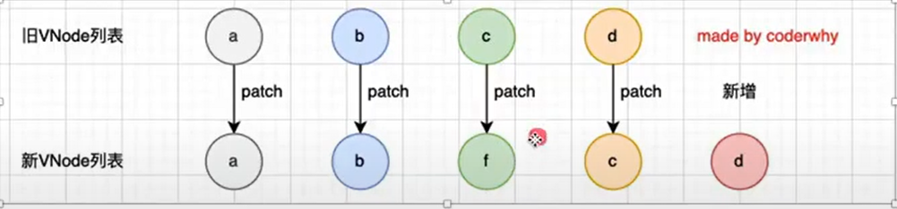
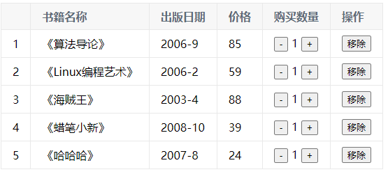
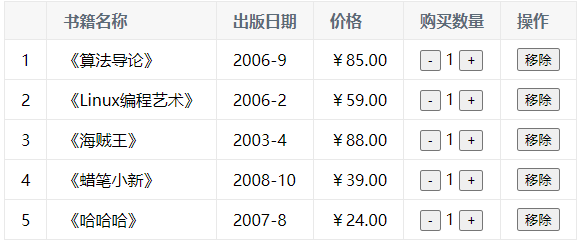

# 1 **mustache语法**

```html
<h2>{{ one + '' + two }}</h2>
<h2>{{ one }} {{ two }}</h2>
<h2>{{ three * 2 }}</h2>
```

```js
data() {
	return {
	  one: '一',
	  two: '二',
	  three: 3
	}
}
```

通过**{{}}**，**template**里既可以使用**data()**里面定义的数据啦

# 2 低频指令

- 本质就是自定义属性

这些指令很少使用~

##  2.1 v-cloak

防止页面加载时出现**闪烁**问题

```html
<div v-cloak>{{ msg }}</div>
```

```js
data() {
    return {
        msg: 'hello'
    }
}
```

```css
[v-cloak]{
  display: none;
}
```


##  2.2 v-text

- 用于**将数据填充到标签中**，作用与插值表达式**类似**，但是**没有闪动**问题
- 如果数据中有HTML标签会将html标签一并输出
- 注意：此处为**单向数据绑定**，数据对象上的值改变，插值会发生变化；但是当插值发生变化并不会影响数据对象的值

```html
<p v-text="msg"></p>
```

```js
data() {
    return {
        msg: 'hello'
    }
}
```


##  2.3 v-html

- 用法和v-text 相似  但是他**可以将HTML片段填充到标签**中
- **可能有安全问题, 一般只在可信任内容上使用 `v-html`，永不用在用户提交的内容上**
- 它与v-text区别:**v-text**输出的是**纯文本**，浏览器不会对其再进行html解析，但v-html会将其当html标签解析后输出。

```html
<p v-html="html"></p> 
<p v-text="text"></p>
<p>{{ message }}</p>  
```

```js
data() {
    return {
        message: '<span>通过双括号绑定</span>',
        html: '<span>html标签在渲染的时候被解析</span>',
        text: '<span>html标签在渲染的时候被源码输出</span>',
    }
}
```


##  2.4 v-pre

- 显示原始信息跳过编译过程
- 跳过这个元素和它的子元素的编译过程。
- **一些静态的内容不需要编译加这个指令可以加快渲染**

```html
<span v-pre>{{ this will not be compiled }}</span>    
<span v-pre>{{ msg }}</span>  
```

```js
data() {
    return {
        msg: 'Hello'
    }
}
```


## 2.5 v-once

- 执行一次性的插值(当数据改变时，插值处的内容不会继续更新)

```html
<span v-once>{{ msg }}</span>
```

```js
data() {
    return {
        msg: 'Hello'
    }
}
```


## 2.6 插值表达式 v-text v-html三者区别

| 差值表达式 | 闪动问题---v-cloak解决 |
| ---------- | ---------------------- |
| v-text     | 没有闪动问题           |
| v-html     | 安全问题               |

## 2.7 自定义指令

除了v-for、v-show、v-model等等指令，**vue也允许我们自定义指令**

在某些情况下，需要**对元素进行DOM操作**，这时就需要用到自定义指令了

通过**directives选项**（**局部**，只能在**当前组件使用**；**全局**的要使用app的**directive()**）

**案例-某个元素挂载完成后自动获取焦点**

```html
<input type="text" ref="input">
```

```js
import { ref } from 'vue'

setup() {
    const inputRef = ref(null)
    onMounted(() => {
        inputRef.value.focus()
    })
    return {
        input
    }
}
```

这是当前输入框，要是想**其它输入框也能挂载完成之后获取焦点呢？**

你可能会想到**复用**。非常棒！

vue中复用代码的形式**主要是组件**，当然还有**Composition API**抽取成一个**hook函数**

还有一个**更简单**的方法：**自定义指令**

我们来自定义一个**v-focus**指令（当然，vue中并没有这个指令哦）

```html
<input type="text" v-focus>
```

```js
directives: {
    focus: {
        mounted(el) {
            el.focus()
        }
    }
}
```

这是**局部**的，当**input**被挂载完成后，执行**input.focus()**

来看看**全局**是怎么做的

```js
import { createApp } from 'vue'
const app = createApp(根组件)
app.directive('focus',{
    mounted(el) {
        el.focus()
    }
})
```

### **指令的生命周期**

和组件的生命周期类似都是在特定时间节点回调对应函数

### 自定义指令的修饰符

**自定义指令的修饰符放在哪里呢？**

指令生命周期函数的**第二参数**


```html
<input type="text" v-focus.test="hhh">
```

```js
directives: {
    focus: {
        mounted(el, bindings) {
            el.focus()
            console.log(bindings.modifiers)
        }
    }
}
```

你就会在控制台看到hhh

### 案例-转化时间戳

在开发中，大多数情况下从**服务器**获取到都是**时间戳**；

需要**将时间戳转化成具体格式的时间**来展示；

vue2可以使用**过滤器**来完成（vue3已移除啦）；

vue3中可以通过**computed()**或者**自定义一个方法**完成；

其实还可以通过**自定义指令**

可以指定一个**v-format-time**的指令

```html
<h2 v-format-time>{{ timestamp }}</h2>
```

```js
setup() {
    const timestamp = 1623352193
    return {
        timestamp
    }
}
```

来全局注册这个指令

```js
import { createApp } from 'vue'
import dayjs from 'dayjs'
const app = createApp(根组件)
app.directive('format-time',{
    mounted(el) {
        const textContent = el.textContent
        let timestamp = parseInt(textContent)
        // 如果是10位，那就是s，需转化为ms
        if(textContent.length === 10) {
            timestamp = timestamp * 1000
        }
        
        el.textContent = dayjs(timestamp).format('YYYY-MM-DD HH:mm:ss')
    }
})
```

这里使用第三方库**dayjs**进行转化

如果用户想**自己设置格式**，可以**传参**进来

```html
<h2 v-format-time='YYYY/MM/DD'>{{ timestamp }}</h2>
```

```js
import { createApp } from 'vue'
import dayjs from 'dayjs'

const app = createApp(根组件)

app.directive('format-time',{
    mounted(el, bindings) {
        let formatString = bindings.value
        // 如果没传就用默认的
        if(!formatString) {
            formatString = 'YYYY-MM-DD HH:mm:ss'
        }
        const textContent = el.textContent
        let timestamp = parseInt(textContent)
        // 如果是10位，那就是s，需转化为ms
        if(textContent.length === 10) {
            timestamp = timestamp * 1000
        }
        
        el.textContent = dayjs(timestamp).format(formatString)
    }
})
```


# 3 数据绑定v-bind

**v-bind:class，语法糖-->:class**

```html


```

```js
data() {
    return {
        url: 'https://pics5.baidu.com/feed/63d9f2d3572c11df69f722f63ced03d9f603c211.jpeg?token=447e2f91bfb2194ae769094c0ba5c2a5'
    }
}
```


## 3.1 动态绑定class

### 对象形式

```html
<h2 :class="{ active: isActive }">你好</h2>
<button v-on:click="btnClick">点击</button>
```

```js
data() {
    return {
        isActive: false
    }
},
methods: {
    btnClick: function () {
        this.isActive = !this.isActive
    }
}
```

当你点击按钮，你会发现h2出现一个叫active的类


### 数组形式

```html
<h2 :class="[active, line]">你好</h2>
```

```js
data() {
    return {
        active: 'aa',
        line: 'bb'
    }
}
```

你会发现h2有**aa,bb**这两个类名了


## 3.2 动态绑定style

### 对象形式

```html
<h2 :style="{ color: finalColor }">你好</h2>
```

```js
data() {
    return {
        finalColor: 'red'
    }
}
```


## 3.3 案例-点击列表项自动变红

```html
<ul>
	<li v-for="(item, index) in list" 
        v-on:click="listClick(index)" 
        :class="{ active: current === index }"
    >{{ index }}-{{ item }}</li>
</ul>
```

```js
data() {
    return {
        current: 0,
        list: ['海贼王', 'abs', '666']
    }
},
methods: {
    listClick(index) {
        this.current = index
    }
}
```

```css
.active {
    color: red;
}
```


# 4 计算属性computed

当数据**需要经过处理再显示**时，需要用到计算属性

## 4.1 基本使用

```html
<h2>{{ getFullName }}</h2>
```

```js
data() {
    return {
        firstName: 'first',
        lastName: 'last'
    }
},
computed: {
    getFullName() {
        return this.firstName + ' ' + this.lastName
    }
}
```


## 4.2 set和get

computed原理是这样的

```html
<h2>{{ fullName }}</h2>
```

```js
data() {
    return {
        firstName: 'first',
        lastName: 'last'
    }
},
computed: {
    // 简写
    // fullName() {
    //     return this.firstName + ' ' + this.lastName
    // }
    // 完整写法
    // 而一般情况下是不用set方法的，只读属性
    fullName: {
        set() {},
        get() {
            return this.firstName + ' ' + this.lastName
        }
    }
}
```


## 4.3 computed和methods的对比--掌握

**methods和computed看起来都可以实现我们的功能，他们的区别在哪里？**

计算属性会进行缓存，如果多次使用，计算属性只会调用一次。

```html
<!-- methods -->
<h2>{{ getFullName() }}</h2>
<h2>{{ getFullName() }}</h2>
<h2>{{ getFullName() }}</h2>
<h2>{{ getFullName() }}</h2>

<!-- 计算属性 -->
<h2>{{ fullName }}</h2>
<h2>{{ fullName }}</h2>
<h2>{{ fullName }}</h2>
<h2>{{ fullName }}</h2>
```

```js
data() {
    return {
        firstName: 'first',
    	lastName: 'last'
    }
},
computed: {
    fullName: function () {
        // 只打印一次
        console.log('fullName')
        return this.firstName + ' ' + this.lastName
    }
},
methods: {
    getFullName: function () {
        // 每打印4次
        console.log('getFullName')
        return this.firstName + ' ' + this.lastName
    }
}
```


# 5 侦听器watch

Vue 提供了一种更通用的方式来**观察和响应**当前活动的实例上的**数据变动**：**侦听属性(watch)**。

当需要在数据变化时执行异步或开销较大的操作时，这个方式是最有用的;

默认情况下，当一个对象发生改变时可以监听到，但是**对象内部成员**发生改变则**监听不到**

```js
data() {
 return {
   info: { name: 'zsf', age: '18'}
 }
},
watch: {
  info(newInfo, oldInfo) {
  	console.log('newValue:', newInfo, 'oldValue:', oldInfo )
  }
},
methods: {
  changeInfo() {
    this.info = {name: 'kobe'}
  }
  changeInfoName() {
    this.info.name = 'kobe'
  }
}
```

当触发某个事件执行**changeInfoName()**时，改变**info**成员**name**的值，**watch**监听不到，所以控制台没打印。

## 5.1 深度侦听

**但是要是有这需求呢？**

这就需要**深度侦听**了。

**方法一**

```js
data() {
 return {
   info: { name: 'zsf', age: '18'}
 }
},
watch: {
  info:{
    handler: function(newInfo, oldInfo) {
      console.log('newValue:', newInfo, 'oldValue:', oldInfo )
    },
    deep: true
  }
},
methods: {
  changeInfo() {
    this.info = {name: 'kobe'}
  }
  changeInfoName() {
    this.info.name = 'kobe'
  }
}
```

**方式二**

```js
watch: {
  info:{
    'info.name': function(newInfo, oldInfo) {
      console.log('newValue:', newInfo, 'oldValue:', oldInfo )
    },
    deep: true
  }
}
```

但是这种方式在vue3官方文档上已经看不到了。

## 5.2 立即执行

当如果需要页面渲染后，不管数据有没有发生改变，都要执行一次侦听器，这时就需要用到**immediate**属性了

```js
watch: {
  info:{
    handler: function(newInfo, oldInfo) {
      console.log('newValue:', newInfo, 'oldValue:', oldInfo )
    },
    deep: true,
    immediate: true
  }
}
```


# 6 事件监听v-on

**v-on:click，语法糖@click**

## 6.1 参数传递

1.事件绑定的方法可以不带小括号（如果不需要参数）；

2.函数定义的时候需要参数，但是事件触发时绑定的函数没有()，vue会默认将浏览器产生的**event**事件对象作为参数传入方法中；

3.需要**event对象**，同时又需要**其它参数**,这是需要手动传入$event;

```html
<button @click="btn1Click">按钮1</button>
<button @click="btn2Click">按钮2</button>
<button @click="btn3Click(abc, $event)">按钮3</button>
```

```js
methods: {
    btn1Click () {
        console.log(123);
    },
    btn2Click (name) {
        console.log(name);
    },
    btn3Click (abc, event) {
        console.log(abc, event);
    }
}
```


## 6.2 修饰符

- .stop的使用---防止**事件冒泡**
- .prevent的使用---防止事件的**默认行为**，如表单submit的默认行为
- .enter的使用---当输入回车才会触发事件（其它特殊键帽类似）
- .once的基本使用---只触发**一次回调**

```html
<div @click="divClick()">
    12345
    <button @click.stop="btnClick()">点击</button>
</div>
```

```js
methods: {
    divClick () {
        console.log('div');
    },
    btnClick () {
        console.log('btn');
    }
}
```


# 7 双向数据绑定v-model

## 7.1 原理

v-model背后有两个操作：

- v-bind绑定value属性的值；
- v-on绑定input事件监听的函数中，函数会获取最新的值赋值到绑定的属性中；

```html
<input v-model='msg' />
```

等价于

```html
<input v-bind='msg' v-on='msg = $event.target.value'>
```

## 7.2 应用场景

**表单**

- checkbox
- radio
- select

**checkbox**

当多个checkbox用v-model绑定一个数据（hobbies）时（记得每个加上value哦），修改选中的数量的时候，hobbies会动态的增删

```html
<form action="">
    <label for="basketball">
      <input type="checkbox" name="" id="basketball" v-model="hobbies" value="basketball">篮球
    </label>
    <label for="football">
      <input type="checkbox" name="" id="football" v-model="hobbies" value="football">足球
    </label>
    <label for="tennis">
      <input type="checkbox" name="" id="tennis" v-model="hobbies" value="tennis">网球
    </label>
</form>
```

**radio**

和多选框不同，两个**radio**用**v-model**绑定一个数据（gender），由于互斥，**gender**最终只能有一个**value**

```html
<label for="male">
      <input type="radio" id="male" v-model="gender" value="male">男
    </label>
    <label for="female">
      <input type="radio" id="female" v-model="gender" value="female">女
    </label>
```

sellect同理

## 7.3 修饰符

由于v-model是集成了v-bind和v-on，所以他也有修饰符

- lazy
- number
- trim

**lazy修饰符有什么作用呢？**

默认情况下，**v-model**在进行双向绑定时，绑定的是**input**事件，每次内容输入后就将**最新的值和绑定的属性同步**；

如果**v-model**加上**lazy**修饰符，会将绑定的事件切换为**change**事件，只有在提交时（比如回车），才会触发（类似于防抖）

**number修饰符有什么作用呢？**

给**v-model赋**值时，不管**内容**是什么类型，都会转换成**String**类型，**但要是希望数字类型不要被转换呢?**

用**number**修饰符。

**trim**

去空格。。。

# 8 条件判断v-if

## 8.1 案例--登陆切换

```html
<span v-if="isUssr">
    <label for="username">用户账号</label>
    <input type="text" id="uername" placeholder="用户账号">
</span>
<span v-else>
    <label for="email">用户邮箱</label>
    <input type="text" id="email" placeholder="用户邮箱">
</span>
<button @click="isUssr = !isUssr">切换类型</button>
```

```js
data() {
    return {
        isUser: true
    }
}
```


## 8.2 v-show 和 v-if的区别

**v-if **确保在切换过程中条件块内的事件监听器和子组件**适当地被销毁和重建**。;

**v-if** 也是**惰性的**：如果在初始渲染时条件为假，则什么也不做——直到条件第一次变为真时，才会开始渲染条件块;

相比之下，**v-show** 就简单得多——不管初始条件是什么，元素**总是会被渲染**，并且只是简单地基于 **CSS的display**进行切换；

注意，**v-show不支持template**；

一般来说，**v-if** 有**更高的切换开销**，而 **v-show** 有**更高的初始渲染开销**；

因此，如果需要非常**频繁地切换**，则使用 **v-show** 较好；

如果在运行时**条件很少改变**，则使用 **v-if** 较好；

# 9 遍历v-for

```html
<li v-for="item in list" :key="item">{{ item }}</li>
```

```js
data() {
    return {
        list: [1,2,3,4,5]
    }
}
```


## 9.1 v-for中key有什么作用？

- key属性主要用在Vue的**虚拟DOM的diff算法**，在**新旧nodes**对比是辨识**VNodes**
- 如果**不使用key**，Vue会使用一种最大限度减少动态元素并且尽可能的尝试就地**修改/复用相同类型元素**的算法
- 而**使用key**时，它会基于key的变化**重新排列元素顺序**，并且会**移除/销毁**key不存在的元素

这时候你可能要问：**啥是VNode？**

- 在Vue中，无论是组件还是元素，最终表现出来的都是一个个VNode
- VNode的本质是一个js对象

比如

```html
<div class="my" style="font-size: 30px; color: red">
    hhh
</div>
```

转化成VNode形式

```js
const vnode = {
    type: 'div',
    prop: {
        class: 'my',
        style: {
            font-size: 30px,
            color: red
        }
    },
    children: 'hhh'
}
```

所以你知道为什么`v-bind`支持**对象绑定**了吧！

所以Vue的渲染过程大致理解为：template -> VNode -> 真实DOM

使用VNode有一个很重要的原因：**跨平台！**

可以在浏览器上渲染，可以在移动端渲染

那，**啥是虚拟DOM？**

VNode组成的VNode Tree

好了，接下来**举例体现v-for中key的作用**

假设一开始要遍历数组arr = [a, b, c, d]

现在要在bc之间插入一个f

当数组变化了之后，要重新遍历了

那有个问题来了：**要怎么做，才能让这个插入性能最高效？**

**方案一，**把原来的数组去掉，用新的数组（ps：狗都不用）

**方案二，**ab不变，用原来的位置，之前c位置换成f，之前d的位置放c，依次类推。。。要是放的位置很靠前，并且这数组巨大，那还不如用方案一呢

**方案三，**diff算法，原来的元素不变，对比新旧VNode有哪些需要发生变化再变化，但是Vue会根据你有没有key采取不同的更新策略：

如图，这里引用coderwhy老师的一张图，当没有key时，它是这样更新的（具体看源码）

用方案二更新



当有key时，这就相对复杂了：

先从头开始，while循环找出哪些不变；

剩下部分从尾开始，whil循环找出哪些不变；

那剩下的是没有与之匹配的节点f，这时直接新增一个节点

这里又引用coderwhy老师的一张图：


这还是比较简单的情况。。。

源码就先到这里，我只是想举出有key和没key对性能的影响

## 9.2 数组中响应式的方法

1. push()
    `this.list.push('aaa')`

2. pop():删除数组最后一个
    `this.list.pop('aaa')`

3. shift():删除数组第一个
    `this.list.shift()`

4. unshift():在数组最前面添加
    `this.list.unshift()`

5. **splice(): 删除/插入/替换**
    **第一个参数是开始位置**

  **删除元素：第二个参数传入你要删除几个元素（如果没有传，就删除后面的所有元素）**

  **替换元素：第二个参数，表示我们要替换几个元素，后面是用于替换前面的元素**

  **插入元素：第二个参数，传入0，并且后面跟上要插入的元素**
  `this.list.splice(1, 3, 'a', 'b', 'c')`

6. sort()
    `this.list.sort()`

7. reverse()

  `this.list.reverse`

# 10 图书购物车

## 10.1 结构样式初始化

```html
<table>
    <thead>
        <tr>
            <th></th>
            <th>书籍名称</th>
            <th>出版日期</th>
            <th>价格</th>
            <th>购买数量</th>
            <th>操作</th>
        </tr>
    </thead>
    <tbody>
        <tr v-for="item in books" :key="item">
            <td>{{ item.id }}</td>
            <td>{{ item.name }}</td>
            <td>{{ item.date }}</td>
            <td>{{ item.price }}</td>
            <td>
                <button>-</button>
                {{ item.count }}
                <button>+</button>
            </td>
            <td>移除</td>
        </tr>
    </tbody>
</table>
```

```js
data() {
    return {
        books: [
            {
                id: 1,
                name: '《算法导论》',
                date: '2006-9',
                price: 85.00,
                count: 1
            },
            {
                id: 2,
                name: '《Linux编程艺术》',
                date: '2006-2',
                price: 59.00,
                count: 1
            },
            {
                id: 3,
                name: '《海贼王》',
                date: '2003-4',
                price: 88.00,
                count: 1
            },
            {
                id: 4,
                name: '《蜡笔小新》',
                date: '2008-10',
                price: 39.00,
                count: 1
            },
            {
                id: 5,
                name: '《哈哈哈》',
                date: '2007-8',
                price: 24.00,
                count: 1
            }
        ]
    }
}
```

```css
table {
    border: 1px solid #e9e9e9;
    border-collapse: collapse;
    border-spacing: 0;
}

th, td {
    padding: 8px 16px;
    border: 1px solid #e9e9e9;
    text-align: left;
}

th {
    background-color: #f7f7f7;
    color: #5c6b77;
    font-weight: 600;
}
```

**效果**



## 10.2 价格格式处理

在价格前面加‘￥’；

需要保留两位小数，**toFixed()**可以把小数点后的00显示出来；

**使用过滤器**

```js
filters: {
    showPrice (price) {
        return '￥' + price.toFixed(2)
    }
}
```

价格那一栏用 `item.price | showPrice`

过滤器语法：会把 `item.price` 当成参数传进 showPrice 函数，类似linux的管道

```html
<tr v-for="item in books" :key="item.id">
    <td>{{ item.id }}</td>
    <td>{{ item.name }}</td>
    <td>{{ item.date }}</td>
    <td>{{ item.price | showPrice }}</td>
    <td>
        <button>-</button>
        {{ item.count }}
        <button>+</button>
    </td>
    <td><button>移除</button></td>
</tr>
```

**效果**



## 10.3 加减按钮的事件

**如何保证操作的是当前书籍？**

index.html+

v-for遍历的时候加上index参数

```html
<tr v-for="(item, index) in books" :key="item.id">
    <td>{{ item.id }}</td>
    <td>{{ item.name }}</td>
    <td>{{ item.date }}</td>
    <td>{{ item.price | showPrice }}</td>
    <td>
        <button @click="decrement(index)">-</button>
        {{ item.count }}
        <button @click="increment(index)">+</button>
    </td>
    <td><button>移除</button></td>
</tr>
```

```js
methods: {
    increment (index) {
        this.books[index].count++
    },
    decrement (index) {
        this.books[index].count--
    }
}
```

**怎么做使书籍数量为1的时候不能减？**

当书籍数量小于或等于1时禁用button

```html
<button @click="decrement(index)" :disabled="item.count <= 1">-</button>
```

**效果**


## 10.4 移除按钮的事件

**如何确保移除的是当前书籍？**

同上，传index

index.html+

```html
<td><button @click="remove(index)">移除</button></td>
```

```js
methods: {
    ...
    remove (index) {
        this.books.splice(index, 1)
    }
}
```

**当移除完购物车，显示购物车为空怎么实现？**

**用v-if和v-else**

当books有长度时才显示表格

```html
<div v-if="books.length">
    ...
</div>
<h2 v-else>购物车空啦</h2>
```

## 10.5 计算总价

**用计算属性computed + 过滤器**

```js
computed: {
    totalPrice () {
        let totalPrice = 0
        for (let i = 0; i < this.books.length; i++) {
            totalPrice += this.books[i].count * this.books[i].price
        }
        return totalPrice
    }
}
```

**效果**


