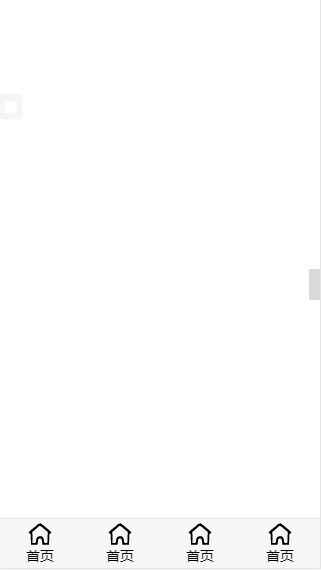
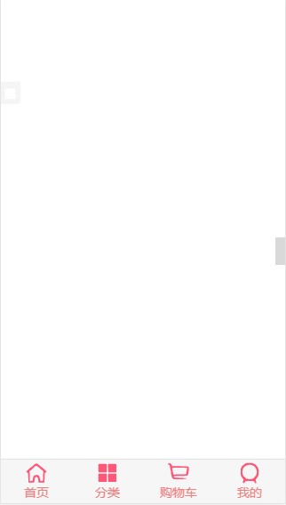

# 1 案例--封装一个TabBar组件

## 1.1 初始化结构

#### App.vue

```html
<div id="app">
  <TabBar></TabBar>
</div>
```

```js
import TabBar from './components/tabbar/TabBar.vue'

components: {
  TabBar
}
```


#### TabBar.vue

```html
<div id="tab-bar">
  <div class="tab-bar-item">首页</div>
  <div class="tab-bar-item">分类</div>
  <div class="tab-bar-item">购物车</div>
  <div class="tab-bar-item">我的</div>
</div>
```

```css
#tab-bar {
  display: flex;
  position: fixed;
  left: 0;
  right: 0;
  bottom: 0;
  background-color: #f6f6f6;
  box-shadow: 0 -1px 1px rgba(100, 100, 100,.2);
}
.tab-bar-item {
  flex: 1;
  text-align: center;
  height: 49px;
}
```


## 1.2 TabBar进一步抽离出TarBarItem

新增一个TarBarItem组件

### TarBarItem.vue

```html
<div class="tab-bar-item">
  
  <div>首页</div>
</div>
```

```css
.tab-bar-item {
  flex: 1;
  text-align: center;
  height: 49px;
  font-size: 14px;
}
.tab-bar-item img {
  vertical-align: middle;
  height: 24px;
  width: 24px;
  margin-top: 3px;
}
```


### TabBar.vue

```html
<div id="tab-bar">
  <slot></slot>
</div>
```

```css
#tab-bar {
  display: flex;
  position: fixed;
  left: 0;
  right: 0;
  bottom: 0;
  background-color: #f6f6f6;
  box-shadow: 0 -1px 1px rgba(100, 100, 100,.2);
}
```


### App.vue

```html
<div id="app">
  <TabBar>
    <TabBarItem></TabBarItem>
    <TabBarItem></TabBarItem>
    <TabBarItem></TabBarItem>
    <TabBarItem></TabBarItem>
  </TabBar>
</div>
```

```js
import TabBarItem from './components/tabbar/TabBarItem.vue'

components: {
	TabBarItem
}
```

### 效果



**问题：同一个图片，一样的文字**

**TarBarItem.vue的内容是写死的吗?**

不是，加入具名插槽

TarBarItem.vue

```html
<div class="tab-bar-item">
  <solt name="item-icon"></solt>
  <solt name="item-text"></solt>
</div>
```

App.vue

```html
<div id="app">
  <tab-bar>
    <tab-bar-item>
      
      <div slot="item-text">首页</div>
    </tab-bar-item>
    <tab-bar-item>
      
      <div slot="item-text">分类</div>
    </tab-bar-item>
    <tab-bar-item>
      
      <div slot="item-text">购物车</div>
    </tab-bar-item>
    <tab-bar-item>
      
      <div slot="item-text">我的</div>
    </tab-bar-item>
  </tab-bar>
</div>
```


## 1.2 处于激活状态的图片和文字

### **TabBarItem.vue**

新增:一个数据isActive、一个类active

```html
<div class="tab-bar-item">
  <div v-if="!isActive">
      <slot name="item-icon"></slot>
  </div>
  <div v-else>
      <slot name="item-icon_active"></slot>
  </div>
  <div :class="{active: isActive}">
      <slot name="item-text"></slot>
  </div>
</div>
```

```js
data () {
  return {
    isActive: true
  }
}
```

```css
.active {
  color: lightcoral;
}
```


### **经验：**

**当插槽有属性时，为了防止使用时覆盖掉slot的属性，一般都是在slot标签外面包一层div，然后那些属性放到div的属性上**

例如

这样的插槽被使用时可能会被覆盖掉v-if属性

```vue
<slot v-if="!isActive" name="item-icon"></slot>
```

而这样就不会

```vue
<div v-if="!isActive"><slot name="item-icon"></slot></div>
```

### 效果



## 1.3 点击每一个item对应一个路由

components文件夹和view的区别

components放的是公共组件

而view放的是单独组件

### 新建四个组件

在双src文件夹下新建view文件夹，然后分别新建home、category、shopcar、profile文件夹放对应组件

比如

home文件夹下的Home.vue

```html
<div>首页</div>
```


### 新增路由

在src文件夹下新建一个router文件夹并在该文件夹下新建一个index.js

**index.js**

```js
// 1.导入
import Vue from 'vue'
import VueRouter from 'vue-router'
// 2.挂载
Vue.use(VueRouter)
// 懒加载
const Home = () => import('../view/home/Home.vue')
const Category = () => import('../view/Category/Category.vue')
const ShopCar = () => import('../view/shopcar/ShopCar.vue')
const Profile = () => import('../view/profile/Profile.vue')
// 3.创建路由配置对象
const routes = [
  {
    path: '',
    redirect: '/home'
  },
  {
    path: '/home',
    components: Home
  },
  {
    path: '/category',
    components: Category
  },
  {
    path: '/shopcar',
    components: ShopCar
  },
  {
    path: '/profile',
    components: Profile
  }
]
// 4.实例化路由对象
const router = new VueRouter({
  routes
})
// 5.默认导出
export default router
```

### main.js导入路由

```js
import Vue from 'vue'
import App from './App.vue'
import router from './router'

// 导入组件库
import ElementUI from 'element-ui'
// 导入组件相关样式
import 'element-ui/lib/theme-chalk/index.css'
// 配置Vue插件
Vue.use(ElementUI)

Vue.config.productionTip = false

new Vue({
  router,
  render: h => h(App)
}).$mount('#app')
```

### 父组件给子组件传路径

**App.vue**

```html
<div id="app">
  <router-view></router-view>
  <tab-bar>
    <tab-bar-item path="/home">
      
      
      <div slot="item-text">首页</div>
    </tab-bar-item>
    <tab-bar-item path="/category">
      
      
      <div slot="item-text">分类</div>
    </tab-bar-item>
    <tab-bar-item path="/shopcar">
      
      
      <div slot="item-text">购物车</div>
    </tab-bar-item>
    <tab-bar-item path="/profile">
      
      
      <div slot="item-text">我的</div>
    </tab-bar-item>
  </tab-bar>
</div>
```


**TabBarItem.vue**

```js
props: {
  path: String
},
methods: {
  itemClick () {
    this.$router.push(this.path)
  }
}
```


## 1.4 点击item才激活

将TabBarItem的isActive改成计算属性

```js
computed: {
    isActive () {
      return this.$route.path.indexOf(this.path) !== -1
    }
  }
```

**如何让使用者修改激活样式？**

比如想修改激活文字样式activeColor="blue"

```vue
<tab-bar-item path="/home" activeColor="blue">
  
  
  <div slot="item-text">首页</div>
</tab-bar-item>
```

先在TabBarItem里添加一个自定义属性activeColor

修改控制文字的那个插槽绑定的样式

TabBarItem.vue

```html
<div :style="activeStyle">
    <slot name="item-text"></slot>
</div>
```

```js
props: {
  activeColor: {
    type: String,
    default: 'red'
  }
},
computed: {
  activeStyle () {
    return this.isActive ? { color: this.activeColor } : {}
  }
}
```


