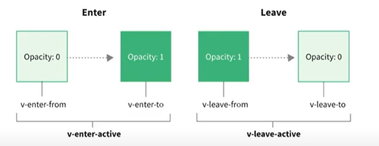

vue中为我们提供一些**内置组件对应的api**来完成动画，利用它们可以方便实现**过渡动画效果**

# 1 transition

给单元素或组件添加动画

## 1.1 **案例**

hello world的显示与隐藏

```html
<button @click="toggle">显示/隐藏</button>
<transition name="zsf">
    <h2 v-if="isShow">hello world</h2>
</transition>
```

```js
data() {
    return {
        isShow: true
    }
},
methods: {
    toggle() {
        this.isShow = !this.isShow
    }
}
```

```css
.zsf-enter-from,
.zsf-leave-to {
    opacity: 0;
}

.zsf-enter-to,
.zsf-leave-from {
    opacity: 1;
}

.zsf-enter-active,
.zsf-leave-active {
    transition: opacity 2s ease;
}
```

这样就是实现了hello world透明度从0到1的动画效果啦

## 1.2 原理

当**插入或删除**包含在**transition**组件中的元素时，Vue将会做以下处理：

1. 自动检测**目标元素是否应用了css过渡或者动画**，如果有，那么在**恰当的时机/删除css类名**；
2. 如果transition组件提供了**js钩子函数**，这些钩子函数将在恰当的时机被调用；
3. 如果**没有**找到**js钩子函数**并且也没有检测到**css过渡/动画**，**dom插入、删除操作**将会**立即执行**；

## 1.3 过渡动画class

vue就是帮助我们在这些class之间**来回切换**完成的动画

### v-enter-from

定义**进入过渡的开始状态**。在元素被插入之前生效，在元素被插入后的下一帧移除

### v-enter-active

定义**进入过渡生效时的状态**。在整个进入过渡的阶段中应用，在元素被插入之前生效，在过渡/动画完成之后移除

这个类可以用来定义进入过渡的过程时间，延迟和曲线函数

### v-enter-to

定义**进入过渡的结束状态**。在元素被插入之后下一帧生效（与此同时v-enter-from被移除），在过渡/动画完成之后移除

### v-enter-from

定义**离开过渡的开始状态**。在离开过渡被触发时立刻生效，下一帧被移除

### v-enter-active

定义**离开过渡生效时的状态**。在整个进入过渡的阶段中应用，在元素被插入之前生效，在过渡/动画完成之后移除

这个类可以用来定义进入过渡的过程时间，延迟和曲线函数

### v-enter-to

定义**离开过渡的结束状态**。在元素被插入之后下一帧生效（与此同时v-leave-from被移除），在过渡/动画完成之后移除

上面那个例子可以用这个图表示



## 1.4 class命名规则

如果transition没有name属性，那所有的class是以-作为默认前缀

如果添加了name属性，比如**name="zsf"**,那么所有的class会以**zsf-**开头

# 2 animate.css

**跨平台的动画库**，对于强调、主页、滑动、注意力引导非常有用；

## 2.1 使用

**安装**

`npm install animate.css`

**引入**

`import animate.css`

# 3 gsap

使用js实现一些动画效果的库

这个可以结合transition内置组件的**js钩子函数**一起使用

详细看官网

# 4 transitions-group

列表过渡动画，可以对多个元素、组件进行动画效果

后续再学啦-->**第14个视频**

有哪些案例呢？

- 数字变化过渡动画
- 列表交错过渡动画
- 


