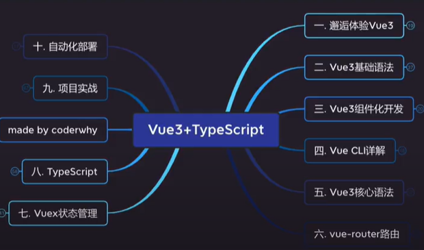

# 1 变化

**vue3发生了哪些变化？**

## 1.1 源码

- **monorepo形式管理**，Mono单个，Repo，repository仓库主要是将许多项目的代码存储在同一个repository中，这样的目的是**多个包本身相互独立，可以有自己的功能逻辑、单元测试等**，同时又在同一个仓库下方便管理。
- 使用**TypeScript**重写，在vue2是使用**Flow进行类型检测**的。

## 1.2 性能

- 使用**Proxy**进行**数据劫持**，Vue2使用**Object.defineProperty**
- 删除了**$on**, **$off**,和**$once**
- 移除了一些特性，如**filter**、**内联模板**等
- 生成**Block Tree**、**Slot编译优化**、**diff算法优化**

## 1.3 API

- **从Option API到Composition API**

  Option API存在比较大的问题是多个逻辑可能是在不同的地方，比如**created**中会使用某个**method**来修改**data**里面的数据，代码**内聚性不高**。

  而Composition API可以将相关联的代码放同一处进行处理，而不需要在多个Option之间寻找

  **而且，vue3的开发，更加接近于js原生的代码**

- **Hooks函数增加代码的复用性**

  Vue2通常使用**mixin**共享组件逻辑，但有一个很大缺陷，mixins也是由一大堆Option组成，并且多个mixins会存在**命名冲突**的问题。

  通过**Hook**函数，来将一部分独立的逻辑抽离出去，并且还可以做到**响应式**

# 2 **拓展**

**CDN引入**（Content Delivery Network），内容分发网络，利用**最靠近**用户的服务器，快速、可靠的将资源发送给用户，一般要钱，开源的cdn服务器有：unpkg、JSDelivr、cdnjs

5. 

**VSCode代码片段**

1. 设置

2. 用户代码片段

3. html.json

4. 快速生成代码片段的网站

   https://snippet-generator.app/

**template元素**

开发中如果不想添加多余的div当父元素，可以使用template元素