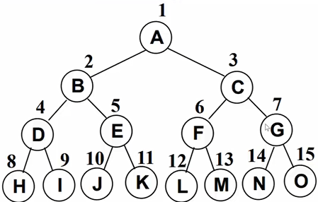
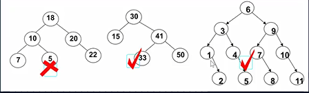
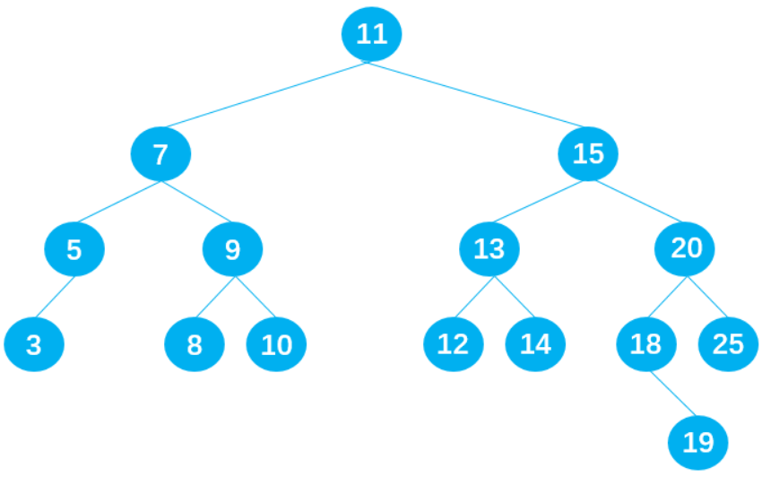
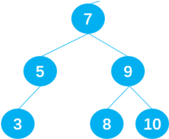

 

## 完美二叉树

除了最后一层的叶子节点外，每层节点都有2个子节点，又叫满二叉树



## 完全二叉树

- **除最后一层**外，其它各层的节点数都达到**最大个数**
- 最后一层从左向右的叶节点连续存在，**只缺右侧**若干节点
- 完美二叉树是特殊的完全二叉树

# 二叉搜索树

Binary Search Tree（BST）

## 特点

- 非空左子树所有的键值小于其根节点的键值
- 非空右子树所有的键值大于其根节点的键值
- 左右子树本身也是二叉搜索树

举个例子



## 封装

```js
function BinarySeacherTree() {
  function Node(key) {
    this.key = key
    this.left = null
    this.right = null
  }
  // 属性-根结点
  this.root = null
}
```

## 常见操作

- insert
- search（优势）
- remove（复杂）
- inOrderTraverse
- preOrderTraverse
- POSTOrderTraverse
- min
- max

### insert

```js
// insert
  BinarySeacherTree.prototype.insert =function (key) {
    // 根据key创建节点
    const newNode = Node(key)

    // case1 根结点是否有值
    if (this.root = null) {
      this.root = newNode
    } else {
      this.insertNode(this.root, newNode)
    }
  }

  // insertNode 用于递归插入
  BinarySeacherTree.prototype.insertNode = function (node, newNode) {
    if (newNode.key < node.key) { // 向左查找
      if (node.left == null) { // 为空？
        node.left = newNode
      } else { 
        this.insertNode(node.left, newNode)
      }
    } else { // 向右查找
      if (node.right == null) { // 为空？
        node.right = newNode
      } else { 
        this.insertNode(node.right, newNode)
      }
    }
  }
```

### 遍历

- 先序遍历（先处理，再找子）
- 中序遍历

**先序遍历**

```js
// preOrderTraversal
  BinarySeacherTree.prototype.preOrderTraversal = function (handler) {
    this.preOrderTraversalNode(this.root, handler)
  }

  // preOrderTraversalNode 用于节点递归遍历 
  BinarySeacherTree.prototype.preOrderTraversalNode = function (node, handler) {
    if (node != null) {
      // 1.处理经过的节点
      handler(node.key)
      // 2.处理经过节点的左子节点
      this.preOrderTraversalNode(node.left, handler)
      // 3.处理经过节点的右子节点
      this.preOrderTraversalNode(node.right, handler)
    }
  }
```

**中序遍历**

```js
// 中序遍历 midOrderTraversal
  BinarySeacherTree.prototype.midOrderTraversal = function (handler) {
    this.midOrderTraversalNode(this.root, handler)
  }
  // preOrderTraversalNode 用于中序节点递归遍历 
  BinarySeacherTree.prototype.midOrderTraversalNode = function (node, handler) {
    if (node != null) {
      // 1.先处理左子树中的节点
      this.midOrderTraversalNode(node.left, handler)
      // 2.处理节点
      handler(node.key)
      // 3.处理右子树中的节点
      this.midOrderTraversalNode(node.right, handler)
    }
  }
```

**后序遍历**

```js
// 后序遍历 
  BinarySeacherTree.prototype.postOrderTraversal = function (handler) {
    this.postOrderTraversalNode(this.root, handler)
  }
  // preOrderTraversalNode 用于中序节点递归遍历 
  BinarySeacherTree.prototype.postOrderTraversalNode = function (node, handler) {
    if (node != null) {
      // 1.先处理左子树中的节点
      this.postOrderTraversalNode(node.left, handler)
      // 2.处理右子树中的节点
      this.postOrderTraversalNode(node.right, handler)
      // 3.处理节点
      handler(node.key)
    }
  }
```

### 搜索

- 最大/最小值
- 特定的值

**最值**

```js
// 寻找最值
  BinarySeacherTree.prototype.max = function () {
    // 获取根结点
    let node = this.root
    // 直到节点没右子节点
    while (node.right != null) {
      node = node.right
    }
    return node.key
  }

  BinarySeacherTree.prototype.min = function () {
    // 获取根结点
    let node = this.root
    // 直到节点没左子节点
    while (node.left != null) {
      node = node.left
    }
    return node.key
  }
```

**特定值**

```js
// 搜索某个key
  BinarySeacherTree.prototype.search = function (key) {
    let node = this.root

    // 循环搜索
    while (node != null) {
      if (key < node.key) {
        node = node.left
      } else if (key > node.key) {
        node = node.right
      } else {
        return true
      }
    }

    return false
  }
```

### 删除

比较复杂~

1. 找到要删除的节点

2. 分3情况：

   - **没有子节点**

   - **有一个子节点**

     左节点？右节点？

     左子节点？右子节点？

   - **有两个子节点**

**找到要删除的节点**

```js
// 1.找到需要删除的节点
    let current = this.root
    // 它的父节点
    let parent = null
    // 判断是否删除的是左子节点
    let isLeftChild = false

    while (current.key != key) {
      parent = current
      if (key < current.key) {
        isLeftChild = true
      } else {
        isLeftChild = false
        current = current.right
      }
      // 到最后都没找到~
      if (current == null) {
        return false
      }
    }
```

**没有子节点**

```js
if (current.left == null && current.right) {
      if (current == this.root) {
        this.root = null
      } else if (isLeftChild) {
        parent.left = null
      } else {
        parent.right = null
      }
    }
```

**有一个子节点**

别忘记考虑删除的是根的情况~

```js
// 删除的是有一个子节点的父节点
    else if (current.right == null) {
      if (current == this.root) {
        this.root = current.left
      } else if (isLeftChild) {
        parent.left = current.left
      } else {
        parent.right = current.left
      }
    } else if (current.left == null) {
      if (current == this.root) {
        this.root = current.right
      } else if (isLeftChild) {
        parent.left = current.right
      } else {
        parent.right = current.right
      }
    }
```

**有两个子节点**



删除后保证还是二叉搜索树

**删除节点9**

- 替代节点9，节点**8符合**；
- 替代节点9，节点**10符合**；

**删除节点7**

- 替代节点7，节点**5符合**；
- 替代节点7，节点**8符合**；

**删除节点15**

- 替代节点15，节点**14符合**；
- 替代节点15，节点**18符合**；

**规律总结：**

若用current表示需要删除的节点，则合适的替代节点是：

- current左子树中比current**小一点点的节点**，即current**左子树**中的**最大值**；
- current右子树中比current**大一点点的节点**，即current**右子树**中的**最小值**；

在二叉搜索树中，这两个特殊的节点有特殊的名字：

- **前驱**。比如下图中的节点5就是节点7的前驱；
- **后继**。比如下图中的节点8就是节点7的后继；



**如何查找前驱和后继？**

**后继**：在current的**右子树**中查找**最小值**，即在current的**右子树**中一直**向左遍历**查找；

**前驱**：在current的**左子树**中查找**最大值**，即在current的**左子树**中一直**向右**遍历查找

**后继代码的封装**

```js
//封装查找后继的方法
      BinarySearchTree.prototype.getSuccessor = function(delNode){
        //1.定义变量,保存找到的后继
        let successor = delNode
        let current = delNode.right
        let successorParent = delNode

        //2.循环查找current的右子树节点
        while(current != null){
          successorParent = successor
          successor = current
          current = current.left
        }

        //3.判断寻找到的后继节点是否直接就是删除节点的right节点
        if(successor != delNode.right){
          successorParent.left = successor.right
          successor.right = delNode.right 
        }
        return successor
      }
```

**代码**

```js
else{
          //1.获取后继节点
          let successor = this.getSuccessor(current)

          //2.判断是否根节点
          if (current == this.root) {
            this.root = successor
          }else if (isLeftChild){
            parent.left = successor
          }else{
            parent.right = successor
          }

          //3.将后继的左子节点改为被删除节点的左子节点
          successor.left = current.left
        }
```

