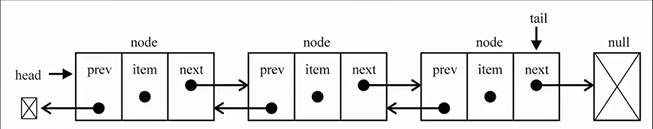

# 数组的缺点

- **连续的内存空间**，大部分编程语言的数组大小固定，当不能满足容量需求时，需要**扩容**，而扩容是非常**消耗性能**
- 在头部或中间**插入数据**，需要进行大量**元素的位移**

# 链表的出现

## 优点

相对于数组，链表有一些**优点**：

- 内存空间**不必连续**~，灵活
- 不用创建时确定大小
- **插入和删除**，时间复杂度可以达到O（1）

## 缺点

而对于数组，链表也有一些**缺点**：

- 访问任何一个元素，都需要**从头开始**

## 总结

| 侧重查询       | 选数组 |
| -------------- | ------ |
| 侧重插入和删除 | 选链表 |

链表和火车的结构非常相似~

# 封装一个链表结构的类

## 单向链表

### 属性

- head
- length
- node的data
- node的next

```js
function LinkedList() {
  // 属性
  this.head = null
  this.length = 0
  // 内部类 节点
  function Node(data) {
    this.data = data
    this.next = null
  }
}
```

### 常见操作

#### append**追加**

1. 创建新节点
2. 添加的是第一个节点？
3. 找出最后节点
4. 长度+1

```js
LinkedList.prototype.append = function (data) {
    // 创建新节点
    const newNode = new Node(data)
    // 添加的是第一个节点？
    if (this.length === 0) {
      this.head = newNode
    } else {                  // 不是 
      // 找出最后节点
      let last = this.head
      while (last.next) {
        last = last.next
      }
      // 最后节点指向新加节点
      last.next = newNode
    }
    // 长度+1
    this.length += 1
    
  }
```

#### **toString**

```js
LinkedList.prototype.toString = function (params) {
    let current = this.head
    let res = ''

    // 遍历节点
    while (current) {
      res += current.data + ' '
      current = current.next
    }

    return res
  }
```

**测试**

```
const list = new LinkedList()

list.append('abc')
list.append('abb')
list.append('ccc')

console.log(list)
```

#### insert插入

- position越界判断
- 根据data创建新节点
- case
- 长度+1

```js
LinkedList.prototype.insert = function (position, data) {
    // position越界判断
    if (position < 0 || position > this.length) {
      return false
    }

    // 根据data创建新节点
    const newNode = new Node(data)

    // case1 插入position = 0 的位置
    if (position === 0) {
      newNode.next = this.head
      this.head = newNode
    } else { // case2 插入position > 1 的位置
      // 找到位置
      let index = 0
      // 记录目标节点
      let current = this.head
      // 记录目标节点的上一个节点
      let previous = null
      while (index++ < position) {
        previous = current
        current = current.next
      }

      newNode.next = current
      previous.next = newNode
    }
    // 长度+1
    this.length += 1

    return true
  }
```

其中，插入到最后的情况，case2已经包含，而且，要是想插入到最后，用**append**呗

**测试**

```js
// 测试
const list = new LinkedList()
// append
list.append('abc')
list.append('abb')
list.append('ccc')

// insert
list.insert(0, 'zsf')
list.insert(3, 'hhh')
list.insert(100, 'lll')

console.log(list)
```


#### get

1. position越界判断，=也不行
2. 获取data

```js
LinkedList.prototype.get = function (position) {
    // position越界判断，=也不行
    if (position < 0 || position >= this.length) {
      return null
    }

    // 获取data
    let current = this.head
    let index = 0
    while (index++ < position) {
      current = current.next
    }

    return current.data
  }
```

**测试**

```js
const list = new LinkedList()
// append
list.append('abc')
list.append('abb')
list.append('ccc')

// insert
list.insert(0, 'zsf')
list.insert(3, 'hhh')
list.insert(100, 'lll')

// get
console.log(list.get(0))
console.log(list.get(2))
console.log(list.get(9))


console.log(list)
```

#### indexOf

```js
LinkedList.prototype.indexOf = function (data) {
    let current = this.head
    let index = 0

    while (current) {
      if (current.data === data) {
        return index
      }
      current = current.next
      index += 1
    }

    return -1
  }
```

**测试**

```js

const list = new LinkedList()

console.log(list.indexOf('zsf'))
console.log(list.indexOf('hhh'))
console.log(list.indexOf('ll'))
```

#### update

- position越界判断，=也不行
- 找到目标节点

```js
LinkedList.prototype.update = function (position, data) {
    // position越界判断，=也不行
    if (position < 0 || position >= this.length) {
      return false
    }
    // 找到目标节点
    let current = this.head
    let index = 0
    while (index++ < position) {
      current = current.next
    }

    current.data = data
    return true
  }
```

**测试**

```js
const list = new LinkedList()
console.log(list.update(0, 'hhh'))
```

#### removeAt

position越界判断，=也不行

1. 第一个节点？
2. 目标节点的上一个节点
3. 长度-1

```js
LinkedList.prototype.removeAt = function (position) {
    // position越界判断，=也不行
    if (position < 0 || position >= this.length) {
      return null
    }

    // 第一个节点？
    // 目标节点
    let current = this.head
    if (position === 0) {
      this.head = this.head.next
    } else {
      // 目标节点的上一个节点
      let previous = null
      let index = 0
      while (index++ < position) {
        previous = current
        current = current.next
      }

      previous.next = current.next
    }
    // 长度-1
    this.length -= 1

    return current.data
  }
```

**测试**

```js
const list = new LinkedList()
console.log(list.removeAt(0))
```

#### remove

1. 根据data获取位置
2. 根据位置删除

```js
LinkedList.prototype.remove = function (data) {
    // 根据data获取位置
    const position = this.indexOf(data)
    // 根据位置删除
    return this.removeAt(position)
  }
```

**测试**

```js
const list = new LinkedList()
console.log(list.remove('abc'))
```

#### isEmpty

```js
LinkedList.prototype.isEmpty = function () {
    return this.length === 0
  }
```


#### size

```js
LinkedList.prototype.size = function () {
    return this.length
  }
```

## 双向链表

单向链表有个明显的**不足**：

**回到前一个节点**

相对于单向链表，双向也有一些**缺点**：

- **插入/删除**某个节点，要处理**4个引用**
- 一个节点**内存空间**更大



### 属性

- head
- tail
- length
- node的data
- node的prev
- node的next

```js
function DoublyLinkedList() {
  // 属性
  this.head = null
  this.tail = null
  this.length = 0
  // 内部类 节点
  function Node(data) {
    this.data = data
    this.prev = null
    this.next = null
  }
}
```

### 常见操作

#### append

```js
DoublyLinkedList.prototype.append = function (data) {
    // 创建新节点
    const newNode = new Node(data)
    // 添加的是第一个节点？
    if (this.length === 0) {
      this.head = newNode
      this.tail = newNode
    } else {                  // 不是 
      newNode.prev = this.tail
      this.tail.next = newNode
      this.tail = newNode
    }
    // 长度+1
    this.length += 1
  }
```

#### insert

```js
DoublyLinkedList.prototype.insert = function (position, data) {
    // position越界判断
    if (position < 0 || position > this.length) {
      return false
    }

    // 根据data创建新节点
    const newNode = new Node(data)

    // case1 原来链表是否为空
    if (this.length === 0) {
      this.head = newNode
      this.tail = newNode
    } else { 
      // case2 插入position = 0 的位置
      if (position === 0) {
        this.head.prev = newNode
        newNode.next = this.head
        this.head = newNode
      } else if (position === this.length) {
        // case3 插入position = this.length 的位置
        newNode.prev = this.tail
        this.tail.next = newNode
        this.tail = newNode
      } else {
        let current = this.head
        let index = 0
        // 找到目标节点
        while (index++ < position) {
          current = current.next
        }
        newNode.next = current
        newNode.prev = current.prev
        current.prev.next = newNode
        current.prev = newNode
      }
    }
    // 长度+1
    this.length += 1

    return true
  }
```


#### backward\forward

```js
// backward向后遍历
  DoublyLinkedList.prototype.backward = function (params) {
    let current = this.head
    while (current) {
      current = current.next
    }
    return current
  }
  // forward
  DoublyLinkedList.prototype.forward = function (params) {
    let current = this.tail
    while (current) {
      current = current.prev
    }
    return current
  }
```

其它方法类似，就是比单向链表修改多个指向
