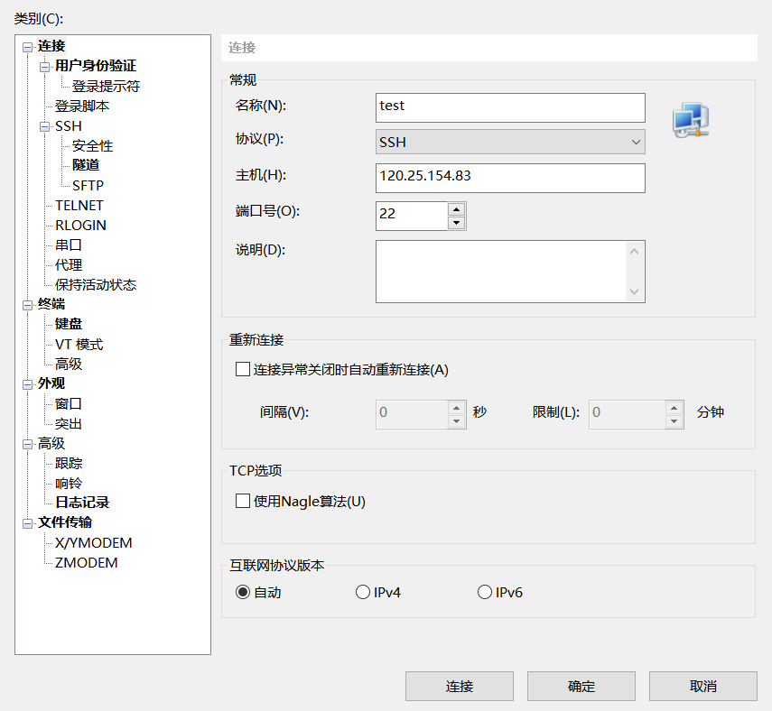
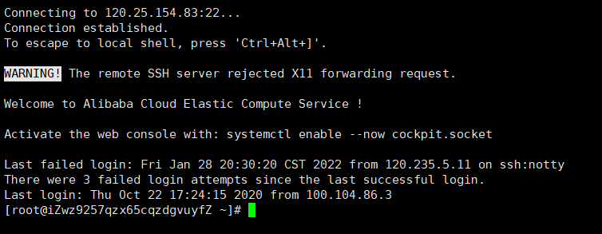
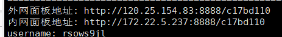
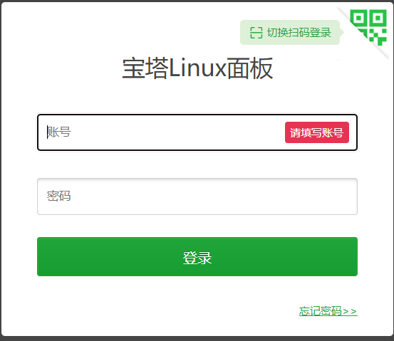
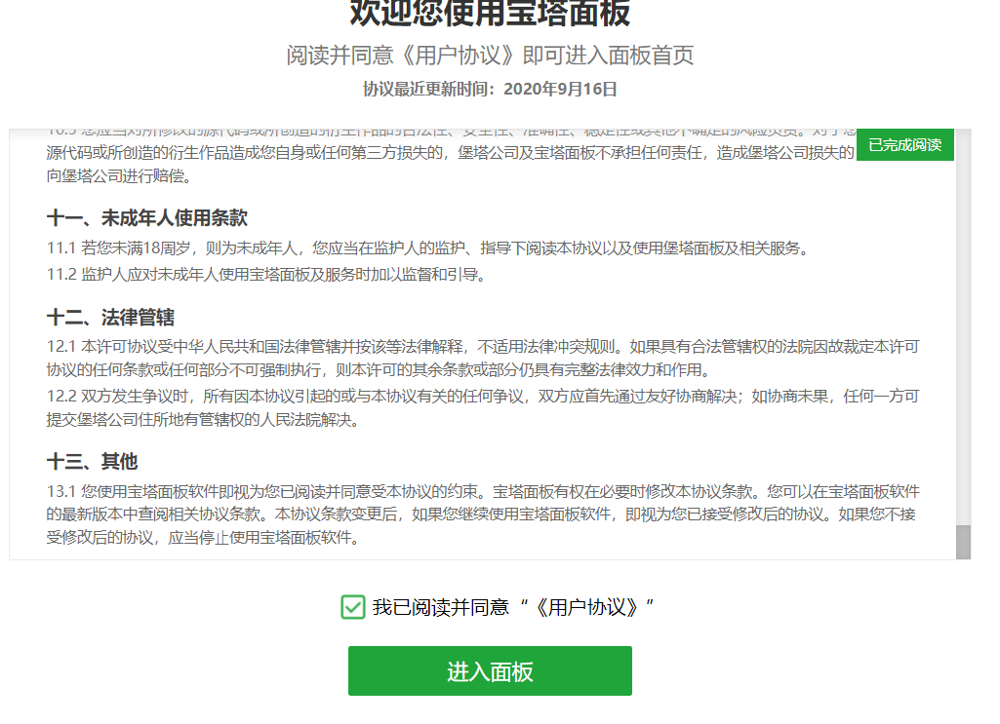
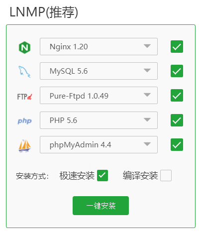
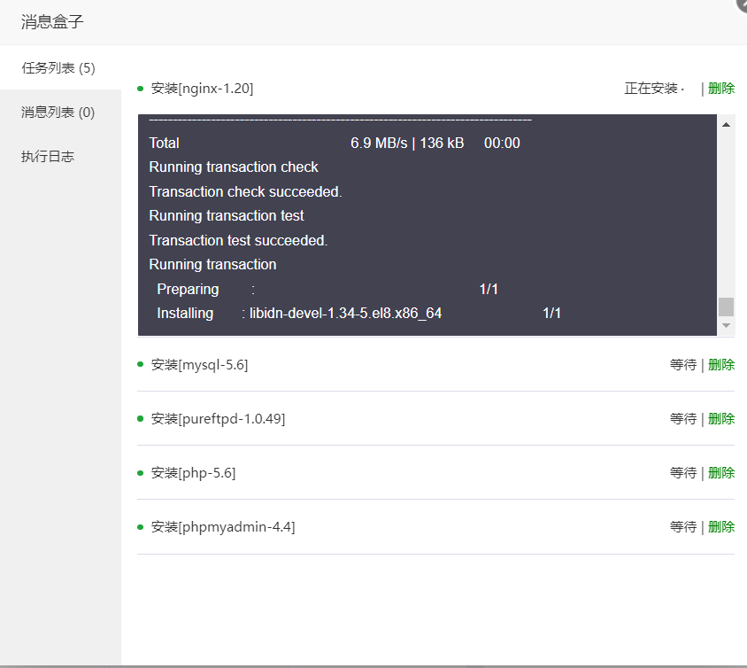
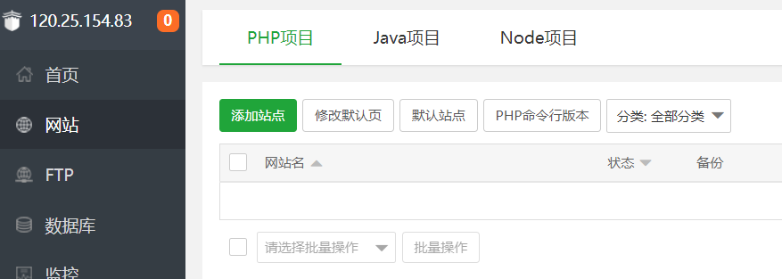
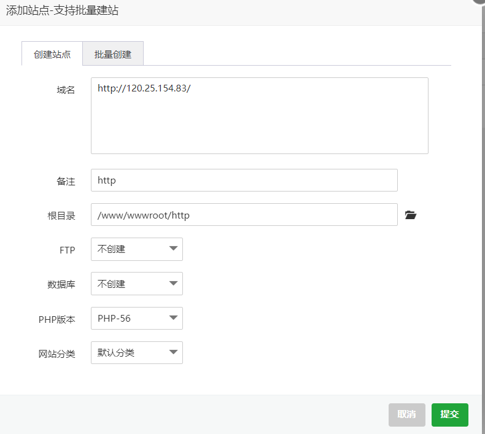
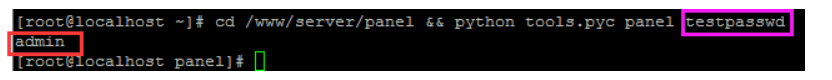

# 借助宝塔

## 安装x-shell

## 公网ip

复制云服务器的公网ip

例 `120.25.154.83`

## 进入x-shell

### 新建回话

将公网ip复制到 **主机**



点击确定

之后会提示输入管理服务器的用户名和密码

成功新建会有#



## 浏览器百度‘宝塔’

进入宝塔命令大全

复制 `yum install -y wget && wget -O install.sh http://download.bt.cn/install/install_6.0.sh && sh install.sh` （我的云服务器是centos）

到x-shell会话那里粘贴

等待一会

## 浏览器打开

复制外网面板地址 `http://120.25.154.83:8888/c17bd110` 到浏览器打开



### 复制username和password

到



### 滑到底，勾选



登陆宝塔账号顺便绑定

### 一键安装



等待安装完成



### 点击‘网站’

添加站点



把这个ip地址 `http://120.25.154.83/` 当做域名

**没有反斜杠/**



### 点击‘文件’

找到http目录

删除该目录下的文件

将开发好的前端代码（dist文件夹）上传

### 上传目录

将dist目录的文件都剪切到http根目录下


如果要上传后端代码和数据库文件

往 https://www.bilibili.com/video/BV1aV411n7SH

观看

## x-shell重置宝塔账号密码

把命令最后面的   “testpasswd”  替换成你要改的新密码

**注：若是debian/ubuntu用户，请使用有root权限的账户去执行这条命令**

` cd /www/server/panel && python tools.py panel testpasswd`

紫框即你要修改的密码
红框即面板账户



重新登陆时

- 账号-admin
- 密码-testpassword

如果提示多次登录失败，暂时禁止登录 请输入以下命令 清除登录限制

`rm -f /www/server/panel/data/*.login`

# 自动化部署

## 4.1 传统开发模式

1. code
2. build
3. test
4. release
5. operate

线上bug隐患，当线上出现bug时，所有环节都需要加班；

## 4.2 DevOps开发模式

某个模块写完就可以build，**持续集成**和**持续交付**；

开发完**代码**会放进**代码仓库**，然后一个**服务器**会**自动构建并部署**代码，当**测试**出现问题后，会**反馈**回开发；

## 4.3 自动化部署流程

1. 本地开发
2. 代码仓库
3. Jenkins服务器（安装java环境，node环境等等）
4. 创建任务（隔段时间**拉下代码并构建后发布**）
5. 测试就可以在测试服务器上访问项目，用户在线上服务器上访问项目

## 4.4 服务器环境安装

### **远程连接服务器**

在云服务器打开终端，执行命令

```
ssh 用户名@公网ip
```

接着输入密码即可

### **安装Jenkins环境**

由于Jenkins是依赖java的，所以先安装java环境；

先做一个搜索

```
dnf search java-1.8
```

#### **安装**java环境

```
dnf install java-1.8.0-openjdk.x86_64
```

安装完成后执行命令，检验安装是否成功

```
java
```

#### **安装Jenkins**

搜索发现是python的，不是这个；

需要先下载，执行命令（参数-O是大写）

```
wget -O /etc/yum.repos.d/jenkins.repo http://pkg.jenkins-ci.org/redhat-stable/jenkins.repo
```

如果没有下载到**/etc/yum.repos.d/**下，需要移动到那里，在**jenkin.repo文件**目录下执行命令

```
mv jenkins.repo /etc/yum.repos.d/
```

可以使用 `cd /etc/yum.repos.d/` 命令移动工作目录

然后使用 `ls` 命令列出该目录下所有文件，查看是否有**jenkins.repo**

##### **导入密钥**

有了jenkins.repo文件，使用dnf命令就可以安装了；

不过linux操作系统会进行一些验证，确保软件合法；

先导入密钥以确保需下载的软件合法，在**jenkin.repo文件**目录下执行命令

```
rpm --import https://pkg.jenkins.io/redhat/jenkins.io.key
```

##### **编辑jenkins.repo**

如果不能安装，那下载的jenkins.repo可能有点问题，需要编辑，在**jenkin.repo文件**目录下执行命令

```
vi jenkins.repo
```

然后点击 **i** 进入编辑模式；

删除baseurl的值后面的 **-stable**；

然后按esc退出编辑模式；

接着同时按 **shift 和 :** ，左下角出现冒号，输入 **wq** 保存；

##### 安装

在**jenkin.repo文件**目录下执行命令

```
dnf install jenkins
```

### 启动jenkins

需要启动jenkins，在**jenkin.repo文件**目录下执行命令

```
systemctl start jenkins
```

执行 **systemctl status jenkins** 查看状态

### 设置jenkins自启动

如果不想手动启动jenkins，可以在**jenkin.repo文件**目录下执行命令

```
systemctl enable jenkins
```

### jenkins图形化界面

jenkins启动后开启一个服务，默认在服务器的8080端口；

但是在防火墙（安全组）并没有允许访问**8080**端口，需要手动添加；

浏览器输入网址 **服务器的公网ip:8080** 进入；

执行 `cat /var/lib/jenkins/secrets/initialAdminPassword` 获取管理员密码；

图形化界面需要这段**密码**；

然后安装**推荐的插件**；

创建一个jenkins**管理员用户**；

### 安装Nginx

Nginx是一个高性能的web服务器，可以配置负载均衡和高并发等等；

执行命令 `dnf install nginx`

### 启动nginx

执行命令 `systemctl start nginx` 启动;

执行命令 `systemctl status nginx` 查看**启动状态**;

执行命令 `systemctl enable nginx` 设置nginx随着操作系统启动而启动;


### 配置nginx

执行 `cd ~` 回到**根目录**；

执行 `mkdir mail_cms` 创建mail_cms**目录**;

执行 `cd mail_cms` 移动到该目录下；

执行 `touch index.html` 创建**index.html**文件;

这样，访问nginx的默认页面替换成index.html；

同理，访问nginx的默认页面可以替换成打包后项目的index.html，需要进行一些配置;

可以执行 `vi /etc/nginx/nginx.conf` 编辑nginx的配置文件；

修改完nginx配置后，执行以下两条命令（第三条尽量不要，如果配置错误可能更长时间等待，严重会宕机）

```
nginx -t # 检验配置是否正确
nginx -s reload # 重新加载配置
service nginx restart # 
```

nginx其它常用命令

```
启动nignx：$ service nginx start
停止nignx：$ service nginx stop
```

服务器端口常用命令

```
查看端口是否可访问：telnet ip 端口号
开放的端口位于/etc/sysconfig/iptables中
查看时通过 cat  /etc/sysconfig/iptables 命令查看

使用netstat列出当前开放的所有端口，不限协议（可以是TCP和UDP）
netstat -lntu
```

防止终端修改文件出错，可以使用vscode修改远程文件；

打包压缩后，nginx的配置注意处理匹配资源文件

```
server
    {
        listen 888;
        server_name 120.25.154.83;
        #index index.html index.htm index.php;
        # root  /www/server/phpmyadmin;
            location ~ /tmp/ {
                return 403;
            }

        #error_page   404   /404.html;
        include enable-php.conf;

        location / {
               root project/admin;
               index index.html;
        }

        location ~ .*\.(gif|jpg|jpeg|png|bmp|swf|ico)$
        {
            root project/admin;
            expires      30d;
        }

        location ~ .*\.(js|css)?$
        {
            root project/admin;
            expires      12h;
        }

        location ~ /\.
        {
            deny all;
        }
        access_log  /www/wwwlogs/access.log;
}
```


#### vscode连接远程服务器

安装vscode插件 **Remote-SSH**；

然后在vscode左侧有对应的图标，点击，+号，输入 `root@公网ip`；

接着输入**密码**，连接成功后vscode左下角有公网ip，点击，然后打开文件夹，剩下的操作就是找你要修改的文件；

找到/etc/nginx/下的**nginx.conf**文件，修改内容；

用户要改变，使用root用户

```
user root;
```

修改代理访问的默认路径，server内容里注释掉它的默认访问路径

```
# root /usr/share/nginx/html;
```

location那部分修改为(这个路径就是你放项目的路径)

```
location / {
	root /root/mall_cms;
	index index.html;
}
```

#### 重启nginx

修改完配置重启，执行 `systemctl restart nginx`

## 4.5 创建jenkins任务

新建freestyle project类型的任务；

还需要在服务器上安装git，执行 `dnf install git`；

填写远程仓库地址、认证；

github个人信息那里生成token（新规密码认证已经不行了）；

选择分支；

构建触发器，选定时构建，日程表五位分表代：分 时 天  月 周；

```
H/30****
表示每30分钟构建一次
```

构建环境，在此之前，Jenkins添加nodeJS插件，添加全局配置，保存后即可安装nodejs；

接着配置jenkins任务，构建环境那一项多出node那一栏，选上；

构建那一栏，选shell脚本，内容如下

```
npm install
npm run build
echo '构建完成'
rm -rf /root/mail_cms/* # 清一下
mv -rf ./dist/* /root/mail_cms/ # 递归移动dist目录下的文件到/root/mail_cms/
```

保存，以上操作一个任务已经创建了，点击立即构建就可以立即构建；


移动文件操作时，jenkins可能没有权限，需要配置一下；

在/etc/sysconfig/下找到**jenkins文件**，编辑，修改成这样，保存；

```
JENKINS_USER="root"
```

执行 `systemctl restart jenkins` 重启jenkins


生成文件树的命令，需要用到tree工具，没有自行百度下载

```
tree -I "node_modules" # 忽略文件夹
```

# 我的远程服务器

项目位于**www/sever/nginx/project**

配置文件位于**www/sever/nginx/conf/nginx.conf**

可用xftp传输文件

