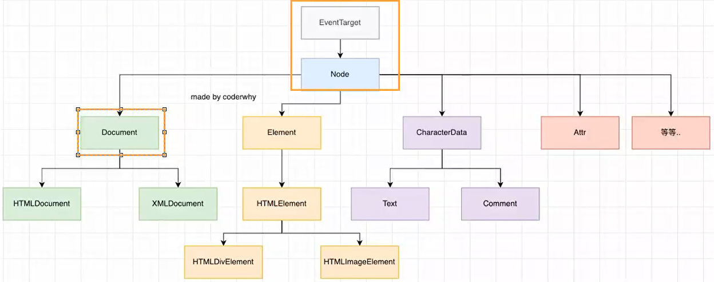

# 1 BOM

## 1.1 浏览器对象模型

Browser Object Model，BOM

BOM，连接**js和浏览器窗口**的**桥梁**。

## 1.2 主要的对象模型

- window
- location
- history
- document

### window

**全局属性、方法**以及**控制浏览器窗口**相关的属性，方法

#### 两个身份

- 全局对象
- 浏览器窗口对象

**window对象**由**Window**这个类**创建**，而**Window**类**继承**自**EventTarget**

所以window对象也有一下方法：

- addEventListener
- removeEventListener
- dispatchEventListener

查看：MDN文档~

#### 常见属性

查文档~

#### 常见方法

MDN~ 

#### 常见事件

| onload              | 资源加载完毕       |                |
| ------------------- | ------------------ | -------------- |
| onfocus             | 获取焦点           |                |
| onblur              | 失去焦点           |                |
| onhashchange        | 链接hash值发生改变 | 前端路由       |
| addEventListener    |                    |                |
| removeEventListener |                    |                |
| dispatchEvent       | 派发               | 参数传事件类型 |

### location

浏览器连接到的对象的位置URL

### 常见属性、方法

window.location打印自己看~

#### history

操作浏览器的历史

MDN~

#### document

当前窗口操作文档的对象

# 2 DOM

Document Object Model

## 2.1 架构(继承关系)

**前端渲染**

从服务器请求到的数据生成相应的html，然后再交给浏览器渲染

## 2.2 document

### 常见属性

- head
- title
- body
- children[]
- location

### 常见方法

| 创建元素   | createElement             |                                                              |
| ---------- | ------------------------- | ------------------------------------------------------------ |
| 添加子元素 | appendChild               | 注意：document不能使用该方法添加子元素（不知道要在哪里添加）document.body.appendChild才可以 |
| 获取元素   | getElementBy...（少用啦） | Id、TagName                                                  |
|            | querySelector             | 获取第一个                                                   |
|            | querySelectorAll          | 获取全部                                                     |

## 2.3 Element

### 常见属性

- id
- tagName
- children
- className
- ...

### 常见方法

特有

| getAttribute | 获取属性 |      |
| ------------ | -------- | ---- |
| setAttribute | 设置属性 |      |

