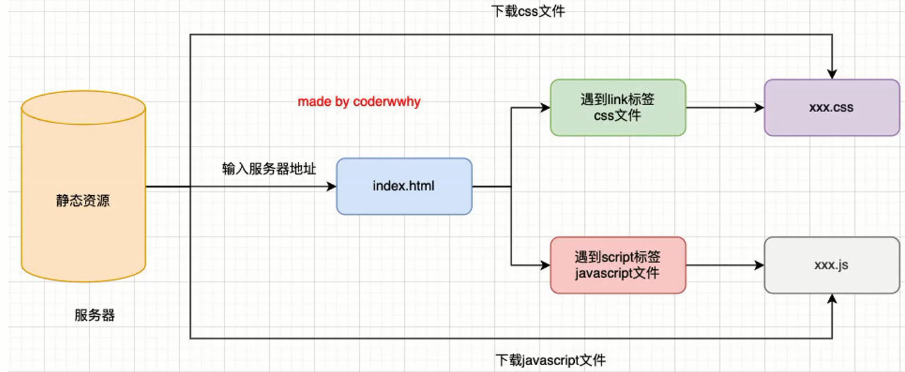
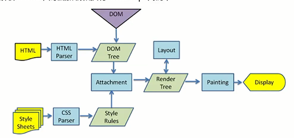

# 浏览器工作原理

js代码在浏览器中是如何被执行的呢？

1.在浏览器输入一个网站链接，会经过**dns域名解析**转换成**IP地址**，ip地址一般是**服务器地址**;

2.进入服务器地址之后，**服务器**一般会返回**index.html**;

3.**浏览器**从**index.html**解析到的**css文件和js文件**都会从服务器**下载**下来;

## 浏览器内核

浏览器内核会将html、css、js解析，渲染成网页

- **Geoko**：早期，现在很少了
- **Trident**：edge之前使用，现在edge已经转向Blink了
- **Webkit**： 苹果开发，之前谷歌浏览器也在使用
- **Blink**：Webkit的一个分支，谷歌开发，目前应用于谷歌浏览器、Edge、Opera

浏览器内核也会**影响兼容性**

实际上**浏览器内核**就是浏览器的**排版引擎**，也叫**浏览器引擎**、**页面渲染引擎**

## 浏览器渲染过程

在**DOM变成DOM树**这个过程，html解析的时候**遇到js标签**，应该怎么办呢？

会**停止解析html**，而去**加载和执行js代码**;

**那js代码由谁来执行呢？**;

**js引擎**

## js引擎

**为什么需要js引擎呢？**

**js**是一门**高级编程语言**;

**高级编程语言**都是需要转化成**机器指令**来执行的;

**js代码**无论是交给**浏览器**和**node**执行，最后都是需要被**cpu**执行的;

但是**cpu**只认识自己的**指令集**，也就是**机器指令**;

所以需要**js引擎**将**js代码**转换成**cpu指令**;

**那有哪些常见的js引擎呢？**

- spiderMonkey：第一款js引擎
- Chakra
- JavaScriptCore：webkit中的js引擎
- v8：谷歌开发的强大js引擎，（c++编写）
- ...

## 浏览器内核和js引擎的关系

以webkit为例，它由两部分组成

- webcore：负责html解析、布局、渲染等工作
- JavaScriptcore：解析执行js代码

js代码生成的抽象语法树网站：[astexplorer.net]()

## v8引擎原理

js代码-->ast(抽象语法树)-->字节码-->机器指令

其中字节码的存在是为了**跨平台**和**收集热函数**;

什么叫**热函数**？**执行次数比较多**的函数;

将执行次数多的函数**直接**转换成**机器指令**放到字节码里，就不用每次都是**字节码变机器指令**，提升性能;

## 预解析

**并不是所有**就是代码一开始就会被执行，如果对**所有的js代码进行解析**会影响网页的**运行效率**

v8引擎实现了Lazy Parsing**延迟解析**的方案，它的作用是将**不必要的函数进行预解析**;

在也就是解析暂时需要的内容，而**对函数的全量解析**是**函数被调用时**才会进行;

