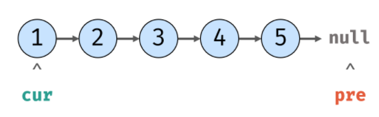
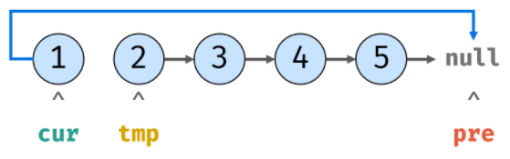
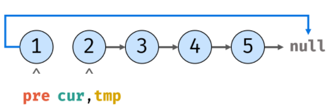
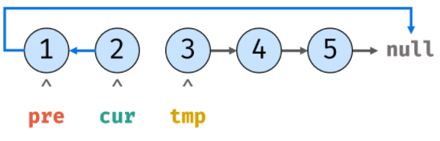
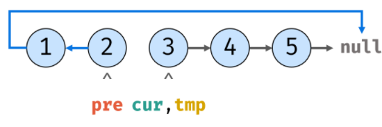
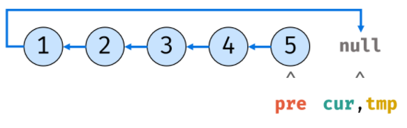
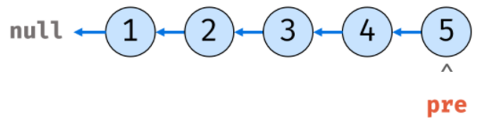
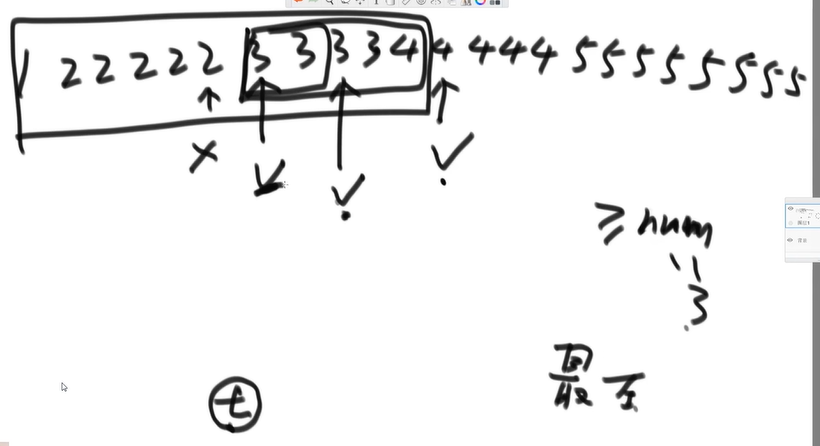

# 链表、数组

## 反转一个单链表

```js
/**
 * Definition for singly-linked list.
 * function ListNode(val) {
 *     this.val = val;
 *     this.next = null;
 * }
 */
/**
 * @param {ListNode} head
 * @return {ListNode}
 */
var reverseList = function(head) {
    let temp = null
    let pre = null
    let cur = head
    while(cur) {
        cur = head.next
        head.next = pre
        prev = head
        head = p
    }

    return pre
};
```

**示例**

```
输入: 1->2->3->4->5->NULL
输出: 5->4->3->2->1->NULL
```

**复盘：**

**时间复杂度 O(N)**：遍历链表使用线性大小时间。

**空间复杂度O(1)**：变量 pre 、temp、cur 使用常数大小额外空间。

1.pre指向null，cur指向头节点

```js
pre = null
cur = head
```



2.暂存后继节点，修改引用指向

```js
temp = cur.next
cur.next = pre
```



3.暂存当前节点，访问下一节点

```js
pre = cur
cur = temp
```



4.循环第2~3步

```js
temp = cur.next
cur.next = pre
pre = cur
cur = temp
```





5.循环到最后两步，cur、temp回收，返回pre是新的头节点





# 排序

## 选择排序

找最小，放开头；

剩下找最小，放剩下开头，重复这步；

### 案例 **[2, 3, 5, 4, 1]**

第一轮 13542

第二轮 12543

第三轮 12453 12354

第四轮 12345

### 代码

```js
/*
 * @Description: 选择排序
 * @Author: SiFeng Zhai
 * @Date: 2022-09-26 19:04:25
 * @LastEditors: SiFeng Zhai
 * @LastEditTime: 2022-09-26 19:19:24
 */
function selectionSort(arr) {
  // 边界
  if (arr === undefined || arr.length < 2) {
    return arr
  }
  for (let i = 0; i < arr.length - 1; i++) {
    let minIndex = i
    for (let j = i + 1; j < arr.length; j++) {
      // 一轮比较，更新最小下标
      minIndex = arr[j] < arr[minIndex] ? j : minIndex 
    }
    swap(arr, i, minIndex)
  }
  return arr
}

function swap(arr, i, j) {
  let temp = arr[i]
  arr[i] = arr[j]
  arr[j] = temp
}
// 测试
const arr1 = [2, 3, 5, 4, 1]
console.log(selectionSort(arr1))
```

## 冒泡排序

找最大，放尾部

剩下找最大，放剩下尾部，重复

### 案例 **[2, 3, 5, 4, 1]**

第一轮 23415

第二轮 23145

第三轮 21345

第四轮 12345

### 代码

```js
/*
 * @Description: 冒泡排序
 * @Author: SiFeng Zhai
 * @Date: 2022-09-26 19:32:47
 * @LastEditors: SiFeng Zhai
 * @LastEditTime: 2022-09-26 19:49:25
 */
function bubbleSort(arr) {
  // 边界
  if (arr === undefined || arr.length < 2) {
    return arr
  }
  for (let i = arr.length; i > 0; i--) {
    for (let j = 0; j < i; j++) {
      if (arr[j] > arr[j + 1]) {
        swap(arr, j, j+1)
      }
      
    }
    
  }
  return arr
}
// function swap(arr, i, j) {
//   let temp = arr[i]
//   arr[i] = arr[j]
//   arr[j] = temp
// }
// 交换的另一种写法：异或(有个条件，两者内存要不一样，否则会被洗成0)
function swap(arr, i, j) {
  arr[i] = arr[i] ^ arr[j]
  arr[j] = arr[i] ^ arr[j]
  arr[i] = arr[i] ^ arr[j]
}
// 测试
const arr1 = [2, 3, 5, 4, 1]
console.log(bubbleSort(arr1))
```

## 插入排序

0~0想有序

0~1想有序

0~2想有序

...

0~n想有序

先排好一部分，当**新元素**进来时从**尾部**开始比较，找到合适位置插入；

```js
function swap(arr, i, j) {
  arr[i] = arr[i] ^ arr[j]
  arr[j] = arr[i] ^ arr[j]
  arr[i] = arr[i] ^ arr[j]
}
function insertSort(arr) {
  if (arr === null || arr.length < 2) {
    return arr
  }
  // 0~0、0~1、0~n想有序
  for (let i=1; i < arr.length; i++) {
    for(let j=i-1; j >= 0; j--) {
      // 插入元素比前一元素小时才会移动
      if (arr[j] > arr[j + 1]) {
        swap(arr, j, j+1)
      }
      
    }
  }
  return arr
}
// 测试数据 
const arr = [3, 2, 5, 4, 2, 3, 1]
console.log(insertSort(arr))
```


## 快速排序

1.拿到中间下标，并取到中间值

2.小于中间值放左边，大于放右边

3.递归1~2步，

4.当传入数组长度不足2时递归结束

5.获取到升序排序的数组

```js
const sortArray = function(nums) {
    // 边界
    if(nums.length <= 1) return nums
    // 中间下标
    const midIndex = Math.floor(nums.length/2)
    // 以中间为基准截取
    const midValue = nums.splice(midIndex, 1)[0]

    const left = []
    const right = []

    // 分类，大的放基准右边，小的放左边
    nums.forEach((item) => {
        if(item < midValue) {
            left.push(item)
        } else {
            right.push(item)
        }
    })

    // 递归+连接
    return [...sortArray(left), midValue, ...sortArray(right)]
}
```

当然你要是觉得上面花里胡哨，你也可以

```js
const sortArray = function(nums) {
    return nums.sort((a, b) => a - b)
}
```

# 贪心

## 算法思想

全局结果是局部结果的简单求和，且**局部结果互不相干**，因此局部最优的策略也同样是全局最优的策略。


## 455.分发饼干

有一群孩子和一堆饼干；

每个孩子有一个饥饿度；

每个饼干都有一个大小；

每个孩子只能吃 一个饼干；

且只有饼干的大小不小于孩子的饥饿度时，这个孩子才能吃饱；

求解最多有多少孩子 可以吃饱？

**题解**

因为**饥饿度最小**的孩子最容易吃饱，所以我们**先考虑**这个孩子；

给剩余孩子里**最小饥饿度**的孩子分配**最小的能饱腹**的饼干；

这样就能让**更多孩子**饱（体现贪心）；

满足了这个孩子之后，采取同样的策略，考虑剩下孩子里饥饿度最小的孩子，直到 **满足所有小孩**或者**分完所有饼干**；

```js
const findContentChildren = function(g, s) {
    // 饥饿度排升序
    g.sort((a, b) => a - b)
    // 饼干大小排升序
    s.sort((a, b) => a - b)
    let child = 0;
    let cookie = 0;
    // 当满足所有小孩或者分完所有饼干就结束
    while (child < g.length && cookie < s.length) {
        if ( g[child] <= s[cookie]) ++child
        ++cookie
    }
    return child
}
```

## 135.分发糖果

一群孩子站成一排；

每个孩子**至少**分配到 **1** 个糖果；

**相邻**两个孩子评分**更高**的孩子会获得**更多**的糖果；

需要准备的最少糖果数目？

**题解**

两次遍历即可；

每个孩子糖果数初识化为1；

从**左到右**遍历一次，当评分**大于左边**就加糖果；

从**右到左**遍历一次，当评分**大于右边**就加糖果；

每次遍历只考虑相邻**一侧** （体现贪心）

注意：从**右到左**的过程，**相邻差距2**就不用赋比相邻大1的值，**使用原来的**即可，反之赋比相邻大1的值

比如 评分 **[1,3,4,5,2]** 糖果数 **[1,2,3,4,1]**

如果只是简单的在相邻基础上糖果+1，那相邻的本来就很少（1），只是+1（2）会比不上另一侧相邻的（原本是4才符合）

```js
/**
 * @param {number[]} ratings
 * @return {number}
 */
const candy = function(ratings) {
    // 数组长度小于2
    if (ratings.length < 2) return 1;
    // 所有孩子糖果数初识值为1
    const num = [];
    for (let i=0; i< ratings.length; i++) {
        num[i] = 1
    }
    // 左到右
    for(let i=1; i < ratings.length; i++) {
        if(ratings[i] > ratings[i-1]) {
            num[i] = num[i-1] + 1
        }
    }
    // 右到左
    for(let i=ratings.length-1; i > 0; i--) {
        if(ratings[i] < ratings[i-1]) {
            // 如果相邻差距2就不用赋比相邻大1的值，使用原来的即可，反之赋比相邻大1的值
            num[i-1] = (num[i-1] > (num[i] + 1) ? num[i-1] : (num[i]+1))
        }
    }
    // 统计总数
    let result = num.reduce((preVal, item) => {
      return preVal + item  
    }, 0)
    return result
};
```

## 435.无重叠区间

给定多个区间；

计算让这些区间互不重叠所需要移除区间的最少个数()；

换句话说，就是在保证区间不重叠的情况下保留**更多的区间**；

起止相连不算重叠；

**题解**

选择的区间**结尾越小**，**余留**给其它区间的**空间越大**，就越能**保留更多**的区间（体现贪心）;

先把区间按照**结尾的大小**进行**增序排序**，每次选择**结尾最小**且和前一个选择的区间**不重叠**的区间;

实时维护区间尾tail;

如果区间**不重叠则移动tail**，重叠则不移动（永远以合适的区间尾当做尾，不然不合适的区间会干扰区间尾）;

```js
/**
 * @param {number[][]} intervals
 * @return {number}
 */
const eraseOverlapIntervals = function(intervals) {
    // 边缘1
    if(!intervals.length) return 0

    // 根据区间尾排升序
    intervals.sort((a, b) => a[1] - b[1])

    // 实时维护区间尾tail
    let tail = intervals[0][1]
    // 记录不重叠区间个数,第一个一定有效
    let num = 1
    for(let i=1; i < intervals.length; i++) {
        // 如果上一个区间尾小于等于下一个区间头，表示不重叠
        if(tail <= intervals[i][0]) {
            num++
            // 如果区间不重叠则移动tail，重叠则不移动，换下一个比较
            tail = intervals[i][1]
        }
        
    }
    return intervals.length - num 
};
```

## 剑指019.最多删除一个字符得到回文

**题解**

```js
/**
 * @param {string} s
 * @return {boolean}
 */
const validPalindrome = function(s) {
    // 开头和结尾
    let start = 0
    let end = s.length - 1
    const foo = (left, right) => {
        for(let i=left, j=right; i < j; i++, j--) {
            if(s[i] !== s[j]) return false
        }
        return true
    }
    while(start < end) { // 如果相等，start+1，end-1
        if(s[start] === s[end]) {
            start++
            end--
        } else { // 如果不等，start+1或end-1后继续靠拢
            return foo(start+1, end) || foo(start, end-1)
        }
    }
    return true
};
```

# 位运算

一个数组有一个元素出现奇数次，其它元素出现偶数次，找出这个数

```js
function findOddTimesNum(arr) {
  let eor = 0
  arr.map((item) => {
    eor ^= item
  })
  return eor
}
// 测试
const arr1 = [1, 1, 2, 2, 3]
console.log(findOddTimesNum(arr1))
```

一个数组有两个元素出现奇数次，其它元素出现偶数次，找出这两个数

```js
function findOddTimesNum(arr) {
  let eor = 0
  arr.map((item) => {
    eor ^= item
  })
  //假设这两个出现奇次元素为ab，那 eor = a ^ b，且a!=b
  // eor != 0，异或也可以看成是无进位相加
  // eor的二进制必然有一个位置是1,假设该位置第3位
  // 隐藏条件：该数组分成了两类数，一是元素二进制数的第3位是1的，二是二进制数的第3位不是1的，并且a和b分别在两边
  const rightOne = eor & (~eor + 1) // 取出eor二进制数最右的1
  let onlyOne = 0 // eor'
  arr.map((item) => {
    if ((item & rightOne) === 1) { // 将a或b的同类异或掉，只剩下a或b
      onlyOne ^= item // 这样异或下来会得出a或者b,再异或eor就可以得到另一个
    }
  })
  console.log(onlyOne, eor ^ onlyOne)
}
// 测试
const arr1 = [1, 1, 2, 2, 3, 4]
findOddTimesNum(arr1)
```

# 二分法

**在一个有序数组中，找某个数是否存在**

常规解法：遍历一次，逐个比较，O(N)

高效解法：二分法，取中间的数作比较，这样可以缩小一半范围，每次缩小一半O(log2N)

**在一个有序数组中，找>=某个数最左侧的位置**



同样可以二分，用t记录该位置，不断刷新t到最后就是最左侧，O(log2N)

**局部最小值问题**

**在一个无序数组中（相邻的两个元素一定不相等），求一个局部最小的位置**

可以将元素转化成**折线图**，**较低点**就是局部最小；

从中间开始，和附近两元素比较是否是局部最小，若是，则返回位置；

若不是，那0到中间必存在局部最小，同样从这段区间中间开始找；

重复下去，一定会找到局部最小；
