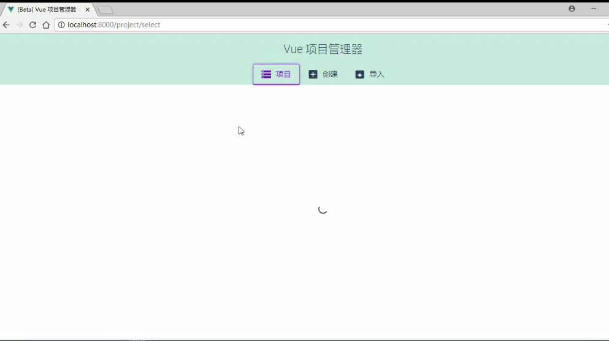
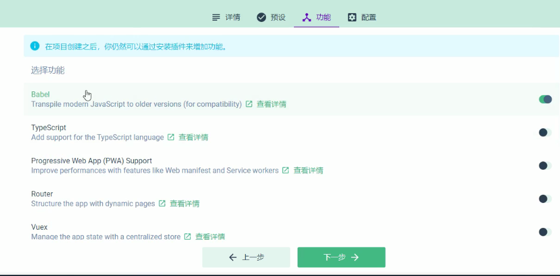
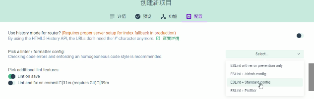

# 1.win+r进入命令行输入cmd

# 2.输入vue ui回车




# 3.创建项目并选择存放路径

选好点击“在此创建”


# 4.设置项目信息

项目名称（必须英文）

Git 那一栏写

```
init project
```


下一步

# 5.预设

如果以前有创建过可以用

如果不想用就选手动


# 6.功能

选择一些主要的:

Babel

Router

Linter/Formatter

使用配置文件



# 7.配置

第二项选择standard.config

lint on save



