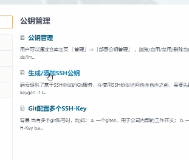
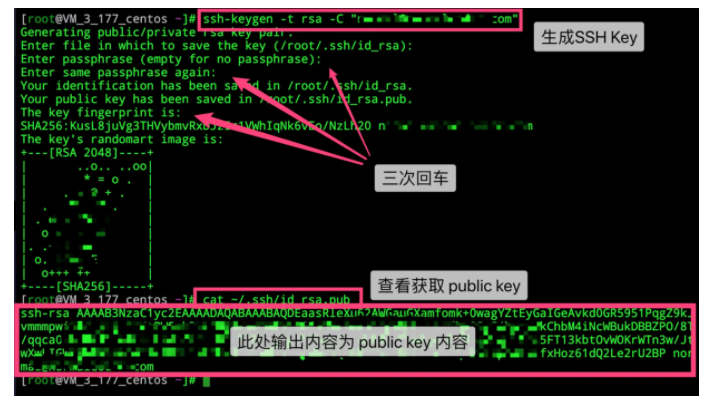

# 1.账号设置-->SSH公钥


只有这样才能上传和下载

# 2.生成公钥

公钥管理



命令行cmd

输入

```
ssh-keygen -t rsa -C "xxxxx@xxxxx.com" 
```

三次回车



**通过查看 `~/.ssh/id_rsa.pub` 文件内容，获取到你的 public key**

3.检验生成的公钥是否能使用

添加后，在终端（Terminal）中输入

```
ssh -T git@gitee.com
```

首次使用需要确认并添加主机到本机SSH可信列表。若返回 Hi XXX! You've successfully authenticated, but Gitee.com does not provide shell access. 内容，则证明添加成功。

再次在终端输入

```
ssh -T git@gitee.com
```

可查看公钥信息

