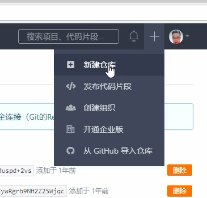
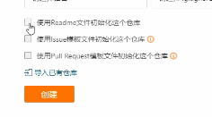
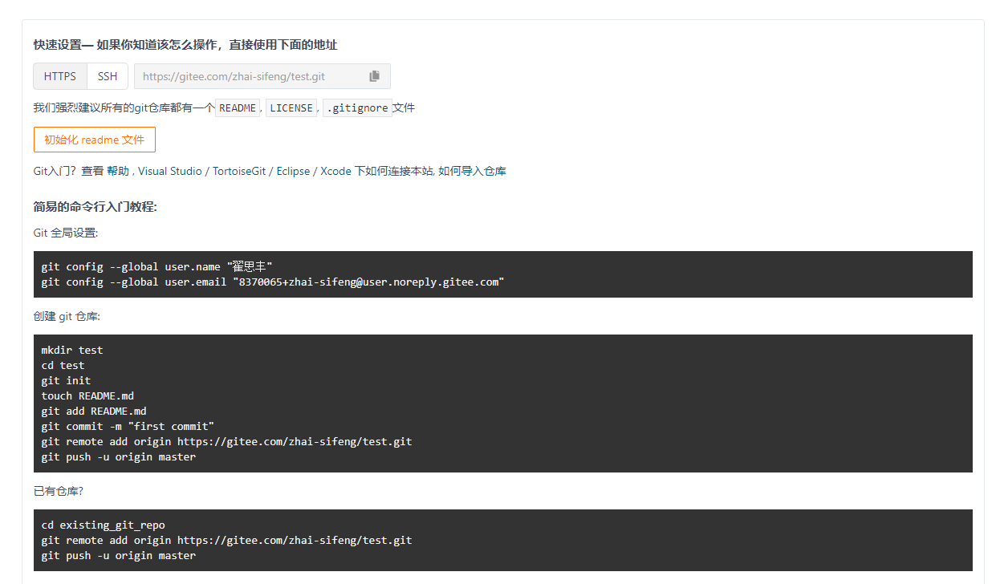
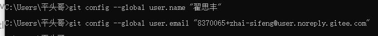
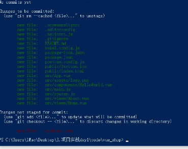
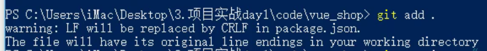
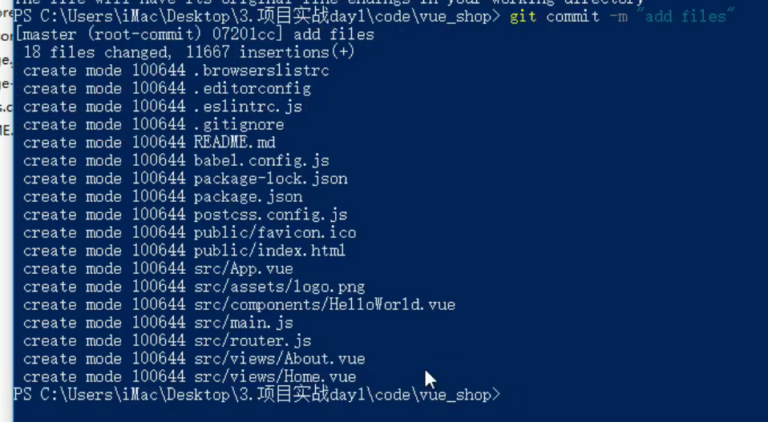
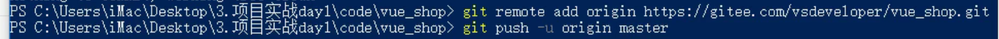
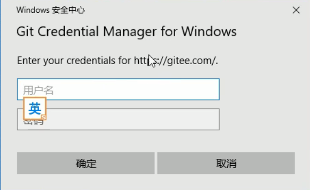

# 1.新建仓库



仓库名称（唯一）

去掉“使用ReadMe文件初始化这个仓库”



# 2.Git全局设置

创建仓库成功后

出现



命令行cmd

输入

```
git config --global user.name "翟思丰"
```

```
git config --global user.email "1482451437@qq.com"
```



# 3.找到项目所在文件夹，shift+右键打开命令行(本地操作)

输入

```
git init
```

**初始化项目**

```
git status
```

**查看项目状态**



然后输入

```
git add .
```

**添加项目所需文件**



接着输入

```
git commit -m "add files"
```



# 4.托管操作

在项目根目录下打开命令行

运行

```
git remote add origin https://gitee.com/zhai-sifeng/（仓库名）.git
//注意这行代码以创建仓库时给的代码为准
```

```
git push -u origin master
```

将本地仓库和云端仓库关联



接着弹出一个窗口



输入码云账号和密码即可（第一次）

第二次就不用了


完成

进码云可查询

