# 1.新建商品分类组件Cate.vue

在components文件夹下新建一个goods文件夹，并在该文件夹下新建一个文件Cate.vue

并初始化结构

```vue
<template>
    <div>
        <h3>商品分类组件页面</h3>
    </div>
</template>

<script>
export default {
    
}
</script>

<style lang="less" scoped>

</style>
```

在router.js中导入Cate.vue组件

而该组件属于Home.vue的子组件，路由规则处于home的子路由

```js
...
import Cate from './components/goods/Cate.vue'

...
const router = new Router({
  routes: [
    { path: '/', redirect: '/login' },
    { path: '/login', component: Login },
    {
      path: '/home',
      component: Home,
      redirect: '/welcome',
      children: [
        ...
        { path: '/categories', component: Cate }

      ]
    }
  ]
})
...
```

效果

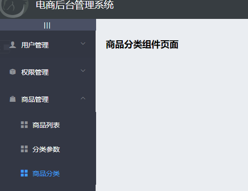

# 2.商品分类页面的基本布局

Cate.vue+

结构

```vue
<template>
    <div>
        <!-- 面包屑导航区域 -->
    <el-breadcrumb separator-class="el-icon-arrow-right">
        <el-breadcrumb-item :to="{ path: '/home' }">首页</el-breadcrumb-item>
        <el-breadcrumb-item>商品管理</el-breadcrumb-item>
        <el-breadcrumb-item>商品分类</el-breadcrumb-item>
      </el-breadcrumb>
  
      <!-- 卡片视图区域 -->
      <el-card>
        <el-row>
          <el-col>
            <el-button type="primary">添加分类</el-button>
          </el-col>
        </el-row>
  
        <!-- 表格 -->
        
  
        <!-- 分页区域 -->
        
      </el-card>
    </div>
</template>
```

效果

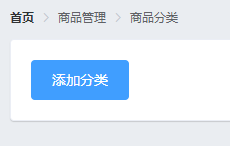

# 3.请求商品分类数据

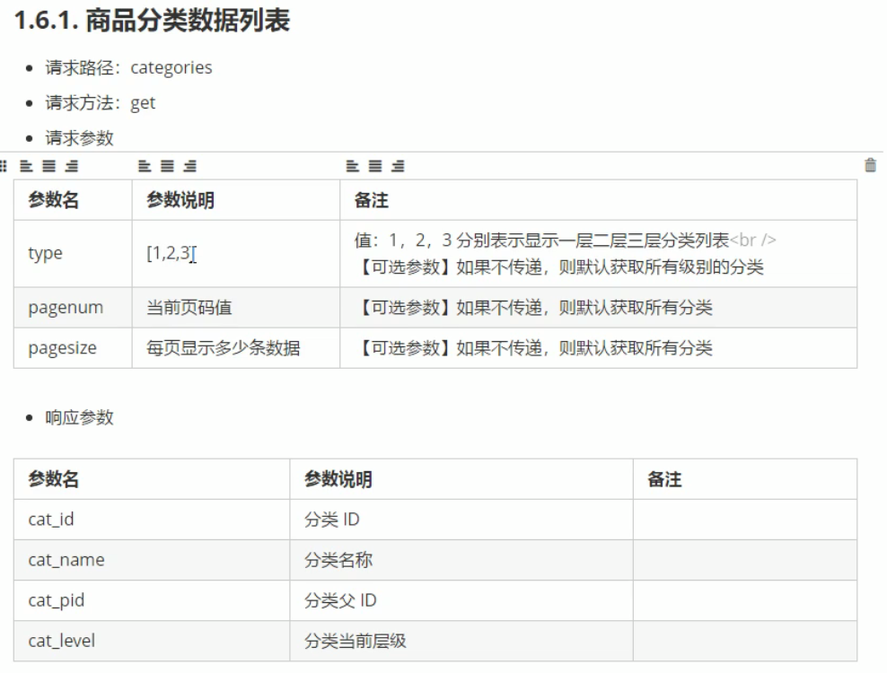

数据成员新增querInfo{}、catelist: []、total

```js
data() {
        return {
            // 查询条件
            querInfo: {
                type: 3,
                pagenum: 1,
                pagesize: 5
            },
            // 商品分类的数据列表，默认为空
            catelist: [],
            // 总数据条数
            total: 0
        }
    }
```

生命周期函数created

行为成员新增getCateList()

```js
created() {
        this.getCateList()
    },
methods: {
    // 获取商品分类数据
    async getCateList() {
        const { data: res } = await this.$http.get('categories', {
            params: this.querInfo
        })

        if (res.meta.status !== 200) {
            return this.$message.error('获取商品分类失败！')
        }
        // 把数据列表，赋值给 catelist
        this.catelist = res.data.result
        // 为总数据条数赋值
        this.total = res.data.total
    }
    
}
```

# 4.将请求到的数据渲染到页面中

Cate.vue+

结构

需要第三方插件

进入vue脚手架

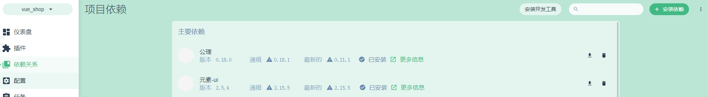

点击“安装依赖”

搜索vue-table-with-tree-grid

选中，点击安装

查看详情可以查看具体怎么使用

导入并注册

在main.js中

```js
...
import TreeTable from 'vue-table-with-tree-grid'
...
Vue.component('tree-table', TreeTable)

...
```

```vue
<!-- 表格 -->
<tree-table :data="catelist" :columns="columns">
    
</tree-table>
```

“分类名称”列的渲染


数据成员新增columns

```js
// 为table指定列的定义
columns: [
    {
        label: '分类名称',
        prop: 'cat_name'
    }
]
```

移除复选框和展开行

添加索引列和自定义列名

纵向分隔线

取消鼠标悬停高亮

给tree-table标签添加相关属性

```vue
<tree-table :data="catelist" :columns="columns" :selection-type="false" :expand-type="false" show-index index-text="#" border :show-row-hover="false"></tree-table>
```

效果

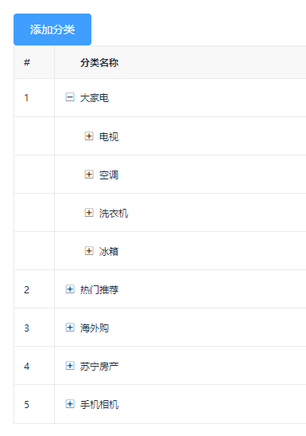

”是否有效“列的渲染

结构

```vue
<!-- 表格 -->
<tree-table ...>
  <!-- 是否有效 -->
  <template slot="isok" slot-scope="scope">
    <i class="el-icon-success" v-if="scope.row.cat_deleted === false" style="color: lightgreen;"></i>
    <i class="el-icon-error" v-else style="color: red;"></i>
  </template>
</tree-table>
```

数据成员columns+

```js
// 为table指定列的定义
columns: [
    ...
    {
        label: '是否有效',
        // 表示，将当前列定义为模板列
        type: 'template',
        // 表示当前这一列使用模板名称
        template: 'isok'
    }

]
```

效果

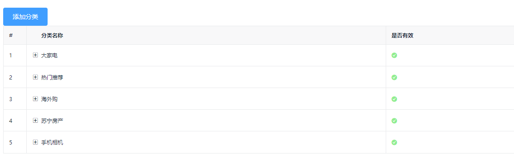

“排序”列和“操作”列的渲染

结构

```vue
<!-- 表格 -->
<tree-table ...>
    ...
    <!-- 排序 -->
    <template slot="order" slot-scope="scope">
        <el-tag size="mini" v-if="scope.row.cat_level===0">一级</el-tag>
        <el-tag type="success" size="mini" v-else-if="scope.row.cat_level===1">二级</el-tag>
        <el-tag type="warning" size="mini" v-else>三级</el-tag>
    </template>
    <!-- 操作 -->
    <template slot="opt" slot-scope="scope">
        <el-button type="primary" icon="el-icon-edit" size="mini">编辑</el-button>
        <el-button type="danger" icon="el-icon-delete" size="mini">删除</el-button>
    </template>
</tree-table>
```

数据成员columns+

```js
// 为table指定列的定义
columns: [
    ...
    {
        label: '排序',
        // 表示，将当前列定义为模板列
        type: 'template',
        // 表示当前这一列使用模板名称
        template: 'order'
    },
    {
        label: '操作',
        // 表示，将当前列定义为模板列
        type: 'template',
        // 表示当前这一列使用模板名称
        template: 'opt'
    }

]
```

效果

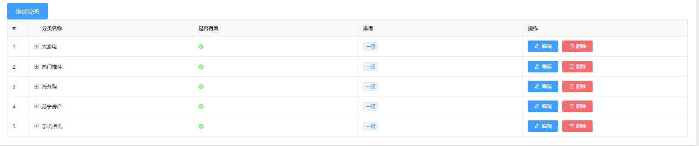

# 5.商品分类的分页效果

Cate.vue+

结构

```vue
<!-- 分页区域 -->
<el-pagination @size-change="handleSizeChange" @current-change="handleCurrentChange" :current-page="querInfo.pagenum" :page-sizes="[3, 5, 10, 15]" :page-size="querInfo.pagesize" layout="total, sizes, prev, pager, next, jumper" :total="total">
</el-pagination>
```

行为成员新增handleSizeChang、handleCurrentChange

```js
// 监听 pagesize 改变
handleSizeChange(newSize) {
    this.querInfo.pagesize = newSize
    this.getCateList()
},
// 监听 pagenum 改变
handleCurrentChange(newPage) {
    this.querInfo.pagenum = newPage
    this.getCateList()
}
```

样式优化

给tree-table加个类名

```vue
<!-- 表格 -->
<tree-table class="treeTable" ...>
    ...
</tree-table>
```

样式

```css
<style lang="less" scoped>
.treeTable {
  margin-top: 15px;
}
</style>
```

效果

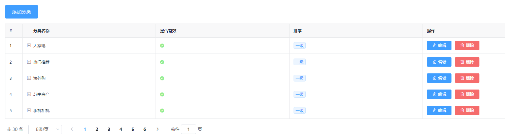

# 6.添加分类的对话框

Cate.vue+

结构

## "添加分类"按钮绑定事件

```vue
<el-button ... @click="showAddCateDialog">添加分类</el-button>
```


```vue
<!-- 添加分类的对话框 -->
<el-dialog title="添加分类" :visible.sync="addCateDialogVisible" width="50%">
    <!-- 添加分类的表单 -->
    <el-form :model="addCateForm" :rules="addCateFormRules" ref="addCateFormRef" label-width="100px">
    <el-form-item label="分类名称：" prop="cat_name">
        <el-input v-model="addCateForm.cat_name"></el-input>
    </el-form-item>
    <el-form-item label="父级分类：">
    </el-form-item>
    </el-form>
    <span slot="footer" class="dialog-footer">
    <el-button @click="addCateDialogVisible = false">取 消</el-button>
    <el-button type="primary" @click="addCateDialogVisible = false">确 定</el-button>
    </span>
</el-dialog>
```

数据成员新增addCateDialogVisible、addCateForm、addCateFormRules

```js
// 控制添加分类对话框的显示与隐藏
addCateDialogVisible: false,
// 添加分类的表单数据对象
addCateForm: {
    // 将要添加的分类的名称
    cat_name: '',
    // 父级分类的Id
    cat_pid: 0,
    // 分类的等级，默认要添加的是1级分类
    cat_level: 0
},
// 添加分类表单的验证规则对象
addCateFormRules: {
    cat_name: [
        { required: true, message: '请输入分类名称', trigger: 'blur' }
    ]
}
```

行为成员新增showAddCateDialog

```js
// 点击按钮，展示添加分类的对话框
showAddCateDialog() {
    // 再展示出对话框
    this.addCateDialogVisible = true
}
```

效果

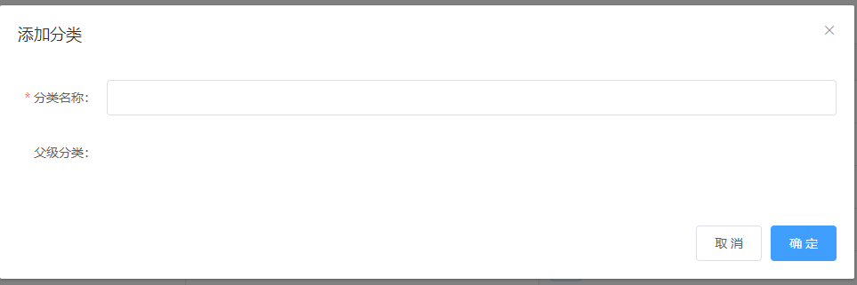

## 获取父级分类

行为成员新增getParentCateList

```js
// 获取父级分类的数据列表
async getParentCateList() {
    const { data: res } = await this.$http.get('categories', {
      params: { type: 2 }
    })

    if (res.meta.status !== 200) {
      return this.$message.error('获取父级分类数据失败！')
    }

    console.log(res.data)
    this.parentCateList = res.data
}
```

行为成员showAddCateDialog+

```js
// 点击按钮，展示添加分类的对话框
showAddCateDialog() {
    // 先获取父级分类的数据列表
    this.getParentCateList()
    // 再展示出对话框
    this.addCateDialogVisible = true
}
```

## 父级分类的级联选择器

按需导入，在plugins文件夹下的element.js+

```js
...
import { ... Cascader } from 'element-ui'

...
Vue.use(Cascader)

...
```

结构

change-on-select属性--可选任一级（不加选不了第一级）

clearable属性--清空

```vue
<el-form-item label="父级分类：">
    <!-- options 用来指定数据源 -->
    <!-- props 用来指定配置对象 -->
    <el-cascader expand-trigger="hover" :options="parentCateList" :props="cascaderProps" v-model="selectedKeys" @change="parentCateChanged" clearable change-on-select>
    </el-cascader>
</el-form-item>
```

数据成员新增parentCateList: []、cascaderProps、selectedKeys

```js
// 父级分类的列表
parentCateList: [],
// 指定级联选择器的配置对象
cascaderProps: {
    value: 'cat_id',
    label: 'cat_name',
    children: 'children'
},
// 选中的父级分类的Id数组
selectedKeys: []
```

行为成员新增

```js
// 选择项发生变化触发这个函数
parentCateChanged() {
    console.log(this.selectedKeys)
    
}
```

样式优化

```css
<style lang="less" scoped>
...
.el-cascader {
  width: 100%;
}
</style>
```

效果

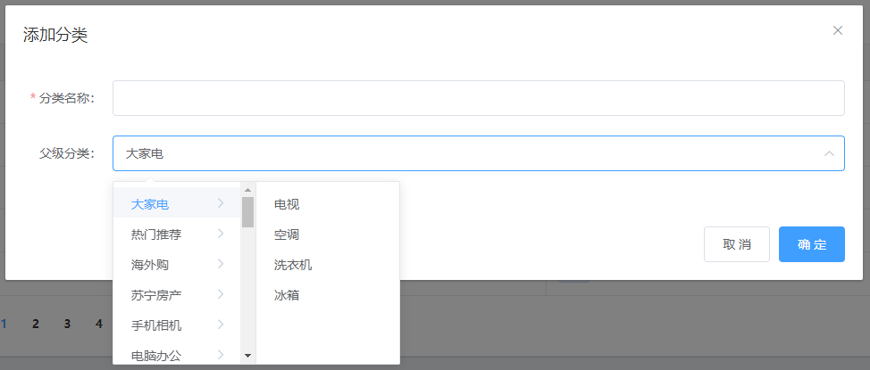

完善行为成员parentCateChanged

```js
// 选择项发生变化触发这个函数
parentCateChanged() {
    // 如果 selectedKeys 数组中的 length 大于0，证明选中的父级分类
    // 反之，就说明没有选中任何父级分类
    if (this.selectedKeys.length > 0) {
      // 父级分类的Id
      this.addCateForm.cat_pid = this.selectedKeys[
        this.selectedKeys.length - 1
      ]
      // 为当前分类的等级赋值
      this.addCateForm.cat_level = this.selectedKeys.length
      return
    } else {
      // 父级分类的Id
      this.addCateForm.cat_pid = 0
      // 为当前分类的等级赋值
      this.addCateForm.cat_level = 0
    }
}
```

## 关闭对话框清空数据

给对话框绑定一个关闭事件

```vue
<!-- 添加分类的对话框 -->
<el-dialog ... @close="addCateDialogClosed">
    ...
</el-dialog>
```

行为成员新增

```js
// 监听对话框的关闭事件，重置表单数据
addCateDialogClosed() {
  this.$refs.addCateFormRef.resetFields()
  this.selectedKeys = []
  this.addCateForm.cat_level = 0
  this.addCateForm.cat_pid = 0
}
```

## 添加分类的请求

修改添加分类对话框的“确认按钮”绑定的事件

```vue
<!-- 添加分类的对话框 -->
<el-dialog ...>
    ...
    </el-form>
    ...
    <el-button ... @click="addCate">确 定</el-button>
    </span>
</el-dialog>
```

行为成员新增addCate

```js
// 点击按钮，添加新的分类
addCate() {
    this.$refs.addCateFormRef.validate(async valid => {
        if (!valid) return
        const { data: res } = await this.$http.post('categories', this.addCateForm)

        if (res.meta.status !== 201) {
            return this.$message.error('添加分类失败！')
        }

        this.$message.success('添加分类成功！')
        this.getCateList()
        this.addCateDialogVisible = false
    })
}
```

# 7.新建分类参数组件Params.vue

在components文件夹下的goods文件夹下新建一个文件Params.vue

并初始化结构

```vue
<template>
    <div>
        <h3>分类参数组件页面</h3>
    </div>
</template>

<script>
export default {
    
}
</script>

<style lang="less" scoped>

</style>
```

在router.js中导入Params.vue组件

而该组件属于Home.vue的子组件，路由规则处于home的子路由

```js
...
import Params from './components/goods/Params.vue'

...
const router = new Router({
  routes: [
    { path: '/', redirect: '/login' },
    { path: '/login', component: Login },
    {
      path: '/home',
      component: Home,
      redirect: '/welcome',
      children: [
        { path: '/params', component: Params }

      ]
    }
  ]
})
...
```

效果


# 8.分类参数基本页面布局

Params.vue+

结构

```vue
<template>
    <div>
        <!-- 面包屑导航区域 -->
        <el-breadcrumb separator-class="el-icon-arrow-right">
            <el-breadcrumb-item :to="{ path: '/home' }">首页</el-breadcrumb-item>
            <el-breadcrumb-item>商品管理</el-breadcrumb-item>
            <el-breadcrumb-item>参数列表</el-breadcrumb-item>
        </el-breadcrumb>

        <!-- 卡片视图区域 -->
        <el-card>
            <!-- 警告区域 -->
            <el-alert show-icon title="注意：只允许为第三级分类设置相关参数！" type="warning" :closable="false"></el-alert>
    
            <!-- 选择商品分类区域 -->
            <el-row class="cat_opt">
                <el-col>
                    <span>选择商品分类：</span>
                </el-col>
            </el-row>
    
            <!-- tab 页签区域 -->
            
        </el-card>
    </div>
</template>
```

样式

```css
<style lang="less" scoped>
.cat_opt {
  margin: 15px 0;
}
</style>
```

效果

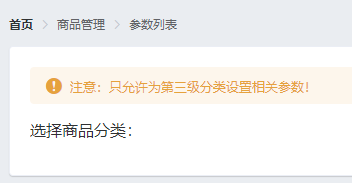

# 9.请求商品分类的数据

数据成员新增catelist: []

```js
data() {
    return {
        // 商品分类列表
        catelist: [],
    }
}
```

生命周期函数created

行为成员新增getCateList

```js
created() {
    this.getCateList()
},
methods: {
    // 获取所有的商品分类列表
    async getCateList() {
        const { data: res } = await this.$http.get('categories')
        if (res.meta.status !== 200) {
            return this.$message.error('获取商品分类失败！')
        }

        this.catelist = res.data
    }
}
```

# 10.将请求到的数据渲染到页面中

Params.vue+

结构

```vue
<!-- 选择商品分类区域 -->
<el-row class="cat_opt">
    <el-col>
        ...
        <!-- 选择商品分类的级联选择框 -->
        <el-cascader expand-trigger="hover" :options="catelist" :props="cateProps" v-model="selectedCateKeys" @change="handleChange">
        </el-cascader>
    </el-col>
</el-row>
```

数据成员新增cateProps、selectedCateKeys

```js
// 级联选择框的配置对象
cateProps: {
    value: 'cat_id',
    label: 'cat_name',
    children: 'children'
},
// 级联选择框双向绑定到的数组
selectedCateKeys: []
```

行为成员新增

```
// 级联选择框选中项变化，会触发这个函数
handleChange() {
    
}
```

效果

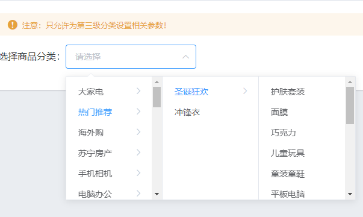

## 控制级联选择器的选择范围

数据成员handleChange+

```js
// 级联选择框选中项变化，会触发这个函数
handleChange() {
    // 证明选中的不是三级分类
    if (this.selectedCateKeys.length !== 3) {
        this.selectedCateKeys = []
        return
    }

    // 证明选中的是三级分类
}
```

## 渲染“动态参数”和“静态属性”页签

Params.vue+

结构

el-tabs的name属性是默认选中

```vue
<!-- tab 页签区域 -->
<el-tabs v-model="activeName" @tab-click="handleTabClick">
	<!-- 添加动态参数的面板 -->
	<el-tab-pane label="动态参数" name="many">
  
	</el-tab-pane>
	<!-- 添加静态属性的面板 -->
	<el-tab-pane label="静态属性" name="only">

	</el-tab-pane>
</el-tabs>
```

按需导入，在plugins文件夹下的element.js+

```js
...
import { ... Tabs, TabPane } from 'element-ui'

...
Vue.use(Tabs)
Vue.use(TabPane)
...
```

数据成员新增activeName

```js
// 被激活的页签的名称
activeName: 'many'
```

行为成员新增handleTabClick

```js
// tab 页签点击事件的处理函数
handleTabClick() {

}
```

完善结构

```vue
<!-- 添加动态参数的面板 -->
<el-tab-pane label="动态参数" name="many">
    <!-- 添加参数的按钮 -->
    <el-button type="primary" size="mini" :disabled="isBtnDisabled" @click="addDialogVisible=true">添加参数</el-button>
</el-tab-pane>
<!-- 添加静态属性的面板 -->
<el-tab-pane label="静态属性" name="only">
    <!-- 添加属性的按钮 -->
    <el-button type="primary" size="mini" :disabled="isBtnDisabled" @click="addDialogVisible=true">添加属性</el-button>
</el-tab-pane>
```

行为成员新增computed（与methods并列非归属）

```js
computed: {
    // 如果按钮需要被禁用，则返回true，否则返回false
    isBtnDisabled() {
      if (this.selectedCateKeys.length !== 3) {
        return true
      }
      return false
    }
}
```

效果

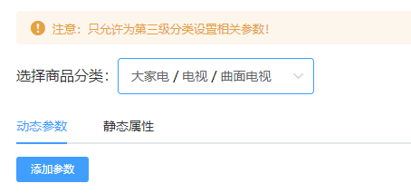

## 请求商品分类的参数数据

computed成员新增

```js
// 当前选中的三级分类的Id
cateId() {
      if (this.selectedCateKeys.length === 3) {
        return this.selectedCateKeys[2]
      }
      return null
}
```

methods成员handleChange+

```js
// 级联选择框选中项变化，会触发这个函数
async handleChange() {
    ...

    // 证明选中的是三级分类
    // 根据所选分类的Id，和当前所处的面板，获取对应的参数
    const { data: res } = await this.$http.get(
        `categories/${this.cateId}/attributes`,
        {
        params: { sel: this.activeName }
        }
    )

    if (res.meta.status !== 200) {
        return this.$message.error('获取参数列表失败！')
    }
}
```

## 将请求商品分类的参数数据的函数单独抽离出来

methods成员新增getParamsData

```js
// 获取参数的列表数据
async getParamsData() {
    // 证明选中的不是三级分类
    if (this.selectedCateKeys.length !== 3) {
      this.selectedCateKeys = []
      return
    }

    // 证明选中的是三级分类
    console.log(this.selectedCateKeys)
    // 根据所选分类的Id，和当前所处的面板，获取对应的参数
    const { data: res } = await this.$http.get(
      `categories/${this.cateId}/attributes`,
      {
        params: { sel: this.activeName }
      }
    )

    if (res.meta.status !== 200) {
      return this.$message.error('获取参数列表失败！')
    }
}
```

methods成员handleChange+、handleTabClick+

```js
// 级联选择框选中项变化，会触发这个函数
handleChange() {
  	this.getParamsData()
},
// tab 页签点击事件的处理函数
handleTabClick() {
    this.getParamsData()
}
```

将获取到的数据判断属于动态还是静态

methods成员getParamsData+

```js
// 获取参数的列表数据
async getParamsData() {
  ...

  if (this.activeName === 'many') {
    this.manyTableData = res.data
  } else {
    this.onlyTableData = res.data
  }
}
```

data成员新增

```js
// 动态参数的数据
manyTableData: [],
// 静态属性的数据
onlyTableData: []
```

## 渲染动态参数和静态属性表格

```vue
<!-- 添加动态参数的面板 -->
<el-tab-pane ...>
  <!-- 添加参数的按钮 -->
  ...
  <!-- 动态参数表格 -->
  <el-table :data="manyTableData" border stripe>
    <!-- 展开行 -->
    <el-table-column type="expand"></el-table-column>
    <!-- 索引列 -->
    <el-table-column type="index"></el-table-column>
    <el-table-column label="参数名称" prop="attr_name"></el-table-column>
    <el-table-column label="操作">
      <template slot-scope="scope">
        <el-button size="mini" type="primary" icon="el-icon-edit">编辑</el-button>
        <el-button size="mini" type="danger" icon="el-icon-delete">删除</el-button>
      </template>
    </el-table-column>
  </el-table>
</el-tab-pane>
<!-- 添加静态属性的面板 -->
<el-tab-pane ...>
  <!-- 添加属性的按钮 -->
  ...
  <!-- 静态属性表格 -->
  <el-table :data="onlyTableData" border stripe>
    <!-- 展开行 -->
    <el-table-column type="expand"></el-table-column>
    <!-- 索引列 -->
    <el-table-column type="index"></el-table-column>
    <el-table-column label="属性名称" prop="attr_name"></el-table-column>
    <el-table-column label="操作">
      <template slot-scope="scope">
        <el-button size="mini" type="primary" icon="el-icon-edit">编辑</el-button>
        <el-button size="mini" type="danger" icon="el-icon-delete">删除</el-button>
      </template>
    </el-table-column>
  </el-table>
</el-tab-pane>
```

效果

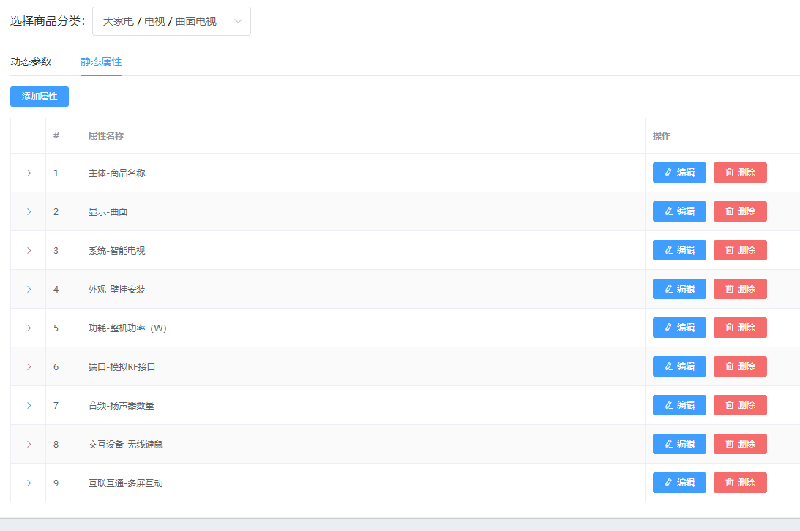

# 11.添加参数/属性对话框

Params.vue+

结构

```vue
<!-- 添加参数的对话框 -->
<el-dialog :title="'添加' + titleText" :visible.sync="addDialogVisible" width="50%" @close="addDialogClosed">
  <!-- 添加参数的对话框 -->
  <el-form :model="addForm" :rules="addFormRules" ref="addFormRef" label-width="100px">
    <el-form-item :label="titleText" prop="attr_name">
      <el-input v-model="addForm.attr_name"></el-input>
    </el-form-item>
  </el-form>
  <span slot="footer" class="dialog-footer">
    <el-button @click="addDialogVisible = false">取 消</el-button>
    <el-button type="primary" @click="addParams">确 定</el-button>
  </span>
</el-dialog>
```

“添加属性”和"添加参数"按钮绑定一个事件

```vue
...
<el-button .... @click="addDialogVisible=true">添加参数</el-button>
...
<el-button ... @click="addDialogVisible=true">添加参数</el-button>
...
```

data成员新增addDialogVisible、addForm、addFormRules

```js
// 控制添加对话框的显示与隐藏
addDialogVisible: false,
// 添加参数的表单数据对象
addForm: {
  attr_name: ''
},
// 添加表单的验证规则对象
addFormRules: {
  attr_name: [
    { required: true, message: '请输入参数名称', trigger: 'blur' }
  ]
}
```

computed成员新增titleText

```js
// 动态计算标题的文本
titleText() {
   if (this.activeName === 'many') {
     return '动态参数'
   }
   return '静态属性'
 }
```

methods成员新增addDialogClosed

```js
// 监听添加对话框的关闭事件
addDialogClosed() {
  this.$refs.addFormRef.resetFields()
}
```

效果

点击“添加参数”

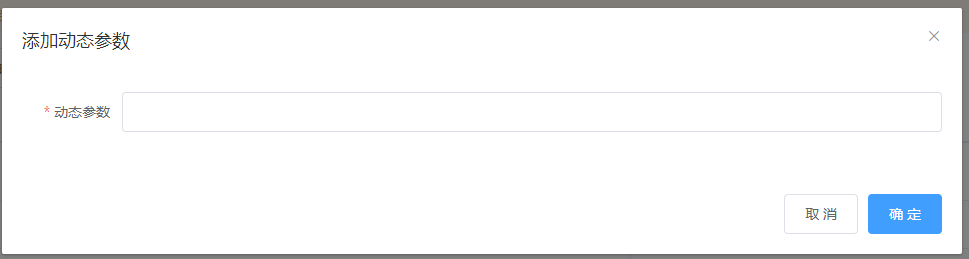

## 添加数据到服务器

Params.vue+

结构

给添加对话框的“确认”按钮绑定一个事件

```vue
...
<el-button ... @click="addParams">确 定</el-button>
...
```

methods成员新增

```js
// 点击按钮，添加参数
addParams() {
  this.$refs.addFormRef.validate(async valid => {
    if (!valid) return
    const { data: res } = await this.$http.post(
      `categories/${this.cateId}/attributes`,
      {
        attr_name: this.addForm.attr_name,
        attr_sel: this.activeName
      }
    )

    if (res.meta.status !== 201) {
      return this.$message.error('添加参数失败！')
    }

    this.$message.success('添加参数成功！')
    this.addDialogVisible = false
    this.getParamsData()
  })
}
```

# 12.修改对话框

Params.vue+

结构


分别给两个页签的“编辑”按钮绑定事件

```vue
...
<el-button ... @click="showEditDialog()">编辑</el-button>
...
<el-button ... @click="showEditDialog()">编辑</el-button>
...
```

修改对话框的结构

```vue
<!-- 修改参数的对话框 -->
<el-dialog :title="'修改' + titleText" :visible.sync="editDialogVisible" width="50%" @close="editDialogClosed">
  <!-- 添加参数的对话框 -->
  <el-form :model="editForm" :rules="editFormRules" ref="editFormRef" label-width="100px">
    <el-form-item :label="titleText" prop="attr_name">
      <el-input v-model="editForm.attr_name"></el-input>
    </el-form-item>
  </el-form>
  <span slot="footer" class="dialog-footer">
    <el-button @click="editDialogVisible = false">取 消</el-button>
    <el-button type="primary" @click="editParams">确 定</el-button>
  </span>
</el-dialog>
```

data成员新增

```js
// 控制修改对话框的显示与隐藏
editDialogVisible: false,
// 修改的表单数据对象
editForm: {},
// 修改表单的验证规则对象
editFormRules: {
  attr_name: [
    { required: true, message: '请输入参数名称', trigger: 'blur' }
  ]
}
```

methods成员新增

```js
// 点击按钮，展示修改的对话框
showEditDialog() {
  this.editDialogVisible = true
},
// 重置修改的表单
editDialogClosed() {
  this.$refs.editFormRef.resetFields()
},
// 点击按钮，修改参数信息
editParams() {

}
```

效果

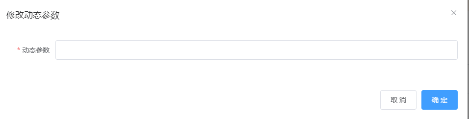

## 参数信息的获取

“编辑”按钮的函数传参

```vue
...
<el-button ... @click="showEditDialog(scope.row.attr_id)">编辑</el-button>
...
<el-button ... @click="showEditDialog(scope.row.attr_id)">编辑</el-button>
...
```

methods成员showEditDialog+

```js
// 点击按钮，展示修改的对话框
async showEditDialog(attr_id) {
  // 查询当前参数的信息
  const { data: res } = await this.$http.get(
    `categories/${this.cateId}/attributes/${attr_id}`,
    {
      params: { attr_sel: this.activeName }
    }
  )

  if (res.meta.status !== 200) {
    return this.$message.error('获取参数信息失败！')
  }

  this.editForm = res.data
  this.editDialogVisible = true
}
```

效果

点击“编辑”

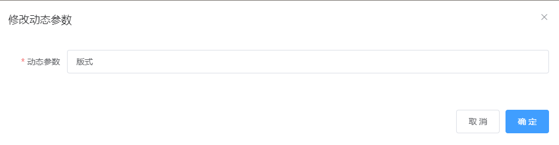

## 参数信息的提交

methods成员editParams+

```js
// 点击按钮，修改参数信息
editParams() {
  this.$refs.editFormRef.validate(async valid => {
    if (!valid) return
    const { data: res } = await this.$http.put(
      `categories/${this.cateId}/attributes/${this.editForm.attr_id}`,
      { attr_name: this.editForm.attr_name, attr_sel: this.activeName }
    )

    if (res.meta.status !== 200) {
      return this.$message.error('修改参数失败！')
    }

    this.$message.success('修改参数成功！')
    this.getParamsData()
    this.editDialogVisible = false
  })
}
```

# 13.删除参数信息

Params.vue+

结构

给两个页签的编辑按钮绑定事件

```vue
<el-button ... @click="removeParams(scope.row.attr_id)">删除</el-button>
...
<el-button ... @click="removeParams(scope.row.attr_id)">删除</el-button>
```

methods成员新增

```js
// 根据Id删除对应的参数项
async removeParams(attr_id) {
  const confirmResult = await this.$confirm(
    '此操作将永久删除该参数, 是否继续?',
    '提示',
    {
      confirmButtonText: '确定',
      cancelButtonText: '取消',
      type: 'warning'
    }
  ).catch(err => err)

  // 用户取消了删除的操作
  if (confirmResult !== 'confirm') {
    return this.$message.info('已取消删除！')
  }

  // 删除的业务逻辑
  const { data: res } = await this.$http.delete(
    `categories/${this.cateId}/attributes/${attr_id}`
  )

  if (res.meta.status !== 200) {
    return this.$message.error('删除参数失败！')
  }

  this.$message.success('删除参数成功！')
  this.getParamsData()
}
```

效果

点击删除

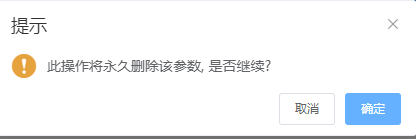

# 14.参数可选项的渲染

Params.vue+

结构

```vue
<template slot-scope="scope">
   <!-- 循环渲染Tag标签 -->
   <el-tag v-for="(item, i) in scope.row.attr_vals" :key="i" closable>{{item}}</el-tag>
</template>
```

methods成员getParamsData+

```js
// 获取参数的列表数据
async getParamsData() {
  ...

  res.data.forEach(item => {
    item.attr_vals = item.attr_vals.split(',') 
  })

  ...
}
```

样式优化

```css
.el-tag {
  margin: 10px;
}
```

效果

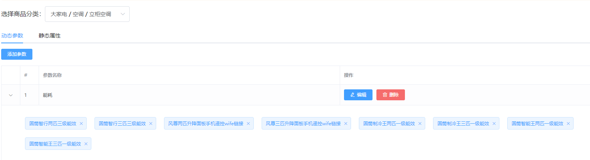

## 解决空字符串也会被渲染出来的问题

methods成员getParamsData+

```js
// 获取参数的列表数据
async getParamsData() {
  ...

  res.data.forEach(item => {
    item.attr_vals = item.attr_vals ? item.attr_vals.split(',') : []
  })

  ...
}
```

## 可选参数的添加按钮与文本框的切换显示

Params.vue+

结构

```vue
<!-- 动态参数表格 -->
<el-table :data="manyTableData" border stripe>
  <!-- 展开行 -->
  <el-table-column type="expand">
    <template slot-scope="scope">
      <!-- 循环渲染Tag标签 -->
      ...
      <!-- 输入的文本框 -->
      <el-input class="input-new-tag" v-if="inputVisible" v-model="inputValue" ref="saveTagInput" size="small" @keyup.enter.native="handleInputConfirm()" @blur="handleInputConfirm()">
      </el-input>
      <!-- 添加按钮 -->
      <el-button v-else class="button-new-tag" size="small" @click="showInput()">+ New Tag</el-button>
    </template>
  </el-table-column>
  ...
</el-table>
```

data成员新增

```js
//控制按钮与文本框的切换显示
inputVisible: false,
//文本框中输入的内容
inputValue: ''
```

methods成员新增

```js
// 文本框失去焦点，或摁下了 Enter 都会触发
handleInputConfirm() {
  
},
// 点击按钮，展示文本输入框
showInput() {
  this.inputVisible = true
}
```

样式

```css
</script>
...

.input-new-tag {
  width: 120px;
}
</style>
```

效果

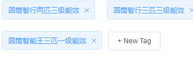

## 解决一些小问题

修改输入文本框的v-if和v-model属性值

```vue
<!-- 输入的文本框 -->
<el-input ... v-if="scope.row.inputVisible" v-model="scope.row.inputValue" ...>
```

data成员删掉inputVisible和inputValue"

methods成员getParamsData+

```js
// 获取参数的列表数据
async getParamsData() {
  ...

  res.data.forEach(item => {
    item.attr_vals = item.attr_vals ? item.attr_vals.split(',') : []
    // 控制文本框的显示与隐藏
    item.inputVisible = false
    // 文本框中输入的值
    item.inputValue = ''
  })

  ...
}
```

函数传参

```vue
<!-- 添加按钮 -->
<el-button v-else class="button-new-tag" size="small" @click="showInput(scope.row)">+ New Tag</el-button>
```

```js
// 点击按钮，展示文本输入框
showInput(row) {
    row.inputVisible = true
}
```

## 点击添加文本框自动聚焦

methods成员showInput+

```js
// 点击按钮，展示文本输入框
showInput(row) {
  ...
  // 让文本框自动获得焦点
  // $nextTick 方法的作用，就是当页面上元素被重新渲染之后，才会指定回调函数中的代码
  this.$nextTick(_ => {
    this.$refs.saveTagInput.$refs.input.focus()
  })
}
```

## 按钮与文本框的切换

函数传参

```vue
<el-input ... @keyup.enter.native="handleInputConfirm(scope.row)" @blur="handleInputConfirm(scope.row)">
</el-input>
```

methods成员handleInputConfirm+

```js
// 文本框失去焦点，或摁下了 Enter 都会触发
handleInputConfirm(row) {
  if (row.inputValue.trim().length === 0) {
    row.inputValue = ''
    row.inputVisible = false
    return
  }
  // 如果没有return，则证明输入的内容，需要做后续处理
}
```

## 将添加的参数上传到服务器

methods成员新增

```js
// 将对 attr_vals 的操作，保存到数据库
async saveAttrVals(row) {
  // 需要发起请求，保存这次操作
  const { data: res } = await this.$http.put(
    `categories/${this.cateId}/attributes/${row.attr_id}`,
    {
      attr_name: row.attr_name,
      attr_sel: row.attr_sel,
      attr_vals: row.attr_vals.join(',')
    }
  )

  if (res.meta.status !== 200) {
    return this.$message.error('修改参数项失败！')
  }

  this.$message.success('修改参数项成功！')
}
```

methods成员 handleInputConfirm+

```js
// 文本框失去焦点，或摁下了 Enter 都会触发
async handleInputConfirm(row) {
    if (row.inputValue.trim().length === 0) {
        row.inputValue = ''
        row.inputVisible = false
        return
    }
    // 如果没有return，则证明输入的内容，需要做后续处理
    row.attr_vals.push(row.inputValue.trim())
    row.inputValue = ''
    row.inputVisible = false
    // 需要发起请求，保存这次操作
    this.saveAttrVals(row)
}
```

## 删除参数

el-tag标签绑定一个事件

```vue
<!-- 循环渲染Tag标签 -->
<el-tag ... @close="handleClose(i, scope.row)">{{item}}</el-tag>
```

methods成员新增

```js
// 删除对应的参数可选项
handleClose(i, row) {
  row.attr_vals.splice(i, 1)
  this.saveAttrVals(row)
}
```

## 解决一个小问题

methods成员

```js
// 获取参数的列表数据
async getParamsData() {
  // 证明选中的不是三级分类
  if (this.selectedCateKeys.length !== 3) {
    ...
    this.manyTableData = []
    this.onlyTableData = []
    ...
  }

  ...
}
```

# 15.静态属性的渲染

与动态参数一样，复制动态参数面板的“展开行”部分代码，覆盖到静态属性面板的“展开行”

```vue
<!-- 展开行 -->
<el-table-column type="expand">
    <template slot-scope="scope">
        <!-- 循环渲染Tag标签 -->
        <el-tag v-for="(item, i) in scope.row.attr_vals" :key="i" closable @close="handleClose(i, scope.row)">{{item}}</el-tag>
        <!-- 输入的文本框 -->
        <el-input class="input-new-tag" v-if="scope.row.inputVisible" v-model="scope.row.inputValue" ref="saveTagInput" size="small" @keyup.enter.native="handleInputConfirm(scope.row)" @blur="handleInputConfirm(scope.row)">
        </el-input>
        <!-- 添加按钮 -->
        <el-button v-else class="button-new-tag" size="small" @click="showInput(scope.row)">+ New Tag</el-button>
     </template>
</el-table-column>
```

效果

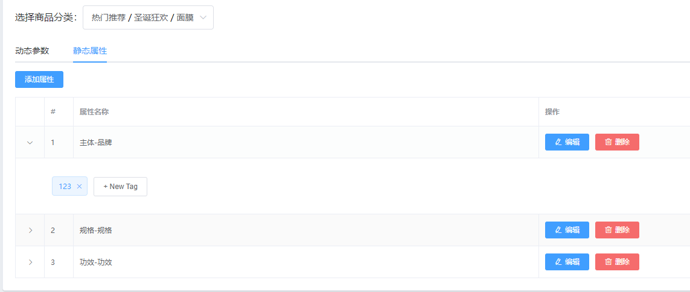

