# 1.新建权限组件Rights.vue

在components文件夹下新建一个right文件夹，并在该文件夹下新建一个文件Rights.vue

并初始化结构

```vue
<template>
    <div>
        <h3>权限列表组件页面</h3>
    </div>
</template>

<script>
export default {
    
}
</script>

<style lang="less" scoped>

</style>
```

在router.js中导入Rights.vue组件

而该组件属于Home.vue的子组件，路由规则处于home的子路由

```js
...
import Rights from './components/right/Rights.vue'

...
const router = new Router({
  routes: [
    { path: '/', redirect: '/login' },
    { path: '/login', component: Login },
    {
      path: '/home',
      component: Home,
      redirect: '/welcome',
      children: [
        ...
        { path: '/rights', component: Rights }

      ]
    }
  ]
})
...
```

效果

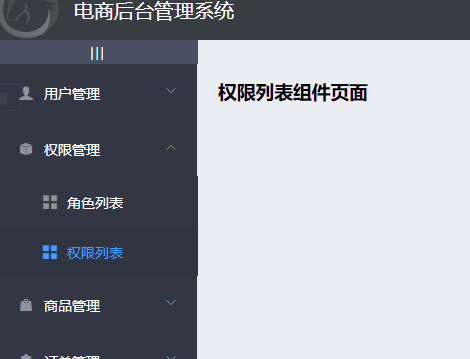

# 2.权限列表页面的基本布局

Rights.vue+

结构

```vue
<template>
    <div>
        <!-- 面包屑导航区域 -->
        <el-breadcrumb separator-class="el-icon-arrow-right">
            <el-breadcrumb-item :to="{ path: '/home' }">首页</el-breadcrumb-item>
            <el-breadcrumb-item>权限管理</el-breadcrumb-item>
            <el-breadcrumb-item>权限列表</el-breadcrumb-item>
        </el-breadcrumb>
    
        <!-- 卡片视图 -->
        <el-card>
            123
        </el-card>
    </div>
</template>
```

效果

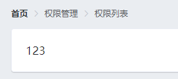

# 3.请求列表数据

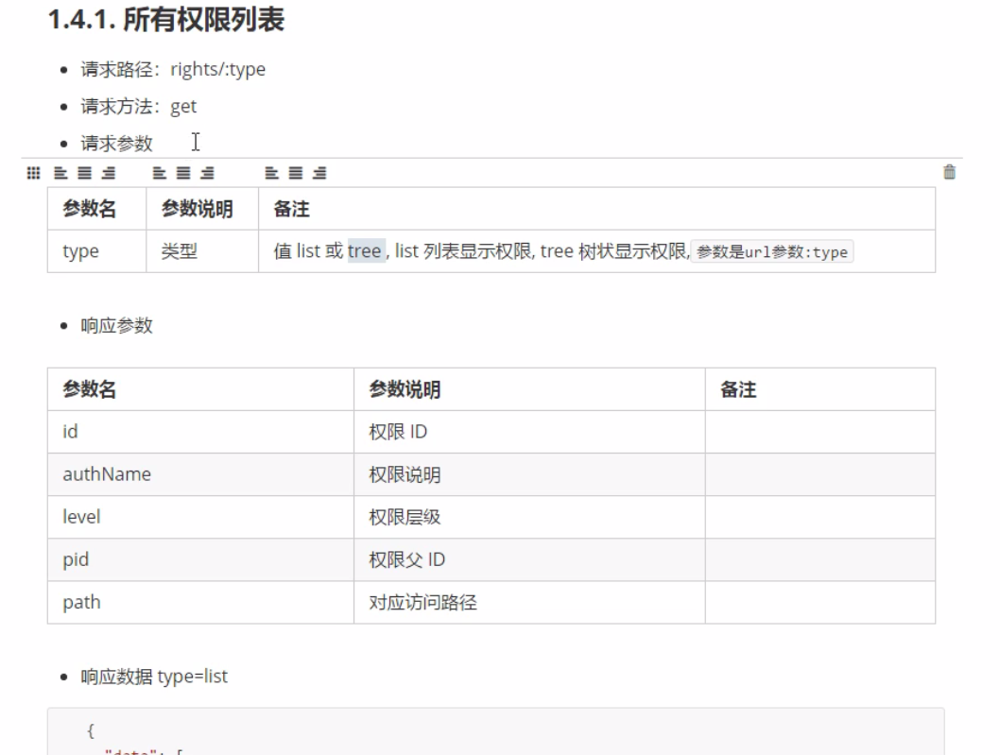

数据成员新增rightsList: []

```js
export default {
    data() {
        return {
        // 权限列表
        rightsList: []
        }
    }
}
</script>
```

生命周期函数created

行为成员新增getRightsList()

```js
export default {
    ...
    created() {
        // 获取所有的权限
        this.getRightsList()
    },
    methods: {
        // 获取权限列表
        async getRightsList() {
        const { data: res } = await this.$http.get('rights/list')
        if (res.meta.status !== 200) {
            return this.$message.error('获取权限列表失败！')
        }

        this.rightsList = res.data
        }
    }
}
</script>
```

# 4.将请求到的数据渲染到页面中

Rights.vue+

结构

```vue
<template>
    <div>
        ...
        <!-- 卡片视图 -->
        <el-card>
            <el-table :data="rightsList" border stripe>
                <el-table-column type="index"></el-table-column>
                <el-table-column label="权限名称" prop="authName"></el-table-column>
                <el-table-column label="路径" prop="path"></el-table-column>
                <el-table-column label="权限等级" prop="level">
                  <template slot-scope="scope">
                    <el-tag v-if="scope.row.level === '0'">一级</el-tag>
                    <el-tag type="success" v-else-if="scope.row.level === '1'">二级</el-tag>
                    <el-tag type="warning" v-else>三级</el-tag>
                  </template>
                </el-table-column>
              </el-table>
        </el-card>
    </div>
</template>
```

按需导入，在plugins文件夹下的element.js里

```js
...
import { ... Tag } from 'element-ui'

...
Vue.use(Tag)
...

```

效果

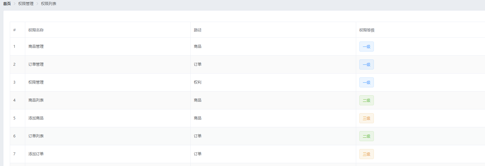

# 5.用户权限管理业务

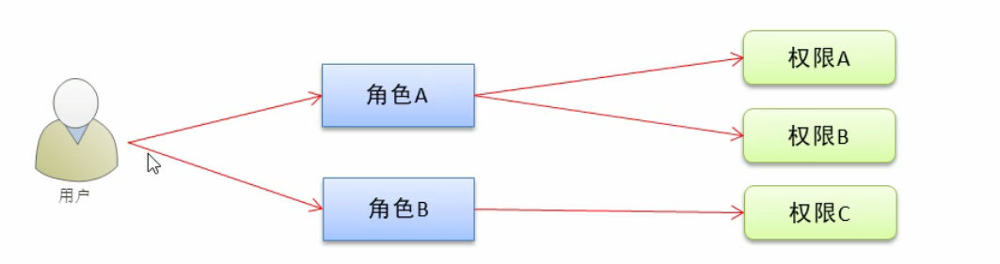

# 6.新建用户角色组件Roles.vue

在components文件夹下新建一个right文件夹，并在该文件夹下新建一个文件Rights.vue

并初始化结构

```vue
<template>
    <div>
        <h3>用户角色</h3>
    </div>
</template>

<script>
export default {
    
}
</script>

<style lang="less" scoped>

</style>
```

在router.js中导入Rights.vue组件

而该组件属于Home.vue的子组件，路由规则处于home的子路由

```js
...
import Roles from './components/power/Roles.vue'

...
const router = new Router({
  routes: [
    { path: '/', redirect: '/login' },
    { path: '/login', component: Login },
    {
      path: '/home',
      component: Home,
      redirect: '/welcome',
      children: [
        ...
        { path: '/roles', component: Roles }

      ]
    }
  ]
})
...
```

效果

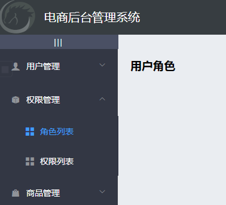

# 7.角色列表的基础布局

Roles.vue+

结构

```vue
<template>
    <div>
        <!-- 面包屑导航区域 -->
        <el-breadcrumb separator-class="el-icon-arrow-right">
            <el-breadcrumb-item :to="{ path: '/home' }">首页</el-breadcrumb-item>
            <el-breadcrumb-item>权限管理</el-breadcrumb-item>
            <el-breadcrumb-item>角色列表</el-breadcrumb-item>
        </el-breadcrumb>
    
        <!-- 卡片视图 -->
        <el-card>
            <!-- 添加角色按钮区域 -->
            <el-row>
            <el-col>
                <el-button type="primary">添加角色</el-button>
            </el-col>
            </el-row>
    
            <!-- 角色列表区域 -->
        </el-card>
    </div>
</template>
```

请求数据

数据成员新增

生命周期函数

行为成员新增

```js
<script>
export default {
    data() {
        return {
        // 所有角色列表数据
        rolelist: []
        }
    },
    created() {
        this.getRolesList()
    },
    methods: {
        // 获取所有角色的列表
        async getRolesList() {
        const { data: res } = await this.$http.get('roles')

        if (res.meta.status !== 200) {
            return this.$message.error('获取角色列表失败！')
        }

        this.rolelist = res.data
        }
    }
}
</script>
```

# 8.将请求到的数据渲染到页面中

Roles.vue+

结构

```vue
<!-- 角色列表区域 -->
            <el-table :data="rolelist" border stripe>
                <!-- 展开列 -->
                <el-table-column type="expand">
                  
                </el-table-column>
                <!-- 索引列 -->
                <el-table-column type="index"></el-table-column>
                <el-table-column label="角色名称" prop="roleName"></el-table-column>
                <el-table-column label="角色描述" prop="roleDesc"></el-table-column>
                <el-table-column label="操作" width="300px">
                  <template slot-scope="scope">
                    <el-button size="mini" type="primary" icon="el-icon-edit">编辑</el-button>
                    <el-button size="mini" type="danger" icon="el-icon-delete">删除</el-button>
                    <el-button size="mini" type="warning" icon="el-icon-setting">分配权限</el-button>
                  </template>
                </el-table-column>
              </el-table>
```

效果

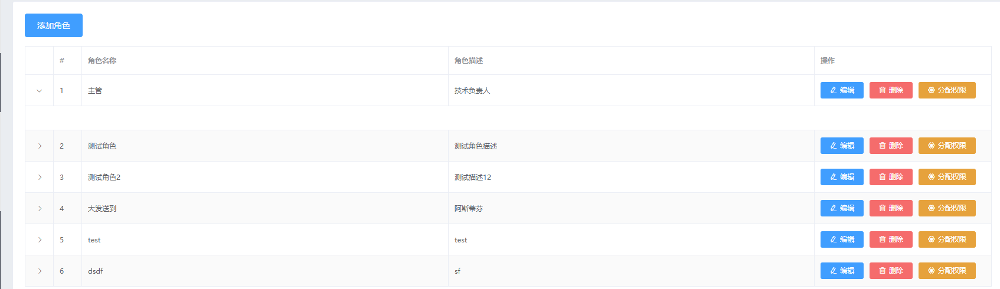

# 9.角色下权限数据的渲染

Roles.vue+

结构

渲染一级权限

```vue
<!-- 展开列 -->
                <el-table-column type="expand">
                    <template slot-scope="scope">
                        <el-row v-for="(item1, i1) in scope.row.children" :key="item1.id">
                          <!-- 渲染一级权限 -->
                          <el-col :span="5">
                            <el-tag>{{item1.authName}}</el-tag>
                          </el-col>
                          
                    </template>
                </el-table-column>
```

效果


优化样式

结构

el-row标签添加一个类名

el-col内容添加一个图标

```vue
<!-- 展开列 -->
                <el-table-column type="expand">
                    <template slot-scope="scope">
                        <el-row :class="['bdbottom', i1 === 0 ? 'bdtop' : '']" ...>
                          <!-- 渲染一级权限 -->
                          <el-col :span="5">
                            ...
                            <i class="el-icon-caret-right"></i>
                          </el-col>
                        </el-row> 
                    </template>
                </el-table-column>
```

样式

```css
<style lang="less" scoped>
.el-tag {
  margin: 7px;
}

.bdtop {
  border-top: 1px solid #eee;
}

.bdbottom {
  border-bottom: 1px solid #eee;
}
</style>
```

效果

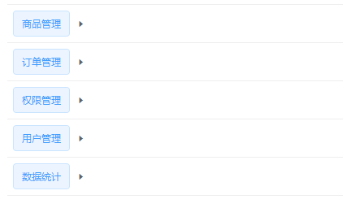

渲染二级权限

结构

```vue
<!-- 展开列 -->
                <el-table-column type="expand">
                    <template slot-scope="scope">
                        <el-row :class="['bdbottom', i1 === 0 ? 'bdtop' : '']" v-for="(item1, i1) in scope.row.children" :key="item1.id">
                            <!-- 渲染一级权限 -->
                            ...
                            <!-- 渲染二级和三级权限 -->
                            <el-col :span="19">
                                <!-- 通过 for 循环 嵌套渲染二级权限 -->
                                <el-row :class="[i2 === 0 ? '' : 'bdtop']" v-for="(item2, i2) in item1.children" :key="item2.id">
                                    <el-col :span="6">
                                        <el-tag type="success">{{item2.authName}}</el-tag>
                                        <i class="el-icon-caret-right"></i>
                                    </el-col>
                                    
                                </el-row>
                            </el-col>
                        </el-row> 
                    </template>
                </el-table-column>
```

效果

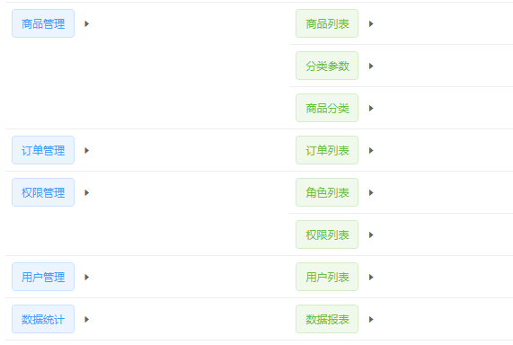

渲染三级权限

结构

```vue
<!-- 展开列 -->
                <el-table-column type="expand">
                    <template slot-scope="scope">
                        <el-row :class="['bdbottom', i1 === 0 ? 'bdtop' : '']" v-for="(item1, i1) in scope.row.children" :key="item1.id">
                            <!-- 渲染一级权限 -->
                            ...
                            <!-- 渲染二级和三级权限 -->
                            <el-col :span="19">
                                <!-- 通过 for 循环 嵌套渲染二级权限 -->
                                <el-row :class="[i2 === 0 ? '' : 'bdtop']" v-for="(item2, i2) in item1.children" :key="item2.id">
                                    ...
                                    <el-col :span="18">
                                        <el-tag type="warning" v-for="(item3, i3) in item2.children" :key="item3.id">{{item3.authName}}</el-tag>
                                    </el-col>
                                </el-row>
                            </el-col>
                        </el-row> 
                    </template>
                </el-table-column>
```

效果

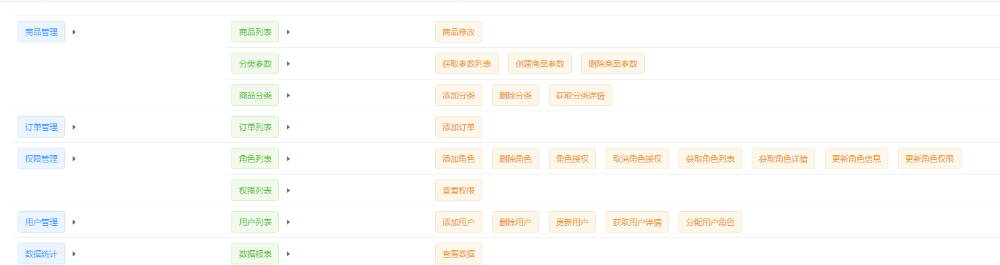

样式优化

宽度不够导致换行

在assets文件夹下的css文件夹下的global.css里设置最小宽度

```css
html,
body,
#app {
  ..
  min-width: 1366px;
}
```

纵向居中

给需要的列加一个类vcenter

结构

```vue
<!-- 展开列 -->
                <el-table-column type="expand">
                    <template slot-scope="scope">
                        <el-row :class="['bdbottom', i1 === 0 ? 'bdtop' : '', 'vcenter']" ...>
                            <!-- 渲染一级权限 -->
                            ...
                            <!-- 渲染二级和三级权限 -->
                            <el-col :span="19">
                                <!-- 通过 for 循环 嵌套渲染二级权限 -->
                                <el-row :class="[i2 === 0 ? '' : 'bdtop', 'vcenter']" ..>
                                    ...
                                </el-row>
                            </el-col>
                        </el-row> 
                    </template>
                </el-table-column>
```

样式

```css
<style lang="less" scoped>
...
.vcenter {
  display: flex;
  align-items: center;
}
</style>
```

效果

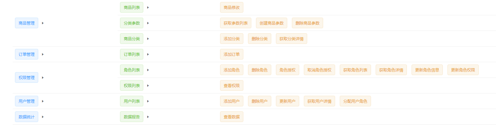

# 10.删除角色下的权限

Roles.vue+

结构

给第三级权限的el-tag标签添加closable属性和点击事件removeRightById

```vue
<!-- 角色列表区域 -->
<el-table :data="rolelist" border stripe>
    <!-- 展开列 -->
    <el-table-column type="expand">
        <template slot-scope="scope">
            <el-row :class="['bdbottom', i1 === 0 ? 'bdtop' : '', 'vcenter']" v-for="(item1, i1) in scope.row.children" :key="item1.id">
                <!-- 渲染一级权限 -->
                ...
                <!-- 渲染二级和三级权限 -->
                <el-col :span="19">
                    <!-- 通过 for 循环 嵌套渲染二级权限 -->
                    <el-row :class="[i2 === 0 ? '' : 'bdtop', 'vcenter']" v-for="(item2, i2) in item1.children" :key="item2.id">
                        ...
                        <el-col :span="18">
                            <el-tag type="warning" v-for="(item3, i3) in item2.children" :key="item3.id" closable @close="removeRightById">{{item3.authName}}</el-tag>
                        </el-col>
                    </el-row>
                </el-col>
            </el-row> 
        </template>
    </el-table-column>
   ...
</el-table>
```

行为成员新增removeRightById

```js
// 根据Id删除对应的权限
async removeRightById() {
    // 弹框提示用户是否要删除
    const confirmResult = await this.$confirm(
        '此操作将永久删除该权限, 是否继续?',
        '提示',
        {
        confirmButtonText: '确定',
        cancelButtonText: '取消',
        type: 'warning'
        }
    ).catch(err => err)

    if (confirmResult !== 'confirm') {
        return this.$message.info('取消了删除！')
    }

}
```

点击事件传参数

```vue
<el-tag ...@close="removeRightById(scope.row, item1.id)">{{item1.authName}}</el-tag>
...
<el-tag ...@close="removeRightById(scope.row, item2.id)">{{item2.authName}}</el-tag>
...
<el-tag ...@close="removeRightById(scope.row, item3.id)">{{item3.authName}}</el-tag>
...
```

行为成员removeRightById+

```js
// 根据Id删除对应的权限
async removeRightById(role, rightId) {
    // 弹框提示用户是否要删除
    const confirmResult = await this.$confirm(
        '此操作将永久删除该权限, 是否继续?',
        '提示',
        {
            confirmButtonText: '确定',
            cancelButtonText: '取消',
            type: 'warning'
        }
    ).catch(err => err)

    if (confirmResult !== 'confirm') {
        return this.$message.info('取消了删除！')
    }
    const { data: res } = await this.$http.delete(
        `roles/${role.id}/rights/${rightId}`
    )

    if (res.meta.status !== 200) {
        return this.$message.error('删除权限失败！')
    }

    role.children = res.data
}
```

效果

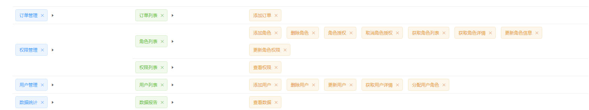

# 11.分配权限

Roles.vue+

获取数据

结构

给“分配权限”按钮添加点击事件

```vue
<!-- 索引列 -->
...
<el-table-column label="操作" width="300px">
  <template slot-scope="scope">
    ...
    <el-button size="mini" type="warning" icon="el-icon-setting" @click="showSetRightDialog()">分配权限</el-button>
  </template>
</el-table-column>
```

数据成员新增 setRightDialogVisible 、rightslist: []

```js
data() {
        return {
            ...
            // 控制分配权限对话框的显示与隐藏
            setRightDialogVisible: false,
            // 所有权限的数据
      		rightslist: []
        }
    }
```

行为成员新增showSetRightDialog

```js
// 展示分配权限的对话框
async showSetRightDialog() {
    this.roleId = role.id
    const { data: res } = await this.$http.get('rights/tree')

    if (res.meta.status !== 200) {
        return this.$message.error('获取权限数据失败！')
    }

    // 把获取到的权限数据保存到 data 中
    this.rightslist = res.data

    this.setRightDialogVisible = true
}
```

效果

点击“分配权限”


# 12.将请求到的数据渲染到页面中

Roles.vue+

结构

```vue
<!-- 分配权限的对话框 -->
<el-dialog ...>
    <!-- 树形控件 -->
    <el-tree :data="rightslist" :props="treeProps"></el-tree>
    ...
</el-dialog>
```

数据成员新增treeProps{}

```js
data() {
        return {
            ...
            // 树形控件的属性绑定对象
            treeProps: {
                label: 'authName',
                children: 'children'
            }
        }
    }
```

按需导入，在plugins文件夹下的element.js中

```js
...
import { ... Tree } from 'element-ui'

...
Vue.use(Tree)
...
```

效果

点击“分配权限”

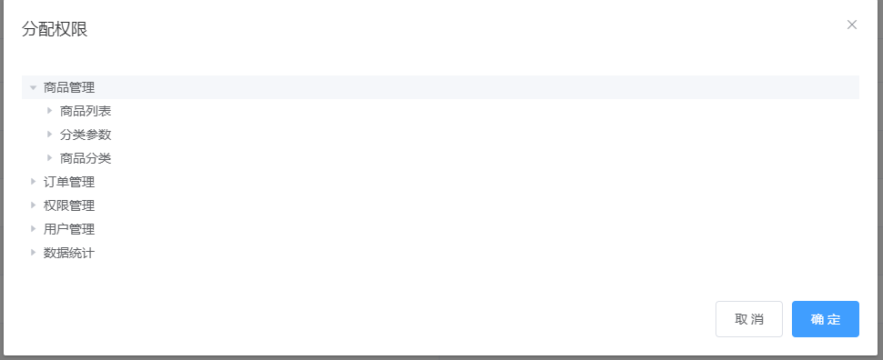

优化

- 添加复选框
- 点击获取id
- 默认结点全部展开

el-tree标签添加对应属性

```vue
<el-tree ...show-checkbox node-key="id" default-expand-all></el-tree>
```

效果

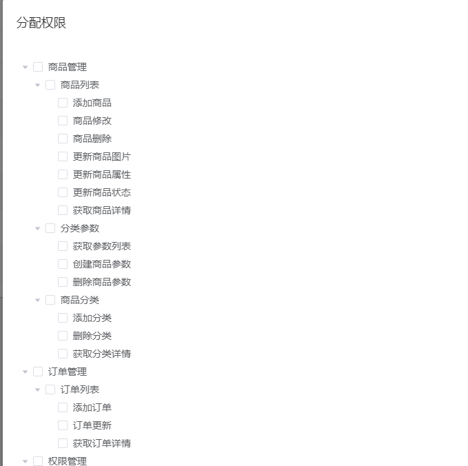

# 13.将当前角色下的所有三级权限在页面勾选

Roles.vue+

结构

给el-tree标签添加default-checked-keys属性

```vue
<el-tree ... :default-checked-keys="defKeys"></el-tree>
```

数据成员新增defKeys: []

```js
data() {
        return {
            ...
            // 默认选中的节点Id值数组
            defKeys: []
        }
    }
```

行为成员新增getLeafKeys

```js
methods: {
        ....
        // 通过递归的形式，获取角色下所有三级权限的id，并保存到 defKeys 数组中
        getLeafKeys(node, arr) {
        // 如果当前 node 节点不包含 children 属性，则是三级节点
        if (!node.children) {
            return arr.push(node.id)
        }

        node.children.forEach(item => this.getLeafKeys(item, arr))
        }
    }
```

函数传参scope.row、role

并将获取到的三级节点加载到对话框中

```vue
<el-button ...@click="showSetRightDialog(scope.row)">分配权限</el-button>
```

```js
// 展示分配权限的对话框
async showSetRightDialog(role) {
    ...

    // 递归获取三级节点的Id
    this.getLeafKeys(role, this.defKeys)

    ...
}
```

效果

点击“分配权限”

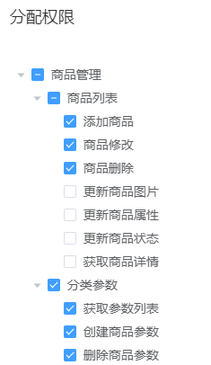

优化

每次退出分配权限对话框要清空id项

结构

分配权限对话框添加关闭事件

```vue
<!-- 分配权限的对话框 -->
<el-dialog ... @close="setRightDialogClosed">...</el-dialog>
```

行为成员新增

```js
// 监听分配权限对话框的关闭事件
setRightDialogClosed() {
    this.defKeys = []
}
```

# 14.将权限数据同步到服务器

Roles.vue+

结构

el-tree标签添加ref="treeRef"属性

修改分配权限对话框的确认按钮绑定的事件

```vue
<el-tree ... ref="treeRef"></el-tree>
```

```vue
<el-button ... @click="allotRights">确 定</el-button>
```

数据成员新增roleId: ''

```js
// 当前即将分配权限的角色id
roleId: ''
```

行为成员新增allotRights

```js
// 点击为角色分配权限
async allotRights() {
    const keys = [
        ...this.$refs.treeRef.getCheckedKeys(),
        ...this.$refs.treeRef.getHalfCheckedKeys()
    ]

    const idStr = keys.join(',')

    const { data: res } = await this.$http.post(
        `roles/${this.roleId}/rights`,
        { rids: idStr }
    )

    if (res.meta.status !== 200) {
        return this.$message.error('分配权限失败！')
    }

    this.$message.success('分配权限成功！')
    this.getRolesList()
    this.setRightDialogVisible = false
}
```

并在展开对话框的时候获取id

```js
// 展示分配权限的对话框
async showSetRightDialog(role) {
    this.roleId = role.id
    ...
}
```

# 15.分配角色的对话框

Users.vue+

结构

给分配角色按钮绑定事件

```vue
<el-button ... @click="setRole(scope.row)"></el-button>
```

新增分配角色对话框

```vue
<!-- 分配角色的对话框 -->
<el-dialog title="分配角色" :visible.sync="setRoleDialogVisible" width="50%" @close="setRoleDialogClosed">
  <div>
    <p>当前的用户：{{userInfo.username}}</p>
    <p>当前的角色：{{userInfo.role_name}}</p>
    <p>分配新角色：
      <el-select v-model="selectedRoleId" placeholder="请选择">
        <el-option v-for="item in rolesList" :key="item.id" :label="item.roleName" :value="item.id">
        </el-option>
      </el-select>
    </p>
  </div>
  <span slot="footer" class="dialog-footer">
    <el-button @click="setRoleDialogVisible = false">取 消</el-button>
    <el-button type="primary" @click="saveRoleInfo">确 定</el-button>
  </span>
</el-dialog>
```

按需导入，在plugins文件夹下的element.js中

```js
...
import { ... Select, Option } from 'element-ui'
...
Vue.use(Select)
Vue.use(Option)
...
```

数据成员新增setRoleDialogVisible、userInfo: {}、rolesList: []

```js
// 控制分配角色对话框的显示与隐藏
setRoleDialogVisible: false,
// 需要被分配角色的用户信息
userInfo: {},
// 所有角色的数据列表
rolesList: [],
// 已选中的角色Id值
selectedRoleId: ''
```

行为成员新增setRole

```js
// 展示分配角色的对话框
async setRole(userInfo) {
  this.userInfo = userInfo

  // 在展示对话框之前，获取所有角色的列表
  const { data: res } = await this.$http.get('roles')
  if (res.meta.status !== 200) {
    return this.$message.error('获取角色列表失败！')
  }

  this.rolesList = res.data

  this.setRoleDialogVisible = true
}
```

效果

点击“分配角色”

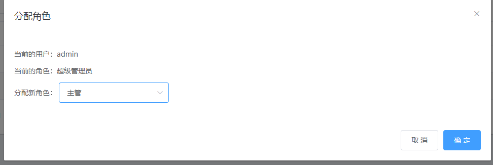

# 16.将分配给用户的角色同步到服务器

Users.vue+

结构

给分配角色的的对话框的确认按钮绑定事件

```vue
<el-button ... @click="saveRoleInfo">确 定</el-button>
```

行为成员新增saveRoleInfo

```js
// 点击按钮，分配角色
async saveRoleInfo() {
  if (!this.selectedRoleId) {
    return this.$message.error('请选择要分配的角色！')
  }

  const { data: res } = await this.$http.put(
    `users/${this.userInfo.id}/role`,
    {
      rid: this.selectedRoleId
    }
  )

  if (res.meta.status !== 200) {
    return this.$message.error('更新角色失败！')
  }

  this.$message.success('更新角色成功！')
  this.getUserList()
  this.setRoleDialogVisible = false
}
```

点击确认按钮之后清空对话框信息

给分配角色对话框绑定事件

```vue
<!-- 分配角色的对话框 -->
<el-dialog ... @close="setRoleDialogClosed">...</el-dialog>
```

行为成员新增

```js
// 监听分配角色对话框的关闭事件
setRoleDialogClosed() {
  this.selectedRoleId = ''
  this.userInfo = {}
}
```

效果

点击“分配角色”

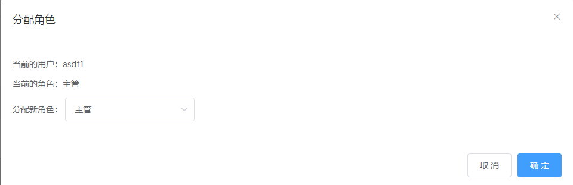

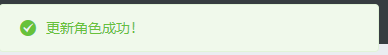

