# 1.整体布局

在plugins文件夹下的element.js里导入相关组件并注册

```js
import {Container, Header, Aside, Main } from 'element-ui'

Vue.use(Container)
Vue.use(Header)
Vue.use(Aside)
Vue.use(Main)
```

在components文件夹下的Home.vue+结构

```vue
<template>
  <el-container class="home-container">
    <!-- 头部区域 -->
    <el-header>Header
      <el-button type="info" @click="logout">退出</el-button>
    </el-header>
    <!-- 页面主体区域 -->
    <el-container>
      <!-- 侧边栏 -->
      <el-aside width="200px">Aside
      </el-aside>
      <!-- 右侧内容主体 -->
      <el-main>mian
      </el-main>
    </el-container>
  </el-container>
</template>
```

效果

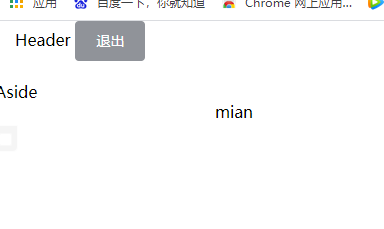

给三个区域添加背景颜色，样式

```css
<style lang="less" scoped>
.el-header {
  background-color: #373d41;
}
.el-aside {
  background-color: #333744;
}
.el-main {
  background-color: #eaedf1;
}
</style>
```

页面撑满全屏

给el-container 添加一个类class="home-container"

```css
.home-container {
  height: 100%;
}
```

效果

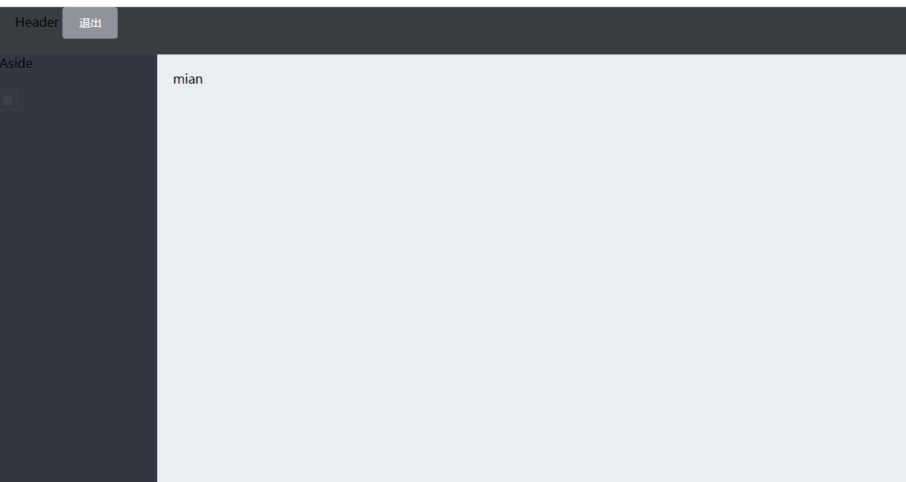

# 2.header区域布局

Home.vue+

结构

```vue
<!-- 头部区域 -->
<el-header>
  <div>
    
    <span>电商后台管理系统</span>
  </div>
  <el-button type="info" @click="logout">退出</el-button>
</el-header>
```

样式优化

```css
.el-header {
  background-color: #373d41;
  display: flex;
  justify-content: space-between;
  padding-left: 0;
  align-items: center;
  color: #fff;
  font-size: 20px;
  > div {
    display: flex;
    align-items: center;
    span {
      margin-left: 15px;
    }
  }
}
```

# 3.左侧菜单布局

在plugins文件夹下的element.js里导入相关组件并注册

```js
import {Menu, Submenu, MenuItem} from 'element-ui'

Vue.use(Menu)
Vue.use(Submenu)
Vue.use(MenuItem)
```

Home.vue+

结构

```vue
<!-- 侧边栏 -->
<el-aside width="200px">
        <el-menu background-color="#333744" text-color="#fff" active-text-color="#409EFF">
          <!-- 一级菜单 -->
          <el-submenu index="1">
             <!-- 一级菜单的模板区域 -->
            <template slot="title">
              <!-- 图标 -->
              <i class="el-icon-location"></i>
              <!-- 文本 -->
              <span>导航一</span>
            </template>
            <!-- 二级菜单 -->
            <el-menu-item index="1-4-1">
              <template slot="title">
                <!-- 图标 -->
                <i class="el-icon-location"></i>
                <!-- 文本 -->
                <span>导航一</span>
              </template>
            </el-menu-item>
          </el-submenu>
    </el-menu>
 </el-aside>
```

效果

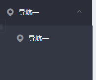

# 4.通过接口获取菜单数据

通过axios请求拦截器添加token，保证拥有获取数据的权限

在main.js里

```js
axios.interceptors.request.use(config => {
  // console.log(config)
  config.headers.Authorization = window.sessionStorage.getItem('token')
  // 在最后必须 return config
  return config
})
```

# 5.发起请求获取菜单数据

Home.vue+

行为

```vue
<script>
export default {
  data() {
    return {
      // 左侧菜单数据
      menulist: []
    }
  },
  //生命周期函数
  created() {
    this.getMenuList()
  },
  methods: {
    logout() {
      window.sessionStorage.clear()
      this.$router.push('/login')
    },
    // 获取所有的菜单
    async getMenuList() {
    const { data: res } = await this.$http.get('menus')
    if (res.meta.status !== 200) return this.$message.error(res.meta.msg)
    this.menulist = res.data
    console.log(res)
    }
  }
}
</script>
```

# 6.左侧菜单渲染

Home.vue+

结构

```vue
<!-- 侧边栏 -->
      <el-aside width="200px">
        <el-menu background-color="#333744" text-color="#fff" active-text-color="#409EFF">
          <!-- 一级菜单 -->
          <el-submenu :index="item.id + ''" v-for="item in menulist" :key="item.id">
             <!-- 一级菜单的模板区域 -->
            <template slot="title">
              <!-- 图标 -->
              <i class="el-icon-location"></i>
              <!-- 文本 -->
              <span>{{ item.authName }}</span>
            </template>
            <!-- 二级菜单 -->
            <el-menu-item :index="item.id + ''" v-for="subItem in item.children">
              <template slot="title">
                <!-- 图标 -->
                <i class="el-icon-location"></i>
                <!-- 文本 -->
                <span>{{item.authName}}</span>
              </template>
            </el-menu-item>
          </el-submenu>
    </el-menu>
</el-aside>
```

图标渲染

结构

```vue
<i :class="iconsObj[item.id]"></i>
```

行为

```js
data() {
    return {
      // 左侧菜单数据
      menulist: [],
      iconsObj: {
        '125': 'iconfont icon-user',
        '103': 'iconfont icon-tijikongjian',
        '101': 'iconfont icon-shangpin',
        '102': 'iconfont icon-danju',
        '145': 'iconfont icon-baobiao'
      }
    }
  }
```

样式优化

```css
.iconfont {
  margin-right: 10px;
}
```

效果

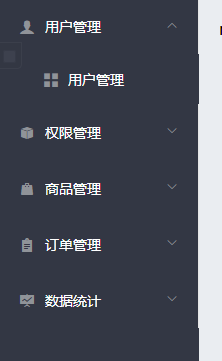

# 7.左侧菜单折叠/展开

Home.vue+

结构

```HTML
//侧边栏折叠改宽度
<el-aside :width="isCollapse ? '64px' : '200px'">
        //添加折叠选择区域，并设置类和点击事件
        <div class="toggle-button" @click="toggleCollapse">|||</div>
        <!-- 侧边栏菜单区域 -->
    	//element 菜单折叠相关属性collapse collapse-transition 
        <el-menu background-color="#333744" text-color="#fff" active-text-color="#409EFF" unique-opened :collapse="isCollapse" :collapse-transition="false">
```

样式

```css
.toggle-button {
  background-color: #4a5064;
  font-size: 10px;
  line-height: 24px;
  color: #fff;
  text-align: center;
  letter-spacing: 0.2em;
  cursor: pointer;
}
```

行为

```js
//在数据成员添加collapse
data() {
    return {
      ...
      // 是否折叠
      isCollapse: false
    }
//行为成员添加toggleCollapse事件函数
  methods: {
    ...
    // 点击按钮，切换菜单的折叠与展开
    toggleCollapse() {
      this.isCollapse = !this.isCollapse
    }
  }
}
```

效果

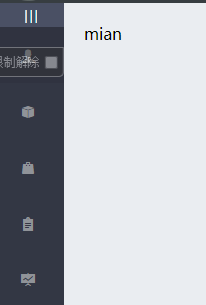

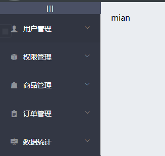

# 8.首页的路由重定向

在components文件夹下新建一个Welcome.vue

Welcome.vue+

```vue
<template>
    <div>
      <h3>Welcome</h3>
    </div>
</template>
```

在router.js里导入Welcome.vue

```js
import Welcome from './components/Welcome.vue'
```

然后路由重定向

```js
const router = new Router({
  routes: [
    { path: '/', redirect: '/login' },
    { path: '/login', component: Login },
    {
      path: '/home',
      component: Home,
      redirect: '/welcome',
      children: [
        { path: '/welcome', component: Welcome }
      ]
    }
  ]
})
```

在Home.vue添加路由占位符

```vue
<!-- 右侧内容主体 -->
<el-main>
  <!-- 路由占位符 -->
  <router-view></router-view>
</el-main>
```

效果

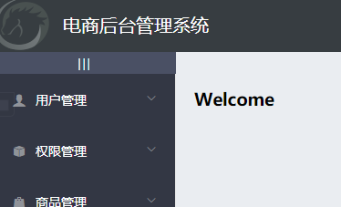

# 9.左侧菜单改造为路由链接

Home.vue+

在el-menu标签添加router属性

```vue
<el-menu background-color="#333744" text-color="#fff" active-text-color="#409EFF" unique-opened :collapse="isCollapse" :collapse-transition="false" :router="true">
```

在二级菜单的el-menu-item标签里面将index属性绑定修改成"/+路径"

```vue
<!-- 二级菜单 -->
<el-menu-item :index=" '/' + item.path + ''" v-for="subItem in item.children">
```

# 10.二级菜单用户列表

在components文件夹下新建一个user文件夹，并在user文件夹下新建Users.vue

```vue
<template>
  <div>
   
  </div>
</template>

<script>
export default {
    
}
</script>

<style lang="less" scoped>
</style>

```

在router.js更改路由规则

先导入Users.vue，再添加子路由

```js
import Users from './components/user/Users.vue'
...
const router = new Router({
  routes: [
    { path: '/', redirect: '/login' },
    { path: '/login', component: Login },
    {
      path: '/home',
      component: Home,
      redirect: '/welcome',
      children: [
        { path: '/welcome', component: Welcome },
        { path: '/users', component: Users }
      ]
    }
  ]
})
```

效果

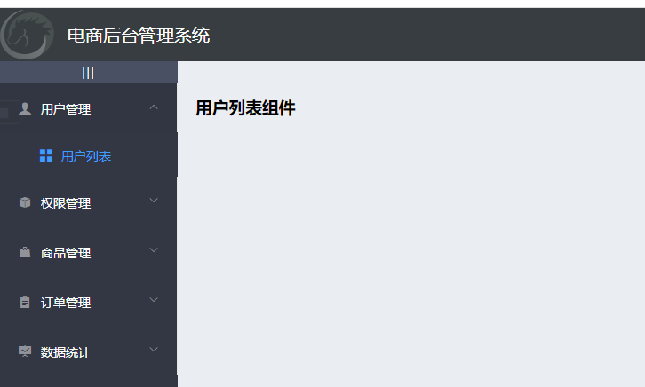

# 11.解决用户列表小问题

选择时高亮（激活）


点击链接时，把对应的地址保存到sessionStorage中，当下一次刷新页面的时候，自动赋值给左侧二级菜单

```vue
//先给el-menu标签添加:default-active="activePath"属性
...
<!-- 侧边栏菜单区域 -->
        <el-menu background-color="#333744" text-color="#fff" active-text-color="#409EFF" unique-opened :collapse="isCollapse" :collapse-transition="false" :router="true" :default-active="activePath">
...
//再给二级菜单注册点击事件
...
<!-- 二级菜单 -->
<el-menu-item :index=" '/' + subItem.path" v-for="subItem in item.children" @click="saveNavState('/' + subItem.path)">
...
//再添加一个数据成员activePath
...
data() {
    return {
      ...
      // 被激活的链接地址
      activePath: ''
    }
  }
...
//当Home组件被加载时就要保存，生命周期函数+
...
//生命周期函数
  created() {
    this.getMenuList()
    this.activePath = window.sessionStorage.getItem('activePath')
  }
...
//行为成员新增点击事件函数
...
methods: {
    ...
    // 保存链接的激活状态
    saveNavState(activePath) {
      window.sessionStorage.setItem('activePath', activePath)
      this.activePath = activePath
    }
...
```

效果


# 12.绘制用户列表

Users.vue+

样式

- 面包屑导航区域
- 卡片视图区域

```vue
<template>
    <div>
        <!-- 面包屑导航区域 -->
        <el-breadcrumb separator-class="el-icon-arrow-right">
          <el-breadcrumb-item :to="{ path: '/home' }">首页</el-breadcrumb-item>
          <el-breadcrumb-item>用户管理</el-breadcrumb-item>
          <el-breadcrumb-item>用户列表</el-breadcrumb-item>
        </el-breadcrumb>
    
        <!-- 卡片视图区域 -->
        <el-card>
          <!-- 搜索与添加区域 -->
          <el-row :gutter="20">
            <el-col :span="8">
              <el-input placeholder="请输入内容">
                <el-button slot="append" icon="el-icon-search"></el-button>
              </el-input>
            </el-col>
            <el-col :span="4">
              <el-button type="primary">添加用户</el-button>
            </el-col>
          </el-row>
        </el-card>
    </div>
</template>
```

按需导入，在plugins文件夹下的element.js里导入

```js
...
import {... Breadcrumb, BreadcrumbItem, Card, Row, Col } from 'element-ui'

...
Vue.use(Breadcrumb)
Vue.use(BreadcrumbItem)
Vue.use(Card)
Vue.use(Row)
Vue.use(Col)
```

覆盖样式，在assets文件夹下的css里的global.css里

```css
...

.el-breadcrumb {
  margin-bottom: 15px;
  font-size: 12px;
}

.el-card {
  box-shadow: 0 1px 1px rgba(0, 0, 0, 0.15) !important;
}
```

效果

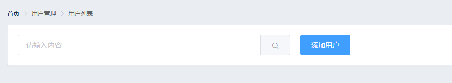

# 13.获取用户列表数据

Users.vue+

行为

```vue
<script>
  export default {
    data() {
      return {
        // 获取用户列表的参数对象
        queryInfo: {
            query: '',
            // 当前的页数
            pagenum: 1,
            // 当前每页显示多少条数据
            pagesize: 2
        },
        userlist: [],
        total: 0
      }
    },
    created() {
        this.getUserList()
    },
    methods: {
        async getUserList() {
            const { data: res } = await this.$http.get('users', {params: this.queryInfo})
            if (res.meta.status !== 200) {
                return this.$message.error('获取用户列表失败！')
            }
            this.userlist = res.data.users
            this.total = res.data.total
            console.log(res)
        }
    }
  }
</script>
```

效果

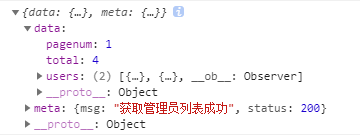

# 14.渲染用户列表数据

Users.vue+

样式

```vue
<!-- 用户列表区域 -->
<el-table :data="userlist">
    <el-table-column label="姓名" prop="username"></el-table-column>
    <el-table-column label="邮箱" prop="email"></el-table-column>
    <el-table-column label="电话" prop="mobile"></el-table-column>
    <el-table-column label="角色" prop="role_name"></el-table-column>
    <el-table-column label="状态"></el-table-column>
</el-table>
```

按需导入，在plugins文件夹下的element.js里导入

```js
...
import { ... Table, TableColumn } from 'element-ui'

...
Vue.use(Table)
Vue.use(TableColumn)
```

**表格添加边框线**：给el-table标签添加border属性

**隔行变色**：给el-table标签添加stripe属性

覆盖样式，在assets文件夹下的css里的global.css里

```css
...

.el-table {
  margin-top: 15px;
  font-size: 12px;
}
```

效果

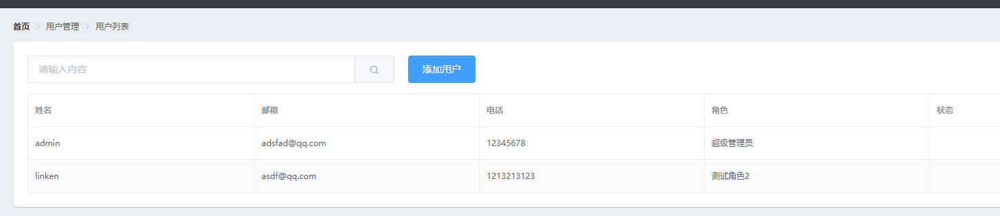

# 15.为用户列表添加索引列

```vue
<!-- 用户列表区域 -->
            <el-table :data="userlist" border stripe >
                <el-table-column type="index"></el-table-column>
                ...
            </el-table>
```

效果

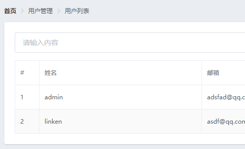

# 16.改造状态列的显示效果

给template标签添加slot-scope="scope"属性，用于接收数据

而scope.row存放的是一行的数据

Users.vue+

结构

```vue
 <!-- 用户列表区域 -->
            <el-table :data="userlist" border stripe >
                ...
                <el-table-column label="状态">
                    <template slot-scope="scope">
                        <el-switch v-model="scope.row.mg_state">
                        </el-switch>
                    </template>
                </el-table-column>
            </el-table>
```

按需导入，在plugins文件夹下的element.js里导入

```js
...
import { ... Switch } from 'element-ui'

...
Vue.use(Switch)
```

# 17.插槽形式自定义列的渲染

Users.vue+

结构

```vue
<!-- 用户列表区域 -->
            <el-table :data="userlist" border stripe >
                ...
                <el-table-column label="操作">
                  <template slot-scope="scope">
                    <!-- 修改按钮 -->
                    <el-button type="primary" icon="el-icon-edit" size="mini"></el-button>
                    <!-- 删除按钮 -->
                    <el-button type="danger" icon="el-icon-delete" size="mini"></el-button>
                    <!-- 分配角色按钮 -->
                    <el-tooltip effect="dark" content="分配角色" placement="top" :enterable="false">
                      <el-button type="warning" icon="el-icon-setting" size="mini"></el-button>
                    </el-tooltip>
                  </template>
                </el-table-column>
            </el-table>
```

按需导入，在plugins文件夹下的element.js里导入

```js
...
import { ... Tooltip } from 'element-ui'

...
Vue.use(Tooltip)
```

效果


# 18.实现数据分页效果

Users.vue+

结构

```vue
<!-- 分页区域 -->
          <el-pagination @size-change="handleSizeChange" @current-change="handleCurrentChange" :current-page="queryInfo.pagenum" :page-sizes="[1, 2, 5, 10]" :page-size="queryInfo.pagesize" layout="total, sizes, prev, pager, next, jumper" :total="total">
          </el-pagination>
```

行为成员新增

```js
 methods: {
        ...
        // 监听 pagesize 改变的事件
        handleSizeChange(newSize) {
          // console.log(newSize)
          this.queryInfo.pagesize = newSize
          this.getUserList()
        },
        // 监听 页码值 改变的事件
        handleCurrentChange(newPage) {
          // console.log(newPage)
          this.queryInfo.pagenum = newPage
          this.getUserList()
        }
    }
```

按需导入，在plugins文件夹下的element.js里导入

```
...
import { ... Pagination } from 'element-ui'

...
Vue.use(Pagination)
```

覆盖样式，在assets文件夹下的css里的global.css里

```css
...

.el-pagination {
  margin-top: 15px;
}
```

效果

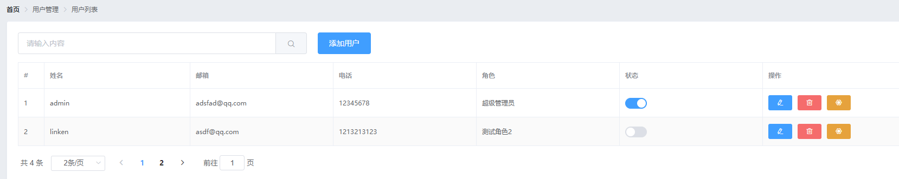

# 19.实现用户状态的修改

Users.vue+

结构

给el-switch标签change属性绑定事件

```vue
<el-switch v-model="scope.row.mg_state" @change="userStateChanged(scope.row)">
</el-switch>
```

行为成员新增

```js
methods: {
        ...
        // 监听 switch 开关状态的改变
        async userStateChanged(userinfo) {
          console.log(userinfo)
          const { data: res } = await this.$http.put(
            `users/${userinfo.id}/state/${userinfo.mg_state}`
          )
          if (res.meta.status !== 200) {
            userinfo.mg_state = !userinfo.mg_state
            return this.$message.error('更新用户状态失败！')
          }
          this.$message.success('更新用户状态成功！')
        }
    }
```

效果

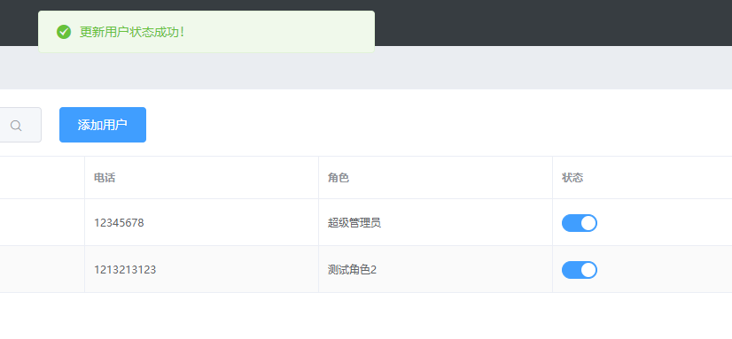

# 20.实现搜索功能

Users.vue+

结构

给el-input标签双向数据绑定

给el-button标签绑定点击事件

```vue
<el-input placeholder="请输入内容" v-model="queryInfo.query" clearable @clear="getUserList">
                <el-button slot="append" icon="el-icon-search" @click="getUserList"></el-button>
              </el-input>
```

效果

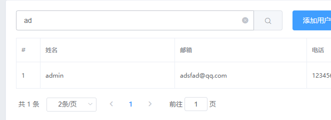

# 21.实现用户添加功能

Users.vue+

结构

给添加用户按钮添加点击事件

```vue
<!-- 搜索与添加区域 -->
          <el-row :gutter="20">
            ...
              <el-button type="primary" @click="addDialogVisible = true">添加用户</el-button>
            </el-col>
          </el-row>
```

添加对话框，当点击“取消”或者“确定”时隐藏对话框

```vue
<!-- 添加用户的对话框 -->
<el-dialog title="添加用户" :visible.sync="addDialogVisible" width="50%" @close="addDialogClosed">
  <!-- 底部区域 -->
  <span slot="footer" class="dialog-footer">
    <el-button @click="addDialogVisible = false">取 消</el-button>
    <el-button type="primary" @click="addDialogVisible = false">确 定</el-button>
  </span>
</el-dialog>
```

数据成员新增

```js
data() {
      return {
        ...
        // 控制添加用户对话框的显示与隐藏
        addDialogVisible: false,
      }
    }
```

行为成员新增

```js
methods: {
        ...
        // 监听添加用户对话框的关闭事件
        addDialogClosed() {
          this.$refs.addFormRef.resetFields()
        }
    }
```

效果

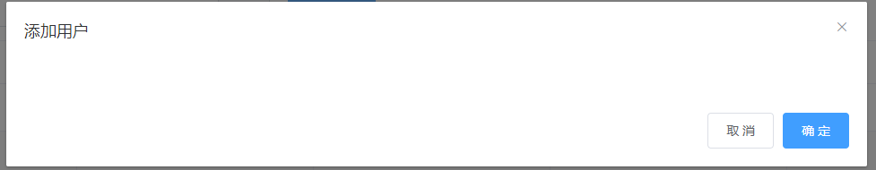

# 22.添加用户的对话框中渲染一个用户表单

Users.vue+

结构


```vue
<!-- 添加用户的对话框 -->
<el-dialog title="添加用户" :visible.sync="addDialogVisible" width="50%" @close="addDialogClosed">
  <!-- 内容主体区域 -->
  <el-form :model="addForm" :rules="addFormRules" ref="addFormRef" label-width="70px">
    <el-form-item label="用户名" prop="username">
      <el-input v-model="addForm.username"></el-input>
    </el-form-item>
    <el-form-item label="密码" prop="password">
      <el-input v-model="addForm.password"></el-input>
    </el-form-item>
    <el-form-item label="邮箱" prop="email">
      <el-input v-model="addForm.email"></el-input>
    </el-form-item>
    <el-form-item label="手机" prop="mobile">
      <el-input v-model="addForm.mobile"></el-input>
    </el-form-item>
  </el-form>
 ...
</el-dialog>
```

数据绑定，定义校验规则

数据成员新增

```js
data() {
  return {
    ...
    // 添加用户的表单数据
    addForm: {
      username: '',
      password: '',
      email: '',
      mobile: ''
    },
    // 添加表单的验证规则对象
    addFormRules: {
      username: [
        { required: true, message: '请输入用户名', trigger: 'blur' },
        {
          min: 3,
          max: 10,
          message: '用户名的长度在3~10个字符之间',
          trigger: 'blur'
        }
      ],
      password: [
        { required: true, message: '请输入密码', trigger: 'blur' },
        {
          min: 6,
          max: 15,
          message: '用户名的长度在6~15个字符之间',
          trigger: 'blur'
        }
      ],
      email: [
        { required: true, message: '请输入邮箱', trigger: 'blur' }
      ],
      mobile: [
        { required: true, message: '请输入手机号', trigger: 'blur' }
      ]
    }
  }
}
```

效果

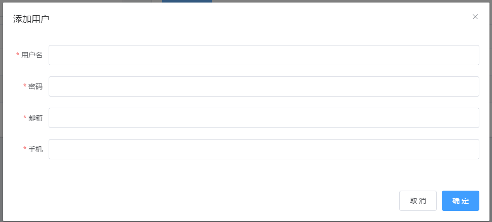

# 23.实现自定义规则

Users.vue+

先自定义

然后通过validator指向

数据成员新增

```js
data() {
      // 验证邮箱的规则
      var checkEmail = (rule, value, cb) => {
        // 验证邮箱的正则表达式
        const regEmail = /^([a-zA-Z0-9_-])+@([a-zA-Z0-9_-])+(\.[a-zA-Z0-9_-])+/

        if (regEmail.test(value)) {
          // 合法的邮箱
          return cb()
        }

        cb(new Error('请输入合法的邮箱'))
      }

      // 验证手机号的规则
      var checkMobile = (rule, value, cb) => {
        // 验证手机号的正则表达式
        const regMobile = /^(0|86|17951)?(13[0-9]|15[012356789]|17[678]|18[0-9]|14[57])[0-9]{8}$/

        if (regMobile.test(value)) {
          return cb()
        }

        cb(new Error('请输入合法的手机号'))
      }
      return {
        ...
        // 添加表单的验证规则对象
        addFormRules: {
          ...
          email: [
            { required: true, message: '请输入邮箱', trigger: 'blur' },
            { validator: checkEmail, trigger: 'blur' }
          ],
          mobile: [
            { required: true, message: '请输入手机号', trigger: 'blur' },
            { validator: checkMobile, trigger: 'blur' }
          ]
        }
      }
      }
    }
```

效果

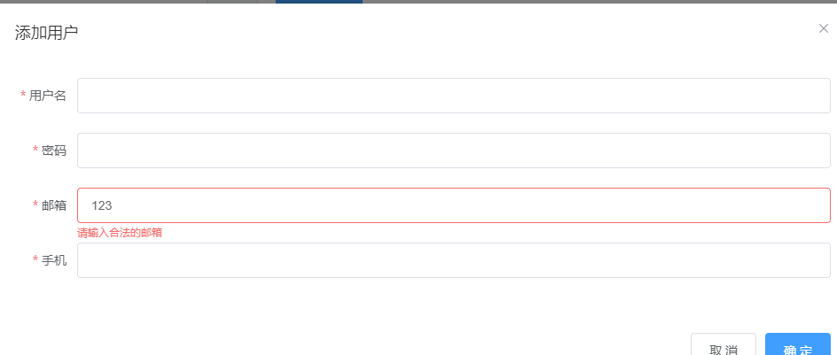

# 24.添加用户表单的重置功能

Users.vue+

结构

给el-dialog标签绑定点击关闭事件

```vue
<!-- 添加用户的对话框 -->
        <el-dialog title="添加用户" :visible.sync="addDialogVisible" width="50%" @close="addDialogClosed">
          ...
        </el-dialog>
```

行为成员添加

通过refs所提供的的api重置

```js
methods: {
        ...
        // 监听添加用户对话框的关闭事件
        addDialogClosed() {
          this.$refs.addFormRef.resetFields()
        }
    }
```

# 25.添加用户的预验证功能

Users.vue+

结构

修改点击确认触发的函数

```vue
<!-- 底部区域 -->
          <span slot="footer" class="dialog-footer">
            <el-button @click="addDialogVisible = false">取 消</el-button>
            <el-button type="primary" @click="addUser">确 定</el-button>
          </span>
```

行为成员新增

```js
methods: {
        ...
        // 点击按钮，添加新用户
        addUser() {
          this.$refs.addFormRef.validate(async valid => {
            if (!valid) return
            // 可以发起添加用户的网络请求
            
          })
        }

    }
```

# 26.发起请求添加一个新用户

Users.vue+

行为

```js
methods: {
        ...
        // 点击按钮，添加新用户
        addUser() {
          this.$refs.addFormRef.validate(async valid => {
            if (!valid) return
            // 可以发起添加用户的网络请求
            const { data: res } = await this.$http.post('users', this.addForm)

            if (res.meta.status !== 201) {
              this.$message.error('添加用户失败！')
            }

            this.$message.success('添加用户成功！')
            // 隐藏添加用户的对话框
            this.addDialogVisible = false
            // 重新获取用户列表数据
            this.getUserList()
          })
        }

    }
```

# 27.用户修改

Users.vue+

结构

在修改按钮上注册点击事件

```vue
<!-- 用户列表区域 -->
            <el-table :data="userlist" border stripe >
                ...
                <el-table-column label="操作">
                  <template slot-scope="scope">
                    <!-- 修改按钮 -->
                    <el-button type="primary" icon="el-icon-edit" size="mini" @click="showEditDialog()"></el-button>
                    ...
                  </template>
                </el-table-column>
            </el-table>
```

数据成员新增

```js
data() {
      ...
      return {
        ...
        // 控制修改用户对话框的显示与隐藏
        editDialogVisible: false
      }
    }
```

行为成员新增

```js
methods: {
        ...
        // 展示编辑用户的对话框
        showEditDialog() {
          this.editDialogVisible = true
        }

    }
```

效果

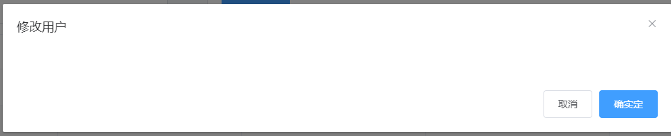

# 28.根据id查询用户信息

Users.vue+

结构

在修改按钮上注册的点击事件函数传参

```vue
<!-- 用户列表区域 -->
            <el-table :data="userlist" border stripe >
                ...
                <el-table-column label="操作">
                  <template slot-scope="scope">
                    <!-- 修改按钮 -->
                    <el-button type="primary" icon="el-icon-edit" size="mini" @click="showEditDialog(scope.row.id)"></el-button>
                    ...
                  </template>
                </el-table-column>
            </el-table>
```

数据成员新增editForm: {}

```js
data() {
      ...
      return {
        ...
        // 查询到的用户信息对象
        editForm: {}
      }
    }
```

行为成员修改

showEditDialog事件函数修改

```js
methods: {
        ...
        // 展示编辑用户的对话框
        async showEditDialog(id) {
          // console.log(id)
          const { data: res } = await this.$http.get('users/' + id)

          if (res.meta.status !== 200) {
            return this.$message.error('查询用户信息失败！')
          }

          this.editForm = res.data
          this.editDialogVisible = true
        }


    }
```

# 29.绘制修改用户表单

Users.vue+

结构

```vue
<!-- 修改用户的对话框 -->
        <el-dialog title="修改用户" :visible.sync="editDialogVisible" width="50%" @close="editDialogClosed">
          <el-form :model="editForm" :rules="editFormRules" ref="editFormRef" label-width="70px">
            <el-form-item label="用户名">
              <el-input v-model="editForm.username" disabled></el-input>
            </el-form-item>
            <el-form-item label="邮箱" prop="email">
              <el-input v-model="editForm.email"></el-input>
            </el-form-item>
            <el-form-item label="手机" prop="mobile">
              <el-input v-model="editForm.mobile"></el-input>
            </el-form-item>
          </el-form>
          <span slot="footer" class="dialog-footer">
            <el-button @click="editDialogVisible = false">取 消</el-button>
            <el-button type="primary" @click="editDialogVisible = false">确 定</el-button>
          </span>
        </el-dialog>
```

数据成员新增editFormRules: {}

```js
data() {
      ...
      return {
        ...
        // 修改表单的验证规则对象
        editFormRules: {
          email: [
            { required: true, message: '请输入用户邮箱', trigger: 'blur' },
            { validator: checkEmail, trigger: 'blur' }
          ],
          mobile: [
            { required: true, message: '请输入用户手机', trigger: 'blur' },
            { validator: checkMobile, trigger: 'blur' }
          ]
        }
      }
}
```

# 30.修改表单关闭之后的重置操作

Users.vue+

结构

给el-dialog标签注册单击事件editDialogClosed

```vue
<!-- 修改用户的对话框 -->
        <el-dialog title="修改用户" :visible.sync="editDialogVisible" width="50%" @close="editDialogClosed">
          <el-form :model="editForm" :rules="editFormRules" ref="editFormRef" label-width="70px">
            <el-form-item label="用户名">
              <el-input v-model="editForm.username" disabled></el-input>
            </el-form-item>
            <el-form-item label="邮箱" prop="email">
              <el-input v-model="editForm.email"></el-input>
            </el-form-item>
            <el-form-item label="手机" prop="mobile">
              <el-input v-model="editForm.mobile"></el-input>
            </el-form-item>
          </el-form>
          <span slot="footer" class="dialog-footer">
            <el-button @click="editDialogVisible = false">取 消</el-button>
            <el-button type="primary" @click="editDialogVisible = false">确 定</el-button>
          </span>
</el-dialog>
```

行为成员新增

```js
methods: {
        ...
        // 监听修改用户对话框的关闭事件
        editDialogClosed() {
          this.$refs.editFormRef.resetFields()
        }


    }
```

# 31.修改提交之前的表单预验证

Users.vue+

结构

给修改对话框的确认按钮注册事件editUserInfo

```vue
<!-- 修改用户的对话框 -->
        <el-dialog title="修改用户" :visible.sync="editDialogVisible" width="50%" @close="editDialogClosed">
          ...
          <span slot="footer" class="dialog-footer">
            <el-button @click="editDialogVisible = false">取 消</el-button>
            <el-button type="primary" @click="editUserInfo">确 定</el-button>
          </span>
        </el-dialog>
```

成员新增editUserInfo

```js
methods: {
        ...
        // 修改用户信息并提交
        editUserInfo() {
          this.$refs.editFormRef.validate(valid => {
            if (!valid) return
            // 发起修改用户信息的数据请求
          })
        }
}
```

发起修改用户信息的请求

```js
methods: {
        ...
        // 修改用户信息并提交
        editUserInfo() {
          this.$refs.editFormRef.validate(valid => {
            if (!valid) return
            // 发起修改用户信息的数据请求
            const { data: res } = await this.$http.put(
              'users/' + this.editForm.id,
              {
                email: this.editForm.email,
                mobile: this.editForm.mobile
              }
            )

            if (res.meta.status !== 200) {
              return this.$message.error('更新用户信息失败！')
            }

            // 关闭对话框
            this.editDialogVisible = false
            // 刷新数据列表
            this.getUserList()
            // 提示修改成功
            this.$message.success('更新用户信息成功！')
          })
        }
}
```

# 32.删除用户的操作

Users.vue+

结构

给删除按钮注册事件removeUserById

```vue
<!-- 用户列表区域 -->
<el-table :data="userlist" border stripe >
    ...
    <el-table-column label="操作">
      <template slot-scope="scope">
        ...
        <!-- 删除按钮 -->
        <el-button type="danger" icon="el-icon-delete" size="mini" @click="removeUserById(scope.row.id)"></el-button>
        ...
      </template>
    </el-table-column>
</el-table>
```

行为成员新增removeUserById

```js
methods: {
        ...
        // 根据Id删除对应的用户信息
        async removeUserById(id) {
          // 弹框询问用户是否删除数据
          const confirmResult = await this.$confirm(
            '此操作将永久删除该用户, 是否继续?',
            '提示',
            {
              confirmButtonText: '确定',
              cancelButtonText: '取消',
              type: 'warning'
            }
          ).catch(err => err)

          // 如果用户确认删除，则返回值为字符串 confirm
          // 如果用户取消了删除，则返回值为字符串 cancel
          // console.log(confirmResult)
          if (confirmResult !== 'confirm') {
            return this.$message.info('已取消删除')
          }

          const { data: res } = await this.$http.delete('users/' + id)

          if (res.meta.status !== 200) {
            return this.$message.error('删除用户失败！')
          }

          this.$message.success('删除用户成功！')
          this.getUserList()
        }
}
```

按需导入，在plugins文件夹下的element.js里导入

```js
...
import { ... MessageBox } from 'element-ui'

...
Vue.prototype.$confirm = MessageBox.confirm
```

效果

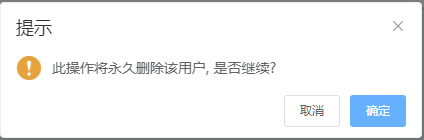

