# 1.登陆业务流程

1. 在登陆页面输入用户名和密码
2. 调用后台接口进行验证
3. 通过验证之后，根据后台响应的状态跳转到项目主页

# 2.登陆业务的相关技术点

- http是无状态的
- 通过cookies在客户端记录状态
- 通过session在服务器端记录状态
- 通过token方式维持状态

如果前端与服务器存在**跨域问题**，要使用token方式维持登陆状态，不然则使用cookies和session就行

# 3.token原理分析

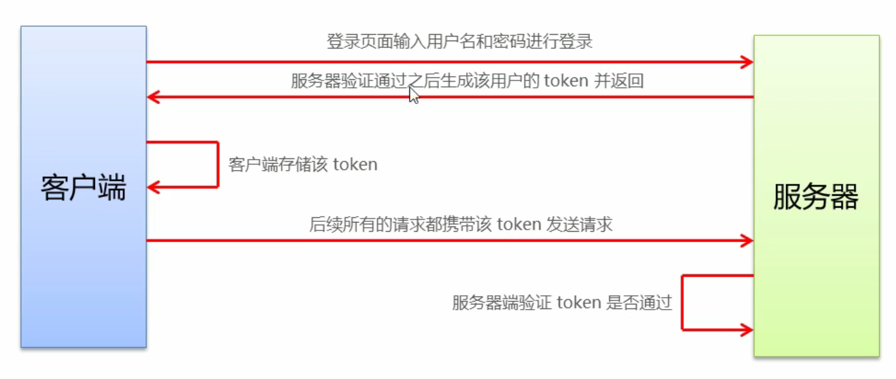

1. 登录页面输入用户名和密码进行登陆
2. 服务器验证痛过之后生成该用户的token值并返回
3. 客户端存储该token
4. 后续的请求都携带该token值发送请求
5. 服务器验证token是否通过

# 4.登陆/退出页面的布局

用Element-ui

哪些组件

- el-form 表单
- el-form-item
- el-input
- el-button
- 字体图标

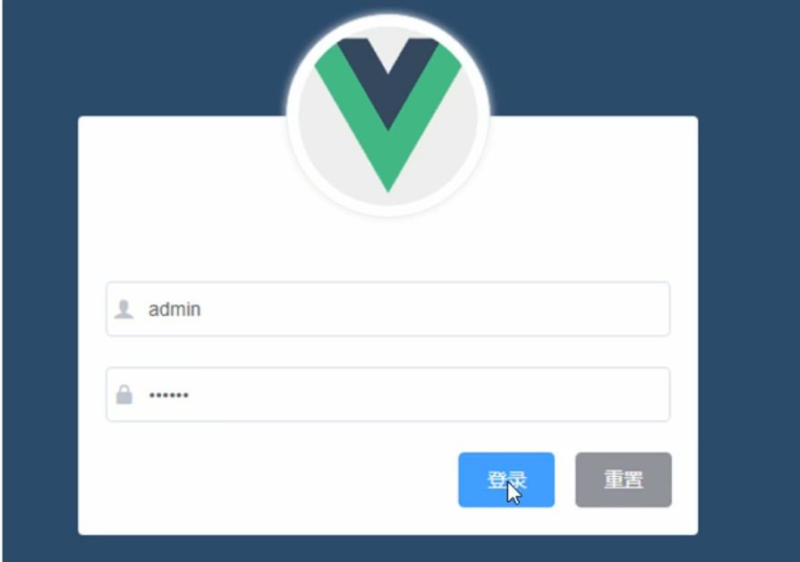

## 1背景

**App.vue**


**router.js**

```js
import Vue from 'vue'
import Router from 'vue-router'

Vue.use(Router)

export default new Router({
  routes: [
  ]
})
```

通过路由的形式将Login.vue渲染到App.vue根组件中

```js
import Vue from 'vue'
import Router from 'vue-router'
import Login from './components/Login.vue'

Vue.use(Router)

export default new Router({
  routes: [
    { path: '/', redirect: '/login' },
    { path: '/login', component: Login }
  ]
})

```


**components文件下的Login.vue**

.vue文件是单文件组件，内容包括

- 结构template
- 行为script
- 样式style

**style的scoped属性限制了样式只对本文件生效，否则全局生效**

```vue
<template>
  <div>
   
  </div>
</template>
<script>
export default {}
</script>
<style lang="less" scoped>
</style>
```

注意要在可视化面板的依赖安装 

开发依赖

less-loader

less

在Login.vue文件下写样式，修改背景色

```css
<style lang="less" scoped>
.login_container {
  background-color: #2b4b6b;
}
</style>
```

效果（没有占满屏幕）

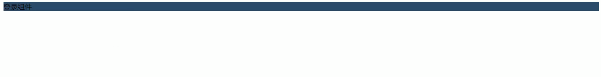

检查发现HTML，body和和id为app的div元素的高度都没占满全屏

需要在项目的assets文件下下新建一个css文件夹，然后新建一个global.css文件（这是一个全局样式表）

```css
/* 全局样式表 */
html,
body,
#app {
  height: 100%;
  margin: 0;
  padding: 0;
}

```

这时需要在入口文件main.js中导入才会生效

```js
// 导入全局样式表
import './assets/css/global.css'
```

此时还没不能生效

还需要在Login.vue文件下将login_container类高度设为100%

```css
<style lang="less" scoped>
.login_container {
  background-color: #2b4b6b;
  height: 100%;
}
</style>
```

效果

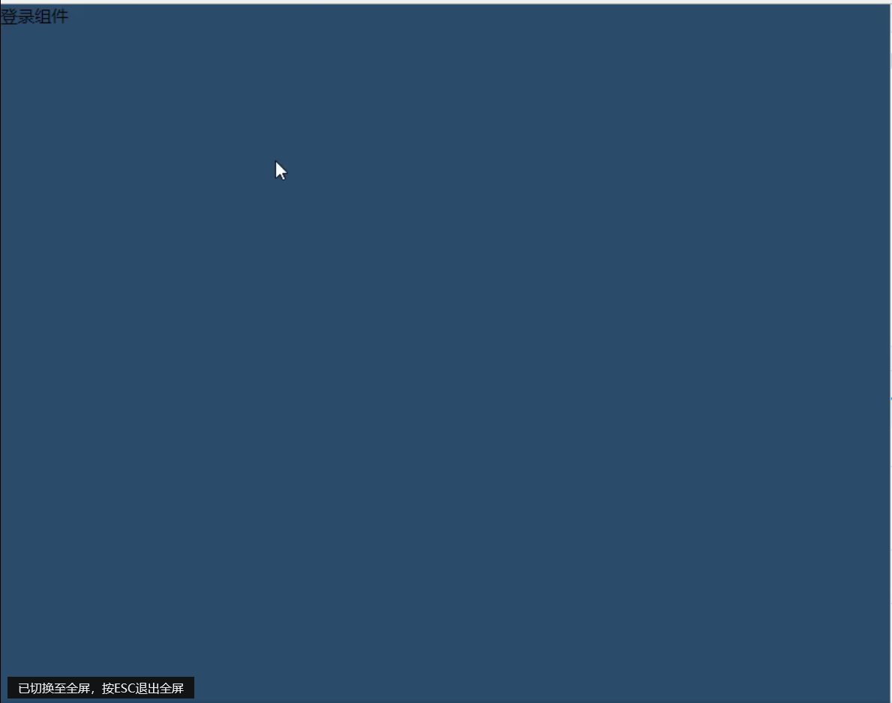

## 2.绘制登陆盒子

在Login.vue文件下

结构

```html
<template>
  <div class="login_container">
    <div class="login_box">
      
    </div>
  </div>
</template>
```

样式

```css
<style lang="less" scoped>
.login_container {
  background-color: #2b4b6b;
  height: 100%;
}

.login_box {
  width: 450px;
  height: 300px;
  background-color: #fff;
  border-radius: 3px;
</style>
```

效果

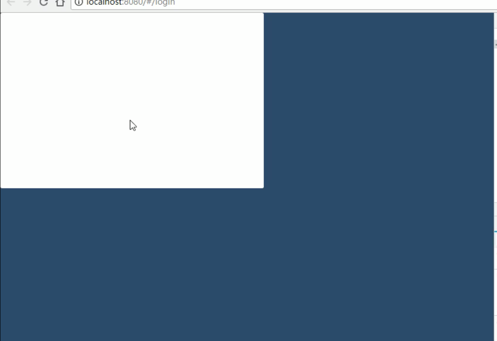

需要将盒子放到中间

样式

```css
<style lang="less" scoped>
.login_container {
  background-color: #2b4b6b;
  height: 100%;
}

.login_box {
  width: 450px;
  height: 300px;
  background-color: #fff;
  border-radius: 3px;
  position: absolute;
  left: 50%;
  top: 50%;
</style>
```

效果

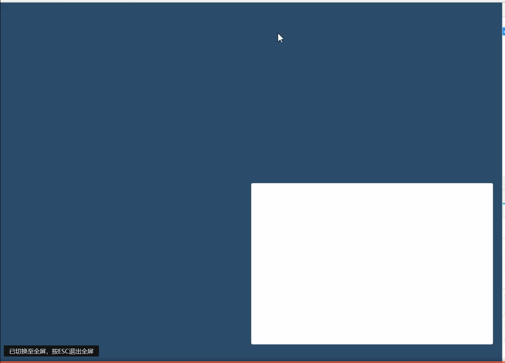

样式再改

```css
<style lang="less" scoped>
.login_container {
  background-color: #2b4b6b;
  height: 100%;
}

.login_box {
  width: 450px;
  height: 300px;
  background-color: #fff;
  border-radius: 3px;
  position: absolute;
  left: 50%;
  top: 50%;
  transform: translate(-50%, -50%);
</style>
```

效果

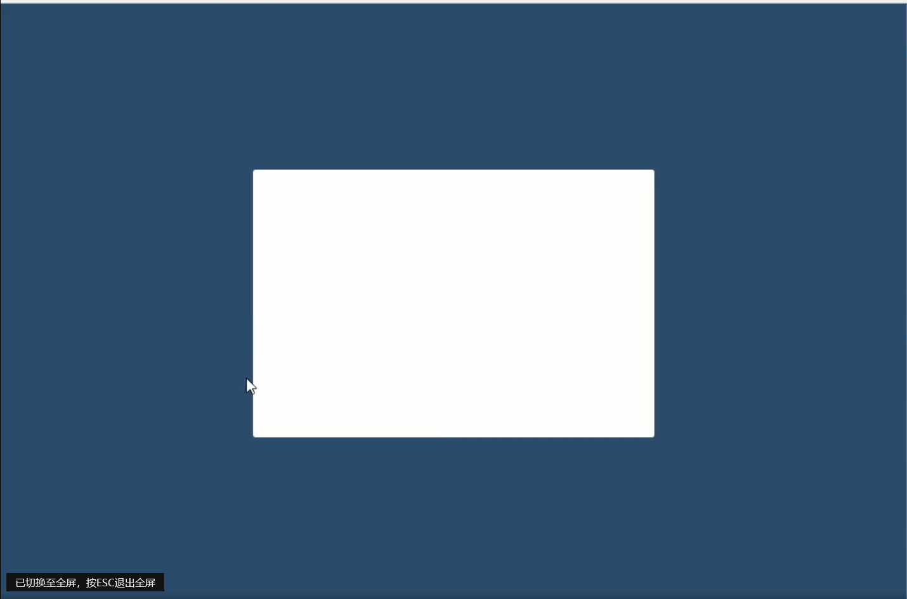

## 3.盒子头部

在Login.vue文件下

结构

```HTML
<template>
  <div class="login_container">
    <div class="login_box">
      <!-- 头像区域 -->
      <div class="avatar_box">
        
      </div>
    </div>
  </div>
</template>
```

效果

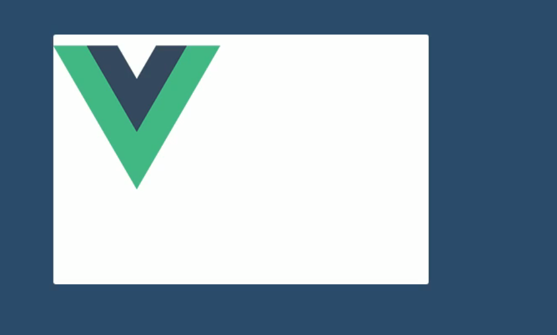

样式

根据less语法，可以嵌套

```css
<style lang="less" scoped>
.login_container {
  background-color: #2b4b6b;
  height: 100%;
}

.login_box {
  width: 450px;
  height: 300px;
  background-color: #fff;
  border-radius: 3px;
  position: absolute;
  left: 50%;
  top: 50%;
  transform: translate(-50%, -50%);
  .avatar_box {
    height: 130px;
    width: 130px;
    img {
      width: 100%;
      height: 100%;
    }
  }
}
</style>
```

效果

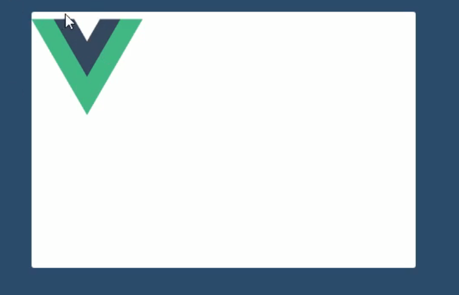

圆角+边框线，.avatar_box+

```css
border: 1px solid #eee;
border-radius: 50%;
```

效果


图片也圆角img样式+

```css
border-radius: 50%;
```

效果

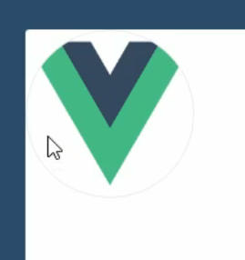

图片与边框要有间隙，.avatar_box+

```css
padding: 10px;
```

效果


给图片加背景颜色，img+

```css
background-color: #eee;
```

效果


给边框线加阴影，.avatar_box+

```css
box-shadow: 0 0 10px #ddd;
```

效果

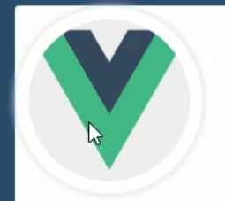

摆正头部，.avatar_box+

```css
position: absolute;
left: 50%;
```

效果

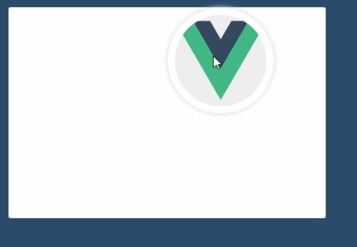

调整居中，.avatar_box+

```css
transform: translate(-50%);
```

效果

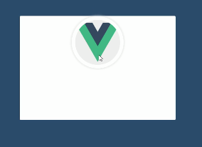

纵向上移一点，.avatar_box+

```
transform: translate(-50%,-50%);
```

效果

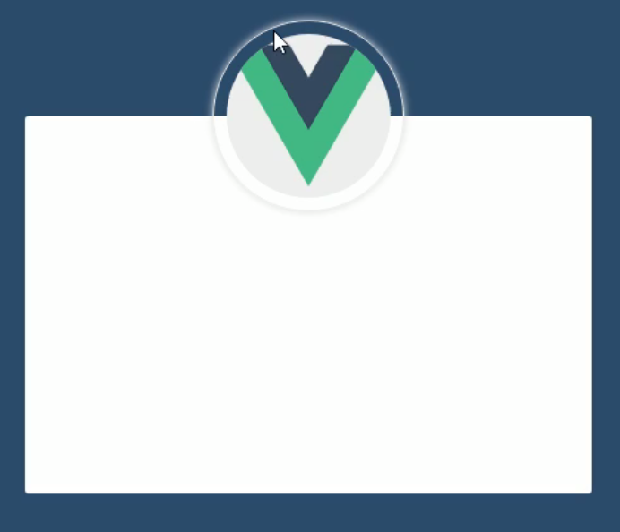

## 4.盒子表单

打开Element官网：https://element.eleme.cn/#/zh-CN

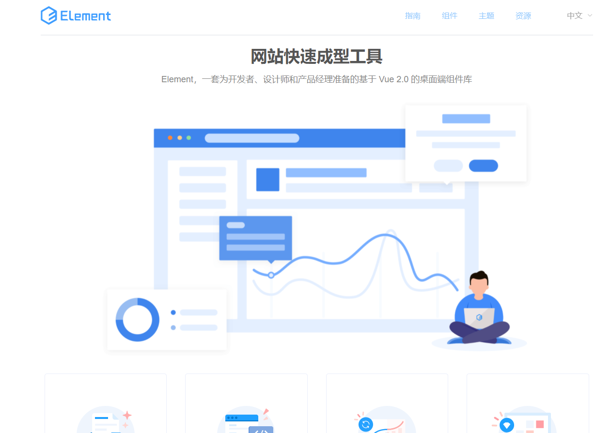

找到需要的组件，复制

```html
<el-form ref="form" :model="form" label-width="80px">
  <el-form-item label="活动名称">
    <el-input v-model="form.name"></el-input>
  </el-form-item>
</el-form>
```

删除不要的属性

```html
<el-form label-width="80px">
  <el-form-item label="活动名称">
    <el-input></el-input>
  </el-form-item>
</el-form>
```

如果直接放Login.vue结构里会出错

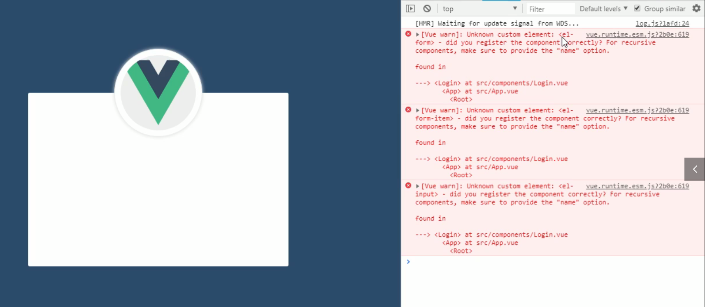

因为我们是按需导入，所以我们还需要在plugins文件夹下的element.js导入需要的组件

```js
import Vue from 'vue'
import { Button, Form, FormItem, Input, Message } from 'element-ui'
```

并且还需要在该文件下用Vue.use把他们注册为全局可用的组件

```js
Vue.use(Button)
Vue.use(Form)
Vue.use(FormItem)
Vue.use(Input)
```

效果

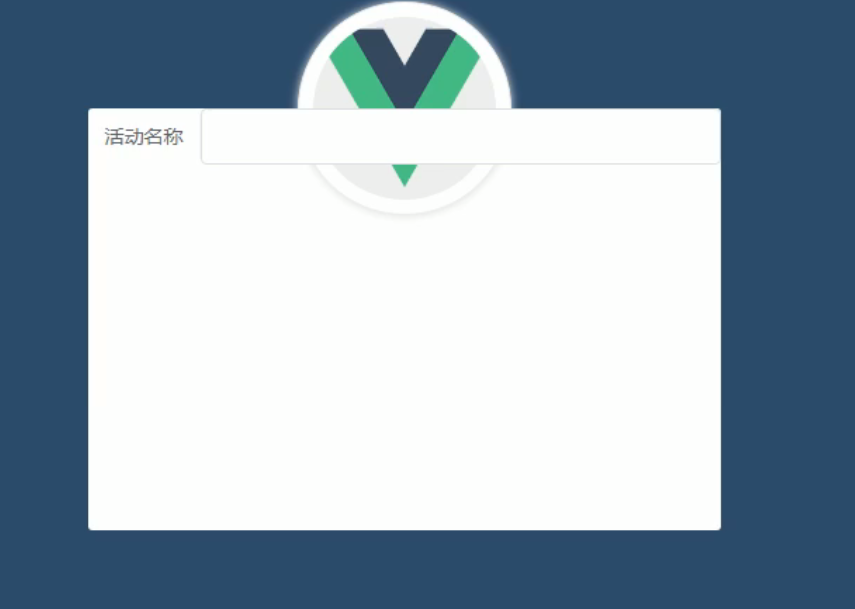

label-width是给提示文本占位的，一般设置为0px

Login.vue的结构+

```html
 <!-- 登录表单区域 -->
<el-form label-width="0px">
    <!-- 用户名 -->
    <el-form-item>
    	<el-input></el-input>
    </el-form-item>
    <!-- 密码 -->
     <el-form-item>
     	<el-input></el-input>
    </el-form-item>
</el-form>
```

效果

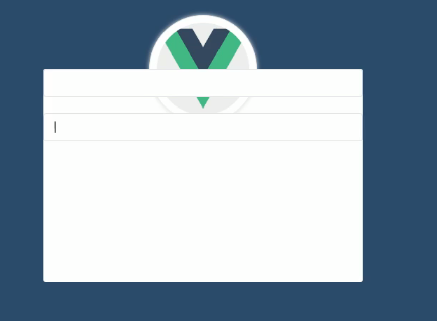

找到想要的按钮组件，复制

```html
<el-button type="primary">主要按钮</el-button>
<el-button type="info">信息按钮</el-button>
```

Login.vue的结构+

```html
<!-- 按钮区 -->
<el-form-item>
	<el-button type="primary">登陆</el-button>
	<el-button type="info">重置</el-button></el-form-item>
```

效果

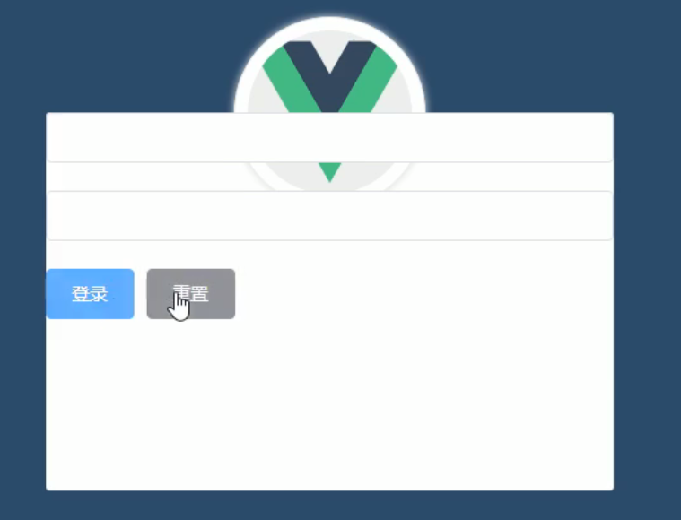

按钮居右对齐，Login.vue的结构+

```html
<!-- 按钮区 -->
<el-form-item class="btns">
	<el-button type="primary">登陆</el-button>
	<el-button type="info">重置</el-button></el-form-item>
```

Login.vue样式，.btns+

```css
.btns {
  display: flex;
  justify-content: flex-end;
}
```

效果

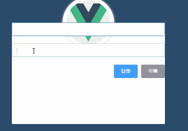

将表单放到下面的位置，按钮居右对齐，Login.vue的结构+

el-form加个class  .login_form

样式.login_form+

```css
.login_form {
  position: absolute;
  bottom: 0;
  width: 100%;
  padding: 0 20px;
}
```

效果（有溢出）

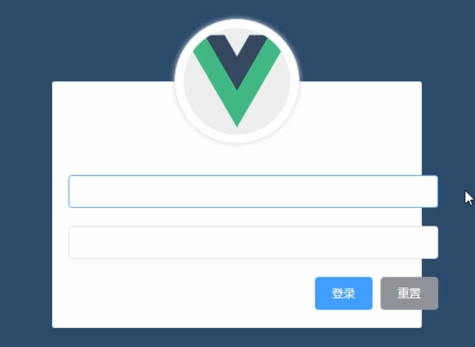

因为表单的box-sizing默认是content，改为box-sizing：border-box

```css
box-sizing：border-box;
```

效果

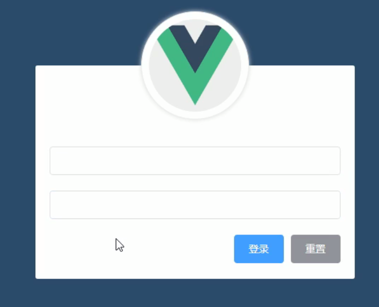

## 5.小图标

找到带icon的输入框

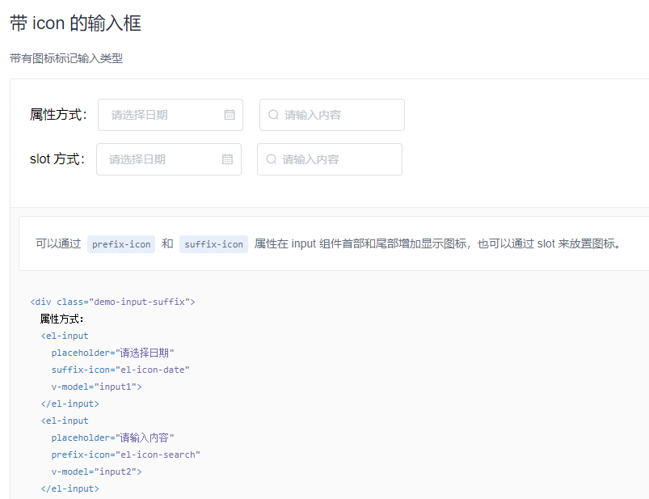

选前面有图标的

```html
prefix-icon="el-icon-search"
```

Login.vue的结构+，给input标签加prefix-icon属性

```HTML
<!-- 登录表单区域 -->
<el-form label-width="0px" class="login_form">
        <!-- 用户名 -->
        <el-form-item>
          <el-input prefix-icon="el-icon-search"></el-input>
        </el-form-item>
        <!-- 密码 -->
        <el-form-item>
          <el-input prefix-icon="el-icon-search" type="password"></el-input>
</el-form-item>
```

效果

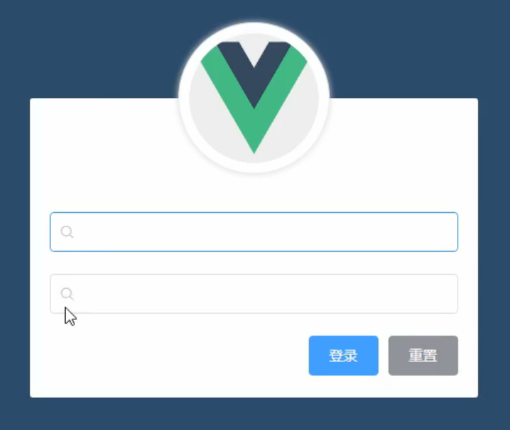

可以去第三方图标库用其它合适的图标

将下载好的图标放到fonts文件夹里，再将fonts文件夹放在assets文件夹下

在入口文件main.js中导入iconfont.css

```js
// 导入字体图标
import './assets/fonts/iconfont.css'
```

Login.vue的结构+,前面的iconfont一定要有

```html
<!-- 用户名 -->
<el-form-item>
	<el-input prefix-icon="iconfont icon-user"></el-input>
</el-form-item>
<!-- 密码 -->
<el-form-item>
	<el-input prefix-icon="iconfont icon-3702mima" type="password"></el-input>
</el-form-item>
```

效果

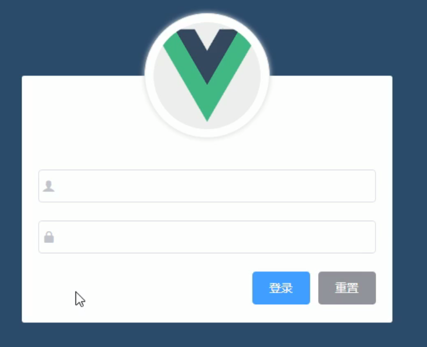

## 6.表单的数据绑定

第一步，为el-form加上:model="loginForm"属性

```html
<el-form :model="loginForm" label-width="0px" class="login_form">
```

第二步，为每一个表单项用v-model属性绑定到对应的数据中

```html
<!-- 用户名 -->
<el-form-item>
	<el-input v-model="loginForm.username" prefix-icon="iconfont icon-user"
></el-input>
</el-form-item>
<!-- 密码 -->
<el-form-item>
<el-input v-model="loginForm.password"
prefix-icon="iconfont icon-3702mima" type="password"
></el-input>
</el-form-item>
```

第三步，在行为区域script定义一个data(){}

```js
<script>
export default {
  data() {
    return {
      // 这是登陆表单的数据绑定对象
      loginForm: {
        username: 'zs',
        password: '123'
      }
    }
  }
}
</script>
```

## 7.表单数据合法性校验

第一步，为el-form添加:rules="xxx"属性

```html
<el-form :model="loginForm" :rules="loginRules" label-width="0px" class="login_form"></el-form>
```

第二步，为el-form-item添加prop="xxx"属性

```html
<el-form-item prop="username">
          <el-input
            v-model="loginForm.username"
            prefix-icon="iconfont icon-user"
          ></el-input>
        </el-form-item>
<el-form-item prop="password">
          <el-input
            v-model="loginForm.password"
            prefix-icon="iconfont icon-3702mima"
            type="password"
          ></el-input>
        </el-form-item>
```

第三步，在行为区域script添加rules对象

rules对象下有若干规则

```js
loginRules: {
        //用户名合法验证
        username: [
        { required: true, message: '请输入用户名', trigger: 'blur' },
        { min: 3, max: 10, message: '长度在 3 到 10 个字符', trigger: 'blur' }
        ],
        //密码合法验证
        password:[
            { required: true, message: '请输入密码', trigger: 'blur' },
        { min: 5, max: 10, message: '长度在 5 到 10 个字符', trigger: 'blur' }
        ]
      }
```

效果


## 8.表单的重置

第一步，给el-form添加ref="xxxRef"属性，可以通过xxxRef获取到表单实例对象，从而可以调用表单的一些方法

```html
<el-form :model="loginForm" :rules="loginRules" ref="loginRef" label-width="0px" class="login_form"></el-form>
```

第二步，为重置按钮绑定一个单击事件

```html
<el-button type="info" @click="resetLoginForm">重置</el-button>
```

第三步，在行为区域script添加methods对象，该对象下有单击事件处理函数

```js
methods: {
    //点击重置
    resetLoginForm () {
      this.$refs.loginRef.resetFields();
    }
  }
```

## 9.登陆前的预验证

第一步，为登陆按钮绑定单击事件

```html
<el-button type="primary" @click="login">登陆</el-button>
```

第二步，在行为区域script下的methods对象添加对应的处理函数

```js
//登陆预验证
    login () {
      this.$refs.loginRef.validata(valid => {
        console.log(valid)
      })
    }
```

第三步，根据预验证结果是否发起请求

先在在main.js里导入axios包

```js
// 导入axios包，发起网络请求
import axios from 'axios'
// 设置请求的根路径
axios.defaults.baseURL = 'http://127.0.0.1:8888/api/private/v1/'
// 把这个包挂载到vue原型上，这样每一个vue的组件都可以通过this，直接访问到$http,从而发起网络请求
Vue.prototype.$http = axios
```

然后在login.vue的行为区域script下的methods对象修改login函数

```js
//登陆预验证
    login () {
      this.$refs.loginRef.validata(valid => {
        if (!valid) return;
        this.$http.post('login', this.loginForm);
      })
    }
```

发起请求之前，要确保服务器是打开状态，打开mysql

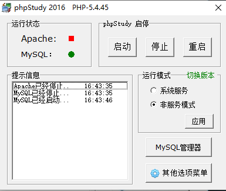

还要将api接口运行

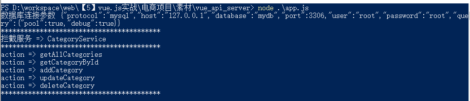

打印出result

```js
login () {
      this.$refs.loginRef.validate( valid => {
        if (!valid) return;
        const result = this.$http.post('login', this.loginForm);
        console.log(result);
      });
    }
```

是个Promise对象

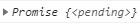

用await和async修饰

打印发现，是具体的响应对象

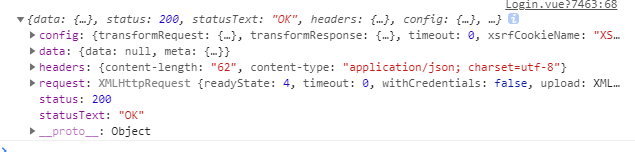

但是我们只要data属性（这对象是axios帮我们封装的，data才是服务器返回的真实数据，其它五个属性我们不需要）

用{}将data属性解构赋值出来

```js
//登陆预验证
    login () {
      this.$refs.loginRef.validate(async valid => {
        if (!valid) return;
        const {data: res} = await this.$http.post('login', this.loginForm);
        console.log(res);
      });
    }
```

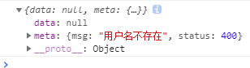

## 10.登陆成功与否弹窗提示

首先在plugins文件夹下的element.js中导入

```js
import { Button, Form, FormItem, Input, Message } from 'element-ui'
//Message需要全局挂载
Vue.prototype.$message = Message
```

methods成员login+

```js
login() {
  this.$refs.loginFormRef.validate(async valid => {
    ...
    // 1. 将登录成功之后的 token，保存到客户端的 sessionStorage 中
    //   1.1 项目中出了登录之外的其他API接口，必须在登录之后才能访问
    //   1.2 token 只应在当前网站打开期间生效，所以将 token 保存在 sessionStorage 中
    window.sessionStorage.setItem('token', res.data.token)
    // 2. 通过编程式导航跳转到后台主页，路由地址是 /home
    this.$router.push('/home')
  })
}
```

## 11.登陆成功之后的行为

```js
//1.将登陆成功之后的token，保存到客户端的sessionStorage中
window.sessionStorage.setItem('token', res.data.token);
​    // 1.1 项目中除了登陆之外的其它接口，必须在登陆之后才能访问

​    // 1.2 token只应在当前网页打开期间生效，

​    //2.通过编程式导航跳转到后台，路由地址是 /home
this.$router.push('/home')
```

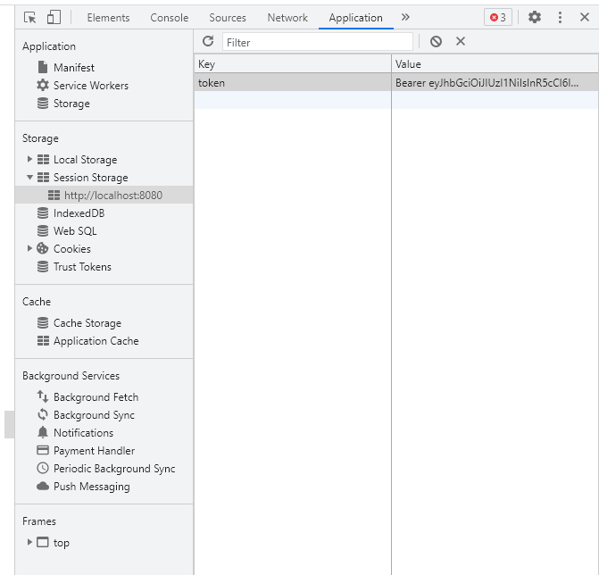

在components文件夹下新建Home.vue

```html
<template>
    <div>home 组件</div>
</template>

<script>
    export default {};
</script>

<style lang="less" scoped>

</style>
```

同时新增路由规则

在router.js里面导入Home.vue

```js
import Home from './components/Home.vue'

Vue.use(Router)

export default new Router({
  routes: [
    ...
    { path: '/home', component: Home }
  ]
})
```

## 12.路由导航守卫控制访问权限

如果用户没有登陆，但是直接通过url访问特定页面，需要重新导航到登陆页面

router.js+

```js
import Vue from 'vue'
import Router from 'vue-router'
import Login from './components/Login.vue'
import Home from './components/Home.vue'

Vue.use(Router)

const router = new Router({
  routes: [
    { path: '/', redirect: '/login' },
    { path: '/login', component: Login },
    { path: '/home', component: Home }
  ]
})
// 挂载路由导航守卫
router.beforeEach((to, from, next) => {
  // to 将要访问的路径
  // from 代表从哪个路径跳转而来
  // next 是一个函数，表示放行 next()表示放行 next('/login')表示强制跳转
  if (to.path === '/login') return next()
  // 获取token
  const tokenStr = window.sessionStorage.getItem('token')
  if (!tokenStr) return next('/login')
  next()
})

export default router
```

## 13.退出功能原理

基于token的方式实现退出比较简单，只要销毁本地的token即可。这样，后续的请求就不会携带token，必须重新登陆形成一个新的token之后才可以访问页面

在components文件夹下的Home.vue+

添加个按钮，并绑定事件

```vue
<template>
    <div>
        <el-button type="info" @click="out">退出</el-button>
    </div>
</template>

<script>
    export default {
        methods: {
            out () {
                //清空token
                window.sessionStorage.clear();
                //跳转到登录页
                this.$router.push('/login');
            }
        }
    };
</script>

<style lang="less" scoped>

</style>
```

## 14.处理语法警告

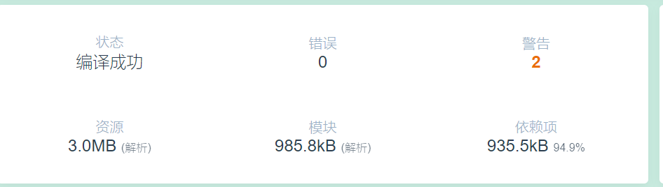

点击输出查看


警告提示：

- ;在js中不应该出现
- 用双引号来表示字符串的要用单引号

需要在项目的根目录中建一个格式化文件后的配置项


```json
{
  "semi": false,
  "singleQuote": true
}
```


# 5.打开终端，查看项目工作区是否干净

```
git status
```


**创建子分支（每开发一个新模块要建，之后在合并到主干）**

```
git checkout -b 分支名
```


查看所有分支

```
git branch
```


*表示当前分支

# 6.查看项目运行状态

进入vue可视化面板

任务-->serve-->运行

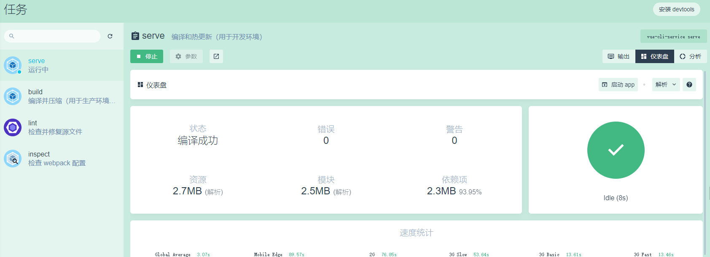

启动app

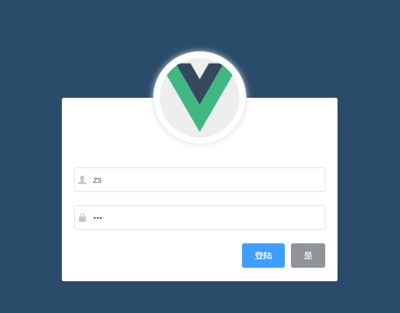

# 7.提交登陆功能代码

在vscode找到项目

右键选择“在集成终端中打开”

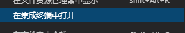

输入

```
git status
```

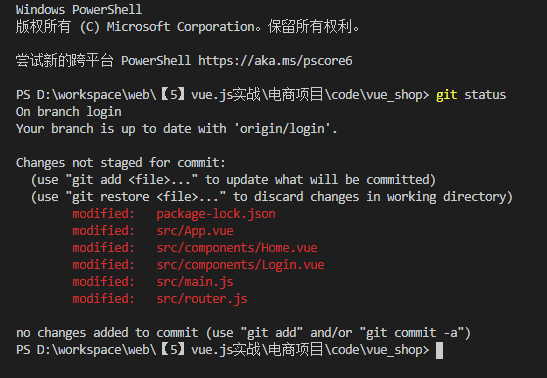

这些文件表示改动过

继续输入

```
git add .
```

再输入

```
git status
```

查看

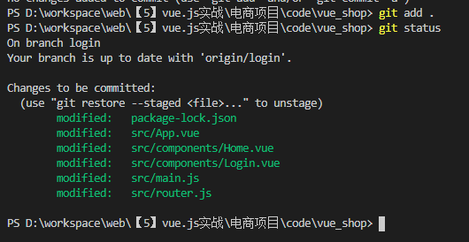

绿色表示这些文件被添加到了暂存区

接下来输入

```
git commit -m "提示文本"
```

完成提交

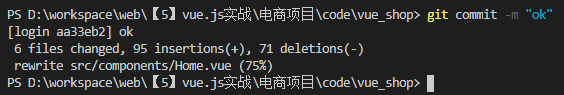

输入

```
git branch
```

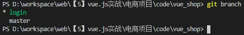

表示刚刚提交的代码都放到login分支里面保存了

接下来把login分支合并到master主分支

第一步，切换到master主分支

```
git checkout master
```


第二步，合并

```
git merge login
```

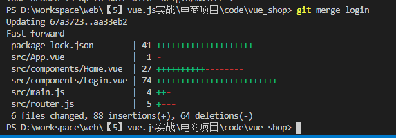

最后，推送

```
git push
```

