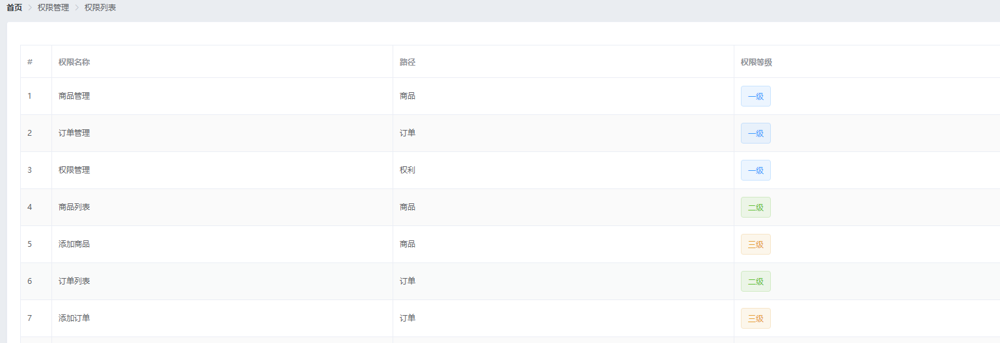

# 1.请求列表数据

## 接口文档

- 请求路径：rights/:type
- 请求方法：get
- 请求参数

| 参数名 | 参数说明 | 备注                                                         |
| ------ | -------- | ------------------------------------------------------------ |
| type   | 类型     | 值 list 或 tree , list 列表显示权限, tree 树状显示权限,`参数是url参数:type` |

- 响应参数

| 参数名   | 参数说明     | 备注 |
| -------- | ------------ | ---- |
| id       | 权限 ID      |      |
| authName | 权限说明     |      |
| level    | 权限层级     |      |
| pid      | 权限父 ID    |      |
| path     | 对应访问路径 |      |

- 响应数据 type=list

```json
  {
    "data": [
        {
            "id": 101,
            "authName": "商品管理",
            "level": "0",
            "pid": 0,
            "path": null
        },
        {
            "id": 102,
            "authName": "订单管理",
            "level": "0",
            "pid": 0,
            "path": null
        }
    ],
    "meta": {
        "msg": "获取权限列表成功",
        "status": 200
    }
}
```

type=tree

```json
  {
    data: [
      {
        id: 101,
        authName: '商品管理',
        path: null,
        pid: 0,
        children: [
          {
            id: 104,
            authName: '商品列表',
            path: null,
            pid: 101,
            children: [
              {
                id: 105,
                authName: '添加商品',
                path: null,
                pid: '104,101'
              }
            ]
          }
        ]
      }
    ],
    meta: {
      msg: '获取权限列表成功',
      status: 200
    }
  }
```

## 前端代码

数据成员新增rightsList: []

```js
export default {
    data() {
        return {
        // 权限列表
        rightsList: []
        }
    }
}
</script>
```

生命周期函数created

行为成员新增getRightsList()

```js
export default {
    ...
    created() {
        // 获取所有的权限
        this.getRightsList()
    },
    methods: {
        // 获取权限列表
        async getRightsList() {
        const { data: res } = await this.$http.get('rights/list')
        if (res.meta.status !== 200) {
            return this.$message.error('获取权限列表失败！')
        }

        this.rightsList = res.data
        }
    }
}
</script>
```

# 2.将请求到的数据渲染到页面中

Rights.vue+

结构

```vue
<template>
    <div>
        ...
        <!-- 卡片视图 -->
        <el-card>
            <el-table :data="rightsList" border stripe>
                <el-table-column type="index"></el-table-column>
                <el-table-column label="权限名称" prop="authName"></el-table-column>
                <el-table-column label="路径" prop="path"></el-table-column>
                <el-table-column label="权限等级" prop="level">
                  <template slot-scope="scope">
                    <el-tag v-if="scope.row.level === '0'">一级</el-tag>
                    <el-tag type="success" v-else-if="scope.row.level === '1'">二级</el-tag>
                    <el-tag type="warning" v-else>三级</el-tag>
                  </template>
                </el-table-column>
              </el-table>
        </el-card>
    </div>
</template>
```

按需导入，在plugins文件夹下的element.js里

```js
...
import { ... Tag } from 'element-ui'

...
Vue.use(Tag)
...

```

效果



