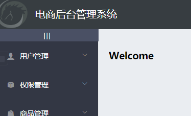
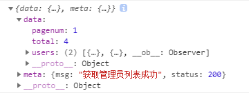
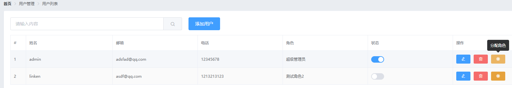
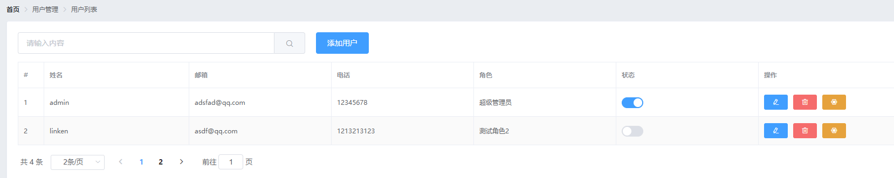
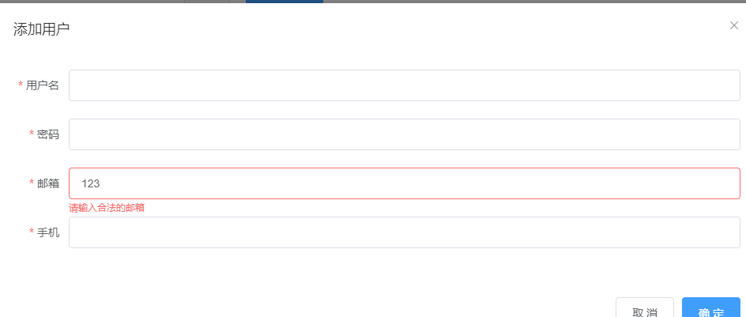
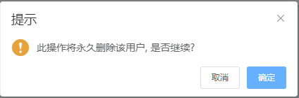

# 1.通过接口获取菜单数据

通过axios请求拦截器添加token，保证拥有获取数据的权限

在main.js里

```js
axios.interceptors.request.use(config => {
  // console.log(config)
  config.headers.Authorization = window.sessionStorage.getItem('token')
  // 在最后必须 return config
  return config
})
```

# 2.发起请求获取菜单数据

## 接口文档

- 请求路径：menus
- 请求方法：get
- 响应数据

```json
{
    "data":
        {
            "id": 101,
            "authName": "商品管理",
            "path": null,
            "children": [
                {
                    "id": 104,
                    "authName": "商品列表",
                    "path": null,
                    "children": []
                }
            ]
        }
    "meta": {
        "msg": "获取菜单列表成功",
        "status": 200
    }
}
```

## 后端代码

Home.vue+

行为

```js
<script>
export default {
  data() {
    return {
      // 左侧菜单数据
      menulist: []
    }
  },
  //生命周期函数
  created() {
    this.getMenuList()
  },
  methods: {
    logout() {
      window.sessionStorage.clear()
      this.$router.push('/login')
    },
    // 获取所有的菜单
    async getMenuList() {
        const { data: res } = await this.$http.get('menus')
        if (res.meta.status !== 200) return this.$message.error(res.meta.msg)
        this.menulist = res.data
        console.log(res)
    }
  }
}
</script>
```


# 3.首页路由重定向

在components文件夹下新建一个Welcome.vue

Welcome.vue+

```vue
<template>
    <div>
      <h3>Welcome</h3>
    </div>
</template>
```

在router.js里导入Welcome.vue

```js
import Welcome from './components/Welcome.vue'
```

然后路由重定向

```js
const router = new Router({
  routes: [
    { path: '/', redirect: '/login' },
    { path: '/login', component: Login },
    {
      path: '/home',
      component: Home,
      redirect: '/welcome',
      children: [
        { path: '/welcome', component: Welcome }
      ]
    }
  ]
})
```

在Home.vue添加路由占位符

```vue
<!-- 右侧内容主体 -->
<el-main>
  <!-- 路由占位符 -->
  <router-view></router-view>
</el-main>
```

效果




# 4.发起请求获取用户列表数据

## 接口文档

- 请求路径：users
- 请求方法：get
- 请求参数

| 参数名   | 参数说明     | 备注     |
| -------- | ------------ | -------- |
| query    | 查询参数     | 可以为空 |
| pagenum  | 当前页码     | 不能为空 |
| pagesize | 每页显示条数 | 不能为空 |

- 响应参数

| 参数名    | 参数说明     | 备注 |
| --------- | ------------ | ---- |
| totalpage | 总记录数     |      |
| pagenum   | 当前页码     |      |
| users     | 用户数据集合 |      |

- 响应数据

```json
{
    "data": {
        "totalpage": 5,
        "pagenum": 4,
        "users": [
            {
                "id": 25,
                "username": "tige117",
                "mobile": "18616358651",
                "type": 1,
                "email": "tige112@163.com",
                "create_time": "2017-11-09T20:36:26.000Z",
                "mg_state": true, // 当前用户的状态
                "role_name": "炒鸡管理员"
            }
        ]
    },
    "meta": {
        "msg": "获取成功",
        "status": 200
    }
}
```

## 前端代码

Users.vue+

行为

```vue
<script>
  export default {
    data() {
      return {
        // 获取用户列表的参数对象
        queryInfo: {
            query: '',
            // 当前的页数
            pagenum: 1,
            // 当前每页显示多少条数据
            pagesize: 2
        },
        userlist: [],
        total: 0
      }
    },
    created() {
        this.getUserList()
    },
    methods: {
        async getUserList() {
            const { data: res } = await this.$http.get('users', {params: this.queryInfo})
            if (res.meta.status !== 200) {
                return this.$message.error('获取用户列表失败！')
            }
            this.userlist = res.data.users
            this.total = res.data.total
            console.log(res)
        }
    }
  }
</script>
```

效果




# 5.插槽形式自定义列的渲染

Users.vue+

结构

```vue
<!-- 用户列表区域 -->
<el-table :data="userlist" border stripe >
    ...
    <el-table-column label="操作">
      <template slot-scope="scope">
        <!-- 修改按钮 -->
        <el-button type="primary" icon="el-icon-edit" size="mini"></el-button>
        <!-- 删除按钮 -->
        <el-button type="danger" icon="el-icon-delete" size="mini"></el-button>
        <!-- 分配角色按钮 -->
        <el-tooltip effect="dark" content="分配角色" placement="top" :enterable="false">
          <el-button type="warning" icon="el-icon-setting" size="mini"></el-button>
        </el-tooltip>
      </template>
    </el-table-column>
</el-table>
```

按需导入，在plugins文件夹下的element.js里导入

```js
...
import { ... Tooltip } from 'element-ui'

...
Vue.use(Tooltip)
```

效果



# 6.实现数据分页效果

Users.vue+

结构

```vue
<!-- 分页区域 -->
<el-pagination @size-change="handleSizeChange" @current-change="handleCurrentChange" :current-page="queryInfo.pagenum" :page-sizes="[1, 2, 5, 10]" :page-size="queryInfo.pagesize" layout="total, sizes, prev, pager, next, jumper" :total="total">
</el-pagination>
```

行为成员新增

```js
 methods: {
        ...
        // 监听 pagesize 改变的事件
        handleSizeChange(newSize) {
          this.queryInfo.pagesize = newSize
          this.getUserList()
        },
        // 监听 页码值 改变的事件
        handleCurrentChange(newPage) {
          this.queryInfo.pagenum = newPage
          this.getUserList()
        }
    }
```

按需导入，在plugins文件夹下的element.js里导入

```
...
import { ... Pagination } from 'element-ui'

...
Vue.use(Pagination)
```

覆盖样式，在assets文件夹下的css里的global.css里

```css
...

.el-pagination {
  margin-top: 15px;
}
```

效果



# 7.发起请求修改用户状态

## 接口文档

- 请求路径：users/:uId/state/:type
- 请求方法：put
- 请求参数

| 参数名 | 参数说明 | 备注                                        |
| ------ | -------- | ------------------------------------------- |
| uId    | 用户 ID  | 不能为空`携带在url中`                       |
| type   | 用户状态 | 不能为空`携带在url中`，值为 true 或者 false |

- 响应数据

```json
{
  "data": {
    "id": 566,
    "rid": 30,
    "username": "admin",
    "mobile": "123456",
    "email": "bb@itcast.com",
    "mg_state": 0
  },
  "meta": {
    "msg": "设置状态成功",
    "status": 200
  }
}
```

### 

## 前端代码

Users.vue+

结构

给el-switch标签change属性绑定事件

```vue
<el-switch v-model="scope.row.mg_state" @change="userStateChanged(scope.row)">
</el-switch>
```

行为成员新增

```js
methods: {
        ...
        // 监听 switch 开关状态的改变
        async userStateChanged(userinfo) {
          const { data: res } = await this.$http.put(
            `users/${userinfo.id}/state/${userinfo.mg_state}`
          )
          if (res.meta.status !== 200) {
            userinfo.mg_state = !userinfo.mg_state
            return this.$message.error('更新用户状态失败！')
          }
          this.$message.success('更新用户状态成功！')
        }
    }
```

效果


# 8.表单自定义规则

Users.vue+

先自定义

然后通过validator指向

数据成员新增

```js
data() {
      // 验证邮箱的规则
      var checkEmail = (rule, value, cb) => {
        // 验证邮箱的正则表达式
        const regEmail = /^([a-zA-Z0-9_-])+@([a-zA-Z0-9_-])+(\.[a-zA-Z0-9_-])+/

        if (regEmail.test(value)) {
          // 合法的邮箱
          return cb()
        }

        cb(new Error('请输入合法的邮箱'))
      }

      // 验证手机号的规则
      var checkMobile = (rule, value, cb) => {
        // 验证手机号的正则表达式
        const regMobile = /^(0|86|17951)?(13[0-9]|15[012356789]|17[678]|18[0-9]|14[57])[0-9]{8}$/

        if (regMobile.test(value)) {
          return cb()
        }

        cb(new Error('请输入合法的手机号'))
      }
      return {
        ...
        // 添加表单的验证规则对象
        addFormRules: {
          ...
          email: [
            { required: true, message: '请输入邮箱', trigger: 'blur' },
            { validator: checkEmail, trigger: 'blur' }
          ],
          mobile: [
            { required: true, message: '请输入手机号', trigger: 'blur' },
            { validator: checkMobile, trigger: 'blur' }
          ]
        }
      }
      }
    }
```

效果



# 9.发起请求添加用户

## 接口文档

- 请求路径：users
- 请求方法：post
- 请求参数

| 参数名   | 参数说明 | 备注     |
| -------- | -------- | -------- |
| username | 用户名称 | 不能为空 |
| password | 用户密码 | 不能为空 |
| email    | 邮箱     | 可以为空 |
| mobile   | 手机号   | 可以为空 |

- 响应参数

| 参数名   | 参数说明    | 备注 |
| -------- | ----------- | ---- |
| id       | 用户 ID     |      |
| rid      | 用户角色 ID |      |
| username | 用户名      |      |
| mobile   | 手机号      |      |
| email    | 邮箱        |      |

- 响应数据

```json
{
    "data": {
        "id": 28,
        "username": "tige1200",
        "mobile": "test",
        "type": 1,
        "openid": "",
        "email": "test@test.com",
        "create_time": "2017-11-10T03:47:13.533Z",
        "modify_time": null,
        "is_delete": false,
        "is_active": false
    },
    "meta": {
        "msg": "用户创建成功",
        "status": 201
    }
}
```

### 

## 前端代码

Users.vue+

行为

```js
methods: {
        ...
        // 点击按钮，添加新用户
        addUser() {
          this.$refs.addFormRef.validate(async valid => {
            if (!valid) return
            // 可以发起添加用户的网络请求
            const { data: res } = await this.$http.post('users', this.addForm)

            if (res.meta.status !== 201) {
              this.$message.error('添加用户失败！')
            }

            this.$message.success('添加用户成功！')
            // 隐藏添加用户的对话框
            this.addDialogVisible = false
            // 重新获取用户列表数据
            this.getUserList()
          })
        }

    }
```

# 10.发起请求通过id展示用户的对话框

## 接口文档

- 请求路径：users/:id
- 请求方法：get
- 请求参数

| 参数名 | 参数说明 | 备注                  |
| ------ | -------- | --------------------- |
| id     | 用户 ID  | 不能为空`携带在url中` |

- 响应参数

| 参数名  | 参数说明 | 备注 |
| ------- | -------- | ---- |
| id      | 用户 ID  |      |
| role_id | 角色 ID  |      |
| mobile  | 手机号   |      |
| email   | 邮箱     |      |

- 响应数据

```json
{
    "data": {
        "id": 503,
        "username": "admin3",
        "role_id": 0,
        "mobile": "00000",
        "email": "new@new.com"
    },
    "meta": {
        "msg": "查询成功",
        "status": 200
    }
}
```


## 前端代码

### 根据id查询用户信息

Users.vue+

结构

在修改按钮上注册的点击事件函数传参

```js
<!-- 用户列表区域 -->
<el-table :data="userlist" border stripe >
    ...
    <el-table-column label="操作">
      <template slot-scope="scope">
        <!-- 修改按钮 -->
        <el-button type="primary" icon="el-icon-edit" size="mini" @click="showEditDialog(scope.row.id)"></el-button>
        ...
      </template>
    </el-table-column>
</el-table>
```

数据成员新增editForm: {}

```js
data() {
  ...
  return {
    ...
    // 查询到的用户信息对象
    editForm: {}
  }
}
```

行为成员修改

showEditDialog事件函数修改

```js
methods: {
    ...
    // 展示编辑用户的对话框
    async showEditDialog(id) {
      // console.log(id)
      const { data: res } = await this.$http.get('users/' + id)

      if (res.meta.status !== 200) {
        return this.$message.error('查询用户信息失败！')
      }

      this.editForm = res.data
      this.editDialogVisible = true
    }


}
```

# 11.发起请求通过id修改用户

## 接口文档

- 请求路径：users/:id
- 请求方法：put
- 请求参数

| 参数名 | 参数说明 | 备注                        |
| ------ | -------- | --------------------------- |
| id     | 用户 id  | 不能为空 `参数是url参数:id` |
| email  | 邮箱     | 可以为空                    |
| mobile | 手机号   | 可以为空                    |

- 响应参数

| 参数名  | 参数说明 | 备注 |
| ------- | -------- | ---- |
| id      | 用户 ID  |      |
| role_id | 角色 ID  |      |
| mobile  | 手机号   |      |
| email   | 邮箱     |      |

- 响应数据

```json
/* 200表示成功，500表示失败 */
{
    "data": {
        "id": 503,
        "username": "admin3",
        "role_id": 0,
        "mobile": "111",
        "email": "123@123.com"
    },
    "meta": {
        "msg": "更新成功",
        "status": 200
    }
}
```


## 前端代码

### 绘制修改用户表单

Users.vue+

结构

```vue
<!-- 修改用户的对话框 -->
<el-dialog title="修改用户" :visible.sync="editDialogVisible" width="50%" @close="editDialogClosed">
  <el-form :model="editForm" :rules="editFormRules" ref="editFormRef" label-width="70px">
    <el-form-item label="用户名">
      <el-input v-model="editForm.username" disabled></el-input>
    </el-form-item>
    <el-form-item label="邮箱" prop="email">
      <el-input v-model="editForm.email"></el-input>
    </el-form-item>
    <el-form-item label="手机" prop="mobile">
      <el-input v-model="editForm.mobile"></el-input>
    </el-form-item>
  </el-form>
  <span slot="footer" class="dialog-footer">
    <el-button @click="editDialogVisible = false">取 消</el-button>
    <el-button type="primary" @click="editDialogVisible = false">确 定</el-button>
  </span>
</el-dialog>
```

数据成员新增editFormRules: {}

```js
data() {
      ...
      return {
        ...
        // 修改表单的验证规则对象
        editFormRules: {
          email: [
            { required: true, message: '请输入用户邮箱', trigger: 'blur' },
            { validator: checkEmail, trigger: 'blur' }
          ],
          mobile: [
            { required: true, message: '请输入用户手机', trigger: 'blur' },
            { validator: checkMobile, trigger: 'blur' }
          ]
        }
      }
}
```

### 修改表单关闭之后的重置操作

Users.vue+

结构

给el-dialog标签注册单击事件editDialogClosed

```vue
<!-- 修改用户的对话框 -->
        <el-dialog title="修改用户" :visible.sync="editDialogVisible" width="50%" @close="editDialogClosed">
          <el-form :model="editForm" :rules="editFormRules" ref="editFormRef" label-width="70px">
            <el-form-item label="用户名">
              <el-input v-model="editForm.username" disabled></el-input>
            </el-form-item>
            <el-form-item label="邮箱" prop="email">
              <el-input v-model="editForm.email"></el-input>
            </el-form-item>
            <el-form-item label="手机" prop="mobile">
              <el-input v-model="editForm.mobile"></el-input>
            </el-form-item>
          </el-form>
          <span slot="footer" class="dialog-footer">
            <el-button @click="editDialogVisible = false">取 消</el-button>
            <el-button type="primary" @click="editDialogVisible = false">确 定</el-button>
          </span>
</el-dialog>
```

行为成员新增

```js
methods: {
        ...
        // 监听修改用户对话框的关闭事件
        editDialogClosed() {
          this.$refs.editFormRef.resetFields()
        }


    }
```

### 修改提交之前的表单预验证

Users.vue+

结构

给修改对话框的确认按钮注册事件editUserInfo

```vue
<!-- 修改用户的对话框 -->
<el-dialog title="修改用户" :visible.sync="editDialogVisible" width="50%" @close="editDialogClosed">
  ...
  <span slot="footer" class="dialog-footer">
    <el-button @click="editDialogVisible = false">取 消</el-button>
    <el-button type="primary" @click="editUserInfo">确 定</el-button>
  </span>
</el-dialog>
```

成员新增editUserInfo

```js
methods: {
        ...
        // 修改用户信息并提交
        editUserInfo() {
          this.$refs.editFormRef.validate(valid => {
            if (!valid) return
            // 发起修改用户信息的数据请求
          })
        }
}
```


```js
methods: {
        ...
        // 修改用户信息并提交
        editUserInfo() {
          this.$refs.editFormRef.validate(valid => {
            if (!valid) return
            // 发起修改用户信息的数据请求
            const { data: res } = await this.$http.put(
              'users/' + this.editForm.id,
              {
                email: this.editForm.email,
                mobile: this.editForm.mobile
              }
            )

            if (res.meta.status !== 200) {
              return this.$message.error('更新用户信息失败！')
            }

            // 关闭对话框
            this.editDialogVisible = false
            // 刷新数据列表
            this.getUserList()
            // 提示修改成功
            this.$message.success('更新用户信息成功！')
          })
        }
}
```

# 12.发起请求通过id删除用户

## 接口文档

- 请求路径：users/:id
- 请求方法：delete
- 请求参数

| 参数名 | 参数说明 | 备注                       |
| ------ | -------- | -------------------------- |
| id     | 用户 id  | 不能为空`参数是url参数:id` |

- 响应参数
- 响应数据

```json
{
    "data": null,
    "meta": {
        "msg": "删除成功",
        "status": 200
    }
}
```

## 前端代码

Users.vue+

结构

给删除按钮注册事件removeUserById

```vue
<!-- 用户列表区域 -->
<el-table :data="userlist" border stripe >
    ...
    <el-table-column label="操作">
      <template slot-scope="scope">
        ...
        <!-- 删除按钮 -->
        <el-button type="danger" icon="el-icon-delete" size="mini" @click="removeUserById(scope.row.id)"></el-button>
        ...
      </template>
    </el-table-column>
</el-table>
```

行为成员新增removeUserById

```js
methods: {
        ...
        // 根据Id删除对应的用户信息
        async removeUserById(id) {
          // 弹框询问用户是否删除数据
          const confirmResult = await this.$confirm(
            '此操作将永久删除该用户, 是否继续?',
            '提示',
            {
              confirmButtonText: '确定',
              cancelButtonText: '取消',
              type: 'warning'
            }
          ).catch(err => err)

          // 如果用户确认删除，则返回值为字符串 confirm
          // 如果用户取消了删除，则返回值为字符串 cancel
          // console.log(confirmResult)
          if (confirmResult !== 'confirm') {
            return this.$message.info('已取消删除')
          }

          const { data: res } = await this.$http.delete('users/' + id)

          if (res.meta.status !== 200) {
            return this.$message.error('删除用户失败！')
          }

          this.$message.success('删除用户成功！')
          this.getUserList()
        }
}
```

按需导入，在plugins文件夹下的element.js里导入

```js
...
import { ... MessageBox } from 'element-ui'

...
Vue.prototype.$confirm = MessageBox.confirm
```

效果


