# 1.表单的数据绑定

给表单标签添加一下两种属性

```vue
v-model=""
```

或

```
:model=""
```


# 2.表单数据的合法性校验

第一步，为el-form添加:rules="xxx"属性

```html
<el-form :rules="loginRules"></el-form>
```

第二步，为el-form-item添加prop="xxx"属性

```html
<el-form-item prop="username"></el-form-item>
<el-form-item prop="password"></el-form-item>
```

第三步，data成员新增loginRules

rules对象下有若干规则

```js
loginRules: {
        //用户名合法验证
        username: [
            { required: true, message: '请输入用户名', trigger: 'blur' },
            { min: 3, max: 10, message: '长度在 3 到 10 个字符', trigger: 'blur' }
        ],
        //密码合法验证
        password:[
            { required: true, message: '请输入密码', trigger: 'blur' },
            { min: 5, max: 10, message: '长度在 5 到 10 个字符', trigger: 'blur' }
        ]
}
```


# 3.表单的重置

第一步，给el-form添加ref="xxxRef"属性，

**可以通过xxxRef获取到表单实例对象，从而可以调用表单的一些方法**

```html
<el-form ref="loginRef"></el-form>
```

第二步，为重置按钮绑定一个单击事件

```html
<el-button @click="resetLoginForm">重置</el-button>
```

第三步，methods成员新增

```js
methods: {
    //点击重置
    resetLoginForm () {
      this.$refs.loginRef.resetFields();
    }
}
```


# 4.登陆前的预验证

第一步，为登陆按钮绑定单击事件

```html
<el-button @click="login">登陆</el-button>
```

第二步，根据预验证结果是否发起请求

先在在main.js里导入axios包

```js
// 导入axios包，发起网络请求
import axios from 'axios'
// 设置请求的根路径
axios.defaults.baseURL = 'http://127.0.0.1:8888/api/private/v1/'
// 把这个包挂载到vue原型上，这样每一个vue的组件都可以通过this，直接访问到$http,从而发起网络请求
Vue.prototype.$http = axios
```

methods成员新增

```js
//登陆预验证
login () {
  this.$refs.loginRef.validata(valid => {
    if (!valid) return;
    this.$http.post('login', this.loginForm);
  })
}
```

**发起请求之前，要确保服务器是打开状态**

## 向服务器发起请求

先在在main.js里导入axios包

```js
// 导入axios包，发起网络请求
import axios from 'axios'
// 设置请求的根路径
axios.defaults.baseURL = 'http://127.0.0.1:8888/api/private/v1/'
// 把这个包挂载到vue原型上，这样每一个vue的组件都可以通过this，直接访问到$http,从而发起网络请求
Vue.prototype.$http = axios
```

```js
this.$http.请求方式(请求路径, 请求体)
```


# 5.登陆成功与否弹窗提示

首先在plugins文件夹下的element.js中导入

```js
import { ... Message } from 'element-ui'
//Message需要全局挂载
Vue.prototype.$message = Message
```

methods成员login+

```js
login() {
  this.$refs.loginFormRef.validate(async valid => {
    ...
    if (res.meta.status !== 200) return this.$message.error('登录失败！')
    this.$message.success('登录成功')
  })
}
```


# 6.登陆成功之后的行为

**1.将登陆成功之后的token，保存到客户端的sessionStorage中**

​	1.1 项目中除了登陆之外的其它接口，必须在登陆之后才能访问

​	1.2 token只应在当前网页打开期间生效

**2.通过编程式导航跳转到后台，路由地址是 /home**

```js
login() {
  this.$refs.loginFormRef.validate(async valid => {
    ...
    // 1. 将登录成功之后的 token，保存到客户端的 sessionStorage 中
    //   1.1 项目中出了登录之外的其他API接口，必须在登录之后才能访问
    //   1.2 token 只应在当前网站打开期间生效，所以将 token 保存在 sessionStorage 中
    window.sessionStorage.setItem('token', res.data.token)
    // 2. 通过编程式导航跳转到后台主页，路由地址是 /home
    this.$router.push('/home')
  })
}
```

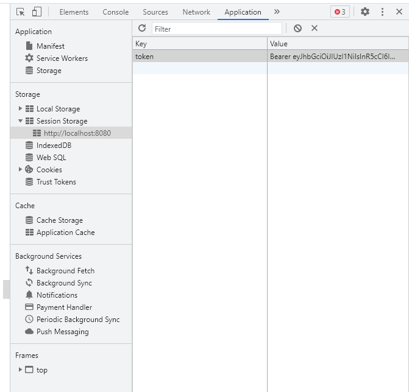


# 7.路由规则

在components文件夹下新建Home.vue

```html
<template>
    <div>home 组件</div>
</template>

<script>
    export default {};
</script>

<style lang="less" scoped>

</style>
```

同时新增路由规则

在router.js里面导入Home.vue

```js
import Home from './components/Home.vue'

Vue.use(Router)

export default new Router({
  routes: [
    ...
    { path: '/home', component: Home }
  ]
})
```


# 8.路由导航守卫控制访问权限

**如果用户没有登陆，但是直接通过url访问特定页面，需要重新导航到登陆页面**

router.js+

```js
...

Vue.use(Router)

const router = new Router({
  routes: [
    ...
  ]
})
// 挂载路由导航守卫
router.beforeEach((to, from, next) => {
  // to 将要访问的路径
  // from 代表从哪个路径跳转而来
  // next 是一个函数，表示放行 next()表示放行 next('/login')表示强制跳转
  if (to.path === '/login') return next()
  // 获取token
  const tokenStr = window.sessionStorage.getItem('token')
  if (!tokenStr) return next('/login')
  next()
})

export default router
```


# 9.退出功能原理

**基于token的方式实现退出比较简单，只要销毁本地的token即可。这样，后续的请求就不会携带token，必须重新登陆形成一个新的token之后才可以访问页面**

在components文件夹下的Home.vue+

添加个按钮，并绑定事件

```vue
<template>
    <div>
        <el-button @click="out">退出</el-button>
    </div>
</template>

<script>
export default {
    methods: {
        out () {
            //清空token
            window.sessionStorage.clear();
            //跳转到登录页
            this.$router.push('/login');
        }
    }
}
</script>

<style lang="less" scoped>

</style>
```


# 10.处理语法警告

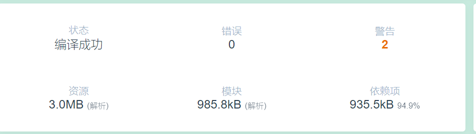

点击输出查看

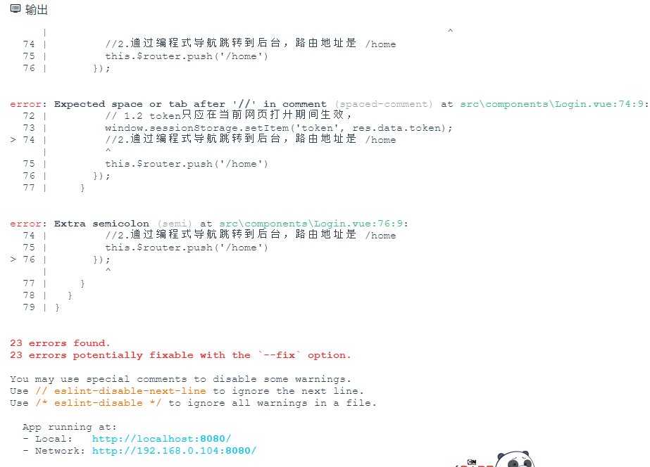

警告提示：

- ;在js中不应该出现
- 用双引号来表示字符串的要用单引号

**需要在项目的根目录中建一个格式化文件后的配置项**

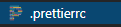

```json
{
  "semi": false,
  "singleQuote": true
}
```


# 11.创建子分支

## 1.打开终端

**打开终端，查看项目工作区是否干净**

```
git status
```

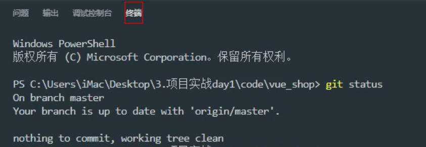

## 2.创建子分支

**创建子分支（每开发一个新模块要建，之后在合并到主干）**

```
git checkout -b 分支名
```

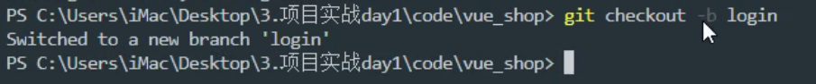

**查看所有分支**

```
git branch
```

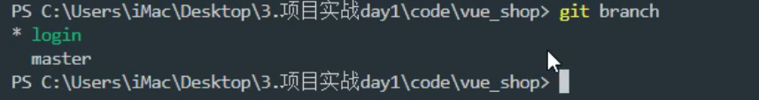

*表示当前分支


# 12.提交分支代码

## 1.终端打开项目

在vscode找到项目

右键选择“在集成终端中打开”


输入

```
git status
```

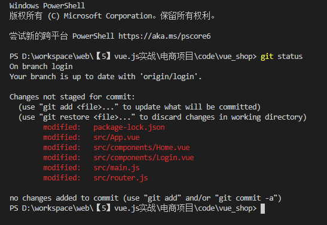

这些文件表示改动过

## 2.将项目文件同步到暂存区

继续输入

```
git add .
```

将改动过的文件同步到暂存区

再输入

```
git status
```

查看

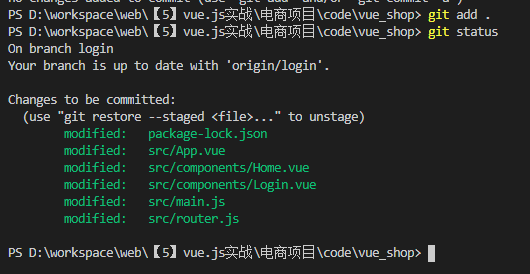

绿色表示这些文件被添加到了暂存区

## 3.提交到远程仓库

接下来输入

```
git commit -m "提示文本"
```

完成提交

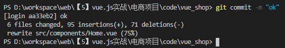

输入

```
git branch
```

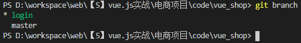

表示刚刚提交的代码都放到login分支里面保存了

## 4.分支合并

接下来把login分支合并到master主分支

**第一步，切换到master主分支**

```
git checkout master
```

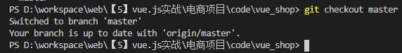

**第二步，合并**

```
git merge login
```

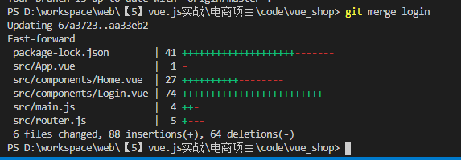

## 5.推送

**最后，推送**

```
git push
```

