# 前端部分

## 1.vue脚手架安装

### 方式1

#### 1.确保已经安装了node

如果没有，node 安装地址：http://nodejs.cn/download/

**注 ：安装 vue-cli 脚手架目前需要node版本为 v4.0 以上**；

#### 2.确保已经安装npm

加快安装速度可以：（这步非必要）

将npm的仓库地址改为淘宝镜像：npm config set registry https://registry.npm.taobao.org --global

#### 3.vue-cli 全局安装

命令行执行 : 

```
npm install -g vue-cli // 加-g是安装到全局
```

#### 4.vue -V 检验是否安装成功

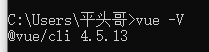

### 方式2

前两步一样

#### 3.配置下载源

全局安装nrm

```
npm install nrm -g
```

#### 4.使用淘宝镜像资源

```
nrm ls 查看镜像源
nrm use taobao
```

#### 5.全局安装vue脚手架

```
npm i @vue/cli -g
```

#### 6.检验是否安装成功

```
vue -V
```

## 2&3.通过vue脚手架创建项目

### 1.win+r进入命令行输入cmd

### 2.输入vue ui回车

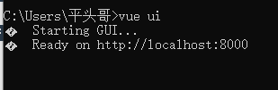


### 3.创建项目并选择存放路径

选好点击“在此创建”

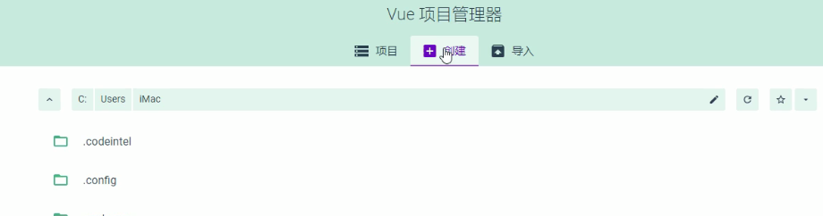

### 4.设置项目信息

项目名称（必须英文）

Git 那一栏写

```
init project
```


下一步

### 5.预设

如果以前有创建过可以用

如果不想用就选手动

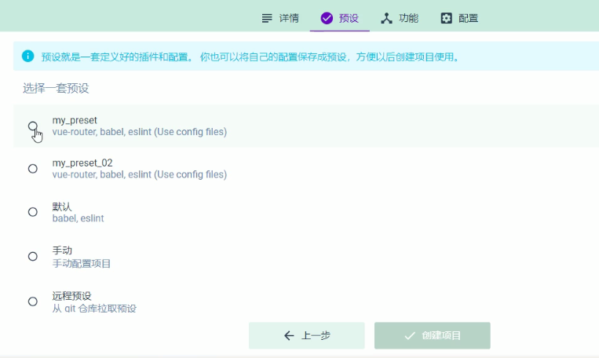

### 6.功能

选择一些主要的:

Babel

Router

Linter/Formatter

使用配置文件


### 7.配置

第二项选择standard.config

lint on save

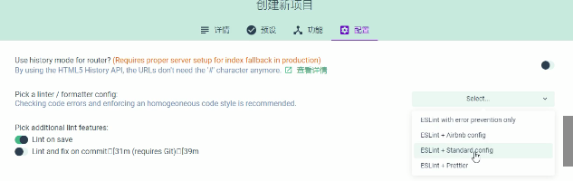

## 4.配置element-ui组件库

### 1.打开项目仪表盘

选插件

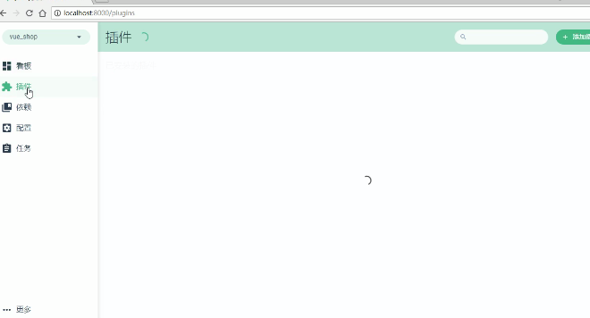

### 2.添加

vue-cli-plugin-element


### 3.配置

不要fully import

选按需导入

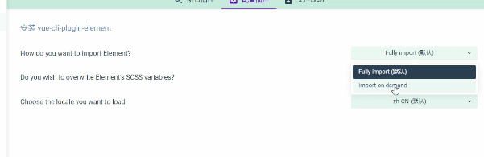

## 5.配置axios库

允许项目发起网络请求

### 1.在可视化面板选中 依赖

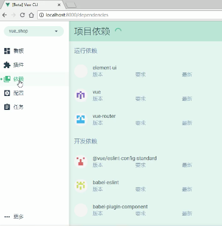

### 2.安装依赖

运行依赖

axios

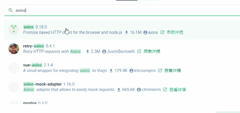

## 6.初始化远程仓库

### 1.账号设置-->SSH公钥


只有这样才能上传和下载

### 2.生成公钥

公钥管理

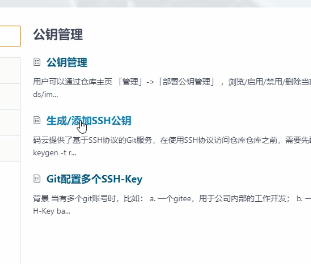

命令行cmd

输入

```
ssh-keygen -t rsa -C "xxxxx@xxxxx.com" 
```

三次回车


**通过查看 `~/.ssh/id_rsa.pub` 文件内容，获取到你的 public key**

3.检验生成的公钥是否能使用

添加后，在终端（Terminal）中输入

```
ssh -T git@gitee.com
```

首次使用需要确认并添加主机到本机SSH可信列表。若返回 Hi XXX! You've successfully authenticated, but Gitee.com does not provide shell access. 内容，则证明添加成功。

再次在终端输入

```
ssh -T git@gitee.com
```

可查看公钥信息

## 7.将本地项目托管到远程仓库

### 1.新建仓库


仓库名称（唯一）

去掉“使用ReadMe文件初始化这个仓库”


### 2.Git全局设置

创建仓库成功后

出现

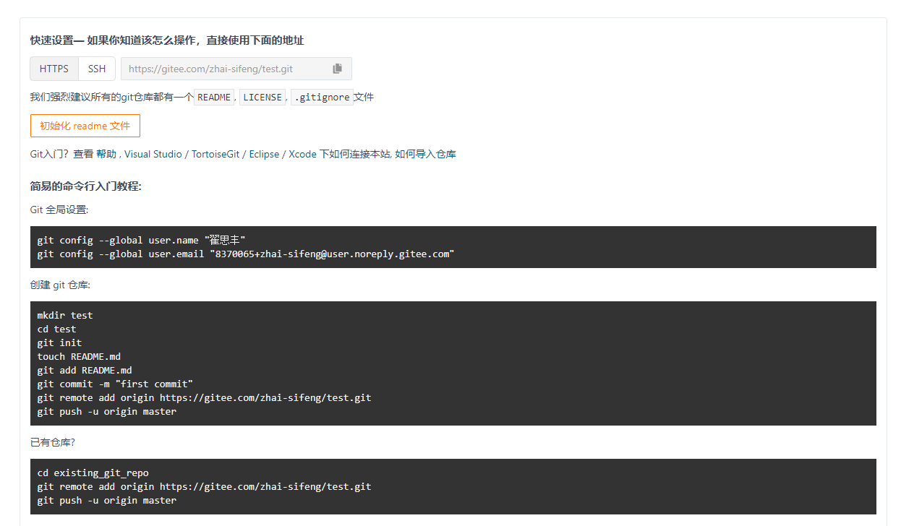

命令行cmd

输入

```
git config --global user.name "翟思丰"
```

```
git config --global user.email "1482451437@qq.com"
```

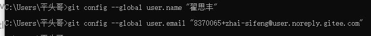

### 3.找到项目所在文件夹，shift+右键打开命令行(本地操作)

输入

```
git init
```

**初始化项目**

```
git status
```

**查看项目状态**

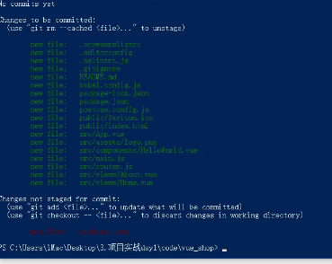

然后输入

```
git add .
```

**添加项目所需文件**

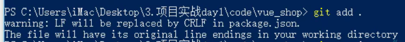

接着输入

```
git commit -m "add files"
```

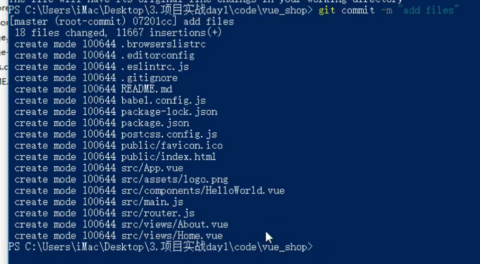

### 4.托管操作

在项目根目录下打开命令行

运行

```
git remote add origin https://gitee.com/zhai-sifeng/（仓库名）.git
//注意这行代码以创建仓库时给的代码为准
```

```
git push -u origin master
```

将本地仓库和云端仓库关联

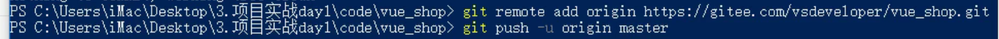

接着弹出一个窗口

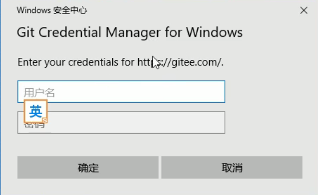

输入码云账号和密码即可（第一次）

第二次就不用了

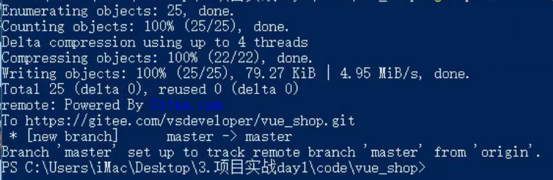

完成

进码云可查询

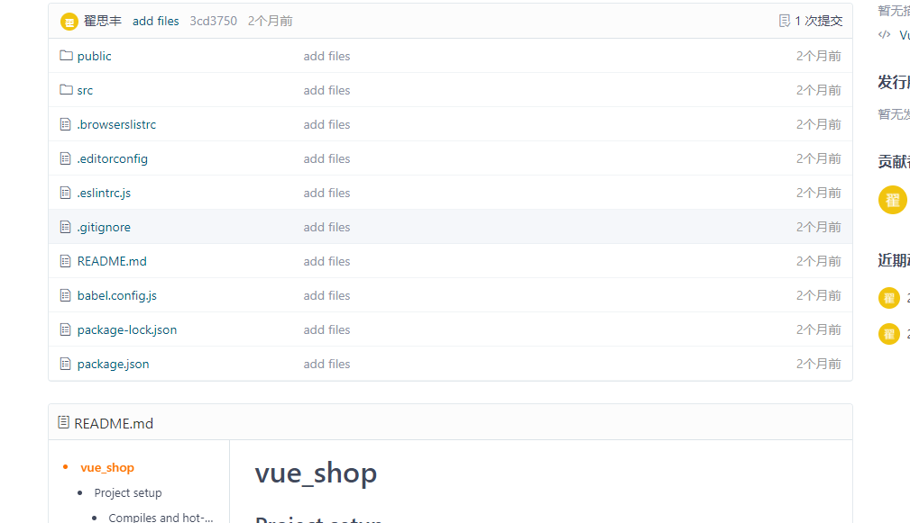

# 后台部分