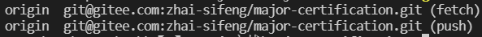

# git

当远程仓库与某个本地仓库有关联时

## 查看

使用 `git remote -v` 查看

会有

## 解除

使用 `git remote rm origin` 解除这个关联

## 建立关联

使用 `git remote add origin git地址`

建立本地仓库与该远程仓库的关联

## 推上远程仓库

使用 `git push origin sifeng(本地分支)`

