# 用户交互到数据库操作链路图

本文档用于说明本电商系统中，每个用户交互如何经过前端页面、前端状态、API 客户端、Go 后端分层，最终映射到 SQLite 表查询或写入。

后续新增需求时，必须同步补充对应的“用户交互 → API/状态 → 服务层 → 数据库操作”链路图。

## 0. 全局链路总览

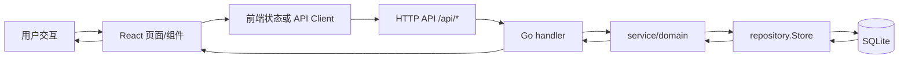

核心分层：

- 前端页面负责收集用户输入、展示状态和触发 API。
- `apiClient` 负责统一发起 `/api/*` 请求，并解析统一响应结构。
- `handler` 负责 HTTP 参数解析和错误映射。
- `service/domain` 负责业务规则，例如价格计算、库存校验、订单状态流转。
- `repository.Store` 隔离存储实现，当前默认使用 `SQLiteStore`。
- SQLite 负责商品、SKU、订单、订单项、订单时间线和库存持久化。

## 1. 应用启动与数据库初始化

虽然这不是用户点击交互，但它决定后续所有交互的数据基础。

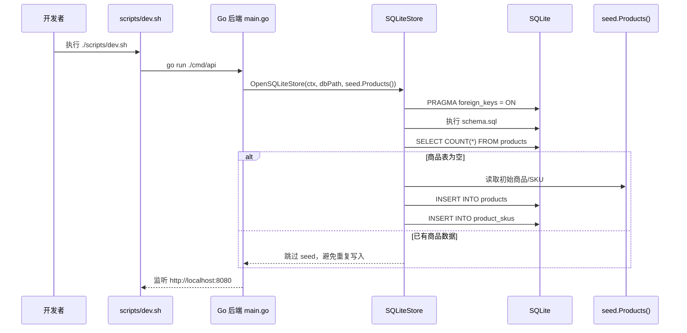

数据库操作：

| 动作 | 表 | SQL 类型 |
|---|---|---|
| 初始化 schema | 全部表 | `CREATE TABLE IF NOT EXISTS` |
| 初始化索引 | 全部索引 | `CREATE INDEX IF NOT EXISTS` |
| 检查是否需要 seed | `products` | `SELECT COUNT(*)` |
| 写入初始商品 | `products` | `INSERT` |
| 写入初始 SKU | `product_skus` | `INSERT` |

## 2. 商品列表：搜索、筛选、排序、分页

用户在商品列表页输入关键词、选择分类、库存状态、排序方式或翻页时，会触发商品列表查询。

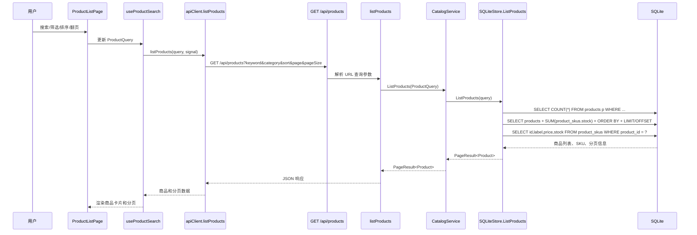

数据库操作：

| 用户动作 | 表 | SQL 类型 | 说明 |
|---|---|---|---|
| 搜索关键词 | `products` | `SELECT` | `lower(title)` / `lower(description)` 模糊匹配 |
| 选择分类 | `products` | `SELECT` | `category = ?` |
| 选择库存状态 | `product_skus` | `EXISTS` / `NOT EXISTS` | 判断是否存在可用库存 SKU |
| 选择排序 | `products` | `ORDER BY` | 价格、销量、评分或默认排序 |
| 翻页 | `products` | `LIMIT/OFFSET` | 返回当前页商品 |
| 展示 SKU | `product_skus` | `SELECT` | 按商品 ID 加载 SKU |

## 3. 商品详情：查看 SKU 和库存

用户从商品列表点击商品详情，会查询单个商品和它的 SKU。

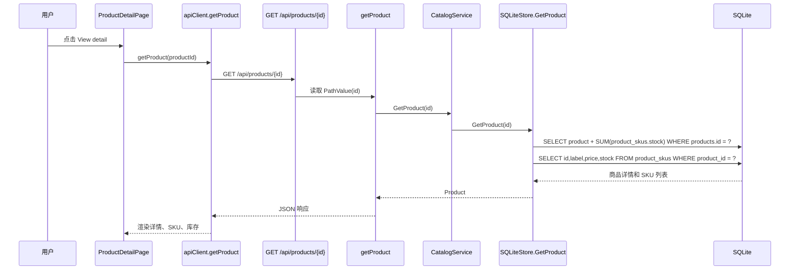

数据库操作：

| 用户动作 | 表 | SQL 类型 | 说明 |
|---|---|---|---|
| 打开商品详情 | `products` | `SELECT` | 查询商品基础信息 |
| 展示库存 | `product_skus` | `SELECT` | 查询 SKU 价格和库存 |

## 4. 加入购物车：前端本地状态更新

当前项目的购物车是前端本地状态，不直接写数据库。数据库库存只在结算时校验和扣减。

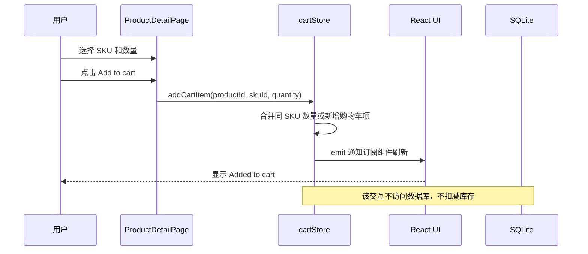

数据库操作：

| 用户动作 | 表 | SQL 类型 | 说明 |
|---|---|---|---|
| 加入购物车 | 无 | 无 | 只更新前端内存状态 |

## 5. 购物车页：展示、数量调整、选中、删除

购物车页会读取商品列表来补齐商品和 SKU 展示信息；数量、选中、删除仍然只更新前端本地状态。

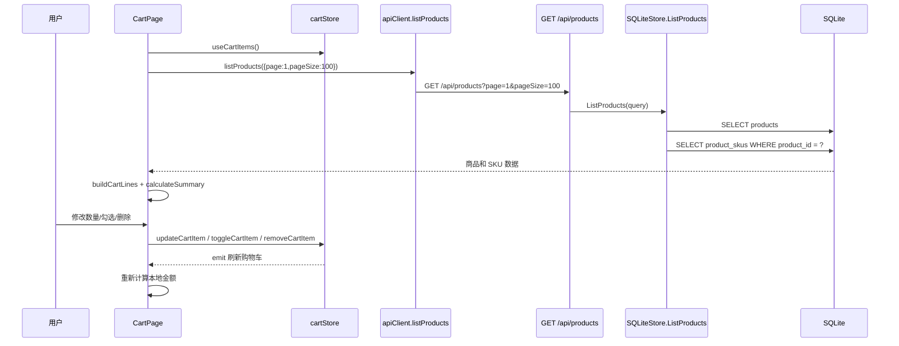

数据库操作：

| 用户动作 | 表 | SQL 类型 | 说明 |
|---|---|---|---|
| 打开购物车页 | `products` | `SELECT` | 查询商品基础信息 |
| 打开购物车页 | `product_skus` | `SELECT` | 查询 SKU 价格和库存 |
| 修改数量 | 无 | 无 | 只更新前端本地状态 |
| 勾选商品 | 无 | 无 | 只更新前端本地状态 |
| 删除商品 | 无 | 无 | 只更新前端本地状态 |

## 6. 购物车校验：后端重新校验商品、SKU、库存和金额

`POST /api/cart/validate` 当前主要由 API 客户端提供，适合在后续需求中接入购物车页或结算页的实时后端校验。

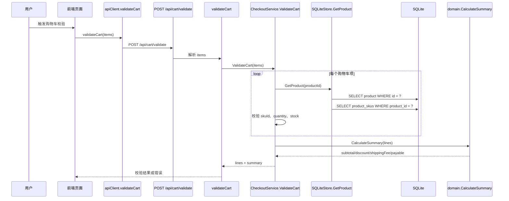

数据库操作：

| 用户动作 | 表 | SQL 类型 | 说明 |
|---|---|---|---|
| 校验购物车 | `products` | `SELECT` | 校验商品是否存在 |
| 校验购物车 | `product_skus` | `SELECT` | 校验 SKU 是否存在、库存是否充足 |
| 计算金额 | 无 | 无 | 在 Go domain 层计算，不落库 |

## 7. 提交结算：创建订单并扣减库存

提交结算是当前系统最核心的写链路。订单、订单项、订单时间线、库存扣减必须在同一个 SQLite 事务中完成。

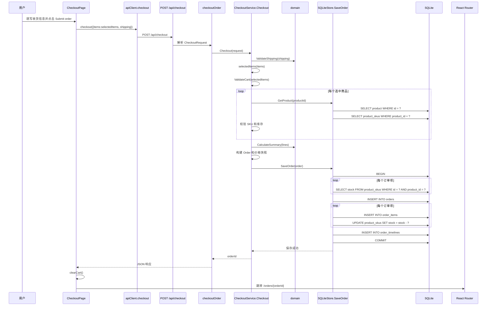

失败回滚：

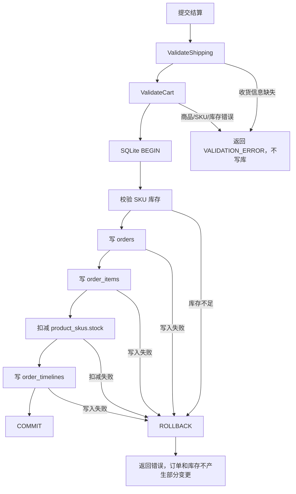

数据库操作：

| 用户动作 | 表 | SQL 类型 | 说明 |
|---|---|---|---|
| 提交结算 | `products` | `SELECT` | 校验商品存在，生成订单快照 |
| 提交结算 | `product_skus` | `SELECT` | 校验 SKU 与库存 |
| 创建订单 | `orders` | `INSERT` | 写入订单主表、金额、收货信息、状态 |
| 创建订单项 | `order_items` | `INSERT` | 写入商品标题、SKU、成交单价、数量快照 |
| 扣减库存 | `product_skus` | `UPDATE` | `stock = stock - quantity` |
| 写时间线 | `order_timelines` | `INSERT` | 写入初始 `pending_payment` 事件 |

## 8. 订单列表：查看和按状态筛选

用户进入订单列表或切换订单状态筛选时，会查询订单主表，并补齐订单项和时间线。

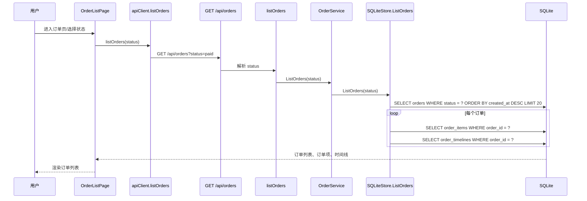

数据库操作：

| 用户动作 | 表 | SQL 类型 | 说明 |
|---|---|---|---|
| 查看订单列表 | `orders` | `SELECT` | 查询订单主表 |
| 按状态筛选 | `orders` | `SELECT WHERE status = ?` | 按订单状态过滤 |
| 展示订单摘要 | `order_items` | `SELECT` | 加载订单项数量和快照 |
| 展示状态信息 | `order_timelines` | `SELECT` | 加载时间线 |

## 9. 订单详情：查看订单项、金额、收货信息和时间线

用户从订单列表点击订单详情，会读取一个订单的完整快照。

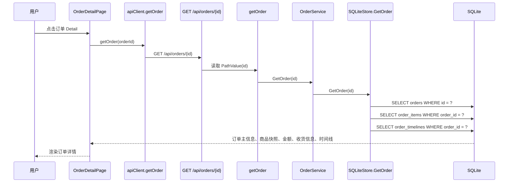

数据库操作：

| 用户动作 | 表 | SQL 类型 | 说明 |
|---|---|---|---|
| 打开订单详情 | `orders` | `SELECT` | 查询订单主信息 |
| 展示商品快照 | `order_items` | `SELECT` | 查询下单时的商品和价格快照 |
| 展示时间线 | `order_timelines` | `SELECT` | 查询订单状态变化记录 |

## 10. 订单状态操作：取消、支付、发货、完成、退款

用户在订单详情页点击状态按钮时，后端先校验状态机，再更新订单状态和时间线。

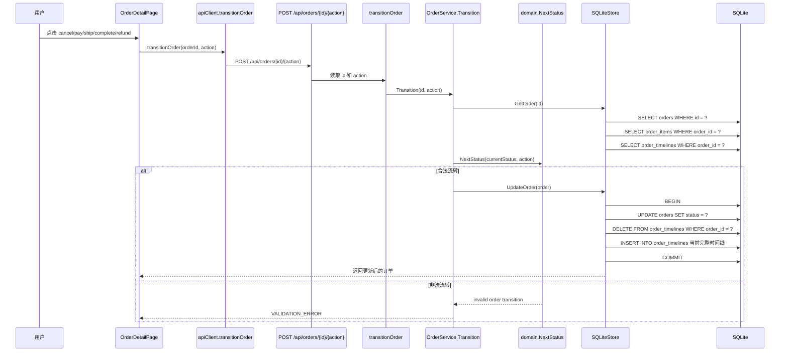

状态流转：

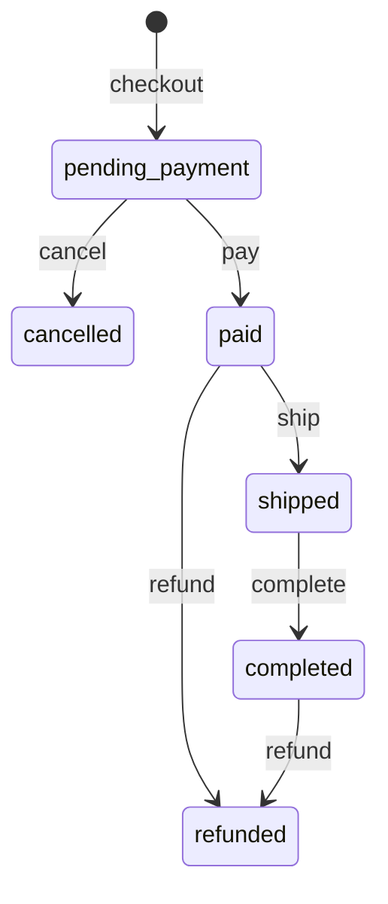

数据库操作：

| 用户动作 | 表 | SQL 类型 | 说明 |
|---|---|---|---|
| 点击订单操作 | `orders` | `SELECT` | 读取当前订单状态 |
| 点击订单操作 | `order_items` | `SELECT` | 返回更新后订单详情所需快照 |
| 点击订单操作 | `order_timelines` | `SELECT` | 读取原时间线 |
| 合法状态流转 | `orders` | `UPDATE` | 更新订单状态 |
| 合法状态流转 | `order_timelines` | `DELETE` + `INSERT` | 重写完整时间线 |
| 非法状态流转 | 无 | 无 | 返回错误，不写库 |

## 11. 当前交互与数据库表关系矩阵

| 用户交互 | API/前端状态 | `products` | `product_skus` | `orders` | `order_items` | `order_timelines` |
|---|---|---:|---:|---:|---:|---:|
| 商品列表搜索/筛选/分页 | `GET /api/products` | 读 | 读 | - | - | - |
| 商品详情 | `GET /api/products/{id}` | 读 | 读 | - | - | - |
| 加入购物车 | `cartStore.addCartItem` | - | - | - | - | - |
| 修改购物车数量/选中/删除 | `cartStore.*` | - | - | - | - | - |
| 打开购物车页 | `GET /api/products` + 本地状态 | 读 | 读 | - | - | - |
| 购物车后端校验 | `POST /api/cart/validate` | 读 | 读 | - | - | - |
| 提交结算 | `POST /api/checkout` | 读 | 读/写 | 写 | 写 | 写 |
| 订单列表 | `GET /api/orders` | - | - | 读 | 读 | 读 |
| 订单详情 | `GET /api/orders/{id}` | - | - | 读 | 读 | 读 |
| 订单状态操作 | `POST /api/orders/{id}/{action}` | - | - | 读/写 | 读 | 读/写 |

## 12. 后续需求文档规范

后续每个新增需求都必须补充链路图，至少包含：

```text
用户交互
  -> 前端页面/组件
  -> 前端状态或 apiClient
  -> HTTP API
  -> handler
  -> service/domain
  -> repository
  -> SQLite 表操作
```

建议每个需求补充三类内容：

- 一张 Mermaid `sequenceDiagram`：说明从用户交互到数据库读写的完整调用链。
- 一张数据库操作表：明确读写了哪些表、使用了什么 SQL 类型。
- 一段一致性说明：如果涉及写操作，必须说明事务、回滚、幂等或错误处理策略。
