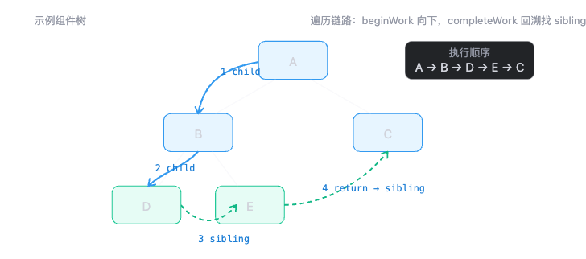
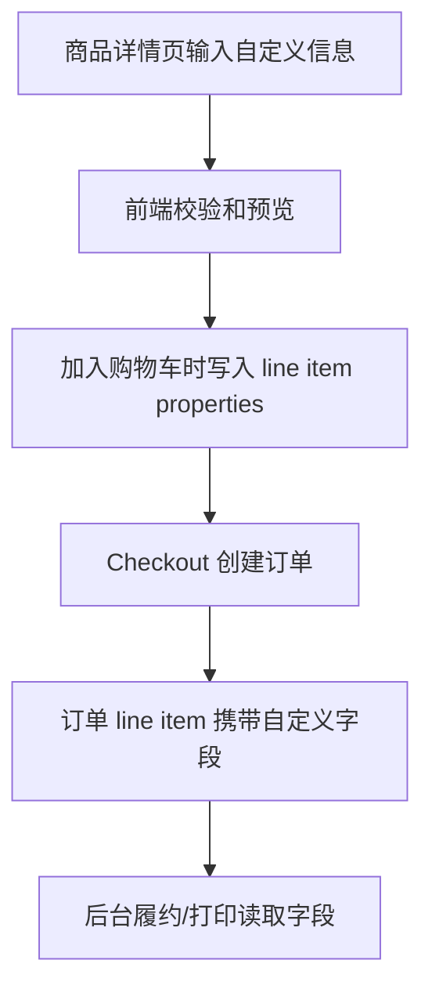
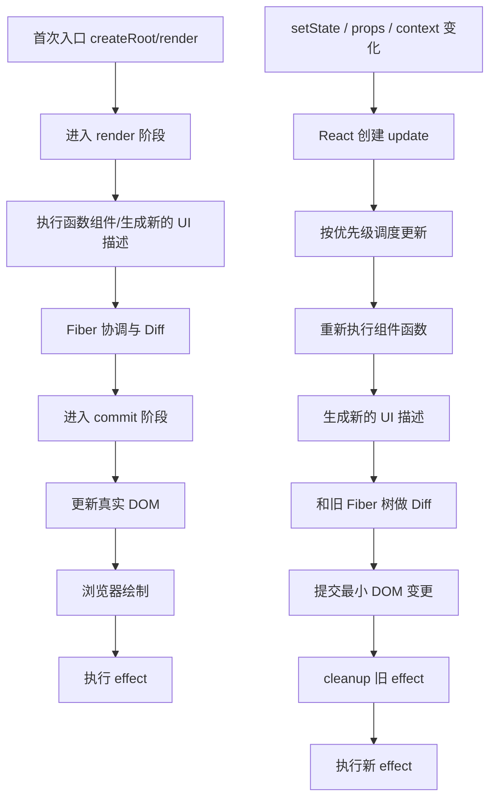

【傲基】
q1: 讲下js的原型链

答：
JavaScript 里每个对象内部都有一个 `[[Prototype]]`，通常可以通过 `__proto__` 间接访问。对象在读取某个属性时，会先在自己身上找；如果找不到，就沿着它的原型对象继续往上找，一直找到 `null` 为止，这条查找路径就是原型链。

比如数组可以直接调用 `map`、`filter`，不是因为数组实例自己有这些方法，而是因为会沿着原型链找到 `Array.prototype`。原型链的意义主要有两个：一是实现属性和方法复用，二是支撑 JS 的继承模型。

结合工程经验，实例对象放自己的数据，共享方法放到原型上，这样比给每个实例都拷一份方法更节省内存。

q11: 那像普通函数，怎么查找它的原型方法呢？

答：
普通函数本身也是对象，所以它也有原型链。要区分两个概念：

第一，函数作为“构造函数”时，有一个 `prototype` 属性，这个属性是给实例对象用的。比如 `Foo.prototype.say = ...`，以后 `new Foo()` 出来的实例就能沿着原型链找到 `say`。

第二，函数自己作为一个对象，也能调用 `call`、`apply`、`bind` 这些方法。这些方法不是函数自己定义的，而是沿着原型链找到 `Function.prototype` 上的。

函数对象先看自己身上有没有，没有就沿着 `__proto__` 往上找，先到 `Function.prototype`，再到 `Object.prototype`，最后到 `null`。

q2: 讲下浏览器的事件循环

答：
宏任务是“外部事件进入 JS 主线程的入口”

执行一个宏任务 / task 
  -> 调用栈清空（同步代码，函数调用都执行完）
  -> 执行 microtask checkpoint
  -> 清空所有微任务
  -> 如果微任务里又产生新的微任务，也继续执行
  -> 浏览器有机会渲染
  -> 执行下一个宏任务

常见宏任务有 script、setTimeout、I/O、UI 事件；常见微任务有 Promise.then、queueMicrotask、MutationObserver。

这个机制和性能优化也有关系。如果一个任务里塞了很多同步计算，或者不断产生微任务，就会长时间占用主线程，导致渲染和用户输入被延后，页面看起来就会卡。

```js
console.log('1')

setTimeout(() => {
  console.log('2')
}, 0)

Promise.resolve().then(() => {
  console.log('3')
})

console.log('4')
1432
```

q3：讲下react的fiber架构

答：
React 引入 Fiber，核心是为了解决老架构同步递归渲染不可中断的问题。

早期 React 更新组件树时，一旦开始 diff 和渲染，就会一直执行到整棵树处理完，中间不能暂停。如果组件树很大，就会长时间占用主线程，用户点击、输入、动画这些高优先级交互会被阻塞。

Fiber 可以理解成 React 内部一种新的节点结构和调度模型。它把原来一次性递归处理的大任务拆成一个个可调度的工作单元。这样 React 就能在渲染过程中暂停、恢复、丢弃或者重做任务，并且给不同更新分优先级。

所以 Fiber 带来的价值主要是三点：可中断渲染、优先级调度、为并发能力比如 `startTransition`、`Suspense` 打基础。

q31: 那fiber架构里面reconciler是怎么遍历那棵树的？

答：
Reconciler 遍历 Fiber 树时整体是深度优先。先通过 child 指针向下执行 beginWork ；如果当前节点没有 child，就执行 completeWork 回溯；回溯时优先找 sibling ，有兄弟节点就处理兄弟，没有兄弟节点就通过 return 回到父节点。su



```bash
A beginWork
  -> 有 child，进入 B

B beginWork
  -> 有 child，进入 D

D beginWork
  -> 没有 child，开始 completeWork
  -> D 有 sibling，进入 E

E beginWork
  -> 没有 child，completeWork
  -> E 没有 sibling，return 回 B
  -> B completeWork
  -> B 有 sibling，进入 C

C beginWork
  -> 没有 child，completeWork
  -> C 没有 sibling，return 回 A
  -> A completeWork
```


q4: 讲下你之前做过哪些性能优化

1. **定位方案**：先用 `Lighthouse` 看 LCP、TBT、CLS，用 `Chrome Performance` 看主线程是否被 JS 执行阻塞，用 `Network` 看首屏资源加载顺序，再用 `@next/bundle-analyzer` 分析首页 bundle，确认哪些模块和依赖占体积。

定位后发现主要问题集中在三块：首屏 JS 太大、首页图片和字体加载链路比较重、第三方脚本比较多。

1.initial JS 从 3MB 到 600KB 怎么做

优化的是首页首屏关键 JS，也就是 initial JS，不是整个项目总代码量。Next.js 本身有页面级拆包能力，我做的主要是在这个基础上继续做组件级拆分和依赖治理。

**组件级动态加载**：我先用 bundle analyzer 看首页 initial bundle 里有哪些模块实际不是首屏必须，比如营销弹窗、推荐商品、评论区、客服入口、部分活动组件。然后用 `next/dynamic` 把这些模块拆到异步 chunk 里，首屏只保留导航、Banner、核心商品信息和 CTA。这样不是把代码“消灭”，而是避免非首屏代码阻塞首屏加载和执行。

**依赖治理和 Tree Shaking**：除了拆 chunk，我也会看哪些依赖本身体积大或被重复打包。比如工具函数、日期处理、图标、富交互组件等，能按需引入就按需引入；只用少量能力的重库会替换成轻量实现；重复依赖会统一版本。导入方式上尽量使用 ESM，避免整包引入，保证 Tree Shaking 能生效。

dynamic import 本身更多是降低首屏 initial JS，不一定降低总 JS；真正减少总体积的是依赖替换、按需引入、重复依赖治理和 Tree Shaking。

2. LCP 从 4s 到 2s 怎么做
**图片落地方式**：
Next 提供了优化能力，我负责判断 LCP 瓶颈在哪里，并把图片尺寸、加载优先级、字体加载、JS 执行和第三方脚本这些策略在业务页面里落地。
LCP 是首屏 Banner 或商品主图，我会把普通 `img` 替换成 `next/image`，
配置合适的 `width/height` 或 `fill`，保证容器尺寸稳定，减少 CLS；
同时配置 `sizes`，让移动端、平板、桌面端加载不同尺寸的图，避免移动端下载桌面大图。
首屏 LCP 图不做懒加载，会加 `priority` 或提前加载；非首屏图片才使用懒加载。

**图片资源治理**：框架只能帮忙转格式、生成不同尺寸，但前提是原图不能过大。所以我也会配合设计或运营压缩原始图片，控制 Banner 尺寸和质量，优先使用 WebP/AVIF 这类更适合 Web 的格式。

**字体落地方式**：字体优化上，我会用 `next/font` 做本地托管和 preload，减少外部字体请求带来的 DNS/TLS 开销。同时控制字体字重和字体数量，比如只保留页面实际用到的字重，避免一次加载多个无用 font-weight。这样能减少字体阻塞和字体切换导致的布局抖动。

**JS 阻塞治理**：如果 Performance 里看到 LCP 延迟不是图片下载，而是主线程被 JS 阻塞，那就继续拆首屏 JS，把弹窗、评论、推荐、客服、营销脚本这些非首屏逻辑延后，减少主线程长任务。


3. 第三方脚本怎么治理

跨境商城会有很多第三方脚本，比如 GA/GTM、广告像素、客服、评论插件、营销弹窗、转化追踪。用 `next/script` 控制加载时机
我的处理方式是先分级：

- 首屏必须的保留，比如核心统计或必要转化追踪用 `afterInteractive`
- 非首屏必须的延后，比如客服、评论、弹窗、推荐脚本用 `lazyOnload`
- 只在特定页面需要的，就按页面加载，不全站注入。

这样可以减少首屏请求数和主线程执行压力。

具体案例我会这样讲：

在 GogoalShop 这类跨境商城里，首页和 PDP 页面经常会同时接入 GA4/GTM、Meta Pixel、TikTok Pixel、客服聊天、评论组件、营销弹窗、推荐商品脚本。我的处理不是简单全部删掉，而是先按“业务必要性 + 页面路径 + 加载时机”分层。

比如 GA4 和 Meta Pixel 属于核心转化追踪，首屏后就要尽快可用，我会用 `next/script` 的 `afterInteractive`，保证 React 页面可交互之后再加载，避免阻塞 HTML 解析和首屏渲染：

```tsx
<Script
  id="ga4"
  src="https://www.googletagmanager.com/gtag/js?id=G-XXXX"
  strategy="afterInteractive"
/>
```

像客服、评论、营销弹窗、推荐商品这类组件，不影响用户第一眼看到商品和价格，我会放到 `lazyOnload`，等浏览器空闲后再加载。比如评论组件只在 PDP 的评论区附近才需要，我会结合动态导入或滚动触发，不让它进入首页首屏主包：

```tsx
<Script
  id="customer-chat"
  src="https://chat.example.com/sdk.js"
  strategy="lazyOnload"
/>
```

还有一类是只在特定页面需要的，比如 checkout 前的优惠弹窗、PDP 的尺码推荐、商品详情页的评论 SDK，我不会全站放在 `_app` 或全局 layout 里，而是只在对应页面挂载。这样用户访问首页时，就不会额外下载 PDP 才用到的脚本。

落地时我会配合 Chrome Performance 和 Network 看两类数据：一是首屏请求数有没有减少，二是 Main Thread 上第三方脚本造成的 Long Task 有没有下降。比如把客服和评论从首屏同步加载改成 `lazyOnload` 后，首页初始请求会更干净，主线程空闲时间更早出现，LCP 和 INP 都会更稳定。

4. 缓存和构建怎么配合
**缓存和静态资源**：Next 构建后的 JS/CSS 文件名带 hash，可以配合 CDN 做长缓存，比如 `Cache-Control: max-age=31536000, immutable`；HTML 入口不做长时间强缓存，保证发版后能拿到最新资源引用。图片、字体、静态资源走压缩和 CDN，降低重复访问成本。

可以把 **Next + CDN 长缓存** 理解成这条链路：

```text
代码构建
  -> Next 生成带 hash 的静态资源
  -> 上传/部署到服务器或 CDN 源站
  -> CDN 根据 Cache-Control 缓存资源
  -> 用户访问页面
  -> HTML 引用具体 hash 文件
  -> 浏览器/CDN 命中缓存
  -> 下次发版 hash 变化，自动请求新资源
```

举个例子，构建前你代码里可能是：

```text
app.js
style.css
```

Next 构建后会变成类似：

```text
/_next/static/chunks/app-a8f3d2.js
/_next/static/css/style-91bc0e.css
```

这里的 `a8f3d2`、`91bc0e` 就是内容 hash。**文件内容不变，hash 基本不变；文件内容变了，hash 就变。**

所以 CDN 可以放心给这些资源配长缓存：

```http
Cache-Control: public, max-age=31536000, immutable
```

意思是：

```text
public：浏览器和 CDN 都可以缓存
max-age=31536000：缓存一年
immutable：有效期内认为资源不会变，不用反复校验
```

关键点在于：**长缓存不会导致用户拿旧代码，因为资源 URL 会变。**

比如第一次发版：

```html
<script src="/_next/static/chunks/app-a8f3d2.js"></script>
```

用户和 CDN 都缓存了 `app-a8f3d2.js`。

下一次发版，如果 JS 内容变了，HTML 会引用新文件：

```html
<script src="/_next/static/chunks/app-b7c9e1.js"></script>
```

浏览器看到这是一个新的 URL，就会重新请求；CDN 如果没有缓存，也会回源拉取新文件。

所以完整策略是：

```text
HTML 入口：不做长缓存，保证能拿到最新资源引用
JS/CSS/hash 图片：做长缓存，因为内容变 URL 就变
CDN：缓存静态资源，减少回源
浏览器：缓存静态资源，减少重复下载
```

面试口语版：

> Next 构建后的 JS/CSS 会带内容 hash，所以静态资源可以配 CDN 长缓存。用户访问时先拿 HTML，HTML 里引用具体 hash 的 JS/CSS。只要代码内容变了，构建后的文件名也会变，浏览器会当成新资源重新请求；没变的话就直接命中浏览器或 CDN 缓存。HTML 入口不能长缓存，否则用户可能拿不到最新的资源引用。

q5: 说下你是怎么做seo优化的

答：
我做的主要是基础 SEO 和页面结构优化，场景主要在 Reolink Web 跨境商城的商品页、活动页和解决方案页。

我的做法一般分四层：

1. Meta 信息维护，比如 `title`、`description`、`canonical`、Open Graph，保证每个页面主题明确。
2. 语义化结构，页面会保留清晰的 `h1/h2` 层级，以及 `section/article` 这些语义化标签，让搜索引擎更容易理解内容结构。
3. 让核心内容可索引。像商品标题、卖点、规格、FAQ、活动规则这些内容，尽量在 SSR/SSG 阶段输出，而不是完全依赖客户端异步渲染。
4. 做图片和性能优化，比如补充 `alt`、控制图片尺寸、首屏图优先加载、非首屏图懒加载，避免资源过重影响抓取和首屏体验。

在睿联这边，我实际覆盖了 20+ 商品和活动页面的基础 SEO 配置。我的理解是 SEO 不是单纯写几个 Meta，而是 `元信息 + 结构 + 可索引内容 + 性能` 一起做。

q51: meta数据是你写的吗？

答：

如果是商品页、活动页、解决方案页这类前端页面，我会负责把 Meta 的生成逻辑接到页面里，包括 `title`、`description`、`canonical`、OG 等字段的渲染和校验。具体文案内容通常会和运营、产品一起对齐，确保页面主题、关键词和实际内容一致。

如果是批量页面，我不会手工一个个硬编码，而是会基于页面数据、商品信息或者活动配置去生成，保证可维护性和一致性。上线前我也会检查页面源码、分享卡片和 Lighthouse SEO 基础项，确认 Meta 生效。

所以更准确的说法是：技术接入和页面渲染逻辑是我负责，具体业务文案会和运营协作完成。

q6: 讲下工程化你做过哪些？

答：
我做过的工程化主要有三类：规范治理、构建提效、流程沉淀。

第一类是规范治理。在淘腾网络我搭过 `ESLint + Prettier + Commitlint + Husky` 这一套，把代码风格、提交规范和提交前检查前置，减少低价值 review 和低级问题进仓库。

具体做法是把“靠人提醒”的规则前置到工具链里。比如 ESLint 负责约束未使用变量、Hook 依赖、React 组件写法；Prettier 负责格式统一；Commitlint 约束提交信息必须符合 `feat/fix/chore` 这类规范；Husky 在 `pre-commit` 阶段跑 lint-staged，只检查本次改动文件，避免全量检查太慢。

一个典型链路是：

```text
开发提交代码
  -> Husky 触发 pre-commit
  -> lint-staged 只拿 staged 文件
  -> ESLint 修复/拦截明显问题
  -> Prettier 统一格式
  -> Commitlint 校验 commit message
  -> 通过后才允许进入仓库
```

这样做的收益是 review 时不用再反复纠结缩进、分号、命名这类低价值问题，团队可以把精力放到业务逻辑、性能和可维护性上。

第二类是构建和依赖治理。我做过项目从 npm 切到 pnpm，规范依赖安装和构建流程，把安装时间从 10 秒降到 5 秒以内；在商城项目里也做过依赖治理、包体积分析和构建优化，支撑性能提升。

具体案例是：原来项目用 npm，每次安装依赖都会在当前项目下重复拷贝大量包，CI 或新同事初始化时等待时间比较长。我切到 pnpm 后，会同步做三件事：第一，锁定 `packageManager`，保证团队都用同一个 pnpm 版本；第二，提交 `pnpm-lock.yaml`，保证 CI 和本地依赖版本一致；第三，把安装命令、构建命令、Node 版本写进 README 或脚本里，避免每个人本地环境不一致。

在商城项目的包体积治理里，我会先用 bundle analyzer 看哪些依赖进入了首屏包。比如营销弹窗、评论组件、富文本编辑器、图表库这类不是首屏必须的依赖，如果被直接 import 到首页，就会拉大首屏 JS。我会把它们改成动态加载或按路由拆包：

```tsx
const ReviewSection = dynamic(() => import("./ReviewSection"), {
  ssr: false,
  loading: () => <ReviewSkeleton />,
});
```

如果发现引入整个工具库，比如一次性引入完整 `lodash` 或图标库，我会改成按需引入，或者替换成更轻的实现。最终目标不是为了“少几个 KB”而优化，而是减少首屏 JS 下载、解析和执行成本，支撑 LCP、TTI、INP 这些体验指标。

pnpm 快主要是因为它用了全局内容寻址存储。相同版本的依赖只会在全局 store 里保存一份，不会像 npm 那样在每个项目里重复拷贝完整依赖。项目里的 node_modules 更多是通过硬链接和符号链接指向全局 store，所以二次安装、多个项目复用依赖时会明显更快，也更省磁盘空间。

另外 pnpm 的依赖结构更严格，只有 package.json 里声明过的依赖才能直接访问，这能减少幽灵依赖问题。配合 lockfile 和 workspace，在团队项目或 monorepo 里可以让依赖安装、版本一致性和构建流程更稳定。

幽灵依赖最大的问题是依赖关系不显式，项目稳定性变差（本地能跑，换环境、升级依赖、CI 构建或线上部署就突然报错。）。比如我代码里直接 import dayjs ，但 package.json 没声明 dayjs，只是因为某个 UI 库间接依赖了它，本地 node_modules 扁平化后刚好能访问。后面 UI 库升级、CI 重装依赖或者切到 pnpm 后，dayjs 不再暴露到当前项目，构建就会报 Cannot find module。pnpm 的严格依赖隔离能提前暴露这类问题，逼着我们把直接使用的依赖写清楚。

第三类是流程沉淀。比如 Shopify 自研应用里，我引入 Docker 做镜像化部署，隔离宿主机环境差异；再配合 Shell 脚本自动化处理镜像打包、版本命名和文件压缩，减少重复部署工作。到睿联之后，我还沉淀过一套活动页交付检查清单，以及一套 AI 辅助研发工作流，覆盖需求拆解、代码草拟、问题排查、测试补充和文档生成。

【喜德盛】
q1: 你们自建站支付方式怎么去对接的？

答：
接第三方支付平台，比如 PayPal、信用卡支付，我们系统侧主要做的是订单创建、支付单创建、跳转收银台或拉起支付组件、接收支付回调、更新订单状态。

PayPal 链路：
前端加载 PayPal JS SDK
  -> 渲染 PayPal Button
  -> 用户登录 PayPal 并授权
  -> 前端拿到 orderID / authorization
  -> 后端调用 PayPal API capture
  -> webhook 或 capture 结果确认支付成功
  -> 更新订单状态


信用卡支付链路：
后端创建 payment intent
  -> 前端用支付 SDK 加载支付组件
  -> 用户输入卡信息
  -> SDK 返回 payment method / token
  -> 前端提交给后端
  -> 后端确认支付
  -> 支付平台 webhook 通知支付结果
  -> 后端验签并更新订单

这里有几个关键点。

第一，支付状态不能以前端跳转结果为准。前端成功页只能作为用户体验，真正可信的是支付平台的服务端回调，也就是 webhook。因为用户可能关闭页面、网络中断，或者伪造前端成功跳转。

第二，回调必须做验签和幂等。支付平台回调可能重复推送，所以后端要根据支付单号、订单号和事件 ID 做幂等处理，已经处理过的回调不能重复改状态、重复扣库存或重复发货。

第三，订单状态要拆清楚。一般会有 `pending_payment`、`paid`、`failed`、`cancelled`、`refunded` 这些状态，支付前创建订单但不进入履约，只有收到可信回调确认支付成功后，才把订单改为已支付。

第四，金额要以后端为准。前端只负责展示，实际支付金额必须由后端根据商品、SKU、优惠、税费、运费重新计算，避免用户篡改请求金额。

如果是跳转收银台，前端集成成本低，但体验和可定制性弱；如果是 SDK 方式，体验更好，可以嵌入站内 checkout，但要更关注安全合规、回调验签、幂等和异常状态处理。


q2: 你们先有Shopify独立站了，自建站的话，会有哪些问题？

答：
从 Shopify 独立站迁到自建站，最大的问题不是页面重写，而是 Shopify 原来帮你兜住的能力要不要自己承担。

第一是交易链路。商品、SKU、库存、购物车、结算、支付、订单、退款、税费、物流这些能力，在 Shopify 里是平台能力；自建站后就要自己设计数据模型、接口、事务和异常兜底。

第二是运营生态。Shopify 有很多成熟 app，比如评论、折扣、邮件营销、自定义商品、数据分析。如果自建站，这些能力要么自研，要么重新选型集成。

第三是 SEO 和流量迁移。URL 结构、301 重定向、canonical、站点地图、结构化数据都要处理，否则原来的搜索权重可能会掉。

第四是稳定性和安全。自建站要自己处理接口限流、黑名单、支付风控、库存并发、日志监控、发布回滚和数据备份。

所以我会倾向于分阶段做：第一阶段可以用 Headless Shopify，让前端自建体验，但商品、库存、订单仍复用 Shopify；第二阶段再逐步把核心业务服务拆出来，避免一次性迁移风险过大。

q3: 你们本身在Shopify上的sku对接到自建站的，还是怎么样？

答：
先把 Shopify 作为商品和库存的源头。

把 Shopify 的 product、variant、inventory 同步到自建后端，比如同步到自己的商品库和 SKU 库。这个时候要建立映射关系，例如 `shopify_product_id`、`shopify_variant_id` 对应自建系统的 `product_id`、`sku_id`。后续订单、库存和履约也要考虑双向同步或以其中一边作为主数据源。


q4: 黑名单拦截，如果是通过调api的形式绕过下单，这种怎么拦截？
登陆态+符合邮箱

q5: 自定义印名印号这个app，是怎么样的一个交互方式？自定义信息跑到订单里的原理是什么？

答：
交互上一般是在商品详情页或购物车前增加一个自定义区域，比如用户选择球衣尺码之后，可以输入姓名、号码，或者选择字体、颜色、位置。前端会做长度、敏感词、字符类型、号码范围这些基础校验，并实时预览效果。

原理上，在 Shopify 里这类自定义信息通常不会作为普通 SKU 处理，而是作为 line item properties 跟着购物车项进入 checkout。也就是说，用户加入购物车时，不只是传 variant id 和 quantity，还会把 `Name`、`Number`、`Font` 这类自定义字段作为属性一起提交。

订单创建后，这些 properties 会出现在订单的 line item 下面。后台、履约系统或者打印系统读取订单时，就能拿到对应商品的自定义信息，用于生产和发货。

所以核心链路是：



q51: 如果说用户要自定义一个图片的话要怎么处理？

答：
自定义图片会比文字复杂，重点是上传、校验、存储和订单关联。

前端会先做基础校验，比如文件类型、大小、尺寸、比例、透明背景、分辨率是否满足印刷要求。然后把图片上传到后端或对象存储，比如 S3、OSS、Shopify Files 等，后端返回一个稳定的图片 URL 或文件 ID。

加入购物车时，不建议把图片本身塞进订单，而是把图片 URL、文件 ID、预览图 URL、印刷位置等信息写到 line item properties。订单履约时再根据这个 URL 下载原图或读取文件 ID。

同时要考虑安全和生产风险：图片需要做类型白名单、病毒扫描、鉴黄/违规内容识别、访问权限控制和过期策略。如果是印刷场景，还要保留原图和预览图，避免用户看到的效果和实际生产文件不一致。

q52: 自定义印名印号为什么不做成变体（作为一个sku去下单），而是做成app？

答：
主要原因是自定义信息的组合数量太大，不适合做成 SKU 变体。

SKU 适合表达有限、可库存管理的商品差异，比如颜色、尺码、版本。但印名印号是用户自由输入的，比如姓名可以有很多组合，号码也有很多组合，如果把每个姓名和号码都做成变体，会导致 SKU 爆炸，商品维护、库存管理、搜索展示和后台操作都会变得不可控。

另外，印名印号本质上不是库存维度，而是订单生产属性。用户买的还是某个球衣 SKU，只是在这件商品上附加了个性化生产信息。所以更合理的方式是：SKU 管颜色和尺码，自定义 app 管姓名、号码、图片、字体、位置等订单附加信息。

这样既不会污染商品 SKU 体系，也方便履约系统按订单行读取定制信息。

q6: 浏览器输入url到页面渲染完成，发生了什么事情？

答：
我会按“网络请求、资源解析、渲染流水线、运行时交互”四个阶段讲。

第一步是 URL 解析和网络连接。浏览器解析 URL，检查缓存，如果没有命中缓存，会做 DNS 解析，拿到 IP 后建立 TCP 连接；如果是 HTTPS，还会进行 TLS 握手。

第二步是发送 HTTP 请求。服务端返回 HTML，浏览器根据状态码、响应头、缓存策略、压缩方式等处理响应。

第三步是解析 HTML。浏览器边下载边解析 HTML，构建 DOM 树；遇到 CSS 会下载并解析成 CSSOM；DOM 和 CSSOM 合并生成 Render Tree。

第四步是执行 JS。遇到普通 script 时，浏览器会暂停 HTML 解析，下载并执行 JS，因为 JS 可能会修改 DOM 或样式。

第五步是布局和绘制。浏览器根据 Render Tree 计算每个元素的位置和尺寸，也就是 layout；然后进行 paint，把颜色、文字、图片、边框等绘制出来；最后通过合成线程把不同图层 compositing 到屏幕上。

如果是 React 页面，HTML 加载后还会下载 JS bundle，执行 React 初始化、创建虚拟 DOM、绑定事件、发起接口请求，最终把数据渲染到页面上。

q61: 刚刚提到的dom树，css树解析的过程中会遇到js解析，阻塞，如果我不希望阻塞，该怎么做？

答：
主要有几类手段。

第一是给脚本加 `defer` 或 `async`。`defer` 会让 JS 下载和 HTML 解析并行，等 DOM 解析完成后按顺序执行；适合依赖 DOM 和有执行顺序要求的业务脚本。`async` 是下载完成就执行，不保证顺序，适合统计、埋点这类独立脚本。

第二是把 script 放到 body 底部，至少让主要 HTML 先解析出来。

第三是拆包和按需加载。比如 React 项目里用路由懒加载、组件懒加载，把首屏不需要的 JS 延后下载和执行。

第四是减少主线程长任务。大计算可以拆分、放到 Web Worker，或者用 requestIdleCallback、setTimeout 分片，避免一次 JS 执行太久阻塞解析和渲染。

第五是优化 CSS。因为 CSS 会影响渲染树和布局，关键 CSS 可以内联，非关键 CSS 延后加载，减少 CSS 阻塞渲染的时间。

q62: 为什么js解析会阻塞dom树的解析？

答：
因为 JavaScript 有修改 DOM 和 CSSOM 的能力，浏览器为了保证执行结果符合代码顺序，遇到普通同步 script 时必须暂停 DOM 解析，先下载并执行 JS。

举个例子，如果 HTML 解析到一半时遇到：

```html
<script>
  document.write('<div>new content</div>')
  document.querySelector('.title').remove()
</script>
```

这段 JS 可能插入新节点、删除已有节点、读取样式、修改 class。如果浏览器一边继续解析后面的 HTML，一边执行这段 JS，就可能导致 DOM 顺序和脚本预期不一致。

另外，如果 JS 里读取样式，比如 `getComputedStyle` 或 `offsetHeight`，它还可能依赖已经解析好的 CSSOM。所以浏览器通常还要等待前面的 CSS 加载和解析完成，避免 JS 读到错误的样式结果。

所以总结就是：JS 阻塞 DOM，是因为它能改 DOM；CSS 可能阻塞 JS，是因为 JS 可能读样式；这三者之间有顺序依赖。

q7: useEffect第一个参数有什么要求？

答：
`useEffect` 的第一个参数必须是一个函数，也就是 effect callback。React 会在组件渲染提交到页面之后执行这个函数。

这个函数有几个要求：

第一，不能直接写成 `async` 函数。因为 async 函数返回的是 Promise，而 `useEffect` 期望返回的是 `undefined` 或一个清理函数。如果要发异步请求，应该在内部定义 async 函数再调用。

```tsx
useEffect(() => {
  async function loadData() {
    const data = await fetchData()
    setData(data)
  }

  loadData()
}, [])
```

第二，可以返回一个 cleanup 函数，用来清理定时器、事件监听、订阅、AbortController 等副作用。

```tsx
useEffect(() => {
  const controller = new AbortController()

  fetch(url, { signal: controller.signal })

  return () => controller.abort()
}, [url])
```

第三，effect 里用到的外部变量，原则上要放到依赖数组里，避免闭包拿到旧值。比如用到了 `url`、`userId`，依赖数组就应该包含它们。

一句话总结：第一个参数必须是同步函数，可以返回清理函数，不能直接返回 Promise；副作用里用到的响应式变量，要通过依赖数组保证执行时机正确。

从 React 原理上看，`useEffect` 不是在 render 阶段执行的，而是在组件完成渲染并提交到 DOM 之后，由 React 在 commit 阶段统一调度的 Passive Effect。React 调用 effect 回调时，需要立刻拿到一个确定的返回值，用来判断后续是否要注册 cleanup。如果回调直接写成 `async`，返回值一定是 `Promise`，React 无法把这个 Promise 当作清理函数执行，也无法等待它再决定 cleanup，所以规范要求 effect 回调本身必须是同步函数。

cleanup 的本质是 React 在下一次 effect 重新执行前，或者组件卸载时，用来清理上一次副作用的同步函数。比如上一次 effect 里注册了事件监听、定时器、订阅、网络请求控制器，React 需要在依赖变化时先执行旧 cleanup，再执行新的 effect，避免重复订阅、内存泄漏和竞态更新。如果返回的是 Promise，React 不知道什么时候清理完成，也不能保证 commit 阶段副作用队列的执行顺序。

依赖数组对应的是 React 判断“这次提交后，这个 effect 是否需要重新执行”的依据。函数组件每次 render 都会形成一份新的闭包快照，effect 里访问的 `props`、`state`、函数和变量，本质上都来自某一次 render。如果依赖数组漏掉了这些响应式变量，React 可能会复用旧 effect，导致 effect 里的闭包仍然拿着旧值，这就是常说的 stale closure。依赖写完整，就是告诉 React：这些值变化后，旧副作用需要清理，新副作用需要基于最新闭包重新建立。

面试可以这样说：`useEffect` 的设计是把副作用从 render 阶段拆到 commit 之后执行，所以 render 必须保持纯净，effect 回调也要同步返回 cleanup 约定；异步逻辑可以放在 effect 内部执行，但不能让 effect 本身返回 Promise。依赖数组则是 React 基于闭包和 Object.is 比较来判断副作用是否需要重新同步的机制，写错依赖就容易出现旧值、重复订阅或请求竞态。

如果要把 React 的渲染和重渲染也画成链路图，可以记成：



【平安】
讲讲diff算法流程

答：
React 的 diff 可以理解成一次从旧 Fiber 树到新 Fiber 树的对比过程，目标是找出最小的更新集合，最后在 commit 阶段把变化同步到真实 UI。

整体流程我会分三层讲：

第一层是节点类型对比。如果新旧节点类型不同，比如从 `div` 变成 `span`，或者从一个组件变成另一个组件，React 通常会认为这棵子树不能复用，直接卸载旧节点，创建新节点。

第二层是同类型节点复用。如果节点类型相同，React 会复用已有 Fiber 和对应 DOM，只更新变化的 props，比如 className、style、事件回调、文本内容等。

第三层是子节点列表 diff。React 会重点看 `key`。如果有稳定 key，就用 key 判断哪些节点可以复用、哪些需要新增、删除或移动；如果没有 key，就只能按位置比较，列表插入、删除、重排时容易造成不必要的更新。

在 Fiber 架构下，diff 发生在 render/reconcile 阶段，这个阶段可以被中断。React 会通过 `child / sibling / return` 指针遍历 Fiber 树，对每个节点执行 `beginWork` 和 `completeWork`，并给需要更新的 Fiber 标记副作用。最后 commit 阶段是同步不可中断的，把插入、更新、删除这些变化真正提交到 DOM 或原生视图。

面试里我会总结成一句：React diff 的核心假设是不同类型节点不复用，同类型节点尽量复用，列表用 key 提高复用准确性；Fiber 让这个比较过程可以拆分和调度，最终把变化集中到 commit 阶段提交。

如果新建一个项目，你会从什么方面去考虑框架选型，构建工具，依赖管理，性能优化等？

答：
如果新建一个项目，我不会一上来先选技术，而是先看业务形态、团队情况和交付要求。

第一是看项目类型。如果是官网、商城、内容 SEO 比较重的项目，我会优先考虑 Next.js，因为它支持 SSR/SSG、路由、图片和字体优化，对首屏和 SEO 更友好；如果是中后台、管理端、SaaS 控制台这类强交互项目，我会考虑 React + Vite，开发体验轻，构建速度快；如果是移动端跨平台 App，我会考虑 React Native。

第二是看团队技术栈。如果团队 React 经验更多，就优先 React 生态；如果团队已有 Vue 组件库和历史项目，也会尊重现有资产。技术选型不是只看框架先进，而是要看团队能不能稳定维护。

第三是构建工具。新项目一般我会优先 Vite，启动快、配置轻、生态成熟；如果是 Next 项目就沿用 Next 自身构建体系；老项目或复杂定制构建才会继续用 Webpack。构建上会提前考虑环境变量、别名、按需加载、包体积分析和生产构建校验。

第四是依赖管理。我会优先用 pnpm，安装快、磁盘占用低，也能更好地暴露幽灵依赖问题。项目初期会约定 Node 版本、包管理器版本、lockfile、依赖升级策略，避免不同同学本地环境不一致。

第五是工程规范。会接入 TypeScript、ESLint、Prettier、Commitlint、Husky，再加上统一的 `lint / typecheck / test / build` 命令，把低级问题前置到提交前和 CI 阶段。

第六是性能和质量。前期就会考虑路由拆包、组件懒加载、图片压缩、缓存策略、首屏资源控制，以及埋点、错误监控和测试覆盖。像我之前做商城项目时，也会用 bundle analyzer 先看首屏包体积，再做依赖治理和动态加载。

所以我的选型链路是：先看业务目标，再看团队能力，再定框架、构建、依赖、规范、性能和交付流程。

RN 和 react 有什么区别，有什么优点和缺点？

答：
React 和 React Native 的核心思想是一致的，都是组件化、声明式 UI、状态驱动视图，也都可以用 Hooks、状态管理和 React 的组件模型。

区别主要在渲染目标不同。React Web 最终渲染的是浏览器 DOM，写的是 `div、span、button` 这些 Web 元素；React Native 最终渲染的是原生视图，写的是 `View、Text、Image、ScrollView` 这些 RN 组件，由 RN 桥接或新架构把 JS 层的描述同步到 iOS/Android 原生层。

样式也不同。Web 用 CSS、布局模型、选择器；RN 用类似 CSS 的 JS 对象，默认 Flex 布局，没有完整 CSS 选择器，也没有浏览器 DOM API。调试和性能问题也不同，Web 更关注浏览器渲染、资源加载、LCP/CLS；RN 更关注 JS 线程、UI 线程、Native 通信、列表渲染、内存和多机型兼容。

RN 的优点是跨平台复用度高，一套 React 技术栈可以同时支持 iOS 和 Android，迭代效率比纯原生高，也方便前端同学上手。像我在 Reolink 智能安防 App 里，就用 RN 承接设备接入、消息提醒、实时预览、录像回放这些业务链路，很多业务逻辑可以跨双端复用。

缺点是复杂原生能力、性能敏感场景和平台差异仍然需要原生协作，比如摄像头、视频流、蓝牙、推送、权限、Native Module、不同系统版本兼容等。RN 不是完全替代原生，而是适合把业务 UI 和跨端逻辑提效，底层能力仍然要和原生配合。

面试总结就是：React 是 Web UI 框架，React Native 是用 React 模型开发原生 App 的跨平台框架；优点是跨端复用和迭代效率高，缺点是复杂原生能力和性能问题需要更强的调试与平台协作能力。

用hook时，不能放循环和条件判断语句里面，这是为什么？

答：
因为 React Hooks 是靠调用顺序来关联状态的，而不是靠变量名。

React 在函数组件每次渲染时，会按 Hooks 调用的先后顺序记录状态，比如第一个 `useState` 对应第一个状态，第二个 `useEffect` 对应第二个 effect。如果 Hooks 放在条件判断或循环里，不同渲染之间 Hooks 的调用顺序或调用次数可能变化，React 就会把状态对应错。

比如：

```tsx
function Demo({ visible }: { visible: boolean }) {
  const [name, setName] = useState('')

  if (visible) {
    const [age, setAge] = useState(0)
  }

  const [count, setCount] = useState(0)
}
```

第一次 `visible = true` 时，Hooks 顺序是：

```text
useState(name)
useState(age)
useState(count)
```

下一次 `visible = false` 时，Hooks 顺序变成：

```text
useState(name)
useState(count)
```

这样 React 原本记录在第二个位置的状态可能被错误地当成 `count`，状态就乱了。

所以 Hooks 必须放在函数组件最外层，保证每次渲染调用顺序一致。如果有条件逻辑，可以把条件放到 Hook 内部，比如在 `useEffect` 里面判断，或者把逻辑拆成自定义 Hook，但自定义 Hook 本身也要遵守同样规则。

